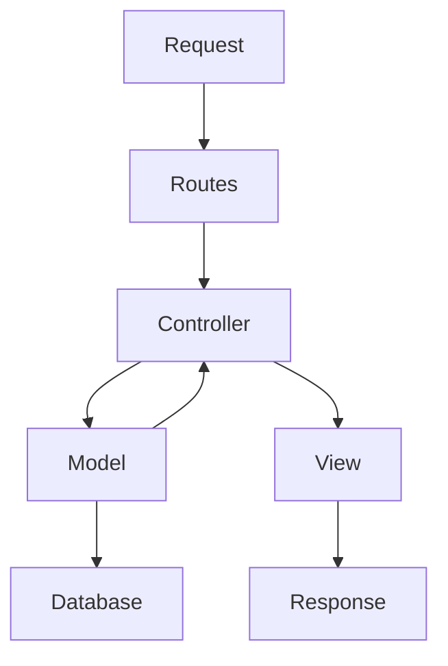
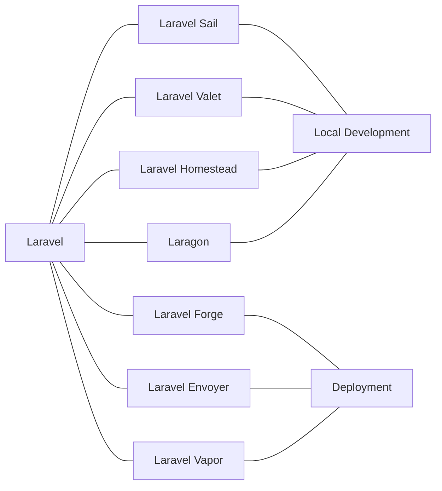
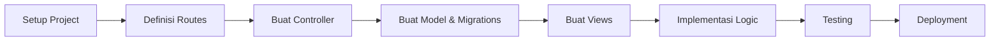

# Pengenalan tentang Laravel dan Ekosistemnya

## Apa itu Laravel?

Laravel adalah framework PHP open-source yang dirancang untuk pengembangan aplikasi web dengan sintaks yang ekspresif dan elegan. Framework ini dibuat oleh Taylor Otwell pada tahun 2011 dan telah menjadi salah satu framework PHP paling populer di dunia.

Laravel menyediakan struktur dan titik awal yang jelas untuk membangun aplikasi web dari yang sederhana hingga yang kompleks, dengan pendekatan MVC (Model-View-Controller) yang membuat kode lebih terorganisir dan mudah dipelihara.

## Mengapa Memilih Laravel?

 

Laravel menawarkan banyak keunggulan dibandingkan framework PHP lainnya:

1. **Sintaks yang Elegan** - Kode Laravel mudah dibaca dan ditulis
2. **Dokumentasi Lengkap** - Panduan resmi yang komprehensif dan komunitas besar
3. **Tools Development** - Artisan CLI, Migrations, Seeders, dan lainnya
4. **Security** - Fitur keamanan bawaan seperti CSRF protection, hashing password, dll
5. **Scalability** - Dapat menangani aplikasi skala kecil hingga enterprise
6. **Modularitas** - Package system yang kuat dan ekosistem yang luas

## Arsitektur Laravel

Laravel menggunakan pola arsitektur MVC (Model-View-Controller) yang membagi aplikasi menjadi tiga komponen utama:

- **Model**: Berhubungan dengan database dan logika bisnis
- **View**: Menangani tampilan dan presentasi data kepada pengguna
- **Controller**: Menghubungkan Model dan View, mengelola request dan response

## Ekosistem Laravel

Laravel memiliki ekosistem yang kaya dan terus berkembang:

### 1. Package dan Library

Laravel memiliki ekosistem package yang luas melalui Composer, memungkinkan Anda menambahkan fungsionalitas dengan mudah:

- **Laravel Breeze** - Implementasi autentikasi sederhana
- **Laravel Sanctum** - Autentikasi API lightweight
- **Laravel Jetstream** - Scaffold aplikasi dengan login, registrasi, dan fitur lainnya
- **Laravel Horizon** - Dashboard untuk Redis Queue
- **Laravel Telescope** - Debugging assistant
- **Laravel Nova** - Admin panel

### 2. Tools Pengembangan

- **Laravel Sail** - Docker development environment
- **Laravel Valet** - Development environment untuk Mac
- **Laravel Homestead** - Pre-packaged Vagrant box
- **Laragon** - Development environment untuk Windows
- **Laravel Forge** - Server management dan deployment
- **Laravel Envoyer** - Zero downtime deployment
- **Laravel Vapor** - Serverless deployment platform untuk AWS

### 3. Fitur Utama Laravel

Laravel menyediakan banyak fitur bawaan yang membantu mempercepat pengembangan aplikasi:

- **Eloquent ORM** - Object-Relational Mapping untuk database
- **Blade Templating** - Template engine yang powerful dan mudah dipahami
- **Migrations** - Version control untuk struktur database
- **Seeding** - Mengisi database dengan data testing
- **Middleware** - Filter HTTP request
- **Authentication** - Sistem login dan register bawaan
- **Artisan Console** - Command-line tool untuk otomatisasi
- **Task Scheduling** - Cron jobs yang terintegrasi
- **Queue System** - Background processing
- **Event & Listeners** - Untuk arsitektur event-driven
- **Broadcasting** - Real-time events dengan WebSockets

## Alur Kerja Pengembangan Laravel

## Versi Laravel

Laravel merilis versi baru secara reguler dengan dukungan jangka panjang (LTS) setiap beberapa versi:

- **Laravel 5.x** - Rilis lama dengan beberapa versi LTS
- **Laravel 6.x** - September 2019 (LTS)
- **Laravel 7.x** - Maret 2020
- **Laravel 8.x** - September 2020
- **Laravel 9.x** - Februari 2022 (LTS)
- **Laravel 10.x** - Februari 2023
- **Laravel 11.x** - Februari 2024 (Current)

## Memulai dengan Laravel

Untuk memulai dengan Laravel, Anda memerlukan:

1. **PHP** (versi 8.1+ untuk Laravel 11)
2. **Composer** (package manager untuk PHP)
3. **Server Web** (Apache/Nginx)
4. **Database** (MySQL, PostgreSQL, SQLite, SQL Server)

Di pertemuan selanjutnya, kita akan menginstal Laragon sebagai lingkungan pengembangan yang menyediakan semua kebutuhan ini dalam satu paket untuk pengguna Windows.

## Komunitas dan Sumber Belajar

Laravel memiliki komunitas yang aktif dan banyak sumber belajar:

- [Dokumentasi Resmi](https://laravel.com/docs)
- [Laracasts](https://laracasts.com) - Tutorial video premium
- [Laravel News](https://laravel-news.com)
- [Laravel.io Forum](https://laravel.io)
- [StackOverflow](https://stackoverflow.com/questions/tagged/laravel)
- [GitHub](https://github.com/laravel/laravel)

## Kesimpulan

Laravel menawarkan kerangka kerja modern untuk pengembangan aplikasi web PHP dengan sintaks yang elegan, fitur-fitur powerful, dan ekosistem yang luas. Memahami Laravel dan ekosistemnya akan membantu Anda membangun aplikasi web dengan lebih efisien dan mengikuti praktik terbaik pengembangan software.

Dalam pertemuan selanjutnya, kita akan mulai dengan instalasi dan konfigurasi Laragon sebagai lingkungan pengembangan Laravel kita dan membuat proyek Laravel pertama kita.
