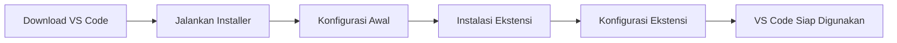
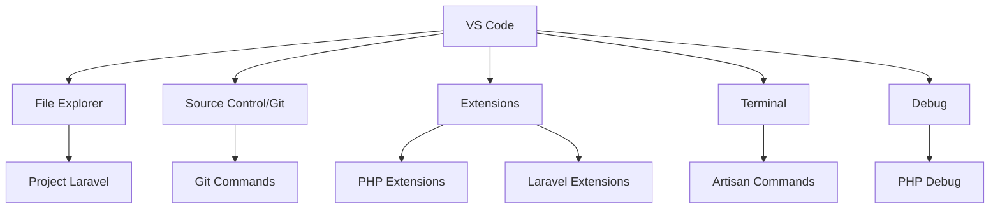

# Instalasi dan Konfigurasi Visual Studio Code

Visual Studio Code (VS Code) adalah editor kode sumber gratis dan open-source yang dikembangkan oleh Microsoft. Editor ini ringan namun powerful, dengan dukungan untuk banyak bahasa pemrograman dan fitur-fitur yang dapat membantu pengembangan aplikasi Laravel kita.

## Mengapa Menggunakan VS Code untuk Laravel?

- Ringan dan cepat dibandingkan IDE penuh seperti PHPStorm
- Mendukung ekstensi PHP dan Laravel secara baik
- Interface yang intuitif dan mudah disesuaikan
- Integrasi Git bawaan yang sangat baik
- Terminal terintegrasi untuk menjalankan perintah Artisan
- Gratis dan open-source

## Langkah-langkah Instalasi VS Code



### 1. Download Visual Studio Code

1. Kunjungi situs resmi VS Code: [https://code.visualstudio.com/](https://code.visualstudio.com/)
2. Klik tombol "Download" untuk sistem operasi Anda (Windows, macOS, atau Linux)
3. Tunggu proses download selesai

### 2. Instalasi VS Code

#### Untuk Windows:
1. Buka file installer yang sudah didownload (biasanya `VSCodeSetup-{versi}.exe`)
2. Klik "Next" untuk melanjutkan proses instalasi
3. Baca dan setujui lisensi penggunaan, kemudian klik "Next"
4. Pilih lokasi instalasi (atau biarkan default) dan klik "Next"
5. Pada bagian "Select Additional Tasks", pastikan opsi berikut dicentang:
   - "Create a desktop icon"
   - "Add 'Open with Code' action to Windows Explorer file context menu"
   - "Add 'Open with Code' action to Windows Explorer directory context menu"
   - "Register Code as an editor for supported file types"
   - "Add to PATH"
6. Klik "Next" dan kemudian "Install"
7. Tunggu proses instalasi selesai dan klik "Finish"

#### Untuk macOS:
1. Buka file `.dmg` yang sudah didownload
2. Seret (drag) ikon VS Code ke folder Applications
3. Buka VS Code dari Launchpad atau folder Applications

#### Untuk Linux (Ubuntu/Debian):
```bash
sudo apt update
sudo apt install software-properties-common apt-transport-https wget
wget -q https://packages.microsoft.com/keys/microsoft.asc -O- | sudo apt-key add -
sudo add-apt-repository "deb [arch=amd64] https://packages.microsoft.com/repos/vscode stable main"
sudo apt update
sudo apt install code
```

## Antarmuka VS Code


Saat pertama kali membuka VS Code, Anda akan melihat antarmuka dengan beberapa bagian utama:
1. **Activity Bar** - Di sebelah kiri, untuk navigasi antar view utama
2. **Side Bar** - Menampilkan berbagai panel (Explorer, Search, Source Control, dll)
3. **Editor** - Area tengah untuk mengedit file
4. **Panel** - Area bawah untuk terminal, output, masalah (problems), dan debug
5. **Status Bar** - Di bagian bawah, menampilkan informasi project dan file

## Instalasi Ekstensi untuk Laravel

VS Code menjadi lebih powerful dengan ekstensi. Berikut ekstensi yang direkomendasikan untuk pengembangan Laravel:

### Langkah Instalasi Ekstensi:
1. Klik ikon Extensions di Activity Bar (atau tekan `Ctrl+Shift+X`)
2. Cari ekstensi yang diinginkan di kotak pencarian
3. Klik "Install" pada ekstensi yang ingin dipasang

### Ekstensi Wajib untuk Laravel:

1. **PHP Intelephense**
   - Memberikan intellisense, linting, dan fitur lainnya untuk PHP
   - [https://marketplace.visualstudio.com/items?itemName=bmewburn.vscode-intelephense-client](https://marketplace.visualstudio.com/items?itemName=bmewburn.vscode-intelephense-client)

2. **Laravel Blade Snippets**
   - Snippet dan highlighting untuk template Blade Laravel
   - [https://marketplace.visualstudio.com/items?itemName=onecentlin.laravel-blade](https://marketplace.visualstudio.com/items?itemName=onecentlin.laravel-blade)

3. **Laravel Snippets**
   - Snippet kode untuk Laravel
   - [https://marketplace.visualstudio.com/items?itemName=onecentlin.laravel5-snippets](https://marketplace.visualstudio.com/items?itemName=onecentlin.laravel5-snippets)

4. **Laravel Artisan**
   - Menjalankan perintah Artisan dari VS Code
   - [https://marketplace.visualstudio.com/items?itemName=ryannaddy.laravel-artisan](https://marketplace.visualstudio.com/items?itemName=ryannaddy.laravel-artisan)

5. **Laravel Extra Intellisense**
   - Autocomplete untuk Laravel routes, views, dll
   - [https://marketplace.visualstudio.com/items?itemName=amiralizadeh9480.laravel-extra-intellisense](https://marketplace.visualstudio.com/items?itemName=amiralizadeh9480.laravel-extra-intellisense)

### Ekstensi Tambahan yang Berguna:

6. **DotENV**
   - Highlighting untuk file .env Laravel
   - [https://marketplace.visualstudio.com/items?itemName=mikestead.dotenv](https://marketplace.visualstudio.com/items?itemName=mikestead.dotenv)

7. **GitLens**
   - Fitur Git yang lebih kaya
   - [https://marketplace.visualstudio.com/items?itemName=eamodio.gitlens](https://marketplace.visualstudio.com/items?itemName=eamodio.gitlens)

8. **Material Icon Theme**
   - Ikon-ikon yang lebih jelas untuk file dan folder
   - [https://marketplace.visualstudio.com/items?itemName=PKief.material-icon-theme](https://marketplace.visualstudio.com/items?itemName=PKief.material-icon-theme)

9. **Prettier - Code formatter**
   - Memformat kode secara otomatis
   - [https://marketplace.visualstudio.com/items?itemName=esbenp.prettier-vscode](https://marketplace.visualstudio.com/items?itemName=esbenp.prettier-vscode)

## Konfigurasi VS Code untuk Laravel

Setelah menginstal ekstensi, berikut adalah beberapa konfigurasi yang direkomendasikan untuk pengembangan Laravel:

### 1. Konfigurasi Format On Save

1. Buka Settings dengan `Ctrl+,` (atau `Cmd+,` di macOS)
2. Cari "format on save"
3. Centang opsi "Editor: Format On Save"

### 2. Konfigurasi PHP Intelephense

1. Buka Settings
2. Cari "intelephense"
3. Sesuaikan pengaturan sesuai kebutuhan, misalnya:
   - `intelephense.files.maxSize`: Atur ke nilai yang lebih tinggi jika project besar
   - `intelephense.environment.phpVersion`: Sesuaikan dengan versi PHP yang digunakan

### 3. Konfigurasi Terminal Terintegrasi

VS Code memiliki terminal terintegrasi yang sangat berguna untuk menjalankan perintah Artisan Laravel:

1. Buka terminal dengan `Ctrl+` (atau `Cmd+` di macOS)
2. Pilih jenis shell yang diinginkan (PowerShell, CMD, atau Git Bash di Windows)
3. Untuk mengonfigurasi shell default:
   - Buka Settings
   - Cari "terminal.integrated.defaultProfile"
   - Pilih shell default sesuai sistem operasi Anda



## Tips Menggunakan VS Code untuk Laravel

1. **Membuka Project Laravel**:
   - File > Open Folder > Pilih folder project Laravel

2. **Menjalankan Artisan Command**:
   - Buka terminal terintegrasi (`Ctrl+` atau `Cmd+`)
   - Ketik perintah Artisan, contoh: `php artisan serve`

3. **Navigasi Cepat**:
   - `Ctrl+P` untuk mencari file
   - `Ctrl+Shift+P` untuk Command Palette
   - `Ctrl+G` untuk pergi ke baris tertentu

4. **Multi-cursor Editing**:
   - `Alt+Click` untuk menambahkan cursor
   - `Ctrl+D` untuk memilih instance berikutnya dari seleksi

5. **Keyboard Shortcuts**:
   - `Ctrl+/` untuk komentar/uncomment baris
   - `Alt+Up/Down` untuk memindahkan baris ke atas/bawah
   - `Ctrl+Space` untuk IntelliSense

## Kesimpulan

Visual Studio Code adalah editor kode yang sangat baik untuk pengembangan Laravel. Dengan ekstensi dan konfigurasi yang tepat, VS Code dapat memberikan pengalaman pengembangan yang hampir setara dengan IDE khusus PHP yang berbayar, sambil tetap mempertahankan kecepatan dan fleksibilitasnya.

Setelah menginstal dan mengonfigurasi VS Code, Anda siap untuk mengembangkan aplikasi Laravel dengan lebih efisien. Pada pertemuan berikutnya, kita akan belajar tentang struktur folder Laravel dan mulai membuat proyek Laravel pertama kita.
