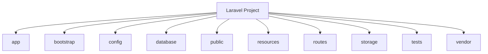
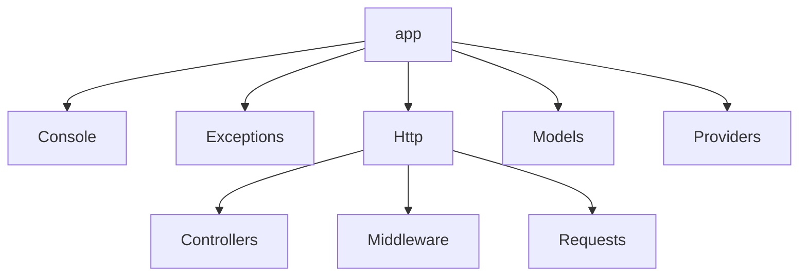
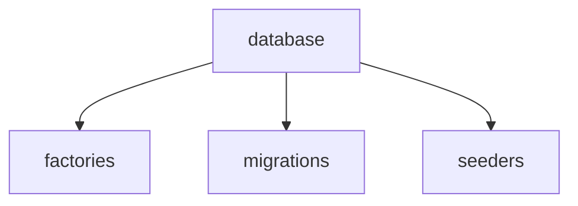
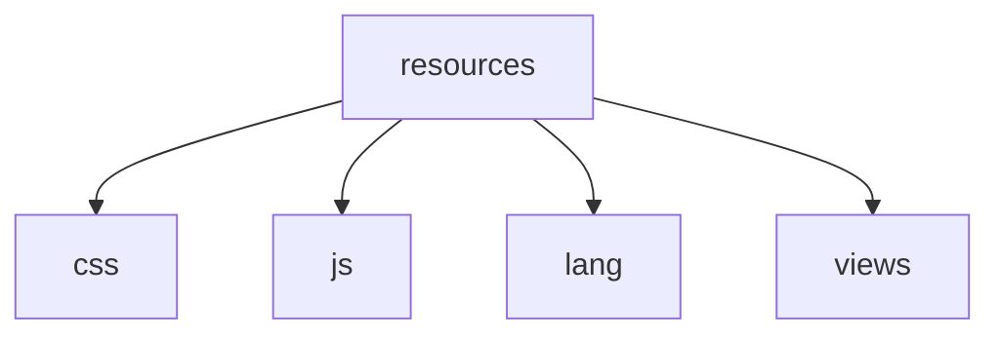
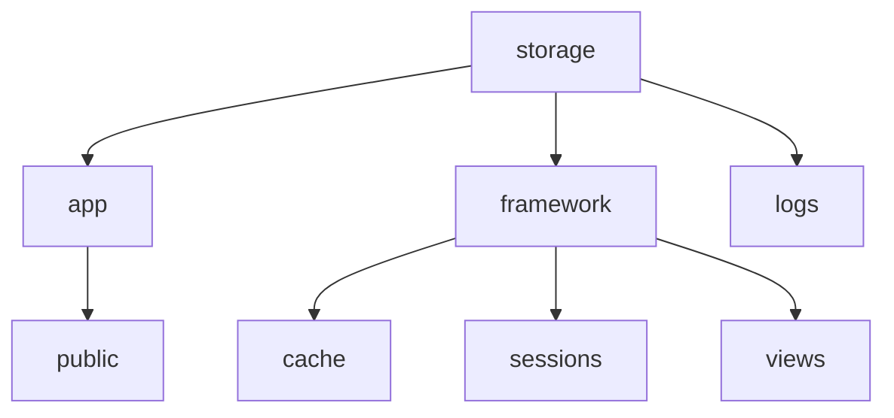
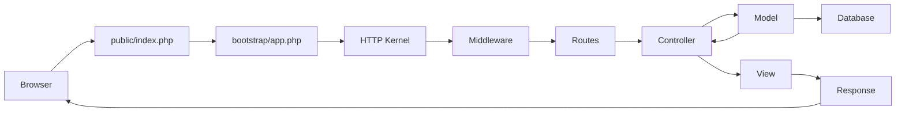

# Pengenalan Struktur Folder Laravel

Laravel memiliki struktur folder yang terorganisir dengan baik untuk memudahkan pengembangan aplikasi web. Memahami struktur folder ini sangat penting bagi setiap pengembang Laravel, terutama untuk pemula. Artikel ini akan membahas struktur folder dasar Laravel dan fungsi dari masing-masing folder.

## Gambaran Umum Struktur Folder Laravel

Setelah Anda menginstal proyek Laravel baru, Anda akan melihat struktur folder seperti berikut:

```
project-laravel/
│
├── app/
├── bootstrap/
├── config/
├── database/
├── public/
├── resources/
├── routes/
├── storage/
├── tests/
├── vendor/
│
├── .env
├── .env.example
├── .gitattributes
├── .gitignore
├── artisan
├── composer.json
├── composer.lock
├── package.json
├── phpunit.xml
└── README.md
```

Mari kita bahas setiap folder secara detail:

## Struktur Folder Utama



### 1. Folder `app/`

Folder `app/` adalah jantung dari aplikasi Laravel Anda. Folder ini berisi kode inti aplikasi Anda.



- **`app/Console/`**: Berisi semua perintah kustom Artisan.
- **`app/Exceptions/`**: Berisi handler exception aplikasi dan pengecualian kustom.
- **`app/Http/`**: Berisi controller, middleware, dan form request.
  - **`app/Http/Controllers/`**: Berisi kelas controller yang menangani request HTTP.
  - **`app/Http/Middleware/`**: Berisi middleware yang menyaring HTTP request.
  - **`app/Http/Requests/`**: Berisi form request kustom untuk validasi.
- **`app/Models/`**: Berisi model Eloquent yang mewakili tabel database.
- **`app/Providers/`**: Berisi semua service provider aplikasi.

### 2. Folder `bootstrap/`

Folder `bootstrap/` berisi file yang menginisialisasi framework dan mengkonfigurasi autoloading. Folder ini juga berisi folder `cache/` yang menyimpan file yang dihasilkan framework untuk optimasi performa.

- **`bootstrap/app.php`**: File entri utama yang membuat instance aplikasi Laravel.
- **`bootstrap/cache/`**: Menyimpan file cache framework seperti route dan service cached.

### 3. Folder `config/`

Folder `config/` berisi semua file konfigurasi aplikasi Laravel Anda. Setiap opsi konfigurasi didokumentasikan dengan baik, jadi silakan jelajahi file-file ini untuk membiasakan diri dengan opsi yang tersedia.

- **`config/app.php`**: Konfigurasi aplikasi seperti timezone, locale, dan providers.
- **`config/database.php`**: Konfigurasi koneksi database.
- **`config/auth.php`**: Konfigurasi autentikasi.
- Dan masih banyak file konfigurasi lainnya.

### 4. Folder `database/`

Folder `database/` berisi migrasi database, model factories, dan seeders.



- **`database/factories/`**: Berisi factory definisi untuk semua model Anda.
- **`database/migrations/`**: Berisi migrasi database yang menentukan struktur database aplikasi.
- **`database/seeders/`**: Berisi seeder database yang mengisi database dengan data.

### 5. Folder `public/`

Folder `public/` berisi file index.php, yang merupakan titik masuk untuk semua permintaan yang masuk ke aplikasi Anda. Folder ini juga berisi aset seperti gambar, JavaScript, dan CSS.

- **`public/index.php`**: File entri utama yang memuat Laravel.
- **`public/css/`**, **`public/js/`**, **`public/images/`**: Folder untuk aset statis.

### 6. Folder `resources/`

Folder `resources/` berisi view, file sumber daya mentah (LESS, SASS, JS), dan file bahasa.



- **`resources/css/`**: Berisi file CSS atau preprocessor CSS mentah.
- **`resources/js/`**: Berisi file JavaScript mentah.
- **`resources/lang/`**: Berisi file bahasa untuk internasionalisasi.
- **`resources/views/`**: Berisi file template Blade yang digunakan untuk menampilkan data.

### 7. Folder `routes/`

Folder `routes/` berisi semua definisi rute untuk aplikasi Anda.

- **`routes/web.php`**: Berisi rute yang terkait dengan antarmuka web.
- **`routes/api.php`**: Berisi rute yang terkait dengan API.
- **`routes/console.php`**: Berisi definisi perintah konsol kustom.
- **`routes/channels.php`**: Berisi definisi saluran broadcasting.

### 8. Folder `storage/`

Folder `storage/` berisi file yang dihasilkan aplikasi, seperti log, cache, dan file yang diunggah oleh pengguna.



- **`storage/app/`**: Berisi file yang dihasilkan aplikasi. File yang diunggah pengguna biasanya disimpan di `storage/app/public/`.
- **`storage/framework/`**: Berisi file yang dihasilkan framework seperti cache, sesi, dan view yang dikompilasi.
- **`storage/logs/`**: Berisi file log aplikasi.

### 9. Folder `tests/`

Folder `tests/` berisi tes otomatis Anda. Laravel menyediakan contoh tes PHPUnit yang siap pakai.

- **`tests/Feature/`**: Berisi tes fitur yang menguji seluruh sistem aplikasi.
- **`tests/Unit/`**: Berisi tes unit yang menguji kelas individual.

### 10. Folder `vendor/`

Folder `vendor/` berisi dependensi Composer Anda. File-file dalam folder ini seharusnya tidak diedit secara langsung karena akan ditimpa saat memperbarui dependensi.

## File Penting di Root Folder

Selain folder-folder di atas, ada beberapa file penting di root folder:

- **`.env`**: File konfigurasi lingkungan yang berisi variabel lingkungan seperti kredensial database.
- **`.env.example`**: Contoh file .env untuk referensi.
- **`.gitignore`**: Menentukan file dan folder yang diabaikan oleh Git.
- **`artisan`**: Skrip PHP yang menyediakan CLI (Command Line Interface) untuk Laravel.
- **`composer.json`**: Mendefinisikan dependensi PHP project dan metadata lainnya.
- **`composer.lock`**: Memastikan instalasi dependensi yang konsisten di semua lingkungan.
- **`package.json`**: Mendefinisikan dependensi JavaScript/Node.js dan skrip.

## Alur Permintaan HTTP dalam Laravel



Alur permintaan HTTP dalam Laravel berawal dari `public/index.php` yang memuat framework, lalu melalui middleware, routing, dan akhirnya ke controller yang berinteraksi dengan model dan mengembalikan view.

## Tips Bekerja dengan Struktur Folder Laravel

1. **Gunakan namespace yang benar**: Laravel menggunakan PSR-4 autoloading. Pastikan namespace kelas Anda sesuai dengan lokasi filenya.

2. **Pertahankan organisasi kode**: Ikuti konvensi Laravel untuk penempatan file. Misalnya, simpan model di folder `app/Models/`.

3. **Perhatikan keamanan**: File sensitif seperti `.env` tidak boleh dicommit ke version control.

4. **Gunakan artisan untuk membuat file**: Lebih baik menggunakan perintah artisan untuk membuat file seperti controller, model, dan migration. Ini memastikan struktur dan namespace yang benar.

5. **Jaga kebersihan**: Bersihkan cache dan file sementara secara berkala dengan perintah artisan seperti `php artisan cache:clear`.

## Kesimpulan

Memahami struktur folder Laravel sangat penting untuk pengembangan yang efisien. Struktur yang terorganisir dengan baik memudahkan pemeliharaan dan skalabilitas aplikasi. Saat Anda terus mengembangkan aplikasi Laravel, Anda akan semakin menghargai desain yang bersih dan intuitif dari framework ini.

Pada pertemuan berikutnya, kita akan belajar cara membuat proyek Laravel pertama dan mulai mengeksplorasi fitur-fiturnya secara lebih mendalam.
