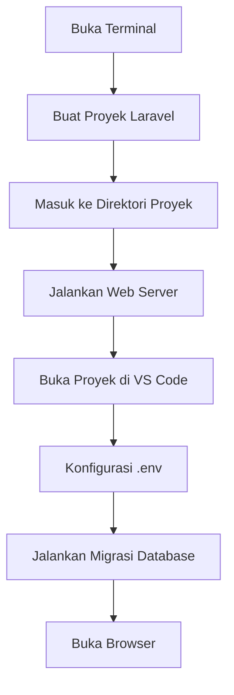
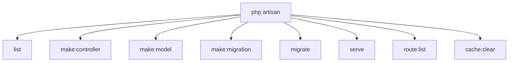

# Pembuatan Proyek Laravel Pertama

Setelah kita menginstal dan mengkonfigurasi lingkungan pengembangan (Laragon dan VS Code), langkah selanjutnya adalah membuat proyek Laravel pertama kita. Dalam tutorial ini, kita akan belajar cara membuat proyek Laravel baru untuk aplikasi manajemen data mahasiswa.

## Prasyarat

Sebelum memulai, pastikan Anda telah menginstal:
- Laragon (dengan PHP, MySQL, dan Composer)
- Visual Studio Code
- Git

## Alur Pembuatan Proyek Laravel



## Langkah-langkah Pembuatan Proyek Laravel

### 1. Membuat Proyek Laravel Baru

Ada dua cara untuk membuat proyek Laravel baru:

#### Menggunakan Laragon (Cara Mudah)

1. Buka aplikasi Laragon
2. Klik kanan pada area kosong di jendela Laragon
3. Pilih **Quick App** > **Laravel**
4. Ketikkan nama proyek: `mahasiswa-app`
5. Tunggu hingga proses pembuatan selesai


#### Menggunakan Composer (Via Terminal)

1. Buka Terminal (Windows CMD, PowerShell, atau Git Bash)
2. Navigasi ke direktori tempat Anda ingin membuat proyek
   ```bash
   cd C:\laragon\www
   ```
3. Jalankan perintah Composer untuk membuat proyek Laravel baru
   ```bash
   composer create-project laravel/laravel mahasiswa-app
   ```
4. Tunggu hingga proses instalasi selesai (dapat memakan waktu beberapa menit tergantung koneksi internet)

### 2. Struktur Project Laravel yang Dihasilkan

Setelah proses instalasi selesai, Laravel akan menghasilkan struktur folder proyek lengkap. Mari kita periksa struktur folder utama:

```
mahasiswa-app/
├── app/
├── bootstrap/
├── config/
├── database/
├── public/
├── resources/
├── routes/
├── storage/
├── tests/
├── vendor/
├── .env
├── .env.example
├── artisan
├── composer.json
└── ...
```

### 3. Konfigurasi Proyek

#### A. Konfigurasi .env

File `.env` berisi pengaturan lingkungan proyek Laravel, termasuk konfigurasi database. Mari kita edit file ini untuk mengatur koneksi database:

1. Buka proyek di VS Code:
   ```bash
   code mahasiswa-app
   ```
   atau klik folder proyek di Laragon dengan opsi "Open in VS Code"

2. Buka file `.env` dan ubah pengaturan database:
   ```
   DB_CONNECTION=mysql
   DB_HOST=127.0.0.1
   DB_PORT=3306
   DB_DATABASE=mahasiswa_app
   DB_USERNAME=root
   DB_PASSWORD=
   ```

3. Ubah juga nama aplikasi:
   ```
   APP_NAME="Aplikasi Manajemen Mahasiswa"
   APP_ENV=local
   APP_DEBUG=true
   APP_URL=http://mahasiswa-app.test
   ```

#### B. Membuat Database

1. Buka Terminal di VS Code (Menu: View > Terminal atau `Ctrl+`)
2. Jalankan perintah berikut untuk membuat database:

   ```bash
   # Jika menggunakan Laragon MySQL
   mysql -u root -e "CREATE DATABASE mahasiswa_app CHARACTER SET utf8mb4 COLLATE utf8mb4_unicode_ci"
   
   # Atau alternatif lain:
   # Buka PhpMyAdmin melalui Laragon dan buat database secara manual
   ```

### 4. Menjalankan Migrasi Database

Laravel menyediakan migrasi default untuk tabel users dan password_resets. Mari kita jalankan migrasi ini:

```bash
cd mahasiswa-app
php artisan migrate
```

Jika berhasil, Anda akan melihat output seperti:

```
Migration table created successfully.
Migrating: 2014_10_12_000000_create_users_table
Migrated:  2014_10_12_000000_create_users_table
Migrating: 2014_10_12_100000_create_password_resets_table
Migrated:  2014_10_12_100000_create_password_resets_table
...
```

### 5. Menjalankan Web Server

#### Menggunakan Laragon

1. Pastikan Laragon sudah berjalan
2. Akses aplikasi melalui browser di:
   ```
   http://mahasiswa-app.test
   ```

#### Menggunakan Artisan Serve

Atau Anda bisa menjalankan server development bawaan Laravel:

```bash
php artisan serve
```

Server akan berjalan di: `http://127.0.0.1:8000`

### 6. Memeriksa Instalasi

Buka browser dan akses URL aplikasi (http://mahasiswa-app.test atau http://localhost:8000). Anda akan melihat halaman selamat datang Laravel:


Jika Anda melihat halaman selamat datang Laravel, selamat! Anda telah berhasil membuat proyek Laravel pertama Anda.

## Menjelajahi Proyek Laravel Baru

Sekarang proyek Laravel telah dibuat, mari kita jelajahi beberapa file kunci:

### routes/web.php

File ini berisi definisi rute web aplikasi. Buka file `routes/web.php` dan perhatikan rute default yang sudah ada:

```php
<?php

use Illuminate\Support\Facades\Route;

Route::get('/', function () {
    return view('welcome');
});
```

Ini adalah rute untuk halaman beranda yang mengembalikan view `welcome.blade.php`.

### resources/views/welcome.blade.php

File ini berisi tampilan halaman beranda default Laravel. Anda dapat memodifikasinya sesuai kebutuhan aplikasi Anda.

### app/Http/Controllers

Direktori ini akan berisi controller untuk aplikasi Anda. Saat ini mungkin kosong karena kita belum membuat controller apapun.

## Menggunakan Artisan CLI

Laravel menyediakan CLI (Command Line Interface) bernama Artisan untuk membantu pengembangan. Beberapa perintah Artisan yang berguna:



Berikut beberapa perintah Artisan dasar:

```bash
# Melihat daftar perintah yang tersedia
php artisan list

# Melihat daftar rute yang terdaftar
php artisan route:list

# Membuat controller baru
php artisan make:controller MahasiswaController

# Membuat model baru dengan migrasi
php artisan make:model Mahasiswa -m

# Membersihkan cache
php artisan cache:clear
```

## Langkah Selanjutnya untuk Aplikasi Mahasiswa

Setelah berhasil membuat proyek Laravel pertama, berikut adalah beberapa langkah yang akan kita lakukan pada pertemuan-pertemuan selanjutnya:

1. Membuat migrasi untuk tabel mahasiswa
2. Membuat model Mahasiswa
3. Membuat controller untuk manajemen data mahasiswa
4. Membuat tampilan untuk form dan daftar mahasiswa
5. Mengimplementasikan fitur CRUD lengkap

## Tips Pemecahan Masalah

Berikut beberapa masalah umum yang mungkin Anda hadapi:

### 1. Halaman Laravel Tidak Muncul
- Pastikan web server (Laragon/Apache) berjalan
- Periksa file `.env` untuk pengaturan APP_URL
- Coba akses dengan URL yang berbeda (localhost:8000 atau 127.0.0.1:8000)

### 2. Error Database
- Pastikan nama database di `.env` sudah benar
- Pastikan kredensial MySQL sudah benar
- Pastikan layanan MySQL berjalan

### 3. Error Permissions
- Pastikan direktori `storage` dan `bootstrap/cache` dapat ditulis oleh web server

## Kesimpulan

Selamat! Anda telah berhasil membuat proyek Laravel pertama Anda. Ini adalah langkah awal yang penting dalam perjalanan belajar Laravel. Pada pertemuan selanjutnya, kita akan belajar lebih banyak tentang konfigurasi database, routing, dan membuat controller pertama.

Jangan lupa untuk menjelajahi struktur proyek Laravel dan membiasakan diri dengan file-file dan direktori utama. Pemahaman yang baik tentang struktur proyek Laravel akan sangat membantu Anda dalam pengembangan aplikasi web di masa depan.
