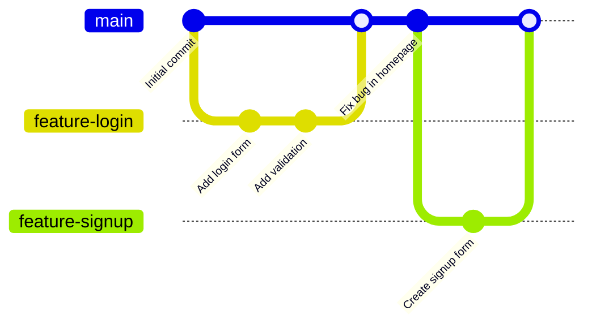
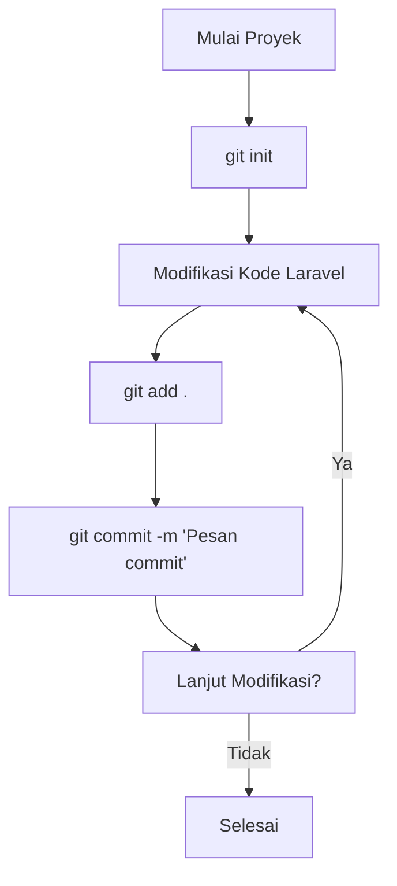
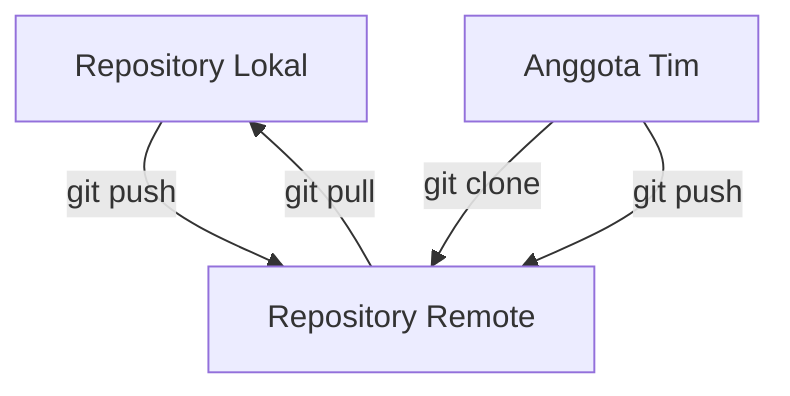

# Pengenalan Git untuk Version Control

Git adalah sistem version control yang sangat populer dan esensial bagi pengembang modern, termasuk developer Laravel. Mari kita kenali dasar-dasar Git untuk mengelola proyek Laravel Anda dengan lebih efektif.

## Apa itu Git?

Git adalah sistem version control terdistribusi yang memungkinkan Anda:
- Melacak perubahan kode
- Bekerja secara kolaboratif
- Mengelola berbagai versi kode
- Menyimpan riwayat perubahan
- Mengembalikan kode ke versi sebelumnya

## Mengapa Git Penting dalam Pengembangan Laravel?

1. **Pelacakan Perubahan**: Setiap perubahan kode di proyek Laravel Anda dapat direkam
2. **Kolaborasi Tim**: Memungkinkan banyak developer bekerja pada proyek yang sama
3. **Percabangan (Branching)**: Memungkinkan pengembangan fitur terpisah tanpa mengganggu kode utama
4. **Deployment**: Mempermudah proses deployment aplikasi Laravel
5. **Backup**: Menyediakan backup kode di repositori remote

## Konsep Dasar Git



### Istilah Penting dalam Git

- **Repository (Repo)**: Tempat penyimpanan kode dan history perubahan
- **Commit**: Catatan perubahan yang disimpan di repository
- **Branch**: Cabang pengembangan terpisah dari kode utama
- **Merge**: Penggabungan perubahan dari satu branch ke branch lain
- **Clone**: Mengunduh salinan repository ke komputer lokal
- **Pull**: Mengambil perubahan terbaru dari repository remote
- **Push**: Mengirim perubahan lokal ke repository remote

## Alur Kerja Dasar Git dalam Proyek Laravel



## Instalasi Git

### Windows
1. Unduh installer Git dari [git-scm.com](https://git-scm.com/)
2. Jalankan installer dan ikuti petunjuknya
3. Buka Command Prompt atau Git Bash untuk memverifikasi instalasi:
   ```
   git --version
   ```

### Linux
```bash
# Ubuntu/Debian
sudo apt-get update
sudo apt-get install git

# Fedora
sudo dnf install git

# Verifikasi instalasi
git --version
```

## Konfigurasi Awal Git

Setelah instalasi, Anda perlu mengonfigurasi identitas:

```bash
git config --global user.name "Nama Anda"
git config --global user.email "email@anda.com"
```

## Perintah Git Dasar untuk Proyek Laravel

### Membuat Repository Baru

```bash
# Masuk ke direktori proyek Laravel
cd mahasiswa-app

# Inisialisasi repository Git
git init
```

### Memeriksa Status Repository

```bash
git status
```

### Menambahkan File ke Staging Area

```bash
# Menambahkan semua file
git add .

# Menambahkan file tertentu
git add app/Models/Mahasiswa.php
```

### Menyimpan Perubahan (Commit)

```bash
git commit -m "Pesan commit yang menjelaskan perubahan"
```

### Melihat Riwayat Commit

```bash
git log
```

### Bekerja dengan Branch

```bash
# Membuat branch baru
git branch fitur-login

# Pindah ke branch baru
git checkout fitur-login
# atau
git switch fitur-login

# Membuat dan pindah ke branch baru sekaligus
git checkout -b fitur-register
```

### Menggabungkan Branch

```bash
# Kembali ke branch utama
git checkout main

# Gabungkan perubahan dari branch lain
git merge fitur-login
```

## File .gitignore untuk Laravel

Laravel memiliki file `.gitignore` default yang baik, namun perlu dipastikan bahwa file-file berikut tidak dimasukkan ke repository:

```
/node_modules
/public/hot
/public/storage
/storage/*.key
/vendor
.env
.env.backup
.phpunit.result.cache
docker-compose.override.yml
Homestead.json
Homestead.yaml
npm-debug.log
yarn-error.log
/.idea
/.vscode
```

## Praktik: Inisialisasi Repositori Git dan Commit Pertama

1. Buka terminal dan navigasi ke direktori proyek Laravel Anda
   ```bash
   cd mahasiswa-app
   ```

2. Inisialisasi repositori Git
   ```bash
   git init
   ```

3. Tambahkan file `.gitignore` jika belum ada (Laravel biasanya sudah menyertakannya)

4. Tambahkan semua file ke staging area
   ```bash
   git add .
   ```

5. Buat commit pertama
   ```bash
   git commit -m "Initial commit: Project setup Laravel Mahasiswa App"
   ```

6. Periksa status dan log
   ```bash
   git status
   git log
   ```

## Bekerja dengan Repository Remote (GitHub, GitLab, dll)



### Menghubungkan dengan Repository Remote

```bash
# Menambahkan remote repository
git remote add origin https://github.com/username/mahasiswa-app.git

# Push ke repository remote
git push -u origin main
```

### Mengunduh dari Repository Remote

```bash
# Clone repository
git clone https://github.com/username/mahasiswa-app.git

# Pull perubahan terbaru
git pull
```

## Tips Praktis Git untuk Proyek Laravel

1. **Commit secara teratur**: Buat commit kecil dengan pesan yang jelas
2. **Gunakan branch untuk fitur**: Kembangkan fitur baru di branch terpisah
3. **Pull sebelum push**: Selalu ambil perubahan terbaru sebelum mengirim perubahan Anda
4. **Review kode**: Periksa perubahan sebelum melakukan commit dengan `git diff`
5. **Gunakan alias**: Buat perintah pendek untuk operasi Git yang sering digunakan

## Sumber Belajar Git Lebih Lanjut

- [Pro Git Book](https://git-scm.com/book) (Gratis)
- [GitHub Learning Lab](https://lab.github.com/)
- [Atlassian Git Tutorial](https://www.atlassian.com/git/tutorials)
- [Git Cheat Sheet](https://education.github.com/git-cheat-sheet-education.pdf)

Dengan pengenalan dasar ini, Anda dapat mulai menggunakan Git untuk mengelola proyek Laravel Anda. Praktik yang konsisten akan membuat Anda semakin ahli dalam menggunakan Git untuk pengembangan yang lebih efisien dan terorganisir.