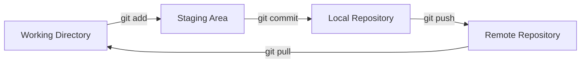
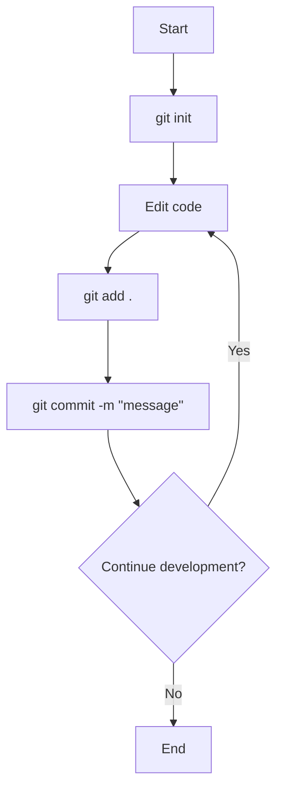

# Praktik: Inisialisasi Repositori Git dan Commit Pertama

Pada tutorial ini, kita akan belajar cara menggunakan Git untuk mengelola kode proyek Laravel kita. Git adalah sistem kontrol versi yang memungkinkan kita melacak perubahan kode, berkolaborasi dengan tim, dan mengelola riwayat pengembangan proyek dengan baik.

## Apa itu Git?

Git adalah sistem kontrol versi terdistribusi yang membantu developer melacak perubahan pada kode sumber. Dengan Git, kita bisa:
- Menyimpan riwayat perubahan kode
- Bekerja secara paralel dalam cabang terpisah (branch)
- Menggabungkan perubahan dari berbagai sumber
- Kembali ke versi kode sebelumnya jika diperlukan

## Alur Kerja Dasar Git



## Langkah-langkah Inisialisasi Repositori Git

### 1. Instalasi Git

Pastikan Git sudah terinstal di komputer Anda:

```bash
git --version
```

Jika belum terinstal, download dari [git-scm.com](https://git-scm.com/) atau gunakan manajer paket sistem Anda.

### 2. Konfigurasi Git

Sebelum menggunakan Git, lakukan konfigurasi identitas Anda:

```bash
git config --global user.name "Nama Anda"
git config --global user.email "email@anda.com"
```

### 3. Inisialisasi Repositori Git dalam Proyek Laravel

Buka terminal dan navigasikan ke direktori proyek Laravel:

```bash
cd mahasiswa-app
```

Inisialisasi repositori Git baru:

```bash
git init
```

Perintah ini akan membuat subdirektori `.git` yang berisi semua file yang diperlukan untuk repositori Git.

### 4. Membuat File .gitignore

Laravel sudah menyertakan file `.gitignore` secara default, tetapi kita bisa memastikannya ada dengan isi yang sesuai:

```
/node_modules
/public/hot
/public/storage
/storage/*.key
/vendor
.env
.env.backup
.phpunit.result.cache
Homestead.json
Homestead.yaml
npm-debug.log
yarn-error.log
```

File ini mencegah Git melacak file yang tidak perlu disimpan dalam repositori, seperti dependensi, file konfigurasi lokal, dan file sementara.

### 5. Menambahkan File ke Staging Area

Tambahkan semua file proyek ke staging area:

```bash
git add .
```

Perintah ini menandai semua file (kecuali yang ada di .gitignore) untuk dimasukkan ke commit berikutnya.

### 6. Commit Pertama

Buat commit pertama dengan pesan deskriptif:

```bash
git commit -m "Initial commit: Laravel project setup"
```

Selamat! Anda telah berhasil membuat commit pertama di repositori Git.

## Alur Kerja Git untuk Pengembangan



## Menghubungkan dengan Repositori Remote (Opsional)

Jika Anda ingin menyimpan proyek di GitHub, GitLab, atau layanan serupa:

1. Buat repositori baru di platform pilihan Anda
2. Hubungkan repositori lokal dengan repositori remote:

```bash
git remote add origin https://github.com/username/mahasiswa-app.git
```

3. Push commit pertama Anda:

```bash
git push -u origin master
```

## Tips Penggunaan Git

1. **Commit secara teratur** - Buat commit kecil dan sering dengan pesan yang jelas
2. **Gunakan branch** - Buat branch terpisah untuk fitur atau perbaikan baru
3. **Cek status** - Gunakan `git status` untuk melihat file yang telah diubah
4. **Lihat riwayat** - Gunakan `git log` untuk melihat riwayat commit

## Kesimpulan

Dengan menginisialisasi repositori Git dan membuat commit pertama, Anda telah menyiapkan pondasi penting untuk mengelola proyek Laravel Anda. Git akan membantu Anda melacak perubahan, berkolaborasi dengan tim, dan menjaga kode tetap terorganisir selama pengembangan.

Pada pertemuan berikutnya, kita akan mulai mempelajari dasar-dasar Laravel untuk mengembangkan aplikasi manajemen data Mahasiswa.