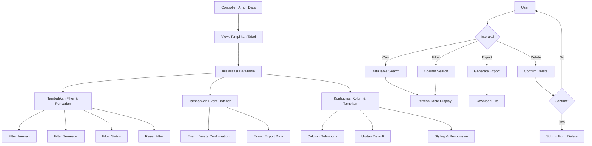

# Datatable untuk Manajemen Data Mahasiswa

DataTables merupakan plugin jQuery yang sangat powerful untuk menampilkan data dalam bentuk tabel dengan berbagai fitur seperti pencarian, pengurutan, dan pagination. Pada bagian ini, kita akan mengimplementasikan DataTables untuk manajemen data Mahasiswa tanpa menggunakan library Yajra, melainkan dengan pendekatan client-side rendering.

## Implementasi DataTables di Laravel

### 1. Menyiapkan Controller

Pertama, pastikan controller untuk menampilkan data mahasiswa sudah siap:

```php
// app/Http/Controllers/MahasiswaController.php
public function index()
{
    $mahasiswas = Mahasiswa::with('jurusan')->get();
    return view('mahasiswa.index', compact('mahasiswas'));
}
```

### 2. Menyiapkan View dengan DataTables

Buat atau perbarui view untuk menampilkan data mahasiswa dengan DataTables:

```php
// resources/views/mahasiswa/index.blade.php
@extends('layouts.app')

@section('title', 'Daftar Mahasiswa')

@section('content')
    <div class="card">
        <div class="card-header bg-primary text-white">
            <div class="d-flex justify-content-between align-items-center">
                <h4 class="mb-0"><i class="fas fa-users me-2"></i>Daftar Mahasiswa</h4>
                <a href="{{ route('mahasiswa.create') }}" class="btn btn-light">
                    <i class="fas fa-plus-circle me-1"></i>Tambah Mahasiswa
                </a>
            </div>
        </div>
        <div class="card-body">
            <div class="table-responsive">
                <table id="mahasiswa-table" class="table table-bordered table-striped table-hover">
                    <thead class="table-dark">
                        <tr>
                            <th width="5%">No</th>
                            <th width="10%">NIM</th>
                            <th width="20%">Nama</th>
                            <th width="15%">Jurusan</th>
                            <th width="10%">Semester</th>
                            <th width="15%">Email</th>
                            <th width="10%">Status</th>
                            <th width="15%">Aksi</th>
                        </tr>
                    </thead>
                    <tbody>
                        @foreach($mahasiswas as $index => $mahasiswa)
                            <tr>
                                <td>{{ $index + 1 }}</td>
                                <td>{{ $mahasiswa->nim }}</td>
                                <td>{{ $mahasiswa->nama }}</td>
                                <td>{{ $mahasiswa->jurusan->nama }}</td>
                                <td>{{ $mahasiswa->semester }}</td>
                                <td>{{ $mahasiswa->email }}</td>
                                <td>
                                    @if($mahasiswa->status == 'aktif')
                                        <span class="badge bg-success">Aktif</span>
                                    @else
                                        <span class="badge bg-secondary">Tidak Aktif</span>
                                    @endif
                                </td>
                                <td>
                                    <div class="btn-group" role="group">
                                        <a href="{{ route('mahasiswa.show', $mahasiswa->id) }}" class="btn btn-sm btn-info text-white" data-bs-toggle="tooltip" title="Detail">
                                            <i class="fas fa-eye"></i>
                                        </a>
                                        <a href="{{ route('mahasiswa.edit', $mahasiswa->id) }}" class="btn btn-sm btn-warning text-white" data-bs-toggle="tooltip" title="Edit">
                                            <i class="fas fa-edit"></i>
                                        </a>
                                        <button type="button" class="btn btn-sm btn-danger delete-btn" 
                                                data-id="{{ $mahasiswa->id }}" 
                                                data-name="{{ $mahasiswa->nama }}"
                                                data-bs-toggle="tooltip" title="Hapus">
                                            <i class="fas fa-trash"></i>
                                        </button>
                                    </div>
                                </td>
                            </tr>
                        @endforeach
                    </tbody>
                </table>
            </div>
        </div>
    </div>
    
    <!-- Form Hapus (Hidden) -->
    <form id="delete-form" method="POST" style="display: none;">
        @csrf
        @method('DELETE')
    </form>
@endsection

@push('scripts')
<script>
    $(document).ready(function() {
        // Inisialisasi DataTable
        $('#mahasiswa-table').DataTable({
            // Konfigurasi dasar
            language: {
                url: '//cdn.datatables.net/plug-ins/1.13.5/i18n/id.json'
            },
            responsive: true,
            
            // Konfigurasi fitur
            lengthMenu: [[5, 10, 25, 50, -1], [5, 10, 25, 50, "Semua"]],
            pageLength: 10,
            
            // Konfigurasi kolom
            columnDefs: [
                { orderable: false, targets: [0, 7] },  // Kolom No dan Aksi tidak bisa diurutkan
                { searchable: false, targets: [0, 7] }, // Kolom No dan Aksi tidak bisa dicari
                { className: 'text-center', targets: [0, 4, 6, 7] } // Rata tengah untuk kolom tertentu
            ],
            
            // Konfigurasi urutan default
            order: [[2, 'asc']], // Urutkan berdasarkan nama (kolom ke-2) secara ascending
            
            // Konfigurasi DOM untuk mempercantik tampilan
            dom: '<"row"<"col-sm-12 col-md-6"l><"col-sm-12 col-md-6"f>>' +
                 '<"row"<"col-sm-12"tr>>' +
                 '<"row"<"col-sm-12 col-md-5"i><"col-sm-12 col-md-7"p>>',
                 
            // Aktifkan fitur ekspor (jika dibutuhkan, perlu tambahan library buttons)
            // buttons: ['copy', 'excel', 'pdf', 'print'],
            
            // Kustomisasi tampilan
            initComplete: function() {
                // Tambahkan warna bergantian untuk baris
                $('#mahasiswa-table tbody tr:odd').addClass('table-light');
                
                // Aktifkan tooltip setelah DataTable diinisialisasi
                $('[data-bs-toggle="tooltip"]').tooltip();
            }
        });
        
        // Sweet Alert untuk konfirmasi hapus
        $('.delete-btn').on('click', function() {
            const id = $(this).data('id');
            const name = $(this).data('name');
            
            Swal.fire({
                title: 'Apakah Anda yakin?',
                text: `Data mahasiswa ${name} akan dihapus!`,
                icon: 'warning',
                showCancelButton: true,
                confirmButtonColor: '#d33',
                cancelButtonColor: '#3085d6',
                confirmButtonText: 'Ya, hapus!',
                cancelButtonText: 'Batal'
            }).then((result) => {
                if (result.isConfirmed) {
                    const form = $('#delete-form');
                    form.attr('action', `{{ url('/mahasiswa') }}/${id}`);
                    form.submit();
                }
            });
        });
    });
</script>
@endpush
```

### 3. Menambahkan Filter dan Pencarian Lanjutan

Kita bisa meningkatkan fungsionalitas dengan menambahkan filter dan pencarian lanjutan:

```php
// resources/views/mahasiswa/index.blade.php (menambahkan filter di atas tabel)
<div class="row mb-3">
    <div class="col-md-12">
        <div class="card bg-light">
            <div class="card-body">
                <h5 class="card-title mb-3">Filter Data</h5>
                <div class="row">
                    <div class="col-md-3 mb-2">
                        <select id="filter-jurusan" class="form-select filter-column">
                            <option value="">- Semua Jurusan -</option>
                            @foreach($jurusans as $jurusan)
                                <option value="{{ $jurusan->nama }}">{{ $jurusan->nama }}</option>
                            @endforeach
                        </select>
                    </div>
                    <div class="col-md-3 mb-2">
                        <select id="filter-semester" class="form-select filter-column">
                            <option value="">- Semua Semester -</option>
                            @for($i = 1; $i <= 8; $i++)
                                <option value="{{ $i }}">Semester {{ $i }}</option>
                            @endfor
                        </select>
                    </div>
                    <div class="col-md-3 mb-2">
                        <select id="filter-status" class="form-select filter-column">
                            <option value="">- Semua Status -</option>
                            <option value="Aktif">Aktif</option>
                            <option value="Tidak Aktif">Tidak Aktif</option>
                        </select>
                    </div>
                    <div class="col-md-3 mb-2">
                        <button id="reset-filter" class="btn btn-secondary w-100">
                            <i class="fas fa-undo me-1"></i>Reset Filter
                        </button>
                    </div>
                </div>
            </div>
        </div>
    </div>
</div>
```

Kemudian tambahkan JavaScript untuk filter di bagian script:

```javascript
// Tambahkan kode ini di dalam @push('scripts')
// Filter kolom spesifik
$('#filter-jurusan').on('change', function() {
    table.column(3).search(this.value).draw(); // Kolom Jurusan
});

$('#filter-semester').on('change', function() {
    table.column(4).search(this.value).draw(); // Kolom Semester
});

$('#filter-status').on('change', function() {
    table.column(6).search(this.value).draw(); // Kolom Status
});

// Reset filter
$('#reset-filter').on('click', function() {
    $('.filter-column').val('');
    table.search('').columns().search('').draw();
});
```

### 4. Memodifikasi Controller untuk Pengambilan Data yang Efisien

Untuk aplikasi dengan data besar, kita bisa mengoptimalkan pengambilan data:

```php
// app/Http/Controllers/MahasiswaController.php
public function index()
{
    // Eager loading untuk mengurangi N+1 query problem
    $mahasiswas = Mahasiswa::with(['jurusan'])->get();
    
    // Ambil daftar jurusan untuk filter
    $jurusans = Jurusan::orderBy('nama')->get();
    
    return view('mahasiswa.index', compact('mahasiswas', 'jurusans'));
}
```

### 5. Mempercantik Tampilan DataTable

Untuk membuat tampilan DataTable lebih menarik, tambahkan custom CSS:

```css
/* public/css/datatable-custom.css */
/* Header tabel */
#mahasiswa-table thead th {
    background-color: #343a40;
    color: white;
    border-color: #454d55;
    text-transform: uppercase;
    font-size: 0.9em;
    padding: 12px;
}

/* Footer tabel */
#mahasiswa-table tfoot th {
    background-color: #f8f9fa;
    font-weight: bold;
}

/* Warna baris saat hover */
#mahasiswa-table tbody tr:hover {
    background-color: rgba(0, 123, 255, 0.1) !important;
}

/* Badge styling */
#mahasiswa-table .badge {
    font-size: 0.8em;
    padding: 0.4em 0.6em;
}

/* Tombol aksi */
#mahasiswa-table .btn-group .btn {
    margin: 0 2px;
    padding: 0.25rem 0.5rem;
}

/* Pagination styling */
.dataTables_wrapper .dataTables_paginate .paginate_button.current, 
.dataTables_wrapper .dataTables_paginate .paginate_button.current:hover {
    background: linear-gradient(to bottom, #3490dc 0%, #2779bd 100%);
    color: white !important;
    border-color: #2779bd;
    border-radius: 4px;
}

.dataTables_wrapper .dataTables_paginate .paginate_button:hover {
    background: linear-gradient(to bottom, #f8f9fa 0%, #e9ecef 100%);
    color: #212529 !important;
    border-color: #dee2e6;
}

/* Search box styling */
.dataTables_wrapper .dataTables_filter input {
    border: 1px solid #ced4da;
    border-radius: 0.25rem;
    padding: 0.375rem 0.75rem;
    font-size: 0.9rem;
}

.dataTables_wrapper .dataTables_filter input:focus {
    border-color: #80bdff;
    box-shadow: 0 0 0 0.2rem rgba(0, 123, 255, 0.25);
    outline: 0;
}

/* Length selection styling */
.dataTables_wrapper .dataTables_length select {
    border: 1px solid #ced4da;
    border-radius: 0.25rem;
    padding: 0.375rem 1.75rem 0.375rem 0.75rem;
}

/* Container spacing */
.dataTables_wrapper {
    padding: 1rem 0;
}

/* Responsive design untuk mobile */
@media (max-width: 768px) {
    #mahasiswa-table {
        font-size: 0.85rem;
    }
    
    #mahasiswa-table .btn-group .btn {
        padding: 0.2rem 0.4rem;
        font-size: 0.8rem;
    }
    
    .dataTables_wrapper .dataTables_filter,
    .dataTables_wrapper .dataTables_length {
        text-align: left;
        margin-bottom: 10px;
    }
}
```

### 6. Menambahkan Fitur Ekspor Data

Untuk menambahkan fitur ekspor data (PDF, Excel, Copy, Print), kita perlu menyertakan beberapa library tambahan:

```php
<!-- Di layout.app.blade.php, tambahkan CSS ini di bagian head -->
<link href="https://cdn.datatables.net/buttons/2.4.0/css/buttons.bootstrap5.min.css" rel="stylesheet">

<!-- Di layout.app.blade.php, tambahkan JavaScript ini di bagian bawah -->
<script src="https://cdn.datatables.net/buttons/2.4.0/js/dataTables.buttons.min.js"></script>
<script src="https://cdn.datatables.net/buttons/2.4.0/js/buttons.bootstrap5.min.js"></script>
<script src="https://cdnjs.cloudflare.com/ajax/libs/jszip/3.10.1/jszip.min.js"></script>
<script src="https://cdnjs.cloudflare.com/ajax/libs/pdfmake/0.1.70/pdfmake.min.js"></script>
<script src="https://cdnjs.cloudflare.com/ajax/libs/pdfmake/0.1.70/vfs_fonts.js"></script>
<script src="https://cdn.datatables.net/buttons/2.4.0/js/buttons.html5.min.js"></script>
<script src="https://cdn.datatables.net/buttons/2.4.0/js/buttons.print.min.js"></script>
<script src="https://cdn.datatables.net/buttons/2.4.0/js/buttons.colVis.min.js"></script>
```

Kemudian aktifkan fitur ekspor di inisialisasi DataTable:

```javascript
// Ubah konfigurasi DataTable
var table = $('#mahasiswa-table').DataTable({
    // Konfigurasi lainnya tetap sama
    
    // Tambahkan buttons dan dom
    dom: '<"row"<"col-sm-12 col-md-6"B><"col-sm-12 col-md-6"f>>' +
         '<"row"<"col-sm-12"tr>>' +
         '<"row"<"col-sm-12 col-md-5"i><"col-sm-12 col-md-7"p>>',
    
    buttons: [
        {
            extend: 'copy',
            text: '<i class="fas fa-copy"></i> Copy',
            className: 'btn btn-secondary btn-sm',
            exportOptions: {
                columns: [1, 2, 3, 4, 5, 6] // Jangan ekspor kolom No dan Aksi
            }
        },
        {
            extend: 'excel',
            text: '<i class="fas fa-file-excel"></i> Excel',
            className: 'btn btn-success btn-sm',
            exportOptions: {
                columns: [1, 2, 3, 4, 5, 6]
            }
        },
        {
            extend: 'pdf',
            text: '<i class="fas fa-file-pdf"></i> PDF',
            className: 'btn btn-danger btn-sm',
            exportOptions: {
                columns: [1, 2, 3, 4, 5, 6]
            },
            customize: function(doc) {
                doc.content[1].table.widths = 
                    Array(doc.content[1].table.body[0].length + 1).join('*').split('');
                doc.defaultStyle.alignment = 'center';
                doc.styles.tableHeader.alignment = 'center';
                doc.content.splice(0, 1, {
                    margin: [0, 0, 0, 12],
                    alignment: 'center',
                    image: 'data:image/png;base64,...', // Logo base64 jika diperlukan
                    width: 80
                }, {
                    margin: [0, 0, 0, 12],
                    alignment: 'center',
                    text: 'DATA MAHASISWA',
                    style: {
                        fontSize: 16,
                        bold: true
                    }
                });
            }
        },
        {
            extend: 'print',
            text: '<i class="fas fa-print"></i> Print',
            className: 'btn btn-info btn-sm text-white',
            exportOptions: {
                columns: [1, 2, 3, 4, 5, 6]
            }
        },
        {
            extend: 'colvis',
            text: '<i class="fas fa-columns"></i> Kolom',
            className: 'btn btn-dark btn-sm'
        }
    ]
});
```



## Keuntungan Menggunakan DataTables

1. **Pencarian & Pengurutan** - Filter data secara instan baik keseluruhan maupun per kolom.
2. **Pagination Otomatis** - Penanganan data dalam jumlah besar dengan paginasi yang efisien.
3. **Responsive Design** - Tampilan yang menyesuaikan dengan ukuran layar perangkat.
4. **Interaksi yang Menyenangkan** - Animasi dan efek visual yang meningkatkan pengalaman pengguna.
5. **Ekspor Data** - Kemampuan untuk mengekspor data ke berbagai format seperti Excel, PDF, dll.
6. **Kustomisasi** - Dapat disesuaikan dengan kebutuhan tampilan aplikasi.

## Tips untuk Penggunaan DataTables yang Optimal

1. **Lazy Load untuk Data Besar** - Gunakan server-side processing untuk data dalam jumlah sangat besar.
2. **Optimasi Query** - Selalu gunakan eager loading untuk relasi agar menghindari N+1 query problem.
3. **Caching** - Pertimbangkan untuk melakukan caching data yang jarang berubah.
4. **Kolom yang Tepat** - Hanya tampilkan kolom yang benar-benar dibutuhkan pengguna.
5. **Responsif** - Pastikan tampilan DataTable tetap bagus di perangkat mobile.

## Tantangan Implementasi

Meskipun DataTables sangat powerful, beberapa tantangan yang mungkin dihadapi:

1. **Performa** - Untuk data sangat besar, client-side rendering bisa lambat.
2. **Kompleksitas** - Fitur lanjutan seperti inline editing membutuhkan konfigurasi tambahan.
3. **Integrasi dengan Backend** - Penyesuaian dengan model dan relasi Laravel kadang memerlukan penanganan khusus.

Dengan implementasi DataTables seperti di atas, manajemen data Mahasiswa menjadi lebih efisien, intuitif, dan menyenangkan bagi pengguna, tanpa harus bergantung pada Yajra DataTables.
