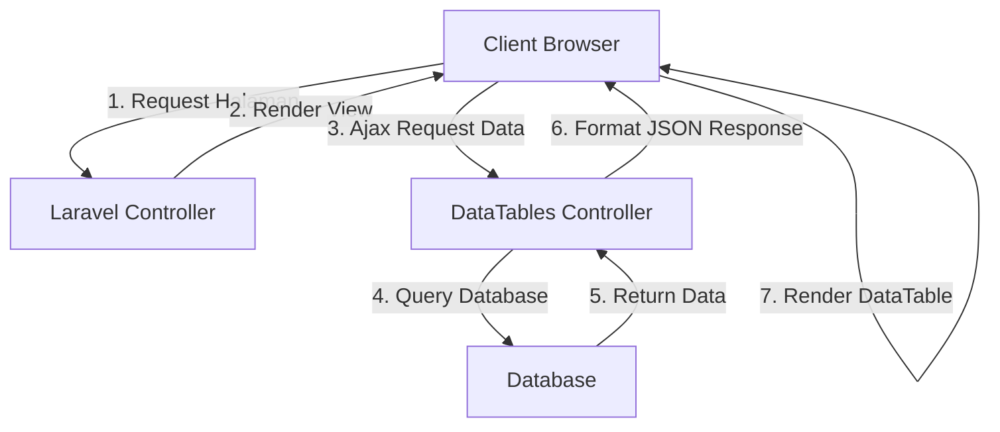

# Datatable untuk Manajemen Data Mahasiswa

Datatable adalah komponen UI yang sangat berguna untuk menampilkan dan mengelola data dalam bentuk tabel dengan berbagai fitur seperti pencarian, pengurutan, dan pagination. Dalam konteks aplikasi mahasiswa, datatable akan sangat membantu untuk mengelola data mahasiswa dengan lebih efisien.

## Pengenalan DataTables

DataTables adalah plugin jQuery yang menyediakan fungsionalitas tabel data yang kaya fitur. Untuk mengimplementasikan DataTables di aplikasi Laravel, kita akan menggunakan library Yajra DataTables yang menyediakan integrasi yang mulus antara Laravel dan DataTables.



## Instalasi Yajra DataTables

Pertama, mari kita instal paket Yajra DataTables:

```bash
composer require yajra/laravel-datatables-oracle
```

Setelah instalasi, tambahkan service provider dan alias di `config/app.php` (jika diperlukan, tergantung versi Laravel):

```php
'providers' => [
    // ...
    Yajra\DataTables\DataTablesServiceProvider::class,
],

'aliases' => [
    // ...
    'DataTables' => Yajra\DataTables\Facades\DataTables::class,
],
```

Kemudian publikasikan konfigurasi:

```bash
php artisan vendor:publish --provider="Yajra\DataTables\DataTablesServiceProvider"
```

## Implementasi DataTables untuk Data Mahasiswa

### 1. Controller untuk DataTable

Buat method di MahasiswaController untuk menangani request DataTable:

```php
use DataTables;
use App\Models\Mahasiswa;

public function getData()
{
    $mahasiswa = Mahasiswa::with('jurusan'); // Eager loading relasi
    
    return DataTables::of($mahasiswa)
        ->addIndexColumn()
        ->addColumn('action', function($row){
            $btn = '<a href="'.route('mahasiswa.edit', $row->id).'" class="btn btn-primary btn-sm">Edit</a> ';
            $btn .= '<a href="javascript:void(0)" data-id="'.$row->id.'" class="btn btn-danger btn-sm delete-btn">Hapus</a>';
            return $btn;
        })
        ->rawColumns(['action'])
        ->make(true);
}
```

### 2. Rute untuk DataTable

Tambahkan rute di `routes/web.php`:

```php
Route::get('mahasiswa/data', [MahasiswaController::class, 'getData'])->name('mahasiswa.data');
```

### 3. Implementasi View

Buat view dengan DataTable:

```html
@extends('layouts.app')

@section('styles')
<link rel="stylesheet" href="https://cdn.datatables.net/1.10.25/css/dataTables.bootstrap5.min.css">
@endsection

@section('content')
<div class="container">
    <div class="row justify-content-center">
        <div class="col-md-12">
            <div class="card">
                <div class="card-header d-flex justify-content-between align-items-center">
                    <span>Daftar Mahasiswa</span>
                    <a href="{{ route('mahasiswa.create') }}" class="btn btn-primary btn-sm">Tambah Mahasiswa</a>
                </div>
                <div class="card-body">
                    <table class="table table-bordered" id="mahasiswa-table">
                        <thead>
                            <tr>
                                <th>No</th>
                                <th>NIM</th>
                                <th>Nama</th>
                                <th>Jurusan</th>
                                <th>Email</th>
                                <th>Aksi</th>
                            </tr>
                        </thead>
                        <tbody>
                        </tbody>
                    </table>
                </div>
            </div>
        </div>
    </div>
</div>
@endsection

@section('scripts')
<script src="https://code.jquery.com/jquery-3.6.0.min.js"></script>
<script src="https://cdn.datatables.net/1.10.25/js/jquery.dataTables.min.js"></script>
<script src="https://cdn.datatables.net/1.10.25/js/dataTables.bootstrap5.min.js"></script>
<script>
    $(function() {
        $('#mahasiswa-table').DataTable({
            processing: true,
            serverSide: true,
            ajax: "{{ route('mahasiswa.data') }}",
            columns: [
                {data: 'DT_RowIndex', name: 'DT_RowIndex'},
                {data: 'nim', name: 'nim'},
                {data: 'nama', name: 'nama'},
                {data: 'jurusan.nama', name: 'jurusan.nama'},
                {data: 'email', name: 'email'},
                {data: 'action', name: 'action', orderable: false, searchable: false},
            ]
        });
    });
</script>
@endsection
```

## Fitur-fitur DataTable yang Berguna

### 1. Server-side Processing

Fitur ini memungkinkan DataTable memproses data di server, yang sangat berguna saat Anda memiliki dataset yang besar. Ini mengurangi waktu loading halaman dan meningkatkan performa aplikasi.

### 2. Pencarian dan Pengurutan

DataTable menyediakan fitur pencarian dan pengurutan kolom yang mudah digunakan. Pengguna dapat mencari data berdasarkan kata kunci atau mengurutkan berdasarkan kolom tertentu.

### 3. Pagination

DataTable secara otomatis menerapkan pagination untuk data yang ditampilkan, membuatnya lebih mudah untuk menjelajahi data yang banyak.

### 4. Export Data

Anda juga dapat menambahkan fitur export data ke berbagai format seperti CSV, Excel, PDF, dll.

```php
// Tambahkan di controller
public function exportExcel()
{
    return Excel::download(new MahasiswaExport, 'mahasiswa.xlsx');
}
```

### 5. Tombol Aksi Kustom

Anda dapat menambahkan tombol aksi kustom untuk setiap baris data, seperti edit, hapus, atau lihat detail.

## Tambahkan Konfirmasi Hapus dengan Sweet Alert

Untuk meningkatkan UX, tambahkan konfirmasi hapus menggunakan Sweet Alert:

```html
@section('scripts')
<!-- Script DataTable dari sebelumnya -->

<script src="https://cdn.jsdelivr.net/npm/sweetalert2@11"></script>
<script>
    // Event delegasi untuk tombol hapus
    $('#mahasiswa-table').on('click', '.delete-btn', function() {
        const id = $(this).data('id');
        
        Swal.fire({
            title: 'Apakah Anda yakin?',
            text: "Data mahasiswa akan dihapus permanen!",
            icon: 'warning',
            showCancelButton: true,
            confirmButtonColor: '#3085d6',
            cancelButtonColor: '#d33',
            confirmButtonText: 'Ya, hapus!',
            cancelButtonText: 'Batal'
        }).then((result) => {
            if (result.isConfirmed) {
                // Kirim request hapus
                $.ajax({
                    url: `/mahasiswa/${id}`,
                    type: 'DELETE',
                    data: {
                        "_token": "{{ csrf_token() }}"
                    },
                    success: function(response) {
                        Swal.fire(
                            'Terhapus!',
                            'Data mahasiswa berhasil dihapus.',
                            'success'
                        );
                        
                        // Reload DataTable
                        $('#mahasiswa-table').DataTable().ajax.reload();
                    },
                    error: function(error) {
                        Swal.fire(
                            'Gagal!',
                            'Terjadi kesalahan saat menghapus data.',
                            'error'
                        );
                    }
                });
            }
        });
    });
</script>
@endsection
```

## Kustomisasi Tampilan DataTable

Anda dapat menyesuaikan tampilan DataTable sesuai kebutuhan:

```javascript
$('#mahasiswa-table').DataTable({
    // Konfigurasi dasar
    processing: true,
    serverSide: true,
    ajax: "{{ route('mahasiswa.data') }}",
    
    // Kustomisasi bahasa
    language: {
        search: "Cari:",
        lengthMenu: "Tampilkan _MENU_ data per halaman",
        zeroRecords: "Tidak ada data yang ditemukan",
        info: "Menampilkan halaman _PAGE_ dari _PAGES_",
        infoEmpty: "Tidak ada data tersedia",
        infoFiltered: "(difilter dari _MAX_ total data)",
        paginate: {
            first: "Pertama",
            last: "Terakhir",
            next: "Selanjutnya",
            previous: "Sebelumnya"
        }
    },
    
    // Konfigurasi kolom
    columns: [
        // Definisi kolom seperti sebelumnya
    ],
    
    // Kustomisasi tampilan
    dom: '<"top"fl>rt<"bottom"ip><"clear">',
    responsive: true,
    
    // Pengaturan panjang halaman
    pageLength: 10,
    lengthMenu: [[10, 25, 50, 100, -1], [10, 25, 50, 100, "Semua"]]
});
```

## Best Practices dalam Menggunakan DataTable

1. **Gunakan eager loading** untuk meningkatkan performa saat mengambil data relasi
2. **Batasi kolom yang diambil** untuk mengurangi transfer data
3. **Gunakan server-side processing** untuk dataset yang besar
4. **Tambahkan indeks database** pada kolom yang sering digunakan untuk pencarian
5. **Hindari custom HTML kompleks** di controller, gunakan view partial atau component
