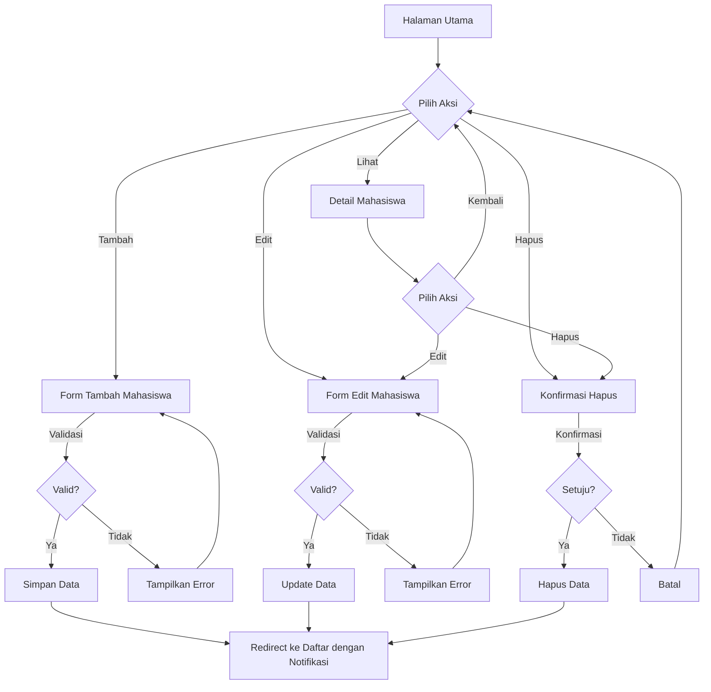
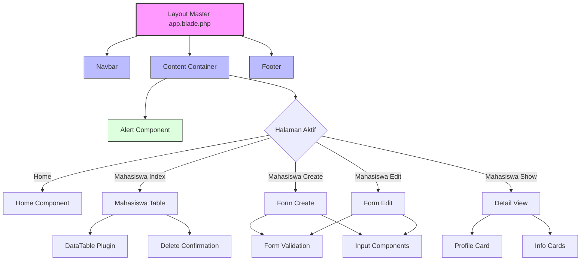

# Praktik: Mempercantik Tampilan Aplikasi

Pada praktik ini, kita akan mengaplikasikan semua pengetahuan yang telah kita pelajari tentang UI dan UX untuk mempercantik tampilan aplikasi pengelolaan data mahasiswa yang sudah kita kembangkan. Kita akan fokus pada implementasi praktis dari Blade, layout master, komponen, CSS framework, form dengan validasi, dan datatable.

## Langkah-langkah Implementasi

### 1. Menyiapkan Layout Dasar

Pertama, kita perlu memastikan bahwa layout master sudah dipersiapkan dengan baik:

```php
// resources/views/layouts/app.blade.php
<!DOCTYPE html>
<html lang="id">
<head>
    <meta charset="UTF-8">
    <meta name="viewport" content="width=device-width, initial-scale=1.0">
    <title>@yield('title', 'Aplikasi Mahasiswa')</title>
    <!-- Bootstrap CSS -->
    <link href="https://cdn.jsdelivr.net/npm/bootstrap@5.3.0/dist/css/bootstrap.min.css" rel="stylesheet">
    <!-- DataTables CSS -->
    <link href="https://cdn.datatables.net/1.13.5/css/dataTables.bootstrap5.min.css" rel="stylesheet">
    <!-- Font Awesome -->
    <link href="https://cdnjs.cloudflare.com/ajax/libs/font-awesome/6.4.0/css/all.min.css" rel="stylesheet">
    <!-- Custom CSS -->
    <link href="{{ asset('css/app.css') }}" rel="stylesheet">
    @stack('styles')
</head>
<body>
    <!-- Navbar -->
    @include('layouts.partials.navbar')
    
    <!-- Main Content -->
    <main class="container py-4">
        @include('layouts.partials.alerts')
        @yield('content')
    </main>
    
    <!-- Footer -->
    @include('layouts.partials.footer')
    
    <!-- Bootstrap JS -->
    <script src="https://cdn.jsdelivr.net/npm/bootstrap@5.3.0/dist/js/bootstrap.bundle.min.js"></script>
    <!-- jQuery -->
    <script src="https://code.jquery.com/jquery-3.7.0.min.js"></script>
    <!-- DataTables JS -->
    <script src="https://cdn.datatables.net/1.13.5/js/jquery.dataTables.min.js"></script>
    <script src="https://cdn.datatables.net/1.13.5/js/dataTables.bootstrap5.min.js"></script>
    <!-- Sweet Alert -->
    <script src="https://cdn.jsdelivr.net/npm/sweetalert2@11"></script>
    <!-- Custom JS -->
    <script src="{{ asset('js/app.js') }}"></script>
    @stack('scripts')
</body>
</html>
```

### 2. Membuat Komponen Navbar dan Footer

Selanjutnya, kita buat komponen navigasi dan footer:

```php
// resources/views/layouts/partials/navbar.blade.php
<nav class="navbar navbar-expand-lg navbar-dark bg-primary">
    <div class="container">
        <a class="navbar-brand" href="{{ route('home') }}">
            <i class="fas fa-graduation-cap me-2"></i>Aplikasi Mahasiswa
        </a>
        <button class="navbar-toggler" type="button" data-bs-toggle="collapse" data-bs-target="#navbarNav">
            <span class="navbar-toggler-icon"></span>
        </button>
        <div class="collapse navbar-collapse" id="navbarNav">
            <ul class="navbar-nav me-auto">
                <li class="nav-item">
                    <a class="nav-link {{ request()->routeIs('home') ? 'active' : '' }}" href="{{ route('home') }}">
                        <i class="fas fa-home me-1"></i>Beranda
                    </a>
                </li>
                <li class="nav-item">
                    <a class="nav-link {{ request()->routeIs('mahasiswa.*') ? 'active' : '' }}" href="{{ route('mahasiswa.index') }}">
                        <i class="fas fa-users me-1"></i>Mahasiswa
                    </a>
                </li>
                <li class="nav-item">
                    <a class="nav-link {{ request()->routeIs('jurusan.*') ? 'active' : '' }}" href="{{ route('jurusan.index') }}">
                        <i class="fas fa-book me-1"></i>Jurusan
                    </a>
                </li>
                <li class="nav-item">
                    <a class="nav-link {{ request()->routeIs('matakuliah.*') ? 'active' : '' }}" href="{{ route('matakuliah.index') }}">
                        <i class="fas fa-clipboard-list me-1"></i>Mata Kuliah
                    </a>
                </li>
            </ul>
            
            <!-- Menu User -->
            <ul class="navbar-nav">
                @auth
                    <li class="nav-item dropdown">
                        <a class="nav-link dropdown-toggle" href="#" id="userDropdown" role="button" data-bs-toggle="dropdown">
                            <i class="fas fa-user-circle me-1"></i>{{ Auth::user()->name }}
                        </a>
                        <div class="dropdown-menu dropdown-menu-end">
                            <a class="dropdown-item" href="{{ route('profile.edit') }}">
                                <i class="fas fa-user-cog me-1"></i>Profil
                            </a>
                            <div class="dropdown-divider"></div>
                            <form action="{{ route('logout') }}" method="POST">
                                @csrf
                                <button type="submit" class="dropdown-item text-danger">
                                    <i class="fas fa-sign-out-alt me-1"></i>Logout
                                </button>
                            </form>
                        </div>
                    </li>
                @else
                    <li class="nav-item">
                        <a class="nav-link" href="{{ route('login') }}">
                            <i class="fas fa-sign-in-alt me-1"></i>Login
                        </a>
                    </li>
                    <li class="nav-item">
                        <a class="nav-link" href="{{ route('register') }}">
                            <i class="fas fa-user-plus me-1"></i>Register
                        </a>
                    </li>
                @endauth
            </ul>
        </div>
    </div>
</nav>
```

```php
// resources/views/layouts/partials/footer.blade.php
<footer class="bg-dark text-white py-4 mt-5">
    <div class="container">
        <div class="row">
            <div class="col-md-6">
                <h5><i class="fas fa-graduation-cap me-2"></i>Aplikasi Mahasiswa</h5>
                <p class="text-muted">
                    Sistem Informasi Pengelolaan Data Mahasiswa menggunakan Laravel.
                </p>
            </div>
            <div class="col-md-3">
                <h5>Navigasi</h5>
                <ul class="list-unstyled">
                    <li><a href="{{ route('home') }}" class="text-white-50">Beranda</a></li>
                    <li><a href="{{ route('mahasiswa.index') }}" class="text-white-50">Mahasiswa</a></li>
                    <li><a href="{{ route('jurusan.index') }}" class="text-white-50">Jurusan</a></li>
                    <li><a href="{{ route('matakuliah.index') }}" class="text-white-50">Mata Kuliah</a></li>
                </ul>
            </div>
            <div class="col-md-3">
                <h5>Kontak</h5>
                <ul class="list-unstyled text-white-50">
                    <li><i class="fas fa-envelope me-2"></i>admin@mahasiswa-app.test</li>
                    <li><i class="fas fa-phone me-2"></i>+62 812 3456 7890</li>
                    <li><i class="fas fa-map-marker-alt me-2"></i>Jl. Pendidikan No. 123</li>
                </ul>
            </div>
        </div>
        <hr>
        <div class="text-center text-white-50">
            <small>&copy; {{ date('Y') }} Aplikasi Mahasiswa. All rights reserved.</small>
        </div>
    </div>
</footer>
```

### 3. Komponen Alert untuk Feedback

Kita perlu komponen alert untuk menampilkan pesan sukses, error, atau informasi:

```php
// resources/views/layouts/partials/alerts.blade.php
@if(session('success'))
    <div class="alert alert-success alert-dismissible fade show">
        <i class="fas fa-check-circle me-1"></i>{{ session('success') }}
        <button type="button" class="btn-close" data-bs-dismiss="alert"></button>
    </div>
@endif

@if(session('error'))
    <div class="alert alert-danger alert-dismissible fade show">
        <i class="fas fa-exclamation-circle me-1"></i>{{ session('error') }}
        <button type="button" class="btn-close" data-bs-dismiss="alert"></button>
    </div>
@endif

@if(session('info'))
    <div class="alert alert-info alert-dismissible fade show">
        <i class="fas fa-info-circle me-1"></i>{{ session('info') }}
        <button type="button" class="btn-close" data-bs-dismiss="alert"></button>
    </div>
@endif

@if($errors->any())
    <div class="alert alert-danger alert-dismissible fade show">
        <i class="fas fa-exclamation-triangle me-1"></i>Terdapat kesalahan pada input Anda:
        <ul class="mb-0 mt-2">
            @foreach($errors->all() as $error)
                <li>{{ $error }}</li>
            @endforeach
        </ul>
        <button type="button" class="btn-close" data-bs-dismiss="alert"></button>
    </div>
@endif
```

### 4. Halaman Beranda yang Menarik

Mari kita buat halaman beranda yang menarik:

```php
// resources/views/home.blade.php
@extends('layouts.app')

@section('title', 'Beranda - Aplikasi Mahasiswa')

@section('content')
    <div class="card bg-primary text-white mb-4">
        <div class="card-body p-5">
            <div class="row align-items-center">
                <div class="col-md-8">
                    <h1 class="display-4">Selamat Datang di Aplikasi Mahasiswa!</h1>
                    <p class="lead">Sistem informasi untuk manajemen data mahasiswa, jurusan, dan mata kuliah.</p>
                    <hr class="my-4">
                    <p>Gunakan menu navigasi di atas untuk mengakses fitur aplikasi.</p>
                    <a href="{{ route('mahasiswa.index') }}" class="btn btn-light btn-lg">
                        <i class="fas fa-users me-2"></i>Kelola Data Mahasiswa
                    </a>
                </div>
                <div class="col-md-4 text-center">
                    <i class="fas fa-graduation-cap fa-10x"></i>
                </div>
            </div>
        </div>
    </div>
    
    <div class="row">
        <div class="col-md-4">
            <div class="card mb-4">
                <div class="card-body text-center">
                    <i class="fas fa-users fa-4x text-primary mb-3"></i>
                    <h3>Mahasiswa</h3>
                    <p class="text-muted">Kelola data mahasiswa dengan mudah dan cepat.</p>
                    <a href="{{ route('mahasiswa.index') }}" class="btn btn-outline-primary">
                        <i class="fas fa-arrow-right me-1"></i>Lihat Data
                    </a>
                </div>
            </div>
        </div>
        <div class="col-md-4">
            <div class="card mb-4">
                <div class="card-body text-center">
                    <i class="fas fa-book fa-4x text-success mb-3"></i>
                    <h3>Jurusan</h3>
                    <p class="text-muted">Kelola data jurusan dan program studi.</p>
                    <a href="{{ route('jurusan.index') }}" class="btn btn-outline-success">
                        <i class="fas fa-arrow-right me-1"></i>Lihat Data
                    </a>
                </div>
            </div>
        </div>
        <div class="col-md-4">
            <div class="card mb-4">
                <div class="card-body text-center">
                    <i class="fas fa-clipboard-list fa-4x text-danger mb-3"></i>
                    <h3>Mata Kuliah</h3>
                    <p class="text-muted">Kelola data mata kuliah dan jadwal perkuliahan.</p>
                    <a href="{{ route('matakuliah.index') }}" class="btn btn-outline-danger">
                        <i class="fas fa-arrow-right me-1"></i>Lihat Data
                    </a>
                </div>
            </div>
        </div>
    </div>
@endsection
```

### 5. Meningkatkan Tampilan Daftar Mahasiswa dengan DataTable

```php
// resources/views/mahasiswa/index.blade.php
@extends('layouts.app')

@section('title', 'Daftar Mahasiswa')

@section('content')
    <div class="card">
        <div class="card-header bg-primary text-white">
            <div class="d-flex justify-content-between align-items-center">
                <h4 class="mb-0"><i class="fas fa-users me-2"></i>Daftar Mahasiswa</h4>
                <a href="{{ route('mahasiswa.create') }}" class="btn btn-light">
                    <i class="fas fa-plus-circle me-1"></i>Tambah Mahasiswa
                </a>
            </div>
        </div>
        <div class="card-body">
            <div class="table-responsive">
                <table id="mahasiswa-table" class="table table-bordered table-striped table-hover">
                    <thead class="table-dark">
                        <tr>
                            <th width="5%">No</th>
                            <th width="10%">NIM</th>
                            <th width="20%">Nama</th>
                            <th width="15%">Jurusan</th>
                            <th width="10%">Semester</th>
                            <th width="15%">Email</th>
                            <th width="10%">Status</th>
                            <th width="15%">Aksi</th>
                        </tr>
                    </thead>
                    <tbody>
                        @foreach($mahasiswas as $index => $mahasiswa)
                            <tr>
                                <td>{{ $index + 1 }}</td>
                                <td>{{ $mahasiswa->nim }}</td>
                                <td>{{ $mahasiswa->nama }}</td>
                                <td>{{ $mahasiswa->jurusan->nama }}</td>
                                <td>{{ $mahasiswa->semester }}</td>
                                <td>{{ $mahasiswa->email }}</td>
                                <td>
                                    @if($mahasiswa->status == 'aktif')
                                        <span class="badge bg-success">Aktif</span>
                                    @else
                                        <span class="badge bg-secondary">Tidak Aktif</span>
                                    @endif
                                </td>
                                <td>
                                    <div class="btn-group" role="group">
                                        <a href="{{ route('mahasiswa.show', $mahasiswa->id) }}" class="btn btn-sm btn-info text-white">
                                            <i class="fas fa-eye"></i>
                                        </a>
                                        <a href="{{ route('mahasiswa.edit', $mahasiswa->id) }}" class="btn btn-sm btn-warning text-white">
                                            <i class="fas fa-edit"></i>
                                        </a>
                                        <button type="button" class="btn btn-sm btn-danger delete-btn" 
                                                data-id="{{ $mahasiswa->id }}" 
                                                data-name="{{ $mahasiswa->nama }}">
                                            <i class="fas fa-trash"></i>
                                        </button>
                                    </div>
                                </td>
                            </tr>
                        @endforeach
                    </tbody>
                </table>
            </div>
        </div>
    </div>
    
    <!-- Form Hapus (Hidden) -->
    <form id="delete-form" method="POST" style="display: none;">
        @csrf
        @method('DELETE')
    </form>
@endsection

@push('scripts')
<script>
    $(document).ready(function() {
        // Inisialisasi DataTable
        $('#mahasiswa-table').DataTable({
            language: {
                url: '//cdn.datatables.net/plug-ins/1.13.5/i18n/id.json'
            },
            responsive: true
        });
        
        // Sweet Alert untuk konfirmasi hapus
        $('.delete-btn').on('click', function() {
            const id = $(this).data('id');
            const name = $(this).data('name');
            
            Swal.fire({
                title: 'Apakah Anda yakin?',
                text: `Data mahasiswa ${name} akan dihapus!`,
                icon: 'warning',
                showCancelButton: true,
                confirmButtonColor: '#d33',
                cancelButtonColor: '#3085d6',
                confirmButtonText: 'Ya, hapus!',
                cancelButtonText: 'Batal'
            }).then((result) => {
                if (result.isConfirmed) {
                    const form = $('#delete-form');
                    form.attr('action', `/mahasiswa/${id}`);
                    form.submit();
                }
            });
        });
    });
</script>
@endpush
```

### 6. Implementasi Form Tambah Mahasiswa dengan Validasi Client-Side

```php
// resources/views/mahasiswa/create.blade.php
@extends('layouts.app')

@section('title', 'Tambah Mahasiswa')

@section('content')
    <div class="card">
        <div class="card-header bg-primary text-white">
            <h4 class="mb-0"><i class="fas fa-user-plus me-2"></i>Tambah Mahasiswa Baru</h4>
        </div>
        <div class="card-body">
            <form action="{{ route('mahasiswa.store') }}" method="POST" id="form-mahasiswa">
                @csrf
                <div class="row">
                    <div class="col-md-6">
                        <div class="form-group mb-3">
                            <label for="nim" class="form-label">NIM <span class="text-danger">*</span></label>
                            <input type="text" class="form-control @error('nim') is-invalid @enderror" 
                                id="nim" name="nim" value="{{ old('nim') }}" required>
                            <div class="invalid-feedback" id="nim-error">
                                @error('nim'){{ $message }}@enderror
                            </div>
                        </div>
                        
                        <div class="form-group mb-3">
                            <label for="nama" class="form-label">Nama Lengkap <span class="text-danger">*</span></label>
                            <input type="text" class="form-control @error('nama') is-invalid @enderror" 
                                id="nama" name="nama" value="{{ old('nama') }}" required>
                            <div class="invalid-feedback" id="nama-error">
                                @error('nama'){{ $message }}@enderror
                            </div>
                        </div>
                        
                        <div class="form-group mb-3">
                            <label for="email" class="form-label">Email <span class="text-danger">*</span></label>
                            <input type="email" class="form-control @error('email') is-invalid @enderror" 
                                id="email" name="email" value="{{ old('email') }}" required>
                            <div class="invalid-feedback" id="email-error">
                                @error('email'){{ $message }}@enderror
                            </div>
                        </div>
                        
                        <div class="form-group mb-3">
                            <label for="tanggal_lahir" class="form-label">Tanggal Lahir</label>
                            <input type="date" class="form-control @error('tanggal_lahir') is-invalid @enderror" 
                                id="tanggal_lahir" name="tanggal_lahir" value="{{ old('tanggal_lahir') }}">
                            <div class="invalid-feedback">
                                @error('tanggal_lahir'){{ $message }}@enderror
                            </div>
                        </div>
                    </div>
                    
                    <div class="col-md-6">
                        <div class="form-group mb-3">
                            <label for="jurusan_id" class="form-label">Jurusan <span class="text-danger">*</span></label>
                            <select class="form-select @error('jurusan_id') is-invalid @enderror" 
                                id="jurusan_id" name="jurusan_id" required>
                                <option value="">-- Pilih Jurusan --</option>
                                @foreach($jurusans as $jurusan)
                                    <option value="{{ $jurusan->id }}" {{ old('jurusan_id') == $jurusan->id ? 'selected' : '' }}>
                                        {{ $jurusan->nama }}
                                    </option>
                                @endforeach
                            </select>
                            <div class="invalid-feedback" id="jurusan-error">
                                @error('jurusan_id'){{ $message }}@enderror
                            </div>
                        </div>
                        
                        <div class="form-group mb-3">
                            <label for="semester" class="form-label">Semester <span class="text-danger">*</span></label>
                            <select class="form-select @error('semester') is-invalid @enderror" 
                                id="semester" name="semester" required>
                                <option value="">-- Pilih Semester --</option>
                                @for($i = 1; $i <= 8; $i++)
                                    <option value="{{ $i }}" {{ old('semester') == $i ? 'selected' : '' }}>
                                        {{ $i }}
                                    </option>
                                @endfor
                            </select>
                            <div class="invalid-feedback" id="semester-error">
                                @error('semester'){{ $message }}@enderror
                            </div>
                        </div>
                        
                        <div class="form-group mb-3">
                            <label for="alamat" class="form-label">Alamat</label>
                            <textarea class="form-control @error('alamat') is-invalid @enderror" 
                                id="alamat" name="alamat" rows="3">{{ old('alamat') }}</textarea>
                            <div class="invalid-feedback">
                                @error('alamat'){{ $message }}@enderror
                            </div>
                        </div>
                        
                        <div class="form-group mb-3">
                            <label class="form-label d-block">Status <span class="text-danger">*</span></label>
                            <div class="form-check form-check-inline">
                                <input class="form-check-input" type="radio" name="status" id="status_aktif" 
                                    value="aktif" {{ old('status', 'aktif') == 'aktif' ? 'checked' : '' }} required>
                                <label class="form-check-label" for="status_aktif">Aktif</label>
                            </div>
                            <div class="form-check form-check-inline">
                                <input class="form-check-input" type="radio" name="status" id="status_tidak_aktif" 
                                    value="tidak_aktif" {{ old('status') == 'tidak_aktif' ? 'checked' : '' }} required>
                                <label class="form-check-label" for="status_tidak_aktif">Tidak Aktif</label>
                            </div>
                            <div class="invalid-feedback d-block" id="status-error">
                                @error('status'){{ $message }}@enderror
                            </div>
                        </div>
                    </div>
                </div>
                
                <div class="d-flex justify-content-end mt-3">
                    <a href="{{ route('mahasiswa.index') }}" class="btn btn-secondary me-2">
                        <i class="fas fa-arrow-left me-1"></i>Kembali
                    </a>
                    <button type="submit" class="btn btn-primary">
                        <i class="fas fa-save me-1"></i>Simpan
                    </button>
                </div>
            </form>
        </div>
    </div>
@endsection

@push('scripts')
<script>
    $(document).ready(function() {
        // Form validation
        $('#form-mahasiswa').on('submit', function(e) {
            let isValid = true;
            
            // Validasi NIM
            const nim = $('#nim').val().trim();
            if (nim === '') {
                $('#nim').addClass('is-invalid');
                $('#nim-error').text('NIM tidak boleh kosong');
                isValid = false;
            } else if (!/^\d{8,10}$/.test(nim)) {
                $('#nim').addClass('is-invalid');
                $('#nim-error').text('NIM harus berupa angka dengan panjang 8-10 digit');
                isValid = false;
            } else {
                $('#nim').removeClass('is-invalid');
            }
            
            // Validasi Nama
            const nama = $('#nama').val().trim();
            if (nama === '') {
                $('#nama').addClass('is-invalid');
                $('#nama-error').text('Nama tidak boleh kosong');
                isValid = false;
            } else if (nama.length < 3) {
                $('#nama').addClass('is-invalid');
                $('#nama-error').text('Nama minimal 3 karakter');
                isValid = false;
            } else {
                $('#nama').removeClass('is-invalid');
            }
            
            // Validasi Email
            const email = $('#email').val().trim();
            const emailRegex = /^[^\s@]+@[^\s@]+\.[^\s@]+$/;
            if (email === '') {
                $('#email').addClass('is-invalid');
                $('#email-error').text('Email tidak boleh kosong');
                isValid = false;
            } else if (!emailRegex.test(email)) {
                $('#email').addClass('is-invalid');
                $('#email-error').text('Format email tidak valid');
                isValid = false;
            } else {
                $('#email').removeClass('is-invalid');
            }
            
            // Validasi Jurusan
            if ($('#jurusan_id').val() === '') {
                $('#jurusan_id').addClass('is-invalid');
                $('#jurusan-error').text('Jurusan harus dipilih');
                isValid = false;
            } else {
                $('#jurusan_id').removeClass('is-invalid');
            }
            
            // Validasi Semester
            if ($('#semester').val() === '') {
                $('#semester').addClass('is-invalid');
                $('#semester-error').text('Semester harus dipilih');
                isValid = false;
            } else {
                $('#semester').removeClass('is-invalid');
            }
            
            // Validasi Status
            if (!$('input[name="status"]:checked').val()) {
                $('#status-error').text('Status harus dipilih');
                isValid = false;
            } else {
                $('#status-error').text('');
            }
            
            if (!isValid) {
                e.preventDefault();
            }
        });
        
        // Real-time validation
        $('#nim').on('input', function() {
            const nim = $(this).val().trim();
            if (nim === '') {
                $(this).addClass('is-invalid');
                $('#nim-error').text('NIM tidak boleh kosong');
            } else if (!/^\d{8,10}$/.test(nim)) {
                $(this).addClass('is-invalid');
                $('#nim-error').text('NIM harus berupa angka dengan panjang 8-10 digit');
            } else {
                $(this).removeClass('is-invalid');
            }
        });
        
        $('#email').on('input', function() {
            const email = $(this).val().trim();
            const emailRegex = /^[^\s@]+@[^\s@]+\.[^\s@]+$/;
            if (email && !emailRegex.test(email)) {
                $(this).addClass('is-invalid');
                $('#email-error').text('Format email tidak valid');
            } else {
                $(this).removeClass('is-invalid');
            }
        });
    });
</script>
@endpush
```

### 7. Tampilan Detail Mahasiswa

```php
// resources/views/mahasiswa/show.blade.php
@extends('layouts.app')

@section('title', 'Detail Mahasiswa')

@section('content')
    <div class="card">
        <div class="card-header bg-primary text-white">
            <h4 class="mb-0"><i class="fas fa-user me-2"></i>Detail Mahasiswa</h4>
        </div>
        <div class="card-body">
            <div class="row">
                <div class="col-md-4 text-center mb-4">
                    <div class="avatar-circle mb-3">
                        <span class="initials">{{ substr($mahasiswa->nama, 0, 1) }}</span>
                    </div>
                    <h4>{{ $mahasiswa->nama }}</h4>
                    <p class="text-muted">{{ $mahasiswa->nim }}</p>
                    <div class="mt-3">
                        @if($mahasiswa->status == 'aktif')
                            <span class="badge bg-success p-2">
                                <i class="fas fa-check-circle me-1"></i>Aktif
                            </span>
                        @else
                            <span class="badge bg-secondary p-2">
                                <i class="fas fa-times-circle me-1"></i>Tidak Aktif
                            </span>
                        @endif
                    </div>
                </div>
                <div class="col-md-8">
                    <div class="card mb-3">
                        <div class="card-header bg-light">
                        <h5 class="mb-0"><i class="fas fa-info-circle me-2"></i>Informasi Pribadi</h5>
                        </div>
                        <div class="card-body">
                            <table class="table table-borderless">
                                <tr>
                                    <th width="30%"><i class="fas fa-envelope me-2 text-muted"></i>Email</th>
                                    <td>{{ $mahasiswa->email }}</td>
                                </tr>
                                <tr>
                                    <th><i class="fas fa-birthday-cake me-2 text-muted"></i>Tanggal Lahir</th>
                                    <td>{{ $mahasiswa->tanggal_lahir ? date('d F Y', strtotime($mahasiswa->tanggal_lahir)) : '-' }}</td>
                                </tr>
                                <tr>
                                    <th><i class="fas fa-map-marker-alt me-2 text-muted"></i>Alamat</th>
                                    <td>{{ $mahasiswa->alamat ?: '-' }}</td>
                                </tr>
                            </table>
                        </div>
                    </div>
                    
                    <div class="card mb-3">
                        <div class="card-header bg-light">
                            <h5 class="mb-0"><i class="fas fa-graduation-cap me-2"></i>Informasi Akademik</h5>
                        </div>
                        <div class="card-body">
                            <table class="table table-borderless">
                                <tr>
                                    <th width="30%"><i class="fas fa-book me-2 text-muted"></i>Jurusan</th>
                                    <td>{{ $mahasiswa->jurusan->nama }}</td>
                                </tr>
                                <tr>
                                    <th><i class="fas fa-calendar-alt me-2 text-muted"></i>Semester</th>
                                    <td>{{ $mahasiswa->semester }}</td>
                                </tr>
                                <tr>
                                    <th><i class="fas fa-clock me-2 text-muted"></i>Terdaftar Sejak</th>
                                    <td>{{ date('d F Y', strtotime($mahasiswa->created_at)) }}</td>
                                </tr>
                            </table>
                        </div>
                    </div>
                    
                    <div class="card">
                        <div class="card-header bg-light">
                            <div class="d-flex justify-content-between align-items-center">
                                <h5 class="mb-0"><i class="fas fa-clipboard-list me-2"></i>Mata Kuliah</h5>
                                <a href="{{ route('mahasiswa.matakuliah.edit', $mahasiswa->id) }}" class="btn btn-sm btn-primary">
                                    <i class="fas fa-edit me-1"></i>Edit Mata Kuliah
                                </a>
                            </div>
                        </div>
                        <div class="card-body">
                            @if($mahasiswa->matakuliahs->count() > 0)
                                <div class="row">
                                    @foreach($mahasiswa->matakuliahs as $matakuliah)
                                        <div class="col-md-6 mb-2">
                                            <div class="d-flex align-items-center border rounded p-2">
                                                <div class="me-2">
                                                    <span class="badge bg-info p-2">{{ $matakuliah->kode }}</span>
                                                </div>
                                                <div>
                                                    <h6 class="mb-0">{{ $matakuliah->nama }}</h6>
                                                    <small class="text-muted">{{ $matakuliah->sks }} SKS</small>
                                                </div>
                                            </div>
                                        </div>
                                    @endforeach
                                </div>
                            @else
                                <div class="alert alert-info">
                                    <i class="fas fa-info-circle me-1"></i>Belum ada mata kuliah yang diambil.
                                </div>
                            @endif
                        </div>
                    </div>
                </div>
            </div>
            
            <div class="d-flex justify-content-end mt-4">
                <a href="{{ route('mahasiswa.index') }}" class="btn btn-secondary me-2">
                    <i class="fas fa-arrow-left me-1"></i>Kembali
                </a>
                <a href="{{ route('mahasiswa.edit', $mahasiswa->id) }}" class="btn btn-warning text-white me-2">
                    <i class="fas fa-edit me-1"></i>Edit
                </a>
                <button type="button" class="btn btn-danger delete-btn" 
                        data-id="{{ $mahasiswa->id }}" 
                        data-name="{{ $mahasiswa->nama }}">
                    <i class="fas fa-trash me-1"></i>Hapus
                </button>
            </div>
        </div>
    </div>
    
    <!-- Form Hapus (Hidden) -->
    <form id="delete-form" method="POST" style="display: none;">
        @csrf
        @method('DELETE')
    </form>
@endsection

@push('styles')
<style>
    /* Style untuk avatar circle */
    .avatar-circle {
        width: 120px;
        height: 120px;
        background-color: #3490dc;
        border-radius: 50%;
        display: flex;
        justify-content: center;
        align-items: center;
        margin: 0 auto;
    }
    
    .initials {
        font-size: 3rem;
        color: white;
        font-weight: bold;
    }
</style>
@endpush

@push('scripts')
<script>
    $(document).ready(function() {
        // Sweet Alert untuk konfirmasi hapus
        $('.delete-btn').on('click', function() {
            const id = $(this).data('id');
            const name = $(this).data('name');
            
            Swal.fire({
                title: 'Apakah Anda yakin?',
                text: `Data mahasiswa ${name} akan dihapus!`,
                icon: 'warning',
                showCancelButton: true,
                confirmButtonColor: '#d33',
                cancelButtonColor: '#3085d6',
                confirmButtonText: 'Ya, hapus!',
                cancelButtonText: 'Batal'
            }).then((result) => {
                if (result.isConfirmed) {
                    const form = $('#delete-form');
                    form.attr('action', `/mahasiswa/${id}`);
                    form.submit();
                }
            });
        });
    });
</script>
@endpush

```

### 8. Menambahkan CSS Kustom untuk Aplikasi

Agar tampilan aplikasi semakin menarik, mari kita tambahkan beberapa sentuhan CSS kustom:

```php
// public/css/app.css
/* General Styles */
body {
    font-family: 'Nunito', sans-serif;
    background-color: #f8f9fa;
}

/* Card styling */
.card {
    border-radius: 10px;
    box-shadow: 0 4px 6px rgba(0, 0, 0, 0.1);
    margin-bottom: 20px;
    border: none;
}

.card-header {
    border-top-left-radius: 10px;
    border-top-right-radius: 10px;
    font-weight: bold;
}

/* Table styling */
.table th {
    background-color: #f8f9fa;
}

.table-hover tbody tr:hover {
    background-color: rgba(0, 123, 255, 0.05);
}

/* Form styling */
.form-control:focus, .form-select:focus {
    border-color: #4dabf7;
    box-shadow: 0 0 0 0.25rem rgba(13, 110, 253, 0.25);
}

.btn {
    border-radius: 5px;
    padding: 0.5rem 1rem;
    transition: all 0.3s;
}

.btn:hover {
    transform: translateY(-2px);
}

/* Navbar styling */
.navbar {
    box-shadow: 0 2px 4px rgba(0, 0, 0, 0.1);
}

.navbar-brand {
    font-weight: bold;
    letter-spacing: 1px;
}

/* Footer styling */
footer {
    box-shadow: 0 -2px 4px rgba(0, 0, 0, 0.05);
}

/* Animation effects */
.card, .btn {
    transition: all 0.3s ease;
}

/* Hover effects */
.card:hover {
    transform: translateY(-5px);
    box-shadow: 0 8px 15px rgba(0, 0, 0, 0.1);
}

/* Custom badge styling */
.badge {
    font-weight: 500;
    padding: 5px 10px;
    border-radius: 5px;
}

/* Avatar styling (additional) */
.avatar-circle {
    box-shadow: 0 4px 8px rgba(0, 0, 0, 0.2);
    transition: all 0.3s ease;
}

.avatar-circle:hover {
    transform: scale(1.05);
}

/* Custom alert styling */
.alert {
    border-radius: 8px;
    border-left-width: 5px;
}

/* Pagination styling */
.pagination .page-item.active .page-link {
    background-color: #3490dc;
    border-color: #3490dc;
}

.pagination .page-link {
    color: #3490dc;
}

/* DataTable custom styling */
div.dataTables_wrapper div.dataTables_length select, 
div.dataTables_wrapper div.dataTables_filter input {
    padding: 6px 12px;
    border-radius: 5px;
    border: 1px solid #ced4da;
}

/* Responsive adjustments */
@media (max-width: 768px) {
    .card-body {
        padding: 1rem;
    }
    
    .table-responsive {
        font-size: 0.9rem;
    }
    
    .avatar-circle {
        width: 100px;
        height: 100px;
    }
    
    .initials {
        font-size: 2.5rem;
    }
}
```

### 9. Menambahkan JavaScript Kustom

```php
// public/js/app.js
// Form validation functions
function validateRequired(field, errorElement, message) {
    if (field.val().trim() === '') {
        field.addClass('is-invalid');
        errorElement.text(message || 'Bidang ini wajib diisi');
        return false;
    }
    field.removeClass('is-invalid');
    return true;
}

function validateEmail(field, errorElement) {
    const value = field.val().trim();
    const emailRegex = /^[^\s@]+@[^\s@]+\.[^\s@]+$/;
    
    if (value === '') {
        field.addClass('is-invalid');
        errorElement.text('Email tidak boleh kosong');
        return false;
    } else if (!emailRegex.test(value)) {
        field.addClass('is-invalid');
        errorElement.text('Format email tidak valid');
        return false;
    }
    field.removeClass('is-invalid');
    return true;
}

function validateNumber(field, errorElement, min, max, message) {
    const value = field.val().trim();
    const numberRegex = /^\d+$/;
    
    if (value === '') {
        field.addClass('is-invalid');
        errorElement.text('Bidang ini wajib diisi');
        return false;
    } else if (!numberRegex.test(value)) {
        field.addClass('is-invalid');
        errorElement.text('Harus berupa angka');
        return false;
    } else if (min !== undefined && parseInt(value) < min) {
        field.addClass('is-invalid');
        errorElement.text(`Nilai minimal adalah ${min}`);
        return false;
    } else if (max !== undefined && parseInt(value) > max) {
        field.addClass('is-invalid');
        errorElement.text(`Nilai maksimal adalah ${max}`);
        return false;
    }
    field.removeClass('is-invalid');
    return true;
}

// Document ready function
$(document).ready(function() {
    // Initialize tooltips
    const tooltips = document.querySelectorAll('[data-bs-toggle="tooltip"]');
    tooltips.forEach(tooltip => {
        new bootstrap.Tooltip(tooltip);
    });
    
    // Auto hide alerts after 5 seconds
    setTimeout(function() {
        $('.alert-dismissible').alert('close');
    }, 5000);
    
    // Back to top button
    $(window).scroll(function() {
        if ($(this).scrollTop() > 100) {
            $('#back-to-top').fadeIn();
        } else {
            $('#back-to-top').fadeOut();
        }
    });
    
    $('#back-to-top').click(function() {
        $('html, body').animate({ scrollTop: 0 }, 'slow');
        return false;
    });
    
    // Animated number counter
    function animateCounter() {
        $('.counter').each(function() {
            const $this = $(this);
            const countTo = parseInt($this.text());
            
            $({ countNum: 0 }).animate({
                countNum: countTo
            }, {
                duration: 1000,
                easing: 'swing',
                step: function() {
                    $this.text(Math.floor(this.countNum));
                },
                complete: function() {
                    $this.text(this.countNum);
                }
            });
        });
    }
    
    // Trigger counter animation if elements exist
    if ($('.counter').length > 0) {
        animateCounter();
    }
});
```

### 10. Penerapan Flowchart untuk Proses CRUD



### 11. Diagram Relasi Komponen UI



## Penjelasan Implementasi

Dalam praktik UI dan UX yang kita buat, kita telah mengimplementasikan beberapa hal penting:

1. **Layout Master Terstruktur** - Kita membuat layout master yang membagi tampilan menjadi header, content, dan footer untuk konsistensi desain di seluruh aplikasi.

2. **Komponen-komponen Modular** - Kita memecah tampilan menjadi komponen-komponen kecil yang dapat digunakan kembali di seluruh aplikasi.

3. **Feedback yang Jelas** - Penggunaan alert dan notifikasi untuk memberikan feedback kepada pengguna setelah tindakan tertentu.

4. **Validasi Form Interaktif** - Validasi form di sisi klien untuk memberikan respons langsung kepada pengguna tanpa perlu menunggu respons server.

5. **Tampilan Responsif** - Desain yang responsif dan berfungsi dengan baik di berbagai ukuran layar.

6. **Estetika yang Menarik** - Penggunaan Bootstrap dengan penyesuaian CSS kustom untuk membuat tampilan yang menarik dan profesional.

7. **Interaksi yang Intuitif** - Penggunaan ikon, tombol dengan warna yang sesuai, dan penempatan yang strategis untuk membuat interaksi intuitif.

8. **Struktur Data yang Jelas** - Penggunaan DataTable untuk menampilkan data dalam format yang terstruktur dan mudah dikelola.

9. **Konsistensi Desain** - Konsistensi dalam penggunaan warna, font, dan komponen UI di seluruh aplikasi.

10. **Animasi dan Efek** - Penambahan animasi dan efek hover yang halus untuk meningkatkan pengalaman pengguna.

Dengan implementasi di atas, aplikasi pengelolaan data mahasiswa menjadi lebih menarik secara visual, lebih mudah digunakan, dan memberikan pengalaman pengguna yang lebih menyenangkan.

