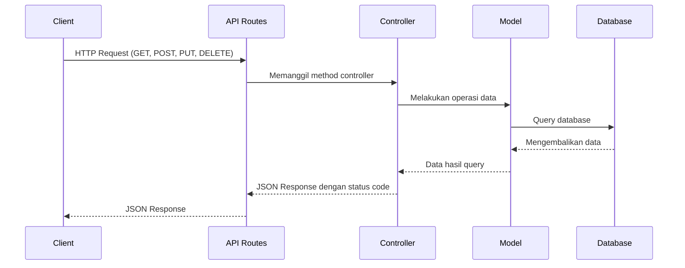
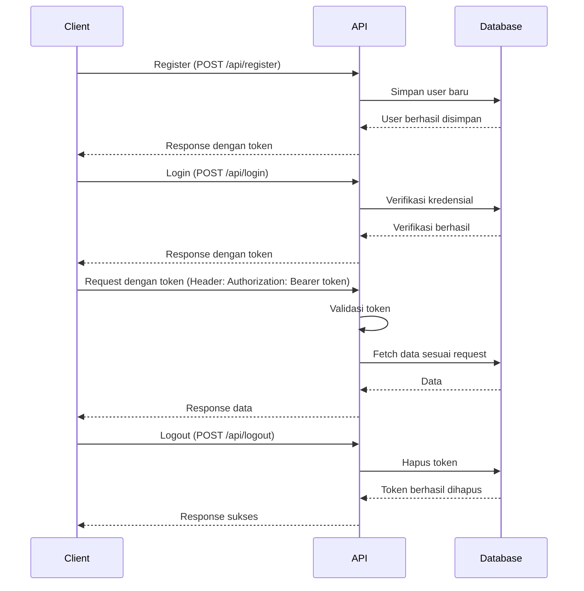

# Tutorial Laravel untuk Pemula: API dan JSON Response

## Topik 11: API dan JSON Response

### Daftar Isi:
1. [Pengenalan RESTful API](#1-pengenalan-restful-api)
2. [Membuat API endpoint untuk data Mahasiswa](#2-membuat-api-endpoint-untuk-data-mahasiswa)
3. [Resource dan Collection di Laravel](#3-resource-dan-collection-di-laravel)
4. [Testing API dengan Postman](#4-testing-api-dengan-postman)
5. [Authentication API dengan token](#5-authentication-api-dengan-token)
6. [Praktik: Membuat API sederhana untuk data Mahasiswa](#6-praktik-membuat-api-sederhana-untuk-data-mahasiswa)

## 1. Pengenalan RESTful API

### Apa itu API?
API (Application Programming Interface) adalah serangkaian aturan dan protokol yang memungkinkan satu aplikasi berkomunikasi dengan aplikasi lain. API berfungsi sebagai perantara yang memungkinkan software yang berbeda untuk bertukar data dan fungsionalitas.

### Apa itu RESTful API?
REST (Representational State Transfer) adalah gaya arsitektur untuk merancang jaringan aplikasi yang memanfaatkan protokol HTTP. RESTful API mengikuti prinsip-prinsip REST dalam implementasinya.

#### Karakteristik RESTful API:

1. **Stateless (Tanpa Status)** - Setiap permintaan dari klien ke server harus mengandung semua informasi yang diperlukan. Server tidak menyimpan konteks klien.

2. **Client-Server Architecture** - Pemisahan antarmuka pengguna (client) dan penyimpanan data (server).

3. **Cacheable** - Respon dapat disimpan dalam cache untuk meningkatkan performa.

4. **Layered System** - Klien tidak dapat membedakan apakah terhubung langsung ke server atau melalui perantara.

5. **Uniform Interface** - Menggunakan metode HTTP standar untuk operasi pada sumber daya.

#### HTTP Methods dalam RESTful API:

| Method | Fungsi | Contoh Penggunaan |
|--------|--------|-------------------|
| GET | Mendapatkan/membaca data | Mendapatkan daftar mahasiswa |
| POST | Membuat data baru | Menambahkan mahasiswa baru |
| PUT | Mengupdate seluruh data | Mengubah seluruh data mahasiswa |
| PATCH | Mengupdate sebagian data | Mengubah sebagian data mahasiswa |
| DELETE | Menghapus data | Menghapus data mahasiswa |

#### Format Response API:
RESTful API umumnya mengembalikan data dalam format JSON (JavaScript Object Notation) atau XML. Di Laravel, JSON adalah format standar yang digunakan.

### Mengapa Menggunakan RESTful API?

1. **Pemisahan Front-end dan Back-end** - Memungkinkan pengembangan aplikasi front-end (seperti aplikasi mobile atau web SPA) dan back-end secara independen.

2. **Skalabilitas** - Memudahkan aplikasi untuk berkembang tanpa mengubah struktur dasarnya.

3. **Interoperabilitas** - Memungkinkan sistem dengan platform berbeda untuk berkomunikasi.

4. **Performa** - Dengan caching dan optimasi lainnya, API dapat meningkatkan performa aplikasi.

### RESTful API dalam Laravel

Laravel menyediakan dukungan luar biasa untuk membangun RESTful API:

1. **Routing API** - Laravel memiliki file khusus untuk mendefinisikan rute API (`routes/api.php`).

2. **Resource Controllers** - Controller khusus untuk menangani operasi CRUD pada resource.

3. **API Resources** - Fitur untuk mentransformasi model dan koleksi data menjadi JSON.

4. **Authentication** - Berbagai metode untuk mengamankan API, termasuk token authentication dan Sanctum.

### Alur Kerja RESTful API di Laravel



### Struktur Endpoint API yang Baik

Struktur endpoint API yang baik mengikuti konvensi berikut:

- `/api/mahasiswa` - GET untuk mendapatkan semua mahasiswa
- `/api/mahasiswa/{id}` - GET untuk mendapatkan mahasiswa tertentu
- `/api/mahasiswa` - POST untuk membuat mahasiswa baru
- `/api/mahasiswa/{id}` - PUT/PATCH untuk mengupdate mahasiswa
- `/api/mahasiswa/{id}` - DELETE untuk menghapus mahasiswa

### Status Code HTTP yang Umum Digunakan

| Status Code | Arti | Contoh Penggunaan |
|-------------|------|-------------------|
| 200 | OK | Request berhasil |
| 201 | Created | Resource berhasil dibuat |
| 400 | Bad Request | Input tidak valid |
| 401 | Unauthorized | Tidak ada otorisasi |
| 403 | Forbidden | Tidak memiliki hak akses |
| 404 | Not Found | Resource tidak ditemukan |
| 422 | Unprocessable Entity | Validasi gagal |
| 500 | Internal Server Error | Error pada server |

## 2. Membuat API endpoint untuk data Mahasiswa

### Mengatur API Routes

Pada Laravel, semua rute API didefinisikan dalam file `routes/api.php`. Secara default, semua rute dalam file ini diawali dengan prefiks `/api`.

```php
// routes/api.php

use App\Http\Controllers\API\MahasiswaController;
use Illuminate\Http\Request;
use Illuminate\Support\Facades\Route;

// Mendefinisikan rute API untuk mahasiswa
Route::apiResource('mahasiswa', MahasiswaController::class);
```

Dengan menggunakan `apiResource`, Laravel secara otomatis membuat rute-rute berikut:

| Method | URI | Action | Route Name |
|--------|-----|--------|------------|
| GET | /api/mahasiswa | index | mahasiswa.index |
| POST | /api/mahasiswa | store | mahasiswa.store |
| GET | /api/mahasiswa/{mahasiswa} | show | mahasiswa.show |
| PUT/PATCH | /api/mahasiswa/{mahasiswa} | update | mahasiswa.update |
| DELETE | /api/mahasiswa/{mahasiswa} | destroy | mahasiswa.destroy |

### Membuat API Controller

Buat controller khusus untuk API menggunakan perintah Artisan:

```bash
php artisan make:controller API/MahasiswaController --api
```

Dengan flag `--api`, Laravel akan membuat controller dengan method-method dasar untuk operasi API:

```php
// app/Http/Controllers/API/MahasiswaController.php

namespace App\Http\Controllers\API;

use App\Http\Controllers\Controller;
use App\Models\Mahasiswa;
use Illuminate\Http\Request;

class MahasiswaController extends Controller
{
    /**
     * Display a listing of the resource.
     *
     * @return \Illuminate\Http\Response
     */
    public function index()
    {
        $mahasiswa = Mahasiswa::all();
        return response()->json([
            'success' => true,
            'message' => 'Daftar data mahasiswa',
            'data' => $mahasiswa
        ]);
    }

    /**
     * Store a newly created resource in storage.
     *
     * @param  \Illuminate\Http\Request  $request
     * @return \Illuminate\Http\Response
     */
    public function store(Request $request)
    {
        $validated = $request->validate([
            'nim' => 'required|string|max:10|unique:mahasiswa',
            'nama' => 'required|string|max:255',
            'jurusan_id' => 'required|exists:jurusan,id',
            'alamat' => 'required|string',
            'email' => 'required|email|unique:mahasiswa',
            'no_hp' => 'required|string|max:15',
        ]);

        $mahasiswa = Mahasiswa::create($validated);

        return response()->json([
            'success' => true,
            'message' => 'Mahasiswa berhasil ditambahkan',
            'data' => $mahasiswa
        ], 201);
    }

    /**
     * Display the specified resource.
     *
     * @param  int  $id
     * @return \Illuminate\Http\Response
     */
    public function show($id)
    {
        $mahasiswa = Mahasiswa::find($id);
        
        if (!$mahasiswa) {
            return response()->json([
                'success' => false,
                'message' => 'Mahasiswa tidak ditemukan'
            ], 404);
        }
        
        return response()->json([
            'success' => true,
            'message' => 'Detail mahasiswa',
            'data' => $mahasiswa
        ]);
    }

    /**
     * Update the specified resource in storage.
     *
     * @param  \Illuminate\Http\Request  $request
     * @param  int  $id
     * @return \Illuminate\Http\Response
     */
    public function update(Request $request, $id)
    {
        $mahasiswa = Mahasiswa::find($id);
        
        if (!$mahasiswa) {
            return response()->json([
                'success' => false,
                'message' => 'Mahasiswa tidak ditemukan'
            ], 404);
        }
        
        $validated = $request->validate([
            'nim' => 'string|max:10|unique:mahasiswa,nim,'.$id,
            'nama' => 'string|max:255',
            'jurusan_id' => 'exists:jurusan,id',
            'alamat' => 'string',
            'email' => 'email|unique:mahasiswa,email,'.$id,
            'no_hp' => 'string|max:15',
        ]);
        
        $mahasiswa->update($validated);
        
        return response()->json([
            'success' => true,
            'message' => 'Mahasiswa berhasil diupdate',
            'data' => $mahasiswa
        ]);
    }

    /**
     * Remove the specified resource from storage.
     *
     * @param  int  $id
     * @return \Illuminate\Http\Response
     */
    public function destroy($id)
    {
        $mahasiswa = Mahasiswa::find($id);
        
        if (!$mahasiswa) {
            return response()->json([
                'success' => false,
                'message' => 'Mahasiswa tidak ditemukan'
            ], 404);
        }
        
        $mahasiswa->delete();
        
        return response()->json([
            'success' => true,
            'message' => 'Mahasiswa berhasil dihapus'
        ]);
    }
}
```

### Format JSON Response yang Konsisten

Penting untuk menjaga format response yang konsisten di seluruh API. Beberapa tips:

1. Selalu sertakan field `success` (boolean) untuk menunjukkan apakah request berhasil atau tidak.
2. Sertakan `message` yang menjelaskan hasil operasi.
3. Sertakan `data` yang berisi informasi yang diminta atau hasil operasi.
4. Gunakan status code HTTP yang sesuai.

### Menangani Validasi dan Error

Berikut adalah contoh bagaimana menangani validasi dan error dengan baik:

```php
public function store(Request $request)
{
    try {
        $validated = $request->validate([
            'nim' => 'required|string|max:10|unique:mahasiswa',
            'nama' => 'required|string|max:255',
            'jurusan_id' => 'required|exists:jurusan,id',
            'alamat' => 'required|string',
            'email' => 'required|email|unique:mahasiswa',
            'no_hp' => 'required|string|max:15',
        ]);

        $mahasiswa = Mahasiswa::create($validated);

        return response()->json([
            'success' => true,
            'message' => 'Mahasiswa berhasil ditambahkan',
            'data' => $mahasiswa
        ], 201);
        
    } catch (\Illuminate\Validation\ValidationException $e) {
        return response()->json([
            'success' => false,
            'message' => 'Validasi gagal',
            'errors' => $e->errors()
        ], 422);
    } catch (\Exception $e) {
        return response()->json([
            'success' => false,
            'message' => 'Terjadi kesalahan pada server',
            'error' => $e->getMessage()
        ], 500);
    }
}
```

## 3. Resource dan Collection di Laravel

### Apa itu API Resource?

API Resource adalah fitur Laravel yang memungkinkan Anda dengan mudah mentransformasi model dan koleksi model menjadi JSON. Dengan resource, Anda dapat:

1. Memformat data sesuai kebutuhan
2. Menyembunyikan atribut tertentu
3. Menambahkan atribut tambahan
4. Melakukan transformasi data

### Membuat Resource untuk Model Mahasiswa

Buat resource menggunakan perintah Artisan:

```bash
php artisan make:resource MahasiswaResource
```

Ini akan membuat file resource di `app/Http/Resources/MahasiswaResource.php`:

```php
// app/Http/Resources/MahasiswaResource.php

namespace App\Http\Resources;

use Illuminate\Http\Resources\Json\JsonResource;

class MahasiswaResource extends JsonResource
{
    /**
     * Transform the resource into an array.
     *
     * @param  \Illuminate\Http\Request  $request
     * @return array|\Illuminate\Contracts\Support\Arrayable|\JsonSerializable
     */
    public function toArray($request)
    {
        return [
            'id' => $this->id,
            'nim' => $this->nim,
            'nama' => $this->nama,
            'jurusan' => $this->jurusan->nama,
            'alamat' => $this->alamat,
            'email' => $this->email,
            'no_hp' => $this->no_hp,
            'created_at' => $this->created_at->format('d-m-Y H:i:s'),
            'updated_at' => $this->updated_at->format('d-m-Y H:i:s'),
        ];
    }
}
```

### Membuat Resource Collection

Untuk menangani koleksi (kumpulan) model, buat resource collection:

```bash
php artisan make:resource MahasiswaCollection --collection
```

```php
// app/Http/Resources/MahasiswaCollection.php

namespace App\Http\Resources;

use Illuminate\Http\Resources\Json\ResourceCollection;

class MahasiswaCollection extends ResourceCollection
{
    /**
     * Transform the resource collection into an array.
     *
     * @param  \Illuminate\Http\Request  $request
     * @return array|\Illuminate\Contracts\Support\Arrayable|\JsonSerializable
     */
    public function toArray($request)
    {
        return [
            'data' => $this->collection,
            'meta' => [
                'total' => $this->collection->count(),
                'per_page' => 15,
                'current_page' => 1,
                'last_page' => 1,
                'from' => 1,
                'to' => $this->collection->count()
            ],
        ];
    }
}
```

### Menggunakan Resource di Controller

Update controller untuk menggunakan resource:

```php
// app/Http/Controllers/API/MahasiswaController.php

use App\Http\Resources\MahasiswaResource;
use App\Http\Resources\MahasiswaCollection;

class MahasiswaController extends Controller
{
    public function index()
    {
        $mahasiswa = Mahasiswa::all();
        return new MahasiswaCollection($mahasiswa);
    }

    public function show($id)
    {
        $mahasiswa = Mahasiswa::find($id);
        
        if (!$mahasiswa) {
            return response()->json([
                'success' => false,
                'message' => 'Mahasiswa tidak ditemukan'
            ], 404);
        }
        
        return new MahasiswaResource($mahasiswa);
    }
    
    // Metode lain...
}
```

### Pagination dengan Resource

Laravel menyediakan kemudahan untuk pagination pada resource:

```php
public function index()
{
    $mahasiswa = Mahasiswa::paginate(15);
    return MahasiswaResource::collection($mahasiswa);
}
```

Response akan otomatis menyertakan data pagination seperti total halaman, next page URL, dll.

## 4. Testing API dengan Postman

### Pengenalan Postman

Postman adalah aplikasi yang memungkinkan Anda menguji API dengan mudah. Dengan Postman, Anda dapat:

1. Mengirim request HTTP (GET, POST, PUT, DELETE, dll)
2. Menyimpan koleksi request
3. Membuat environment (untuk development, testing, production)
4. Melihat respon API dengan format yang mudah dibaca
5. Otomatisasi testing API

### Langkah-langkah Testing API dengan Postman

#### 1. Menginstal Postman

Download Postman dari [https://www.postman.com/downloads/](https://www.postman.com/downloads/) dan instal di komputer Anda.

#### 2. Membuat Collection

Collection adalah kumpulan request yang berkaitan. Buat collection baru untuk API Mahasiswa:

1. Klik tombol "New" -> "Collection"
2. Beri nama "API Mahasiswa Laravel"
3. Klik "Create"

#### 3. Menambahkan Request

Tambahkan request untuk setiap endpoint API:

##### GET /api/mahasiswa

1. Klik kanan pada collection -> "Add Request"
2. Beri nama "Get All Mahasiswa"
3. Pilih metode GET
4. Masukkan URL: `http://mahasiswa-app.test/api/mahasiswa` (sesuaikan dengan URL project Anda)
5. Klik "Save"

##### GET /api/mahasiswa/{id}

1. Buat request baru dengan nama "Get Mahasiswa by ID"
2. Pilih metode GET
3. Masukkan URL: `http://mahasiswa-app.test/api/mahasiswa/1` (sesuaikan ID sesuai kebutuhan)
4. Klik "Save"

##### POST /api/mahasiswa

1. Buat request baru dengan nama "Create Mahasiswa"
2. Pilih metode POST
3. Masukkan URL: `http://mahasiswa-app.test/api/mahasiswa`
4. Pada tab "Body", pilih "raw" dan format "JSON"
5. Masukkan data JSON:
```json
{
    "nim": "1234567890",
    "nama": "Budi Santoso",
    "jurusan_id": 1,
    "alamat": "Jl. Contoh No. 123",
    "email": "budi@example.com",
    "no_hp": "081234567890"
}
```
6. Klik "Save"

##### PUT /api/mahasiswa/{id}

1. Buat request baru dengan nama "Update Mahasiswa"
2. Pilih metode PUT
3. Masukkan URL: `http://mahasiswa-app.test/api/mahasiswa/1`
4. Pada tab "Body", pilih "raw" dan format "JSON"
5. Masukkan data JSON:
```json
{
    "nama": "Budi Santoso Updated",
    "alamat": "Jl. Contoh Updated No. 123"
}
```
6. Klik "Save"

##### DELETE /api/mahasiswa/{id}

1. Buat request baru dengan nama "Delete Mahasiswa"
2. Pilih metode DELETE
3. Masukkan URL: `http://mahasiswa-app.test/api/mahasiswa/1`
4. Klik "Save"

### Menangani Headers dan Auth Token

Jika API Anda menggunakan authentication, Anda perlu menambahkan header Authorization:

1. Pada tab "Headers", tambahkan key "Authorization"
2. Value diisi dengan token (misalnya: "Bearer your-token-here")

### Automation Testing dengan Postman

Postman memungkinkan Anda membuat tes otomatis untuk API:

1. Pada request, klik tab "Tests"
2. Tambahkan kode JavaScript untuk menguji respon:

```javascript
// Test apakah response status code 200
pm.test("Status code is 200", function () {
    pm.response.to.have.status(200);
});

// Test apakah response berisi data yang diharapkan
pm.test("Response has expected data", function () {
    var jsonData = pm.response.json();
    pm.expect(jsonData.success).to.be.true;
    pm.expect(jsonData.data).to.be.an('array');
});
```

### Export dan Import Collection

Anda dapat membagikan collection Postman dengan tim Anda:

1. Klik kanan pada collection -> "Export"
2. Pilih format dan lokasi penyimpanan
3. Share file collection dengan tim
4. Tim dapat mengimport collection melalui "Import" -> "Upload Files"

## 5. Authentication API dengan Token

### Pengenalan Authentication API

Authentication (otentikasi) adalah proses verifikasi identitas pengguna. Dalam konteks API, authentication sangat penting untuk:

1. Melindungi data sensitif
2. Membatasi akses ke endpoint tertentu
3. Melacak penggunaan API
4. Personalisasi response

### Laravel Sanctum

Laravel Sanctum adalah paket official dari Laravel untuk menangani API authentication dengan token. Sanctum menyediakan:

1. API token authentication sederhana
2. SPA authentication
3. Protection terhadap CSRF

### Menginstal Laravel Sanctum

1. Install Sanctum via Composer:
```bash
composer require laravel/sanctum
```

2. Publish konfigurasi Sanctum:
```bash
php artisan vendor:publish --provider="Laravel\Sanctum\SanctumServiceProvider"
```

3. Jalankan migrasi:
```bash
php artisan migrate
```

4. Tambahkan middleware Sanctum ke Kernel:
```php
// app/Http/Kernel.php

protected $middlewareGroups = [
    // ...
    'api' => [
        \Laravel\Sanctum\Http\Middleware\EnsureFrontendRequestsAreStateful::class,
        'throttle:api',
        \Illuminate\Routing\Middleware\SubstituteBindings::class,
    ],
    // ...
];
```

### Mengatur Model User untuk Token

Edit model User untuk menggunakan trait HasApiTokens:

```php
// app/Models/User.php

namespace App\Models;

use Illuminate\Foundation\Auth\User as Authenticatable;
use Illuminate\Notifications\Notifiable;
use Laravel\Sanctum\HasApiTokens;

class User extends Authenticatable
{
    use HasApiTokens, Notifiable;
    
    // ...
}
```

### Membuat Controller untuk Authentication

Buat controller khusus untuk authentication:

```bash
php artisan make:controller API/AuthController
```

```php
// app/Http/Controllers/API/AuthController.php

namespace App\Http\Controllers\API;

use App\Http\Controllers\Controller;
use App\Models\User;
use Illuminate\Http\Request;
use Illuminate\Support\Facades\Auth;
use Illuminate\Support\Facades\Hash;
use Illuminate\Validation\ValidationException;

class AuthController extends Controller
{
    public function register(Request $request)
    {
        $request->validate([
            'name' => 'required|string|max:255',
            'email' => 'required|string|email|max:255|unique:users',
            'password' => 'required|string|min:8|confirmed',
        ]);

        $user = User::create([
            'name' => $request->name,
            'email' => $request->email,
            'password' => Hash::make($request->password),
        ]);

        $token = $user->createToken('auth_token')->plainTextToken;

        return response()->json([
            'success' => true,
            'message' => 'User berhasil registrasi',
            'data' => $user,
            'access_token' => $token,
            'token_type' => 'Bearer',
        ], 201);
    }

    public function login(Request $request)
    {
        $request->validate([
            'email' => 'required|email',
            'password' => 'required',
        ]);

        $user = User::where('email', $request->email)->first();

        if (! $user || ! Hash::check($request->password, $user->password)) {
            throw ValidationException::withMessages([
                'email' => ['The provided credentials are incorrect.'],
            ]);
        }

        $token = $user->createToken('auth_token')->plainTextToken;

        return response()->json([
            'success' => true,
            'message' => 'Login berhasil',
            'data' => $user,
            'access_token' => $token,
            'token_type' => 'Bearer',
        ]);
    }

    public function logout(Request $request)
    {
        $request->user()->currentAccessToken()->delete();

        return response()->json([
            'success' => true,
            'message' => 'Logout berhasil'
        ]);
    }

    public function me(Request $request)
    {
        return response()->json([
            'success' => true,
            'message' => 'Data user',
            'data' => $request->user()
        ]);
    }
}
```

### Menambahkan Route untuk Authentication

```php
// routes/api.php

// Route authentication
Route::post('register', [AuthController::class, 'register']);
Route::post('login', [AuthController::class, 'login']);

// Route yang memerlukan authentication
Route::middleware('auth:sanctum')->group(function () {
    Route::post('logout', [AuthController::class, 'logout']);
    Route::get('me', [AuthController::class, 'me']);
    
    // Route API mahasiswa yang dilindungi
    Route::apiResource('mahasiswa', MahasiswaController::class);
});
```

### Alur Authentication API



### Testing Authentication di Postman

1. Buat request untuk register dan login
2. Dapatkan token dari response
3. Gunakan token untuk request yang memerlukan authentication:
   - Pada tab "Authorization", pilih tipe "Bearer Token"
   - Masukkan token yang didapat

