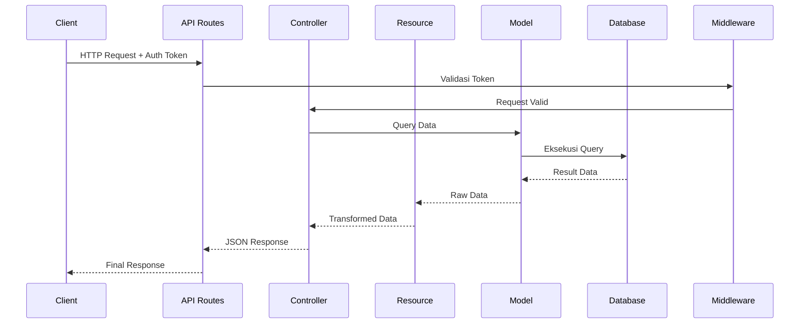

# 6. Praktik: Membuat API sederhana untuk data Mahasiswa

Dalam praktik ini, kita akan mengimplementasikan semua konsep yang telah dipelajari untuk membuat API lengkap untuk manajemen data Mahasiswa. Kita akan membuat API yang bisa digunakan untuk operasi CRUD pada data mahasiswa dengan autentikasi token menggunakan Laravel Sanctum.

## 6.1 Persiapan Project

Pastikan Anda sudah memiliki project Laravel yang sudah dibuat sebelumnya. Jika belum, Anda bisa membuat project baru:

```bash
composer create-project laravel/laravel mahasiswa-app
cd mahasiswa-app
```

### Konfigurasi Database

Edit file `.env` untuk mengatur koneksi database:

```
DB_CONNECTION=mysql
DB_HOST=127.0.0.1
DB_PORT=3306
DB_DATABASE=mahasiswa_app
DB_USERNAME=root
DB_PASSWORD=
```

## 6.2 Membuat Migrations dan Model

### Membuat Migration untuk Jurusan

```bash
php artisan make:migration create_jurusan_table
```

Edit file migration yang dibuat:

```php
// database/migrations/xxxx_xx_xx_create_jurusan_table.php

use Illuminate\Database\Migrations\Migration;
use Illuminate\Database\Schema\Blueprint;
use Illuminate\Support\Facades\Schema;

class CreateJurusanTable extends Migration
{
    public function up()
    {
        Schema::create('jurusan', function (Blueprint $table) {
            $table->id();
            $table->string('nama', 255);
            $table->string('kode', 10)->unique();
            $table->text('deskripsi')->nullable();
            $table->timestamps();
        });
    }

    public function down()
    {
        Schema::dropIfExists('jurusan');
    }
}
```

### Membuat Migration untuk Mahasiswa

```bash
php artisan make:migration create_mahasiswa_table
```

Edit file migration yang dibuat:

```php
// database/migrations/xxxx_xx_xx_create_mahasiswa_table.php

use Illuminate\Database\Migrations\Migration;
use Illuminate\Database\Schema\Blueprint;
use Illuminate\Support\Facades\Schema;

class CreateMahasiswaTable extends Migration
{
    public function up()
    {
        Schema::create('mahasiswa', function (Blueprint $table) {
            $table->id();
            $table->string('nim', 10)->unique();
            $table->string('nama', 255);
            $table->foreignId('jurusan_id')->constrained('jurusan')->onDelete('cascade');
            $table->text('alamat');
            $table->string('email')->unique();
            $table->string('no_hp', 15);
            $table->timestamps();
        });
    }

    public function down()
    {
        Schema::dropIfExists('mahasiswa');
    }
}
```

### Membuat Model Jurusan

```bash
php artisan make:model Jurusan
```

Edit model Jurusan:

```php
// app/Models/Jurusan.php

namespace App\Models;

use Illuminate\Database\Eloquent\Factories\HasFactory;
use Illuminate\Database\Eloquent\Model;

class Jurusan extends Model
{
    use HasFactory;
    
    protected $table = 'jurusan';
    
    protected $fillable = [
        'nama',
        'kode',
        'deskripsi'
    ];
    
    public function mahasiswa()
    {
        return $this->hasMany(Mahasiswa::class);
    }
}
```

### Membuat Model Mahasiswa

```bash
php artisan make:model Mahasiswa
```

Edit model Mahasiswa:

```php
// app/Models/Mahasiswa.php

namespace App\Models;

use Illuminate\Database\Eloquent\Factories\HasFactory;
use Illuminate\Database\Eloquent\Model;

class Mahasiswa extends Model
{
    use HasFactory;
    
    protected $table = 'mahasiswa';
    
    protected $fillable = [
        'nim',
        'nama',
        'jurusan_id',
        'alamat',
        'email',
        'no_hp'
    ];
    
    public function jurusan()
    {
        return $this->belongsTo(Jurusan::class);
    }
}
```

### Jalankan Migrasi

```bash
php artisan migrate
```

## 6.3 Membuat Seeder untuk Data Contoh

### Membuat Seeder untuk Jurusan

```bash
php artisan make:seeder JurusanSeeder
```

Edit file seeder:

```php
// database/seeders/JurusanSeeder.php

namespace Database\Seeders;

use App\Models\Jurusan;
use Illuminate\Database\Seeder;

class JurusanSeeder extends Seeder
{
    public function run()
    {
        $jurusan = [
            [
                'nama' => 'Teknik Informatika',
                'kode' => 'TI',
                'deskripsi' => 'Jurusan yang mempelajari ilmu komputer dan pemrograman'
            ],
            [
                'nama' => 'Sistem Informasi',
                'kode' => 'SI',
                'deskripsi' => 'Jurusan yang mempelajari sistem informasi dalam organisasi'
            ],
            [
                'nama' => 'Teknik Elektro',
                'kode' => 'TE',
                'deskripsi' => 'Jurusan yang mempelajari tentang listrik dan elektronika'
            ],
            [
                'nama' => 'Manajemen Bisnis',
                'kode' => 'MB',
                'deskripsi' => 'Jurusan yang mempelajari manajemen dalam bisnis'
            ],
        ];
        
        foreach ($jurusan as $jur) {
            Jurusan::create($jur);
        }
    }
}
```

### Membuat Factory untuk Mahasiswa

```bash
php artisan make:factory MahasiswaFactory
```

Edit file factory:

```php
// database/factories/MahasiswaFactory.php

namespace Database\Factories;

use App\Models\Jurusan;
use Illuminate\Database\Eloquent\Factories\Factory;

class MahasiswaFactory extends Factory
{
    public function definition()
    {
        $jurusanIds = Jurusan::pluck('id')->toArray();
        
        return [
            'nim' => $this->faker->unique()->numerify('##########'),
            'nama' => $this->faker->name,
            'jurusan_id' => $this->faker->randomElement($jurusanIds),
            'alamat' => $this->faker->address,
            'email' => $this->faker->unique()->safeEmail,
            'no_hp' => $this->faker->phoneNumber,
        ];
    }
}
```

### Membuat Seeder untuk Mahasiswa

```bash
php artisan make:seeder MahasiswaSeeder
```

Edit file seeder:

```php
// database/seeders/MahasiswaSeeder.php

namespace Database\Seeders;

use App\Models\Mahasiswa;
use Illuminate\Database\Seeder;

class MahasiswaSeeder extends Seeder
{
    public function run()
    {
        Mahasiswa::factory(50)->create();
    }
}
```

### Update DatabaseSeeder

```php
// database/seeders/DatabaseSeeder.php

namespace Database\Seeders;

use Illuminate\Database\Seeder;

class DatabaseSeeder extends Seeder
{
    public function run()
    {
        $this->call([
            JurusanSeeder::class,
            MahasiswaSeeder::class,
        ]);
    }
}
```

### Jalankan Seeder

```bash
php artisan db:seed
```

## 6.4 Menginstal Laravel Sanctum

```bash
composer require laravel/sanctum
php artisan vendor:publish --provider="Laravel\Sanctum\SanctumServiceProvider"
php artisan migrate
```

### Konfigurasi Model User

```php
// app/Models/User.php

namespace App\Models;

use Illuminate\Foundation\Auth\User as Authenticatable;
use Illuminate\Notifications\Notifiable;
use Laravel\Sanctum\HasApiTokens;

class User extends Authenticatable
{
    use HasApiTokens, Notifiable;
    
    protected $fillable = [
        'name',
        'email',
        'password',
    ];
    
    protected $hidden = [
        'password',
        'remember_token',
    ];
    
    protected $casts = [
        'email_verified_at' => 'datetime',
    ];
}
```

### Update Kernel untuk Sanctum

```php
// app/Http/Kernel.php

// Di dalam $middlewareGroups
'api' => [
    \Laravel\Sanctum\Http\Middleware\EnsureFrontendRequestsAreStateful::class,
    'throttle:api',
    \Illuminate\Routing\Middleware\SubstituteBindings::class,
],
```

## 6.5 Membuat API Resource

### Membuat Resource untuk Jurusan

```bash
php artisan make:resource JurusanResource
```

Edit file resource:

```php
// app/Http/Resources/JurusanResource.php

namespace App\Http\Resources;

use Illuminate\Http\Resources\Json\JsonResource;

class JurusanResource extends JsonResource
{
    public function toArray($request)
    {
        return [
            'id' => $this->id,
            'nama' => $this->nama,
            'kode' => $this->kode,
            'deskripsi' => $this->deskripsi,
            'created_at' => $this->created_at->format('d-m-Y H:i:s'),
            'updated_at' => $this->updated_at->format('d-m-Y H:i:s'),
        ];
    }
}
```

### Membuat Resource untuk Mahasiswa

```bash
php artisan make:resource MahasiswaResource
```

Edit file resource:

```php
// app/Http/Resources/MahasiswaResource.php

namespace App\Http\Resources;

use Illuminate\Http\Resources\Json\JsonResource;

class MahasiswaResource extends JsonResource
{
    public function toArray($request)
    {
        return [
            'id' => $this->id,
            'nim' => $this->nim,
            'nama' => $this->nama,
            'jurusan' => new JurusanResource($this->whenLoaded('jurusan')),
            'jurusan_id' => $this->jurusan_id,
            'alamat' => $this->alamat,
            'email' => $this->email,
            'no_hp' => $this->no_hp,
            'created_at' => $this->created_at->format('d-m-Y H:i:s'),
            'updated_at' => $this->updated_at->format('d-m-Y H:i:s'),
        ];
    }
}
```

## 6.6 Membuat Controller

### Controller untuk Authentication

```bash
php artisan make:controller API/AuthController
```

Edit file controller:

```php
// app/Http/Controllers/API/AuthController.php

namespace App\Http\Controllers\API;

use App\Http\Controllers\Controller;
use App\Models\User;
use Illuminate\Http\Request;
use Illuminate\Support\Facades\Auth;
use Illuminate\Support\Facades\Hash;
use Illuminate\Validation\ValidationException;

class AuthController extends Controller
{
    public function register(Request $request)
    {
        $request->validate([
            'name' => 'required|string|max:255',
            'email' => 'required|string|email|max:255|unique:users',
            'password' => 'required|string|min:8|confirmed',
        ]);

        $user = User::create([
            'name' => $request->name,
            'email' => $request->email,
            'password' => Hash::make($request->password),
        ]);

        $token = $user->createToken('auth_token')->plainTextToken;

        return response()->json([
            'success' => true,
            'message' => 'User berhasil registrasi',
            'data' => $user,
            'access_token' => $token,
            'token_type' => 'Bearer',
        ], 201);
    }

    public function login(Request $request)
    {
        $request->validate([
            'email' => 'required|email',
            'password' => 'required',
        ]);

        $user = User::where('email', $request->email)->first();

        if (! $user || ! Hash::check($request->password, $user->password)) {
            throw ValidationException::withMessages([
                'email' => ['Kredensial yang diberikan tidak sesuai.'],
            ]);
        }

        $token = $user->createToken('auth_token')->plainTextToken;

        return response()->json([
            'success' => true,
            'message' => 'Login berhasil',
            'data' => $user,
            'access_token' => $token,
            'token_type' => 'Bearer',
        ]);
    }

    public function logout(Request $request)
    {
        $request->user()->currentAccessToken()->delete();

        return response()->json([
            'success' => true,
            'message' => 'Logout berhasil'
        ]);
    }

    public function me(Request $request)
    {
        return response()->json([
            'success' => true,
            'message' => 'Data user',
            'data' => $request->user()
        ]);
    }
}
```

### Controller untuk Jurusan

```bash
php artisan make:controller API/JurusanController --api
```

Edit file controller:

```php
// app/Http/Controllers/API/JurusanController.php

namespace App\Http\Controllers\API;

use App\Http\Controllers\Controller;
use App\Http\Resources\JurusanResource;
use App\Models\Jurusan;
use Illuminate\Http\Request;

class JurusanController extends Controller
{
    public function index()
    {
        $jurusan = Jurusan::all();
        
        return response()->json([
            'success' => true,
            'message' => 'Daftar data jurusan',
            'data' => JurusanResource::collection($jurusan)
        ]);
    }

    public function store(Request $request)
    {
        $validated = $request->validate([
            'nama' => 'required|string|max:255',
            'kode' => 'required|string|max:10|unique:jurusan',
            'deskripsi' => 'nullable|string',
        ]);

        $jurusan = Jurusan::create($validated);

        return response()->json([
            'success' => true,
            'message' => 'Jurusan berhasil ditambahkan',
            'data' => new JurusanResource($jurusan)
        ], 201);
    }

    public function show($id)
    {
        $jurusan = Jurusan::find($id);
        
        if (!$jurusan) {
            return response()->json([
                'success' => false,
                'message' => 'Jurusan tidak ditemukan'
            ], 404);
        }
        
        return response()->json([
            'success' => true,
            'message' => 'Detail jurusan',
            'data' => new JurusanResource($jurusan)
        ]);
    }

    public function update(Request $request, $id)
    {
        $jurusan = Jurusan::find($id);
        
        if (!$jurusan) {
            return response()->json([
                'success' => false,
                'message' => 'Jurusan tidak ditemukan'
            ], 404);
        }
        
        $validated = $request->validate([
            'nama' => 'string|max:255',
            'kode' => 'string|max:10|unique:jurusan,kode,'.$id,
            'deskripsi' => 'nullable|string',
        ]);
        
        $jurusan->update($validated);
        
        return response()->json([
            'success' => true,
            'message' => 'Jurusan berhasil diupdate',
            'data' => new JurusanResource($jurusan)
        ]);
    }

    public function destroy($id)
    {
        $jurusan = Jurusan::find($id);
        
        if (!$jurusan) {
            return response()->json([
                'success' => false,
                'message' => 'Jurusan tidak ditemukan'
            ], 404);
        }
        
        $jurusan->delete();
        
        return response()->json([
            'success' => true,
            'message' => 'Jurusan berhasil dihapus'
        ]);
    }
}
```

### Controller untuk Mahasiswa

```bash
php artisan make:controller API/MahasiswaController --api
```

Edit file controller:

```php
// app/Http/Controllers/API/MahasiswaController.php

namespace App\Http\Controllers\API;

use App\Http\Controllers\Controller;
use App\Http\Resources\MahasiswaResource;
use App\Models\Mahasiswa;
use Illuminate\Http\Request;

class MahasiswaController extends Controller
{
    public function index(Request $request)
    {
        $query = Mahasiswa::with('jurusan');
        
        // Filter berdasarkan jurusan_id jika parameter ada
        if ($request->has('jurusan_id') && $request->jurusan_id) {
            $query->where('jurusan_id', $request->jurusan_id);
        }
        
        // Pencarian berdasarkan nama atau nim
        if ($request->has('search') && $request->search) {
            $search = $request->search;
            $query->where(function($q) use ($search) {
                $q->where('nama', 'like', "%{$search}%")
                  ->orWhere('nim', 'like', "%{$search}%");
            });
        }
        
        // Pagination
        $perPage = $request->get('per_page', 15);
        $mahasiswa = $query->paginate($perPage);
        
        return response()->json([
            'success' => true,
            'message' => 'Daftar data mahasiswa',
            'data' => MahasiswaResource::collection($mahasiswa),
            'meta' => [
                'current_page' => $mahasiswa->currentPage(),
                'from' => $mahasiswa->firstItem(),
                'last_page' => $mahasiswa->lastPage(),
                'path' => $mahasiswa->path(),
                'per_page' => $mahasiswa->perPage(),
                'to' => $mahasiswa->lastItem(),
                'total' => $mahasiswa->total(),
            ],
        ]);
    }

    public function store(Request $request)
    {
        try {
            $validated = $request->validate([
                'nim' => 'required|string|max:10|unique:mahasiswa',
                'nama' => 'required|string|max:255',
                'jurusan_id' => 'required|exists:jurusan,id',
                'alamat' => 'required|string',
                'email' => 'required|email|unique:mahasiswa',
                'no_hp' => 'required|string|max:15',
            ]);

            $mahasiswa = Mahasiswa::create($validated);
            $mahasiswa->load('jurusan');

            return response()->json([
                'success' => true,
                'message' => 'Mahasiswa berhasil ditambahkan',
                'data' => new MahasiswaResource($mahasiswa)
            ], 201);
            
        } catch (\Illuminate\Validation\ValidationException $e) {
            return response()->json([
                'success' => false,
                'message' => 'Validasi gagal',
                'errors' => $e->errors()
            ], 422);
        } catch (\Exception $e) {
            return response()->json([
                'success' => false,
                'message' => 'Terjadi kesalahan pada server',
                'error' => $e->getMessage()
            ], 500);
        }
    }

    public function show($id)
    {
        $mahasiswa = Mahasiswa::with('jurusan')->find($id);
        
        if (!$mahasiswa) {
            return response()->json([
                'success' => false,
                'message' => 'Mahasiswa tidak ditemukan'
            ], 404);
        }
        
        return response()->json([
            'success' => true,
            'message' => 'Detail mahasiswa',
            'data' => new MahasiswaResource($mahasiswa)
        ]);
    }

    public function update(Request $request, $id)
    {
        try {
            $mahasiswa = Mahasiswa::find($id);
            
            if (!$mahasiswa) {
                return response()->json([
                    'success' => false,
                    'message' => 'Mahasiswa tidak ditemukan'
                ], 404);
            }
            
            $validated = $request->validate([
                'nim' => 'string|max:10|unique:mahasiswa,nim,'.$id,
                'nama' => 'string|max:255',
                'jurusan_id' => 'exists:jurusan,id',
                'alamat' => 'string',
                'email' => 'email|unique:mahasiswa,email,'.$id,
                'no_hp' => 'string|max:15',
            ]);
            
            $mahasiswa->update($validated);
            $mahasiswa->load('jurusan');
            
            return response()->json([
                'success' => true,
                'message' => 'Mahasiswa berhasil diupdate',
                'data' => new MahasiswaResource($mahasiswa)
            ]);
            
        } catch (\Illuminate\Validation\ValidationException $e) {
            return response()->json([
                'success' => false,
                'message' => 'Validasi gagal',
                'errors' => $e->errors()
            ], 422);
        } catch (\Exception $e) {
            return response()->json([
                'success' => false,
                'message' => 'Terjadi kesalahan pada server',
                'error' => $e->getMessage()
            ], 500);
        }
    }

    public function destroy($id)
    {
        $mahasiswa = Mahasiswa::find($id);
        
        if (!$mahasiswa) {
            return response()->json([
                'success' => false,
                'message' => 'Mahasiswa tidak ditemukan'
            ], 404);
        }
        
        $mahasiswa->delete();
        
        return response()->json([
            'success' => true,
            'message' => 'Mahasiswa berhasil dihapus'
        ]);
    }
}
```

## 6.7 Membuat API Routes

Edit file `routes/api.php`:

```php
// routes/api.php

use App\Http\Controllers\API\AuthController;
use App\Http\Controllers\API\JurusanController;
use App\Http\Controllers\API\MahasiswaController;
use Illuminate\Support\Facades\Route;

// Route autentikasi yang tidak memerlukan token
Route::post('register', [AuthController::class, 'register']);
Route::post('login', [AuthController::class, 'login']);

// Route yang memerlukan autentikasi
Route::middleware('auth:sanctum')->group(function () {
    // Auth routes
    Route::post('logout', [AuthController::class, 'logout']);
    Route::get('me', [AuthController::class, 'me']);
    
    // Jurusan routes
    Route::apiResource('jurusan', JurusanController::class);
    
    // Mahasiswa routes
    Route::apiResource('mahasiswa', MahasiswaController::class);
});
```

## 6.8 Alur Kerja API Endpoint



## 6.9 Testing Menggunakan Postman

### Langkah-langkah Testing

1. **Register User**:
   - Method: POST
   - URL: `http://mahasiswa-app.test/api/register`
   - Body (JSON):
   ```json
   {
       "name": "Admin Test",
       "email": "admin@example.com",
       "password": "password123",
       "password_confirmation": "password123"
   }
   ```

2. **Login User**:
   - Method: POST
   - URL: `http://mahasiswa-app.test/api/login`
   - Body (JSON):
   ```json
   {
       "email": "admin@example.com",
       "password": "password123"
   }
   ```
   - Salin token yang diterima untuk digunakan pada request berikutnya

3. **Mengambil Data Jurusan**:
   - Method: GET
   - URL: `http://mahasiswa-app.test/api/jurusan`
   - Headers:
     - Authorization: Bearer {token}

4. **Membuat Jurusan Baru**:
   - Method: POST
   - URL: `http://mahasiswa-app.test/api/jurusan`
   - Headers:
     - Authorization: Bearer {token}
   - Body (JSON):
   ```json
   {
       "nama": "Teknik Lingkungan",
       "kode": "TL",
       "deskripsi": "Jurusan yang mempelajari pengelolaan lingkungan"
   }
   ```

5. **Mengambil Data Mahasiswa dengan Paginasi**:
   - Method: GET
   - URL: `http://mahasiswa-app.test/api/mahasiswa?page=1&per_page=10`
   - Headers:
     - Authorization: Bearer {token}

6. **Mencari Mahasiswa**:
   - Method: GET
   - URL: `http://mahasiswa-app.test/api/mahasiswa?search=budi`
   - Headers:
     - Authorization: Bearer {token}

7. **Filter Mahasiswa berdasarkan Jurusan**:
   - Method: GET
   - URL: `http://mahasiswa-app.test/api/mahasiswa?jurusan_id=1`
   - Headers:
     - Authorization: Bearer {token}

8. **Membuat Mahasiswa Baru**:
   - Method: POST
   - URL: `http://mahasiswa-app.test/api/mahasiswa`
   - Headers:
     - Authorization: Bearer {token}
   - Body (JSON):
   ```json
   {
       "nim": "2023001001",
       "nama": "Budi Setiawan",
       "jurusan_id": 1,
       "alamat": "Jl. Contoh No. 123, Jakarta",
       "email": "budi@mail.com",
       "no_hp": "081234567890"
   }
   ```

9. **Mengupdate Data Mahasiswa**:
   - Method: PUT/PATCH
   - URL: `http://mahasiswa-app.test/api/mahasiswa/1`
   - Headers:
     - Authorization: Bearer {token}
   - Body (JSON):
   ```json
   {
       "nama": "Budi Setiawan Update",
       "alamat": "Jl. Contoh No. 456, Jakarta Barat"
   }
   ```

10. **Menghapus Data Mahasiswa**:
    - Method: DELETE
    - URL: `http://mahasiswa-app.test/api/mahasiswa/1`
    - Headers:
      - Authorization: Bearer {token}

11. **Logout**:
    - Method: POST
    - URL: `http://mahasiswa-app.test/api/logout`
    - Headers:
      - Authorization: Bearer {token}

### Membuat Collection Postman

1. Buat Collection baru di Postman bernama "Mahasiswa API"
2. Buat folder:
   - Authentication
   - Jurusan
   - Mahasiswa
3. Tambahkan semua request ke folder yang sesuai
4. Tambahkan test script untuk memastikan response status code dan format sesuai

### Contoh Test Script untuk Endpoint Login

```javascript
// Test status code 200
pm.test("Status code is 200", function () {
    pm.response.to.have.status(200);
});

// Test response format
pm.test("Response has correct structure", function () {
    var jsonData = pm.response.json();
    pm.expect(jsonData).to.have.property('success');
    pm.expect(jsonData).to.have.property('message');
    pm.expect(jsonData).to.have.property('data');
    pm.expect(jsonData).to.have.property('access_token');
    pm.expect(jsonData).to.have.property('token_type');
});

// Simpan token ke environment variable
if (pm.response.json().access_token) {
    pm.environment.set("auth_token", pm.response.json().access_token);
}
```

## 6.10 Menggunakan API dari Aplikasi Lain

Setelah API selesai dibuat, Anda dapat menggunakannya dari berbagai aplikasi seperti:

### Menggunakan JavaScript dan Fetch API

```javascript
// Login dan mendapatkan token
async function login() {
    const response = await fetch('http://mahasiswa-app.test/api/login', {
        method: 'POST',
        headers: {
            'Content-Type': 'application/json'
        },
        body: JSON.stringify({
            email: 'admin@example.com',
            password: 'password123'
        })
    });
    
    const data = await response.json();
    return data.access_token;
}

// Mengambil data mahasiswa
async function getMahasiswa() {
    const token = await login();
    
    const response = await fetch('http://mahasiswa-app.test/api/mahasiswa', {
        method: 'GET',
        headers: {
            'Authorization': `Bearer ${token}`,
            'Content-Type': 'application/json'
        }
    });
    
    const data = await response.json();
    console.log(data);
}

getMahasiswa();
```

### Menggunakan PHP dan Guzzle

```php
// Contoh di framework lain atau aplikasi PHP native
use GuzzleHttp\Client;

$client = new Client([
    'base_uri' => 'http://mahasiswa-app.test/api/',
    'timeout'  => 5.0,
]);

// Login untuk mendapatkan token
$response = $client->post('login', [
    'json' => [
        'email' => 'admin@example.com',
        'password' => 'password123'
    ]
]);

$result = json_decode($response->getBody()->getContents(), true);
$token = $result['access_token'];

// Mengambil data mahasiswa
$mahasiswa = $client->get('mahasiswa', [
    'headers' => [
        'Authorization' => 'Bearer ' . $token
    ]
]);

$data = json_decode($mahasiswa->getBody()->getContents(), true);
print_r($data);
```

### Menggunakan Python dan Requests

```python
import requests

# URL base untuk API
base_url = 'http://mahasiswa-app.test/api/'

# Login untuk mendapatkan token
login_data = {
    'email': 'admin@example.com',
    'password': 'password123'
}

response = requests.post(base_url + 'login', json=login_data)
token = response.json()['access_token']

# Headers dengan token autentikasi
headers = {
    'Authorization': f'Bearer {token}'
}

# Mengambil data mahasiswa
mahasiswa_response = requests.get(base_url + 'mahasiswa', headers=headers)
mahasiswa_data = mahasiswa_response.json()
print(mahasiswa_data)

# Menambahkan mahasiswa baru
new_mahasiswa = {
    'nim': '2023001002',
    'nama': 'Siti Nurhaliza',
    'jurusan_id': 2,
    'alamat': 'Jl. Melati No. 45, Bandung',
    'email': 'siti@example.com',
    'no_hp': '081987654321'
}

create_response = requests.post(base_url + 'mahasiswa', headers=headers, json=new_mahasiswa)
print(create_response.json())
```

### Menggunakan Flutter/Dart

```dart
import 'dart:convert';
import 'package:http/http.dart' as http;

class ApiService {
  final String baseUrl = 'http://mahasiswa-app.test/api/';
  String? token;

  Future<void> login() async {
    final response = await http.post(
      Uri.parse('${baseUrl}login'),
      headers: {'Content-Type': 'application/json'},
      body: jsonEncode({
        'email': 'admin@example.com',
        'password': 'password123'
      }),
    );

    if (response.statusCode == 200) {
      final data = jsonDecode(response.body);
      token = data['access_token'];
      print('Login berhasil dengan token: $token');
    } else {
      throw Exception('Gagal login');
    }
  }

  Future<List<dynamic>> getMahasiswa() async {
    if (token == null) {
      await login();
    }

    final response = await http.get(
      Uri.parse('${baseUrl}mahasiswa'),
      headers: {
        'Content-Type': 'application/json',
        'Authorization': 'Bearer $token',
      },
    );

    if (response.statusCode == 200) {
      final data = jsonDecode(response.body);
      return data['data'];
    } else {
      throw Exception('Gagal mengambil data mahasiswa');
    }
  }

  Future<dynamic> createMahasiswa(Map<String, dynamic> mahasiswaData) async {
    if (token == null) {
      await login();
    }

    final response = await http.post(
      Uri.parse('${baseUrl}mahasiswa'),
      headers: {
        'Content-Type': 'application/json',
        'Authorization': 'Bearer $token',
      },
      body: jsonEncode(mahasiswaData),
    );

    if (response.statusCode == 201) {
      return jsonDecode(response.body);
    } else {
      throw Exception('Gagal membuat data mahasiswa');
    }
  }
}
```

## 6.11 Menambahkan Fitur Export dan Import Data

### Membuat Controller untuk Export/Import

```bash
php artisan make:controller API/ExportImportController
```

Edit file controller:

```php
// app/Http/Controllers/API/ExportImportController.php

namespace App\Http\Controllers\API;

use App\Http\Controllers\Controller;
use App\Models\Mahasiswa;
use Illuminate\Http\Request;
use Illuminate\Support\Facades\Validator;
use Illuminate\Support\Facades\DB;

class ExportImportController extends Controller
{
    public function exportMahasiswa()
    {
        try {
            $mahasiswa = Mahasiswa::with('jurusan')->get();
            
            $exportData = $mahasiswa->map(function ($item) {
                return [
                    'nim' => $item->nim,
                    'nama' => $item->nama,
                    'jurusan_kode' => $item->jurusan->kode,
                    'alamat' => $item->alamat,
                    'email' => $item->email,
                    'no_hp' => $item->no_hp,
                ];
            });
            
            return response()->json([
                'success' => true,
                'message' => 'Data mahasiswa berhasil diekspor',
                'data' => $exportData
            ]);
            
        } catch (\Exception $e) {
            return response()->json([
                'success' => false,
                'message' => 'Terjadi kesalahan pada server',
                'error' => $e->getMessage()
            ], 500);
        }
    }
    
    public function importMahasiswa(Request $request)
    {
        try {
            $validator = Validator::make($request->all(), [
                'data' => 'required|array',
                'data.*.nim' => 'required|string|max:10',
                'data.*.nama' => 'required|string|max:255',
                'data.*.jurusan_kode' => 'required|string|exists:jurusan,kode',
                'data.*.alamat' => 'required|string',
                'data.*.email' => 'required|email',
                'data.*.no_hp' => 'required|string|max:15',
            ]);
            
            if ($validator->fails()) {
                return response()->json([
                    'success' => false,
                    'message' => 'Validasi gagal',
                    'errors' => $validator->errors()
                ], 422);
            }
            
            $importedCount = 0;
            $updatedCount = 0;
            $errorCount = 0;
            
            DB::beginTransaction();
            
            foreach ($request->data as $mhsData) {
                try {
                    // Cari jurusan berdasarkan kode
                    $jurusan = \App\Models\Jurusan::where('kode', $mhsData['jurusan_kode'])->first();
                    
                    if (!$jurusan) {
                        $errorCount++;
                        continue;
                    }
                    
                    // Cek apakah mahasiswa sudah ada
                    $mahasiswa = Mahasiswa::where('nim', $mhsData['nim'])->first();
                    
                    if ($mahasiswa) {
                        // Update data yang sudah ada
                        $mahasiswa->update([
                            'nama' => $mhsData['nama'],
                            'jurusan_id' => $jurusan->id,
                            'alamat' => $mhsData['alamat'],
                            'email' => $mhsData['email'],
                            'no_hp' => $mhsData['no_hp'],
                        ]);
                        $updatedCount++;
                    } else {
                        // Buat data baru
                        Mahasiswa::create([
                            'nim' => $mhsData['nim'],
                            'nama' => $mhsData['nama'],
                            'jurusan_id' => $jurusan->id,
                            'alamat' => $mhsData['alamat'],
                            'email' => $mhsData['email'],
                            'no_hp' => $mhsData['no_hp'],
                        ]);
                        $importedCount++;
                    }
                } catch (\Exception $e) {
                    $errorCount++;
                }
            }
            
            DB::commit();
            
            return response()->json([
                'success' => true,
                'message' => 'Import data berhasil',
                'data' => [
                    'imported' => $importedCount,
                    'updated' => $updatedCount,
                    'errors' => $errorCount
                ]
            ]);
            
        } catch (\Exception $e) {
            DB::rollBack();
            
            return response()->json([
                'success' => false,
                'message' => 'Terjadi kesalahan pada server',
                'error' => $e->getMessage()
            ], 500);
        }
    }
}
```

### Menambahkan Route untuk Export/Import

Tambahkan route baru di `routes/api.php`:

```php
// routes/api.php
// Tambahkan dalam middleware auth:sanctum

// Export Import routes
Route::get('export/mahasiswa', [ExportImportController::class, 'exportMahasiswa']);
Route::post('import/mahasiswa', [ExportImportController::class, 'importMahasiswa']);
```

## 6.12 Menambahkan Rate Limiting

### Konfigurasi Rate Limiting

Edit file `app/Providers/RouteServiceProvider.php`:

```php
// app/Providers/RouteServiceProvider.php

// Di dalam method boot()
RateLimiter::for('api', function (Request $request) {
    return $request->user()
        ? Limit::perMinute(60)->by($request->user()->id)
        : Limit::perMinute(20)->by($request->ip());
});
```

### Custom Rate Limiting untuk API tertentu

Tambahkan middleware rate limiting khusus di file `routes/api.php`:

```php
// routes/api.php

// Rate limiting khusus untuk endpoint export/import
Route::middleware(['auth:sanctum', 'throttle:5,1'])->group(function () {
    Route::get('export/mahasiswa', [ExportImportController::class, 'exportMahasiswa']);
    Route::post('import/mahasiswa', [ExportImportController::class, 'importMahasiswa']);
});
```

## 6.13 Menambahkan Dokumentasi API dengan Swagger

### Instalasi Swagger

```bash
composer require "darkaonline/l5-swagger"
php artisan vendor:publish --provider "L5Swagger\L5SwaggerServiceProvider"
```

### Konfigurasi Swagger

Edit file config `config/l5-swagger.php` untuk menyesuaikan documentasi:

```php
// config/l5-swagger.php

'defaults' => [
    'routes' => [
        'api' => 'api/documentation',
    ],
    'paths' => [
        'docs_json' => 'api-docs.json',
        'docs_yaml' => 'api-docs.yaml',
        'annotations' => base_path('app'),
    ],
],
```

### Dokumentasi di Controller

Edit `app/Http/Controllers/API/MahasiswaController.php` untuk menambahkan anotasi Swagger:

```php
// app/Http/Controllers/API/MahasiswaController.php
namespace App\Http\Controllers\API;

use App\Http\Controllers\Controller;
use App\Http\Resources\MahasiswaResource;
use App\Models\Mahasiswa;
use Illuminate\Http\Request;

/**
 * @OA\Info(
 *     title="Mahasiswa API Documentation",
 *     version="1.0.0",
 *     description="API untuk manajemen data mahasiswa",
 *     @OA\Contact(
 *         email="admin@example.com"
 *     )
 * )
 */
class MahasiswaController extends Controller
{
    /**
     * @OA\Get(
     *     path="/api/mahasiswa",
     *     summary="Mendapatkan daftar mahasiswa",
     *     tags={"Mahasiswa"},
     *     @OA\Parameter(
     *         name="search",
     *         in="query",
     *         description="Kata kunci pencarian nama atau nim",
     *         required=false,
     *         @OA\Schema(type="string")
     *     ),
     *     @OA\Parameter(
     *         name="jurusan_id",
     *         in="query",
     *         description="Filter berdasarkan jurusan ID",
     *         required=false,
     *         @OA\Schema(type="integer")
     *     ),
     *     @OA\Parameter(
     *         name="per_page",
     *         in="query",
     *         description="Jumlah data per halaman",
     *         required=false,
     *         @OA\Schema(type="integer", default=15)
     *     ),
     *     @OA\Response(
     *         response=200,
     *         description="Daftar data mahasiswa berhasil diambil"
     *     ),
     *     @OA\Response(
     *         response=401,
     *         description="Unauthorized"
     *     ),
     *     security={{"bearerAuth": {}}}
     * )
     */
    public function index(Request $request)
    {
        // Kode tetap sama seperti sebelumnya
    }

    /**
     * @OA\Post(
     *     path="/api/mahasiswa",
     *     summary="Membuat data mahasiswa baru",
     *     tags={"Mahasiswa"},
     *     @OA\RequestBody(
     *         required=true,
     *         @OA\JsonContent(
     *             required={"nim", "nama", "jurusan_id", "alamat", "email", "no_hp"},
     *             @OA\Property(property="nim", type="string", example="2023001003"),
     *             @OA\Property(property="nama", type="string", example="Ahmad Ramadhan"),
     *             @OA\Property(property="jurusan_id", type="integer", example=1),
     *             @OA\Property(property="alamat", type="string", example="Jl. Merdeka No. 10, Surabaya"),
     *             @OA\Property(property="email", type="string", example="ahmad@example.com"),
     *             @OA\Property(property="no_hp", type="string", example="081234567890")
     *         )
     *     ),
     *     @OA\Response(
     *         response=201,
     *         description="Mahasiswa berhasil ditambahkan"
     *     ),
     *     @OA\Response(
     *         response=422,
     *         description="Validasi gagal"
     *     ),
     *     security={{"bearerAuth": {}}}
     * )
     */
    public function store(Request $request)
    {
        // Kode tetap sama seperti sebelumnya
    }

    // Tambahkan anotasi untuk method lainnya
}
```

### Menambahkan Konfigurasi Security

Tambahkan di awal file controller:

```php 
/**
 * @OA\SecurityScheme(
 *     securityScheme="bearerAuth",
 *     type="http",
 *     scheme="bearer",
 *     bearerFormat="JWT"
 * )
 */
```

### Generate Dokumentasi Swagger

```bash
php artisan l5-swagger:generate
```

Setelah itu, dokumentasi dapat diakses di URL: `http://mahasiswa-app.test/api/documentation`

## 6.14 Praktik Terbaik untuk API Security

### CORS Configuration

Edit file `config/cors.php`:

```php
return [
    'paths' => ['api/*'],
    'allowed_methods' => ['*'],
    'allowed_origins' => ['http://localhost:3000', 'https://yourapplicationdomain.com'],
    'allowed_origins_patterns' => [],
    'allowed_headers' => ['*'],
    'exposed_headers' => [],
    'max_age' => 0,
    'supports_credentials' => false,
];
```

### Validasi Request dengan Form Request

Buat Form Request untuk validasi:

```bash
php artisan make:request MahasiswaStoreRequest
```

Edit file request:

```php
// app/Http/Requests/MahasiswaStoreRequest.php

namespace App\Http\Requests;

use Illuminate\Foundation\Http\FormRequest;
use Illuminate\Contracts\Validation\Validator;
use Illuminate\Http\Exceptions\HttpResponseException;

class MahasiswaStoreRequest extends FormRequest
{
    public function authorize()
    {
        return true;
    }

    public function rules()
    {
        return [
            'nim' => 'required|string|max:10|unique:mahasiswa',
            'nama' => 'required|string|max:255',
            'jurusan_id' => 'required|exists:jurusan,id',
            'alamat' => 'required|string',
            'email' => 'required|email|unique:mahasiswa',
            'no_hp' => 'required|string|max:15',
        ];
    }
    
    public function messages()
    {
        return [
            'nim.required' => 'NIM wajib diisi',
            'nim.unique' => 'NIM sudah terdaftar',
            'nama.required' => 'Nama wajib diisi',
            'jurusan_id.required' => 'Jurusan wajib diisi',
            'jurusan_id.exists' => 'Jurusan tidak valid',
            'alamat.required' => 'Alamat wajib diisi',
            'email.required' => 'Email wajib diisi',
            'email.email' => 'Format email tidak valid',
            'email.unique' => 'Email sudah terdaftar',
            'no_hp.required' => 'Nomor HP wajib diisi',
        ];
    }
    
    protected function failedValidation(Validator $validator)
    {
        throw new HttpResponseException(response()->json([
            'success' => false,
            'message' => 'Validasi gagal',
            'errors' => $validator->errors()
        ], 422));
    }
}
```

Kemudian gunakan di controller:

```php
// app/Http/Controllers/API/MahasiswaController.php

use App\Http\Requests\MahasiswaStoreRequest;

// ...

public function store(MahasiswaStoreRequest $request)
{
    $validated = $request->validated();
    
    $mahasiswa = Mahasiswa::create($validated);
    $mahasiswa->load('jurusan');
    
    return response()->json([
        'success' => true,
        'message' => 'Mahasiswa berhasil ditambahkan',
        'data' => new MahasiswaResource($mahasiswa)
    ], 201);
}
```

## 6.15 Monitoring dan Logging API

### Middleware untuk Logging API Request

```bash
php artisan make:middleware LogApiRequests
```

Edit file middleware:

```php
// app/Http/Middleware/LogApiRequests.php

namespace App\Http\Middleware;

use Closure;
use Illuminate\Http\Request;
use Illuminate\Support\Facades\Log;

class LogApiRequests
{
    public function handle(Request $request, Closure $next)
    {
        $response = $next($request);
        
        // Catat waktu request
        $startTime = microtime(true);
        
        // Log request
        Log::channel('api')->info('API Request', [
            'method' => $request->method(),
            'url' => $request->fullUrl(),
            'ip' => $request->ip(),
            'user_id' => $request->user() ? $request->user()->id : 'guest',
            'request_body' => $request->except(['password', 'password_confirmation']),
            'response_status' => $response->status(),
            'execution_time' => microtime(true) - $startTime,
        ]);
        
        return $response;
    }
}
```

### Konfigurasi Channel Log Khusus untuk API

Edit file `config/logging.php`:

```php
'channels' => [
    // Konfigurasi lain...
    
    'api' => [
        'driver' => 'daily',
        'path' => storage_path('logs/api.log'),
        'level' => 'info',
        'days' => 14,
    ],
],
```

### Registrasi Middleware di Kernel

```php
// app/Http/Kernel.php

protected $middlewareGroups = [
    'api' => [
        \Laravel\Sanctum\Http\Middleware\EnsureFrontendRequestsAreStateful::class,
        'throttle:api',
        \Illuminate\Routing\Middleware\SubstituteBindings::class,
        \App\Http\Middleware\LogApiRequests::class,
    ],
];
```

## 6.16 Ringkasan dan Kesimpulan

Dalam praktik ini, kita telah berhasil membuat API Mahasiswa lengkap dengan fitur-fitur berikut:

1. **Autentikasi menggunakan Laravel Sanctum**
   - Register, Login, Logout
   - Token Authentication

2. **Manajemen Data Jurusan**
   - Create, Read, Update, Delete (CRUD)

3. **Manajemen Data Mahasiswa**
   - CRUD dengan relasi ke Jurusan
   - Pencarian dan filter data
   - Paginasi

4. **Fitur Tambahan**
   - Export/Import data
   - Rate Limiting
   - Dokumentasi API dengan Swagger
   - Logging dan Monitoring API

5. **Praktik Terbaik**
   - Penggunaan API Resource untuk transformasi data
   - Penggunaan Form Request untuk validasi
   - Penanganan error yang konsisten
   - CORS Configuration untuk keamanan

API ini bisa digunakan sebagai dasar untuk mengembangkan sistem informasi akademik yang lebih lengkap, dan dapat diintegrasikan dengan berbagai platform front-end seperti React, Vue, Angular, Flutter, atau aplikasi mobile lainnya.

### Langkah Selanjutnya

1. **Implementasi Refresh Token**
   - Menambahkan fitur refresh token untuk meningkatkan keamanan

2. **Role dan Permission**
   - Implementasi role-based access control (RBAC)
   - Pemberian hak akses berdasarkan peran

3. **Implementasi Redis untuk Caching**
   - Meningkatkan performa API dengan caching

4. **Unit Testing dan Feature Testing**
   - Membuat test untuk memastikan API berfungsi sesuai harapan

5. **Integrasi dengan Front-end**
   - Membuat aplikasi front-end yang mengkonsumsi API ini

Dengan menyelesaikan praktik ini, Anda telah mempelajari dasar-dasar pengembangan RESTful API dengan Laravel dan siap untuk membangun aplikasi yang lebih kompleks dengan arsitektur API-first.