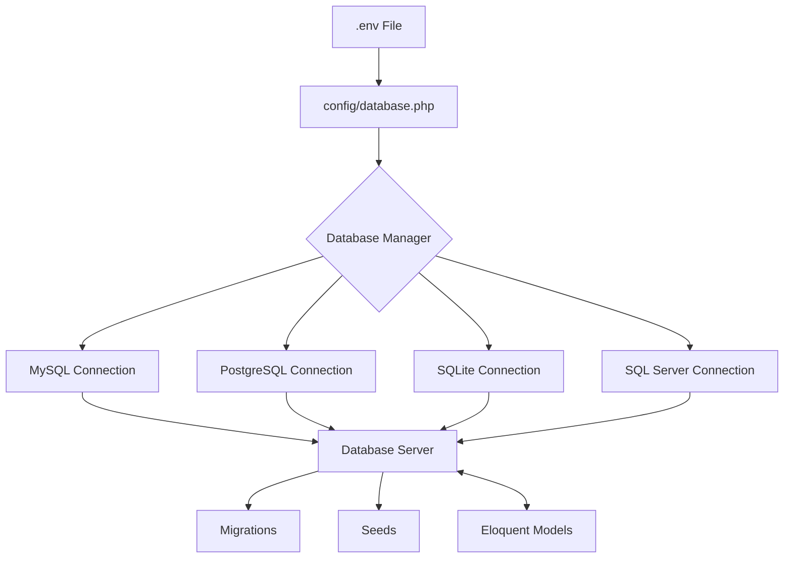

# Tutorial: Konfigurasi Database di Laravel

Database adalah bagian penting dari kebanyakan aplikasi web modern. Laravel menyediakan cara yang mudah dan fleksibel untuk mengonfigurasi koneksi database. Tutorial ini akan memandu Anda melalui langkah-langkah konfigurasi database di project Laravel Anda, khususnya untuk aplikasi manajemen data mahasiswa.

## Diagram Koneksi Database di Laravel



## 1. Memahami File Konfigurasi Database

Laravel menyimpan pengaturan koneksi database dalam dua lokasi utama:

- File `.env` - menyimpan informasi sensitif seperti username, password, dan nama database
- File `config/database.php` - menyimpan konfigurasi default dan struktur koneksi

## 2. Menyiapkan File .env

File `.env` berada di root project Laravel Anda. Untuk aplikasi mahasiswa-app, konfigurasi database pada file `.env` akan terlihat seperti ini:

```
DB_CONNECTION=mysql
DB_HOST=127.0.0.1
DB_PORT=3306
DB_DATABASE=mahasiswa_app
DB_USERNAME=root
DB_PASSWORD=
```

### Penjelasan Parameter:

- `DB_CONNECTION`: Jenis database yang digunakan (mysql, pgsql, sqlite, sqlsrv)
- `DB_HOST`: Host server database (biasanya localhost atau 127.0.0.1 untuk pengembangan lokal)
- `DB_PORT`: Port yang digunakan database (3306 untuk MySQL)
- `DB_DATABASE`: Nama database yang akan digunakan
- `DB_USERNAME`: Username untuk koneksi database
- `DB_PASSWORD`: Password untuk koneksi database

## 3. Membuat Database Baru

Sebelum melanjutkan, Anda perlu membuat database baru untuk aplikasi mahasiswa-app.

### Menggunakan Laragon:

1. Buka Laragon
2. Klik tombol "Database" 
3. Login ke MySQL (biasanya dengan username "root" dan password kosong)
4. Buat database baru dengan nama "mahasiswa_app"

### Menggunakan Command Line (MySQL):

```bash
mysql -u root -p
```

Setelah masuk ke prompt MySQL:

```sql
CREATE DATABASE mahasiswa_app;
EXIT;
```

## 4. Memahami File config/database.php

File `config/database.php` berisi konfigurasi untuk berbagai jenis koneksi database. Anda tidak perlu mengubah file ini secara langsung kecuali untuk konfigurasi khusus, karena Laravel akan mengambil nilai dari file `.env`.

Berikut sebagian isi dari file `config/database.php`:

```php
return [
    'default' => env('DB_CONNECTION', 'mysql'),
    
    'connections' => [
        'mysql' => [
            'driver' => 'mysql',
            'url' => env('DATABASE_URL'),
            'host' => env('DB_HOST', '127.0.0.1'),
            'port' => env('DB_PORT', '3306'),
            'database' => env('DB_DATABASE', 'forge'),
            'username' => env('DB_USERNAME', 'forge'),
            'password' => env('DB_PASSWORD', ''),
            'unix_socket' => env('DB_SOCKET', ''),
            'charset' => 'utf8mb4',
            'collation' => 'utf8mb4_unicode_ci',
            'prefix' => '',
            'prefix_indexes' => true,
            'strict' => true,
            'engine' => null,
            'options' => extension_loaded('pdo_mysql') ? array_filter([
                PDO::MYSQL_ATTR_SSL_CA => env('MYSQL_ATTR_SSL_CA'),
            ]) : [],
        ],
        // Konfigurasi untuk jenis database lainnya...
    ],
    // Konfigurasi lainnya...
];
```

## 5. Menguji Koneksi Database

Untuk memastikan koneksi database sudah benar, Anda dapat menggunakan perintah Artisan:

```bash
php artisan db:monitor
```

atau

```bash
php artisan tinker
```

Kemudian di dalam Tinker:

```php
DB::connection()->getPdo();
```

Jika koneksi berhasil, perintah ini akan menampilkan objek PDO. Jika terjadi error, Laravel akan menampilkan pesan error yang berkaitan dengan masalah koneksi.

## 6. Mengonfigurasi Multiple Database

Laravel memungkinkan Anda untuk menggunakan beberapa koneksi database dalam satu aplikasi. Ini berguna jika aplikasi Anda memerlukan akses ke beberapa database.

### Tambahkan koneksi baru di .env:

```
DB_CONNECTION=mysql
DB_HOST=127.0.0.1
DB_PORT=3306
DB_DATABASE=mahasiswa_app
DB_USERNAME=root
DB_PASSWORD=

DB_ARCHIVE_CONNECTION=mysql
DB_ARCHIVE_HOST=127.0.0.1
DB_ARCHIVE_PORT=3306
DB_ARCHIVE_DATABASE=mahasiswa_archive
DB_ARCHIVE_USERNAME=root
DB_ARCHIVE_PASSWORD=
```

### Tambahkan koneksi baru di config/database.php:

```php
'connections' => [
    'mysql' => [
        // Konfigurasi database utama...
    ],
    
    'archive' => [
        'driver' => 'mysql',
        'host' => env('DB_ARCHIVE_HOST', '127.0.0.1'),
        'port' => env('DB_ARCHIVE_PORT', '3306'),
        'database' => env('DB_ARCHIVE_DATABASE', 'forge'),
        'username' => env('DB_ARCHIVE_USERNAME', 'forge'),
        'password' => env('DB_ARCHIVE_PASSWORD', ''),
        // Parameter lainnya...
    ],
],
```

## 7. Menggunakan Database di Model

Untuk menggunakan koneksi database tertentu dalam model, Anda dapat menentukan properti `$connection`:

```php
namespace App\Models;

use Illuminate\Database\Eloquent\Model;

class MahasiswaArchive extends Model
{
    protected $connection = 'archive';
    protected $table = 'mahasiswa_archives';
    // ...
}
```

## 8. Migrasi Database

Laravel menggunakan migrasi untuk membuat dan memodifikasi struktur tabel. Buat file migrasi untuk tabel mahasiswa:

```bash
php artisan make:migration create_mahasiswa_table
```

Edit file migrasi di direktori `database/migrations`:

```php
public function up()
{
    Schema::create('mahasiswa', function (Blueprint $table) {
        $table->id();
        $table->string('nim', 20)->unique();
        $table->string('nama', 100);
        $table->string('email')->unique();
        $table->enum('jenis_kelamin', ['L', 'P']);
        $table->unsignedBigInteger('jurusan_id');
        $table->text('alamat')->nullable();
        $table->string('no_telp', 15)->nullable();
        $table->timestamps();
        
        $table->foreign('jurusan_id')->references('id')->on('jurusan');
    });
}
```

Jalankan migrasi untuk membuat tabel:

```bash
php artisan migrate
```

## 9. Seeder untuk Data Awal

Buat seeder untuk mengisi data awal:

```bash
php artisan make:seeder JurusanSeeder
php artisan make:seeder MahasiswaSeeder
```

Edit file `database/seeders/JurusanSeeder.php`:

```php
public function run()
{
    DB::table('jurusan')->insert([
        ['nama' => 'Teknik Informatika', 'kode' => 'TI', 'created_at' => now(), 'updated_at' => now()],
        ['nama' => 'Sistem Informasi', 'kode' => 'SI', 'created_at' => now(), 'updated_at' => now()],
        ['nama' => 'Teknik Elektro', 'kode' => 'TE', 'created_at' => now(), 'updated_at' => now()],
    ]);
}
```

Jalankan seeder:

```bash
php artisan db:seed --class=JurusanSeeder
```

## 10. Konfigurasi Database untuk Environment yang Berbeda

Laravel memungkinkan konfigurasi database yang berbeda untuk environment yang berbeda (development, testing, production):

### File .env.testing

Untuk lingkungan testing, buatlah file `.env.testing`:

```
DB_CONNECTION=sqlite
DB_DATABASE=:memory:
```

Menggunakan SQLite in-memory database untuk testing akan mempercepat waktu eksekusi test.

## 11. Menggunakan Database Factory untuk Testing

Buat factory untuk model Mahasiswa:

```bash
php artisan make:factory MahasiswaFactory
```

Edit file `database/factories/MahasiswaFactory.php`:

```php
public function definition()
{
    return [
        'nim' => $this->faker->unique()->numerify('##########'),
        'nama' => $this->faker->name,
        'email' => $this->faker->unique()->safeEmail,
        'jenis_kelamin' => $this->faker->randomElement(['L', 'P']),
        'jurusan_id' => Jurusan::factory(),
        'alamat' => $this->faker->address,
        'no_telp' => $this->faker->phoneNumber,
    ];
}
```

## Praktik: Mengonfigurasi Database untuk Aplikasi Mahasiswa-App

1. Sesuaikan file `.env` dengan konfigurasi database lokal Anda
2. Buat database `mahasiswa_app` di MySQL
3. Buat file migrasi untuk tabel `jurusan` dan `mahasiswa`
4. Jalankan migrasi untuk membuat tabel
5. Buat seeder untuk mengisi data awal jurusan dan beberapa data mahasiswa
6. Jalankan seeder untuk mengisi data

## Kesimpulan

Konfigurasi database di Laravel sangat fleksibel dan mudah untuk disesuaikan dengan kebutuhan aplikasi. Dengan mengikuti langkah-langkah di atas, Anda telah berhasil mengonfigurasi database untuk aplikasi mahasiswa-app. Pastikan untuk selalu menjaga informasi sensitif seperti username dan password database dalam file `.env` yang tidak disertakan dalam version control.

Selanjutnya, Anda dapat melanjutkan dengan membuat model, controller, dan view untuk mengelola data mahasiswa dengan memanfaatkan koneksi database yang telah Anda konfigurasi.