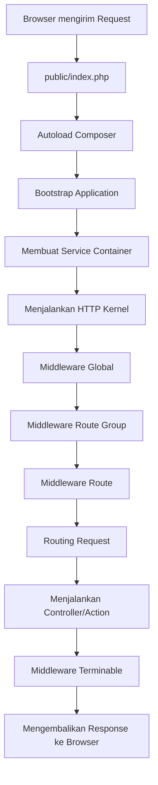
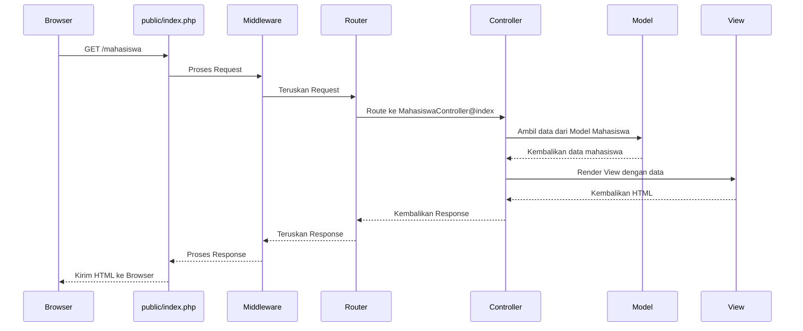

# Pengenalan Request Lifecycle di Laravel

Laravel adalah framework PHP yang sangat populer dengan arsitektur yang rapi dan terstruktur. Salah satu konsep penting yang perlu dipahami untuk menjadi developer Laravel yang efektif adalah proses "Request Lifecycle" atau siklus hidup permintaan. Artikel ini akan menjelaskan bagaimana Laravel memproses request dari awal hingga akhir dengan bahasa yang mudah dipahami.

## Apa itu Request Lifecycle?

Request Lifecycle adalah proses lengkap yang terjadi sejak pengguna mengirimkan permintaan (misalnya mengklik link atau mengirim form) hingga Laravel mengembalikan respons (halaman HTML, JSON, atau jenis respons lainnya).

## Diagram Siklus Hidup Request Laravel

Berikut adalah gambaran umum proses siklus hidup request di Laravel:



## Penjelasan Detail Setiap Tahap

### 1. Entry Point: public/index.php

Semua request Laravel dimulai dari file `public/index.php`. Ini adalah titik masuk aplikasi Laravel. File ini melakukan beberapa hal penting:

- Mendefinisikan path dasar aplikasi
- Memuat autoloader Composer
- Mendapatkan instance aplikasi Laravel
- Menjalankan aplikasi

```php
// public/index.php
require __DIR__.'/../vendor/autoload.php';
$app = require_once __DIR__.'/../bootstrap/app.php';
$kernel = $app->make(Illuminate\Contracts\Http\Kernel::class);
$response = $kernel->handle($request = Illuminate\Http\Request::capture());
$response->send();
$kernel->terminate($request, $response);
```

### 2. Bootstrap Application

Laravel memuat file `bootstrap/app.php` yang menciptakan instance baru dari aplikasi Laravel. File ini bertindak sebagai "glue" yang mengikat berbagai komponen Laravel dan bertanggung jawab untuk mengkonfigurasi beberapa direktori utama.

### 3. Service Container

Salah satu komponen terpenting dalam Laravel adalah Service Container (Container Layanan). Container ini berperan sebagai wadah untuk mengelola dependensi kelas dan melakukan dependency injection.

### 4. HTTP / Console Kernels

Setelah aplikasi bootstrap, request akan diteruskan ke HTTP kernel atau Console kernel (tergantung jenis request). Pada aplikasi web, HTTP kernel (`app/Http/Kernel.php`) akan menangani request.

HTTP Kernel berfungsi sebagai pusat komando yang mengelola semua request. Kernel ini mendefinisikan middleware global yang akan dijalankan sebelum request ditangani.

### 5. Middleware

Middleware berfungsi sebagai lapisan filter untuk HTTP request. Middleware dapat melakukan berbagai tugas seperti:

- Verifikasi apakah pengguna telah terautentikasi
- Melindungi aplikasi dari serangan CSRF
- Melakukan logging aktivitas
- Dan banyak lagi

Middleware dijalankan dalam urutan tertentu:
1. Global middleware (diterapkan ke semua request)
2. Grup route middleware (diterapkan ke grup route tertentu)
3. Route middleware (diterapkan ke route spesifik)

### 6. Routing

Setelah melewati middleware, Laravel akan mencoba mencocokkan URL request dengan route yang didefinisikan di `routes/web.php` atau `routes/api.php`. Jika route cocok, Laravel akan menjalankan aksi yang terkait (biasanya method dalam controller).

### 7. Controller / Action

Controller bertugas menerima request, memproses data (biasanya dengan bantuan Service atau Model), dan mengembalikan response yang sesuai. Pada tahap ini:

- Request diolah
- Data diambil dari database jika diperlukan
- View dirender atau API response dibuat

### 8. Response

Setelah controller selesai memproses request, response akan dibuat dan dikirim kembali melalui middleware (dalam urutan terbalik), kemudian dikembalikan ke browser.

### 9. Terminable Middleware

Beberapa middleware memiliki proses yang perlu dijalankan setelah response dikirim ke browser. Middleware ini disebut "terminable middleware" dan akan dijalankan di tahap akhir.

## Contoh Sederhana Request Lifecycle

Mari lihat contoh sederhana untuk memahami alur request lifecycle dalam Laravel:



## Contoh Kode dalam Konteks Aplikasi Mahasiswa

Berikut contoh bagaimana request lifecycle bekerja dalam konteks aplikasi manajemen mahasiswa:

1. **User mengakses URL**: `http://mahasiswa-app.test/mahasiswa`

2. **Route (`routes/web.php`)** menangkap request:
   ```php
   Route::get('/mahasiswa', 'MahasiswaController@index');
   ```

3. **Controller (`app/Http/Controllers/MahasiswaController.php`)** memproses request:
   ```php
   public function index()
   {
       $mahasiswa = Mahasiswa::all();
       return view('mahasiswa.index', ['mahasiswa' => $mahasiswa]);
   }
   ```

4. **View (`resources/views/mahasiswa/index.blade.php`)** dirender dan dikembalikan ke browser

## Request Lifecycle dalam Praktik Pengembangan

Memahami request lifecycle sangat penting karena membantu Anda:

1. **Debug masalah** dengan lebih efektif - Anda tahu di mana mencari ketika sesuatu tidak berfungsi
2. **Optimalkan aplikasi** - Anda bisa mengidentifikasi bottleneck dan mempercepat aplikasi
3. **Tulis kode yang lebih baik** - Anda tahu kapan dan di mana menambahkan logika tertentu

## Tips dan Praktik Terbaik

1. **Gunakan Middleware untuk logika yang berulang** - Misalnya, autentikasi, logging, atau transformasi data
2. **Jaga Controller tetap ramping** - Pindahkan logika bisnis ke Service Class
3. **Manfaatkan Service Container** - Untuk dependency injection dan pengelolaan objek
4. **Pahami perbedaan antara `boot` dan `register`** dalam Service Provider
5. **Gunakan Route Model Binding** untuk mengambil model secara otomatis

## Kesimpulan

Request Lifecycle di Laravel adalah proses yang terstruktur dan dapat diprediksi. Dimulai dari `public/index.php`, melewati middleware, router, controller, dan akhirnya mengembalikan response ke browser.

Dengan memahami alur ini, Anda akan menjadi developer Laravel yang lebih baik, mampu mendebug masalah dengan cepat, dan mengoptimalkan aplikasi Anda secara efektif.

Pada pertemuan selanjutnya, kita akan mempelajari lebih dalam tentang Routing di Laravel sebagai komponen kunci dalam request lifecycle.
