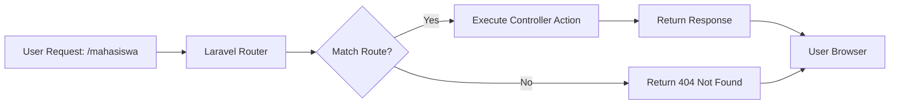
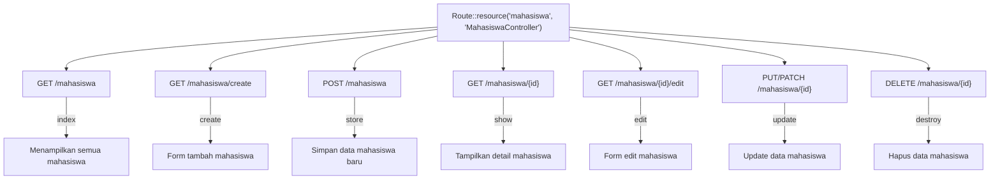

# Routing di Laravel

Routing adalah salah satu komponen paling fundamental dalam framework Laravel. Routing memungkinkan kita menentukan bagaimana aplikasi merespons permintaan ke URL tertentu. Dalam tutorial ini, kita akan mempelajari dasar-dasar routing di Laravel dan bagaimana mengimplementasikannya dalam proyek mahasiswa-app kita.

## Apa itu Routing?

Routing adalah proses pemetaan URL ke tindakan atau fungsi tertentu dalam aplikasi. Dengan kata lain, routing menentukan apa yang harus dilakukan aplikasi ketika pengguna mengakses URL tertentu.



## File Routes di Laravel

Laravel menyimpan definisi route dalam direktori `routes`. Ada beberapa file route utama:

- `web.php`: untuk web routes yang melalui middleware web (session, CSRF, dll)
- `api.php`: untuk API routes dengan middleware api
- `console.php`: untuk mendefinisikan perintah console
- `channels.php`: untuk mendefinisikan broadcasting channels

Untuk aplikasi web standar seperti mahasiswa-app kita, sebagian besar route akan didefinisikan di `routes/web.php`.

## Basic Routing

### 1. Route Sederhana

Berikut adalah contoh route sederhana yang merespons request GET ke URL `/`:

```php
// routes/web.php
Route::get('/', function () {
    return view('welcome');
});
```

Route di atas akan menampilkan view `welcome` ketika pengguna mengakses homepage aplikasi.

### 2. Route dengan Parameter

Sering kali kita perlu menangkap segmen dari URL sebagai parameter:

```php
Route::get('/mahasiswa/{id}', function ($id) {
    return "Detail Mahasiswa dengan ID: " . $id;
});
```

Route ini akan menangkap angka atau string setelah `/mahasiswa/` dan meneruskannya ke fungsi sebagai variabel `$id`.

### 3. Route dengan Parameter Opsional

Kita juga bisa membuat parameter opsional dengan menambahkan tanda tanya (?) dan memberikan nilai default:

```php
Route::get('/mahasiswa/{nama?}', function ($nama = 'Semua Mahasiswa') {
    return "Daftar Mahasiswa: " . $nama;
});
```

### 4. Route dengan Batasan Parameter

Laravel memungkinkan kita membatasi format parameter menggunakan metode `where`:

```php
Route::get('/mahasiswa/{id}', function ($id) {
    return "Detail Mahasiswa dengan ID: " . $id;
})->where('id', '[0-9]+');
```

Route ini hanya akan merespons jika `{id}` berupa angka.

## HTTP Methods

Laravel mendukung semua metode HTTP standar:

```php
Route::get('/mahasiswa', 'MahasiswaController@index');
Route::post('/mahasiswa', 'MahasiswaController@store');
Route::put('/mahasiswa/{id}', 'MahasiswaController@update');
Route::patch('/mahasiswa/{id}', 'MahasiswaController@update');
Route::delete('/mahasiswa/{id}', 'MahasiswaController@destroy');
```

Anda juga bisa mendaftarkan route yang merespons beberapa metode HTTP:

```php
Route::match(['get', 'post'], '/mahasiswa/search', function () {
    // Handle GET atau POST request
});

Route::any('/mahasiswa/all', function () {
    // Handle semua jenis HTTP method
});
```

## Route Groups

Route groups memungkinkan kita mengelompokkan route dengan atribut yang sama, seperti middleware, namespace, atau prefix URL.

### 1. Route Group dengan Prefix

```php
Route::prefix('admin')->group(function () {
    Route::get('/mahasiswa', 'Admin\MahasiswaController@index');
    Route::get('/jurusan', 'Admin\JurusanController@index');
});
```

Contoh di atas membuat route untuk `/admin/mahasiswa` dan `/admin/jurusan`.

### 2. Route Group dengan Middleware

```php
Route::middleware(['auth'])->group(function () {
    Route::get('/dashboard', 'DashboardController@index');
    Route::get('/profile', 'ProfileController@show');
});
```

Semua route dalam grup ini memerlukan autentikasi.

### 3. Route Group dengan Namespace

```php
Route::namespace('Admin')->group(function () {
    // Controller dalam namespace "App\Http\Controllers\Admin"
    Route::get('/stats', 'StatsController@index');
});
```

### 4. Route Group dengan Multiple Attributes

```php
Route::prefix('admin')
    ->middleware(['auth', 'admin'])
    ->namespace('Admin')
    ->group(function () {
        Route::get('/dashboard', 'DashboardController@index');
        // Lebih banyak route...
    });
```

## Route Model Binding

Laravel dapat secara otomatis mengambil model Eloquent berdasarkan parameter route:

### Implicit Binding

```php
// routes/web.php
Route::get('/mahasiswa/{mahasiswa}', 'MahasiswaController@show');

// app/Http/Controllers/MahasiswaController.php
public function show(Mahasiswa $mahasiswa)
{
    return view('mahasiswa.show', ['mahasiswa' => $mahasiswa]);
}
```

Laravel akan secara otomatis mencari Mahasiswa dengan ID yang sesuai dengan parameter `{mahasiswa}` dan menyuntikkannya ke controller.

### Explicit Binding

Untuk kasus yang lebih spesifik, kita bisa mendefinisikan binding secara eksplisit di `RouteServiceProvider`:

```php
// app/Providers/RouteServiceProvider.php
public function boot()
{
    Route::bind('mahasiswa', function ($value) {
        return App\Models\Mahasiswa::where('nim', $value)->firstOrFail();
    });

    parent::boot();
}
```

## Named Routes

Kita bisa memberi nama pada route untuk memudahkan referensi di tempat lain:

```php
Route::get('/mahasiswa/{id}', 'MahasiswaController@show')->name('mahasiswa.show');
```

Kemudian kita bisa menggunakan helper `route()` untuk menghasilkan URL ke route tersebut:

```php
// Dalam Blade view
<a href="{{ route('mahasiswa.show', ['id' => $mahasiswa->id]) }}">
    Lihat Detail
</a>

// Dalam controller
return redirect()->route('mahasiswa.show', ['id' => $mahasiswa->id]);
```

## Resource Controllers

Laravel menyediakan cara cepat untuk membuat route CRUD lengkap dengan satu baris kode:

```php
Route::resource('mahasiswa', 'MahasiswaController');
```

Ini sama dengan mendefinisikan route-route berikut:



## Fallback Routes

Kita bisa mendefinisikan fallback route yang akan dijalankan ketika tidak ada route lain yang cocok:

```php
Route::fallback(function () {
    return view('errors.404');
});
```

## Contoh Implementasi Route untuk Aplikasi Mahasiswa

Berikut contoh implementasi routing lengkap untuk aplikasi manajemen mahasiswa:

```php
// routes/web.php

// Halaman Utama
Route::get('/', 'HomeController@index')->name('home');

// Route Autentikasi
Auth::routes();

// Route Group untuk Admin
Route::prefix('admin')
    ->middleware(['auth', 'admin'])
    ->namespace('Admin')
    ->name('admin.')
    ->group(function () {
        Route::get('/dashboard', 'DashboardController@index')->name('dashboard');
        Route::resource('mahasiswa', 'MahasiswaController');
        Route::resource('jurusan', 'JurusanController');
        Route::resource('matakuliah', 'MataKuliahController');
    });

// Route untuk User Biasa
Route::middleware(['auth'])->group(function () {
    Route::get('/profile', 'ProfileController@show')->name('profile.show');
    Route::put('/profile', 'ProfileController@update')->name('profile.update');
    
    // Pencarian Mahasiswa
    Route::get('/mahasiswa/search', 'MahasiswaController@search')->name('mahasiswa.search');
    
    // Route Resource Mahasiswa (hanya read)
    Route::resource('mahasiswa', 'MahasiswaController')->only(['index', 'show']);
});

// Fallback Route
Route::fallback(function () {
    return view('errors.404');
});
```

## Praktik Terbaik Routing di Laravel

1. **Berikan nama yang deskriptif untuk route** - Gunakan pola penamaan yang konsisten seperti `resource.action` (contoh: `mahasiswa.show`).

2. **Gunakan route resource untuk model CRUD** - Memanfaatkan `Route::resource()` untuk menjaga konsistensi.

3. **Kelompokkan route yang berkaitan** - Gunakan route groups untuk route yang memiliki prefix, middleware, atau namespace yang sama.

4. **Gunakan route model binding** - Manfaatkan fitur ini untuk kode yang lebih bersih dan ringkas.

5. **Hindari logika kompleks dalam closure route** - Pindahkan ke controller untuk kode yang lebih terorganisir.

6. **Pertimbangkan struktur folder untuk aplikasi besar** - Pisahkan route ke beberapa file dan gunakan `require` untuk mengimpor.

## Melihat Daftar Route

Untuk menampilkan semua route yang terdaftar dalam aplikasi Laravel, jalankan perintah Artisan berikut:

```bash
php artisan route:list
```

## Kesimpulan

Routing adalah fondasi penting dalam aplikasi Laravel. Dengan pemahaman yang baik tentang routing, Anda dapat membangun struktur aplikasi yang bersih, mudah dipelihara, dan user-friendly. Pada pertemuan berikutnya, kita akan membahas lebih dalam tentang controllers dan bagaimana mereka bekerja sama dengan routes untuk menangani permintaan pengguna.
