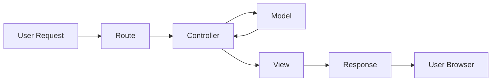
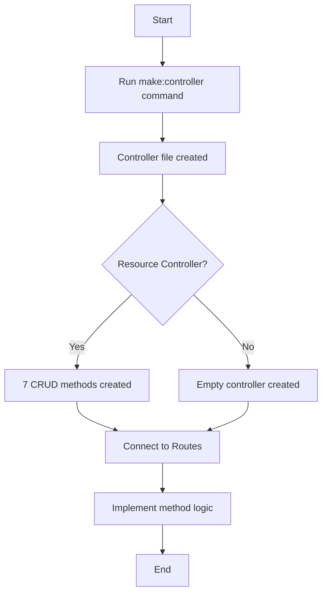
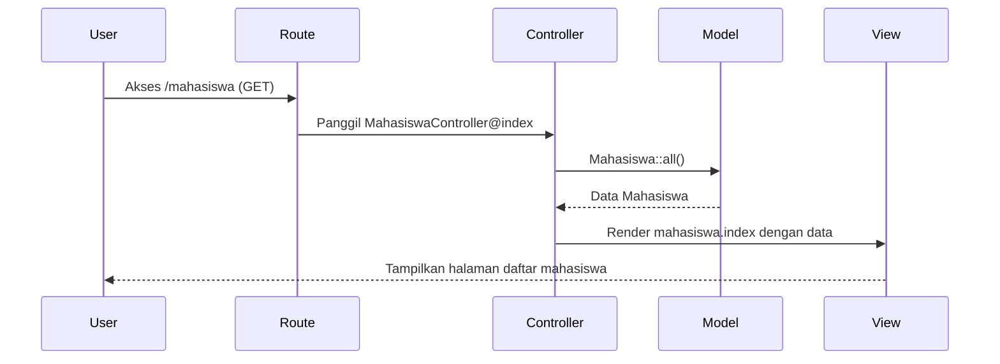

# Membuat Controller Pertama di Laravel

Controller adalah komponen inti dalam pola arsitektur MVC (Model-View-Controller) yang digunakan Laravel. Controller berfungsi sebagai perantara antara Model (data) dan View (tampilan), serta bertanggung jawab menangani request dari pengguna dan mengembalikan response yang sesuai.

Pada tutorial ini, kita akan belajar cara membuat controller pertama dalam aplikasi manajemen mahasiswa kita.

## Apa itu Controller?

Controller adalah kelas PHP yang mengelola logika aplikasi. Tugas utama controller adalah:

1. Menerima request dari pengguna
2. Berinteraksi dengan model untuk mendapatkan atau memproses data
3. Memilih view yang sesuai untuk ditampilkan
4. Mengembalikan response ke pengguna



## Struktur Controller di Laravel

Controller Laravel biasanya disimpan di folder `app/Http/Controllers`. Setiap controller adalah class PHP yang meng-extend class `App\Http\Controllers\Controller`.

## Membuat Controller dengan Artisan

Laravel menyediakan Artisan CLI untuk memudahkan pembuatan controller. Untuk membuat controller pertama kita (MahasiswaController), jalankan perintah berikut di terminal:

```bash
php artisan make:controller MahasiswaController
```

Perintah ini akan menghasilkan file baru di `app/Http/Controllers/MahasiswaController.php` dengan struktur dasar berikut:

```php
<?php

namespace App\Http\Controllers;

use Illuminate\Http\Request;

class MahasiswaController extends Controller
{
    //
}
```

## Membuat Controller Resource

Jika kita ingin membuat controller dengan method CRUD (Create, Read, Update, Delete) yang sudah disiapkan, kita bisa menggunakan flag `--resource`:

```bash
php artisan make:controller MahasiswaController --resource
```

Perintah ini akan menghasilkan controller dengan method standar:

```php
<?php

namespace App\Http\Controllers;

use Illuminate\Http\Request;

class MahasiswaController extends Controller
{
    /**
     * Display a listing of the resource.
     */
    public function index()
    {
        //
    }

    /**
     * Show the form for creating a new resource.
     */
    public function create()
    {
        //
    }

    /**
     * Store a newly created resource in storage.
     */
    public function store(Request $request)
    {
        //
    }

    /**
     * Display the specified resource.
     */
    public function show(string $id)
    {
        //
    }

    /**
     * Show the form for editing the specified resource.
     */
    public function edit(string $id)
    {
        //
    }

    /**
     * Update the specified resource in storage.
     */
    public function update(Request $request, string $id)
    {
        //
    }

    /**
     * Remove the specified resource from storage.
     */
    public function destroy(string $id)
    {
        //
    }
}
```



## Membuat Controller dengan Model

Jika kita sudah memiliki model Mahasiswa, kita bisa menghasilkan controller yang terhubung dengan model tersebut:

```bash
php artisan make:controller MahasiswaController --resource --model=Mahasiswa
```

Perintah ini akan menghasilkan controller dengan parameter tipe-hint model Mahasiswa:

```php
public function show(Mahasiswa $mahasiswa)
{
    //
}
```

## Mengimplementasikan Controller Pertama

Mari kita buat controller sederhana untuk mengelola halaman mahasiswa. Berikut adalah contoh implementasi `MahasiswaController.php`:

```php
<?php

namespace App\Http\Controllers;

use Illuminate\Http\Request;
use App\Models\Mahasiswa;

class MahasiswaController extends Controller
{
    /**
     * Menampilkan daftar mahasiswa
     */
    public function index()
    {
        $mahasiswa = Mahasiswa::all();
        return view('mahasiswa.index', ['mahasiswa' => $mahasiswa]);
    }

    /**
     * Menampilkan form tambah mahasiswa
     */
    public function create()
    {
        return view('mahasiswa.create');
    }

    /**
     * Menyimpan data mahasiswa baru
     */
    public function store(Request $request)
    {
        // Validasi input
        $validated = $request->validate([
            'nim' => 'required|unique:mahasiswa|max:10',
            'nama' => 'required|max:100',
            'email' => 'required|email|unique:mahasiswa',
            'jurusan' => 'required',
        ]);

        // Simpan data
        Mahasiswa::create($validated);

        // Redirect dengan pesan sukses
        return redirect()->route('mahasiswa.index')
            ->with('success', 'Data mahasiswa berhasil disimpan!');
    }

    /**
     * Menampilkan detail mahasiswa
     */
    public function show(Mahasiswa $mahasiswa)
    {
        return view('mahasiswa.show', compact('mahasiswa'));
    }

    /**
     * Menampilkan form edit mahasiswa
     */
    public function edit(Mahasiswa $mahasiswa)
    {
        return view('mahasiswa.edit', compact('mahasiswa'));
    }

    /**
     * Memperbarui data mahasiswa
     */
    public function update(Request $request, Mahasiswa $mahasiswa)
    {
        // Validasi input
        $validated = $request->validate([
            'nim' => 'required|max:10|unique:mahasiswa,nim,' . $mahasiswa->id,
            'nama' => 'required|max:100',
            'email' => 'required|email|unique:mahasiswa,email,' . $mahasiswa->id,
            'jurusan' => 'required',
        ]);

        // Update data
        $mahasiswa->update($validated);

        // Redirect dengan pesan sukses
        return redirect()->route('mahasiswa.index')
            ->with('success', 'Data mahasiswa berhasil diperbarui!');
    }

    /**
     * Menghapus data mahasiswa
     */
    public function destroy(Mahasiswa $mahasiswa)
    {
        $mahasiswa->delete();

        return redirect()->route('mahasiswa.index')
            ->with('success', 'Data mahasiswa berhasil dihapus!');
    }
}
```

## Menghubungkan Controller dengan Route

Setelah membuat controller, kita perlu menghubungkannya dengan route. Buka file `routes/web.php` dan tambahkan kode berikut:

### Cara 1: Mendaftarkan Route Satu per Satu

```php
// routes/web.php
use App\Http\Controllers\MahasiswaController;

Route::get('/mahasiswa', [MahasiswaController::class, 'index'])->name('mahasiswa.index');
Route::get('/mahasiswa/create', [MahasiswaController::class, 'create'])->name('mahasiswa.create');
Route::post('/mahasiswa', [MahasiswaController::class, 'store'])->name('mahasiswa.store');
Route::get('/mahasiswa/{mahasiswa}', [MahasiswaController::class, 'show'])->name('mahasiswa.show');
Route::get('/mahasiswa/{mahasiswa}/edit', [MahasiswaController::class, 'edit'])->name('mahasiswa.edit');
Route::put('/mahasiswa/{mahasiswa}', [MahasiswaController::class, 'update'])->name('mahasiswa.update');
Route::delete('/mahasiswa/{mahasiswa}', [MahasiswaController::class, 'destroy'])->name('mahasiswa.destroy');
```

### Cara 2: Menggunakan Resource Route

Cara yang lebih ringkas adalah menggunakan resource route:

```php
// routes/web.php
use App\Http\Controllers\MahasiswaController;

Route::resource('mahasiswa', MahasiswaController::class);
```

## Membuat Method Tambahan dalam Controller

Terkadang kita membutuhkan method tambahan di luar CRUD standar, misalnya untuk pencarian:

```php
/**
 * Mencari mahasiswa berdasarkan nama atau nim
 */
public function search(Request $request)
{
    $keyword = $request->input('keyword');
    $mahasiswa = Mahasiswa::where('nama', 'like', "%$keyword%")
                        ->orWhere('nim', 'like', "%$keyword%")
                        ->paginate(10);
    
    return view('mahasiswa.index', compact('mahasiswa', 'keyword'));
}
```

Kemudian tambahkan route untuk method ini:

```php
Route::get('/mahasiswa/search', [MahasiswaController::class, 'search'])->name('mahasiswa.search');
```

**Catatan penting:** Route khusus seperti `search` harus didefinisikan sebelum resource route untuk menghindari konflik.

## Dependency Injection di Controller

Laravel mendukung dependency injection melalui constructor atau method. Berikut contohnya:

```php
<?php

namespace App\Http\Controllers;

use App\Services\MahasiswaService;
use Illuminate\Http\Request;

class MahasiswaController extends Controller
{
    protected $mahasiswaService;

    // Constructor Injection
    public function __construct(MahasiswaService $mahasiswaService)
    {
        $this->mahasiswaService = $mahasiswaService;
    }

    // Method Injection
    public function index(Request $request)
    {
        $mahasiswa = $this->mahasiswaService->getAllMahasiswa();
        return view('mahasiswa.index', compact('mahasiswa'));
    }
}
```

## Praktik Terbaik Membuat Controller

1. **Ikuti Prinsip Single Responsibility** - Satu controller harus fokus pada satu resource atau entitas
2. **Gunakan Resource Controller untuk CRUD standar** - Manfaatkan konvensi Laravel
3. **Jaga Controller Tetap Ramping** - Pindahkan logika bisnis ke Service atau Repository
4. **Gunakan Request Classes untuk Validasi Kompleks** - Buat class request terpisah untuk validasi kompleks
5. **Manfaatkan Route Model Binding** - Menghemat kode untuk mengambil model berdasarkan ID
6. **Gunakan Middleware di Controller** - Tambahkan middleware di constructor untuk keamanan

## Contoh Alur Kerja dalam Controller



## Praktik: Membuat HomeController

Mari buat controller sederhana untuk menangani halaman beranda aplikasi mahasiswa kita:

1. Jalankan Artisan command:

```bash
php artisan make:controller HomeController
```

2. Edit file `app/Http/Controllers/HomeController.php`:

```php
<?php

namespace App\Http\Controllers;

use Illuminate\Http\Request;
use App\Models\Mahasiswa;
use App\Models\Jurusan;

class HomeController extends Controller
{
    /**
     * Menampilkan halaman beranda.
     */
    public function index()
    {
        // Ambil statistik untuk dashboard
        $totalMahasiswa = Mahasiswa::count();
        $totalJurusan = Jurusan::count();
        $mahasiswaTerbaru = Mahasiswa::latest()->take(5)->get();
        
        return view('home', compact('totalMahasiswa', 'totalJurusan', 'mahasiswaTerbaru'));
    }
}
```

3. Tambahkan route untuk HomeController di `routes/web.php`:

```php
use App\Http\Controllers\HomeController;

Route::get('/', [HomeController::class, 'index'])->name('home');
```

4. Buat view untuk halaman beranda di `resources/views/home.blade.php`.

## Kesimpulan

Controller adalah komponen penting dalam arsitektur MVC Laravel yang mengelola logika aplikasi dan berfungsi sebagai penghubung antara Model dan View. Dengan memahami cara membuat dan menggunakan controller, Anda dapat mengorganisir kode aplikasi dengan lebih baik dan mengikuti prinsip separation of concerns.

Pada pertemuan selanjutnya, kita akan membahas tentang View di Laravel dan bagaimana menampilkan data dari controller ke pengguna.
