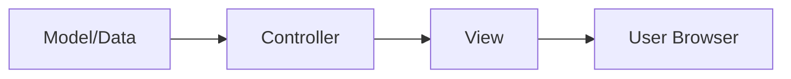
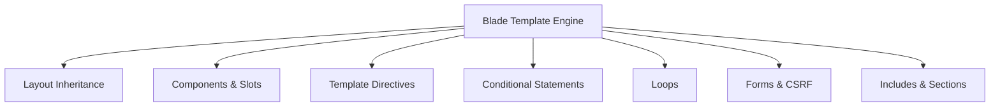
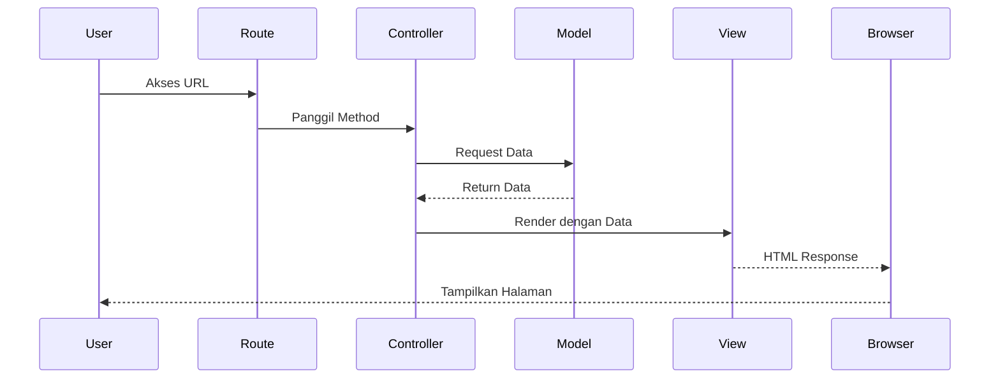
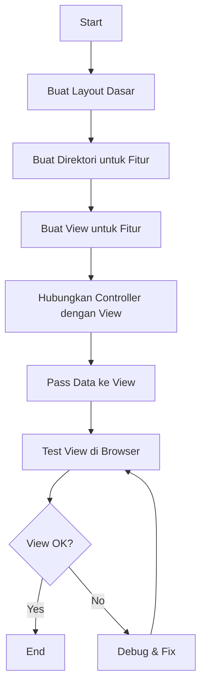

# Membuat View Pertama di Laravel

View merupakan komponen penting dalam arsitektur MVC (Model-View-Controller) Laravel yang bertanggung jawab untuk menampilkan data ke pengguna dalam bentuk antarmuka yang menarik dan interaktif. Pada tutorial ini, kita akan belajar cara membuat view pertama dalam aplikasi manajemen data mahasiswa.

## Apa itu View?

View adalah file yang berisi kode HTML dan tampilan yang digunakan untuk menyajikan data kepada pengguna. Dalam Laravel, view dipisahkan dari logika aplikasi, sehingga memudahkan pengembangan dan pemeliharaan kode.



## Lokasi View di Laravel

View Laravel disimpan di direktori `resources/views`. Secara default, Laravel menggunakan Blade sebagai template engine untuk membuat view yang lebih dinamis.

## Struktur Direktori View yang Direkomendasikan

Untuk aplikasi manajemen mahasiswa kita, sebaiknya kita mengorganisir view ke dalam struktur direktori yang rapi:

```
resources/
└── views/
    ├── layouts/            # Template utama
    │   └── app.blade.php   # Layout dasar aplikasi
    ├── partials/           # Komponen yang dapat digunakan kembali
    │   ├── header.blade.php
    │   ├── footer.blade.php
    │   └── sidebar.blade.php
    ├── mahasiswa/          # View untuk fitur mahasiswa
    │   ├── index.blade.php  # Daftar mahasiswa
    │   ├── create.blade.php # Form tambah mahasiswa
    │   ├── edit.blade.php   # Form edit mahasiswa
    │   └── show.blade.php   # Detail mahasiswa
    ├── jurusan/            # View untuk fitur jurusan
    ├── home.blade.php      # Halaman beranda
    └── welcome.blade.php   # Halaman selamat datang
```

## Membuat Layout Dasar

Pertama, mari buat layout dasar aplikasi yang akan digunakan oleh semua halaman:

1. Buat direktori `layouts` jika belum ada:

```bash
mkdir -p resources/views/layouts
```

2. Buat file `app.blade.php` di dalam direktori tersebut:

```php
<!DOCTYPE html>
<html lang="id">
<head>
    <meta charset="UTF-8">
    <meta name="viewport" content="width=device-width, initial-scale=1.0">
    <title>@yield('title', 'Aplikasi Manajemen Mahasiswa')</title>
    
    <!-- Bootstrap CSS -->
    <link href="https://cdn.jsdelivr.net/npm/bootstrap@5.3.0/dist/css/bootstrap.min.css" rel="stylesheet">
    
    <!-- Custom CSS -->
    <link rel="stylesheet" href="{{ asset('css/app.css') }}">
    
    @yield('styles')
</head>
<body>
    <header>
        <nav class="navbar navbar-expand-lg navbar-dark bg-primary">
            <div class="container">
                <a class="navbar-brand" href="{{ route('home') }}">Sistem Mahasiswa</a>
                <button class="navbar-toggler" type="button" data-bs-toggle="collapse" data-bs-target="#navbarNav">
                    <span class="navbar-toggler-icon"></span>
                </button>
                <div class="collapse navbar-collapse" id="navbarNav">
                    <ul class="navbar-nav">
                        <li class="nav-item">
                            <a class="nav-link" href="{{ route('home') }}">Home</a>
                        </li>
                        <li class="nav-item">
                            <a class="nav-link" href="{{ route('mahasiswa.index') }}">Mahasiswa</a>
                        </li>
                        <li class="nav-item">
                            <a class="nav-link" href="#">Jurusan</a>
                        </li>
                    </ul>
                </div>
            </div>
        </nav>
    </header>

    <main class="container my-4">
        @yield('content')
    </main>

    <footer class="bg-light py-3 mt-5">
        <div class="container text-center">
            <p>&copy; {{ date('Y') }} Aplikasi Manajemen Mahasiswa</p>
        </div>
    </footer>

    <!-- Bootstrap JS Bundle with Popper -->
    <script src="https://cdn.jsdelivr.net/npm/bootstrap@5.3.0/dist/js/bootstrap.bundle.min.js"></script>
    
    <!-- Custom JavaScript -->
    <script src="{{ asset('js/app.js') }}"></script>
    
    @yield('scripts')
</body>
</html>
```

Pada layout di atas, kita menggunakan direktif Blade `@yield` untuk mendefinisikan bagian yang akan diisi oleh view yang menggunakan layout ini.

## Membuat View untuk Halaman Beranda

Sekarang, mari buat view untuk halaman beranda:

```php
<!-- resources/views/home.blade.php -->
@extends('layouts.app')

@section('title', 'Beranda - Aplikasi Manajemen Mahasiswa')

@section('content')
    <div class="jumbotron">
        <h1 class="display-4">Selamat Datang di Sistem Manajemen Mahasiswa</h1>
        <p class="lead">Aplikasi ini digunakan untuk mengelola data mahasiswa, jurusan, dan mata kuliah.</p>
        <hr class="my-4">
        <p>Silakan gunakan menu di atas untuk mengakses fitur-fitur aplikasi.</p>
        <a class="btn btn-primary btn-lg" href="{{ route('mahasiswa.index') }}" role="button">Lihat Daftar Mahasiswa</a>
    </div>

    <div class="row mt-5">
        <div class="col-md-4">
            <div class="card">
                <div class="card-body">
                    <h5 class="card-title">Total Mahasiswa</h5>
                    <p class="card-text display-4">{{ $totalMahasiswa ?? 0 }}</p>
                    <a href="{{ route('mahasiswa.index') }}" class="btn btn-sm btn-outline-primary">Lihat Detail</a>
                </div>
            </div>
        </div>
        <div class="col-md-4">
            <div class="card">
                <div class="card-body">
                    <h5 class="card-title">Total Jurusan</h5>
                    <p class="card-text display-4">{{ $totalJurusan ?? 0 }}</p>
                    <a href="#" class="btn btn-sm btn-outline-primary">Lihat Detail</a>
                </div>
            </div>
        </div>
        <div class="col-md-4">
            <div class="card">
                <div class="card-body">
                    <h5 class="card-title">Total Mata Kuliah</h5>
                    <p class="card-text display-4">{{ $totalMataKuliah ?? 0 }}</p>
                    <a href="#" class="btn btn-sm btn-outline-primary">Lihat Detail</a>
                </div>
            </div>
        </div>
    </div>

    @if(isset($mahasiswaTerbaru) && count($mahasiswaTerbaru) > 0)
        <div class="mt-5">
            <h3>Mahasiswa Terbaru</h3>
            <div class="table-responsive">
                <table class="table table-striped">
                    <thead>
                        <tr>
                            <th>NIM</th>
                            <th>Nama</th>
                            <th>Jurusan</th>
                            <th>Aksi</th>
                        </tr>
                    </thead>
                    <tbody>
                        @foreach($mahasiswaTerbaru as $mhs)
                            <tr>
                                <td>{{ $mhs->nim }}</td>
                                <td>{{ $mhs->nama }}</td>
                                <td>{{ $mhs->jurusan }}</td>
                                <td>
                                    <a href="{{ route('mahasiswa.show', $mhs->id) }}" class="btn btn-sm btn-info">Detail</a>
                                </td>
                            </tr>
                        @endforeach
                    </tbody>
                </table>
            </div>
        </div>
    @endif
@endsection
```

## Membuat View untuk Daftar Mahasiswa

Selanjutnya, mari buat view untuk menampilkan daftar mahasiswa:

1. Buat direktori `mahasiswa` jika belum ada:

```bash
mkdir -p resources/views/mahasiswa
```

2. Buat file `index.blade.php` di dalam direktori tersebut:

```php
<!-- resources/views/mahasiswa/index.blade.php -->
@extends('layouts.app')

@section('title', 'Daftar Mahasiswa')

@section('content')
    <div class="d-flex justify-content-between align-items-center mb-4">
        <h1>Daftar Mahasiswa</h1>
        <a href="{{ route('mahasiswa.create') }}" class="btn btn-primary">
            <i class="bi bi-plus-circle"></i> Tambah Mahasiswa
        </a>
    </div>

    @if(session('success'))
        <div class="alert alert-success alert-dismissible fade show" role="alert">
            {{ session('success') }}
            <button type="button" class="btn-close" data-bs-dismiss="alert" aria-label="Close"></button>
        </div>
    @endif

    <div class="card">
        <div class="card-header">
            <form action="{{ route('mahasiswa.index') }}" method="GET" class="row g-3">
                <div class="col-md-10">
                    <input type="text" name="search" class="form-control" placeholder="Cari berdasarkan nama atau NIM..." value="{{ request('search') }}">
                </div>
                <div class="col-md-2">
                    <button type="submit" class="btn btn-primary w-100">Cari</button>
                </div>
            </form>
        </div>
        <div class="card-body">
            @if(count($mahasiswa) > 0)
                <div class="table-responsive">
                    <table class="table table-striped table-hover">
                        <thead>
                            <tr>
                                <th>No.</th>
                                <th>NIM</th>
                                <th>Nama</th>
                                <th>Email</th>
                                <th>Jurusan</th>
                                <th>Aksi</th>
                            </tr>
                        </thead>
                        <tbody>
                            @foreach($mahasiswa as $index => $mhs)
                                <tr>
                                    <td>{{ $index + 1 }}</td>
                                    <td>{{ $mhs->nim }}</td>
                                    <td>{{ $mhs->nama }}</td>
                                    <td>{{ $mhs->email }}</td>
                                    <td>{{ $mhs->jurusan }}</td>
                                    <td>
                                        <div class="btn-group" role="group">
                                            <a href="{{ route('mahasiswa.show', $mhs->id) }}" class="btn btn-sm btn-info">Detail</a>
                                            <a href="{{ route('mahasiswa.edit', $mhs->id) }}" class="btn btn-sm btn-warning">Edit</a>
                                            <form action="{{ route('mahasiswa.destroy', $mhs->id) }}" method="POST" class="d-inline" onsubmit="return confirm('Apakah Anda yakin ingin menghapus data ini?');">
                                                @csrf
                                                @method('DELETE')
                                                <button type="submit" class="btn btn-sm btn-danger">Hapus</button>
                                            </form>
                                        </div>
                                    </td>
                                </tr>
                            @endforeach
                        </tbody>
                    </table>
                </div>
                
                <div class="d-flex justify-content-center mt-4">
                    {{ $mahasiswa->links() }}
                </div>
            @else
                <div class="alert alert-info">
                    Tidak ada data mahasiswa yang ditemukan.
                </div>
            @endif
        </div>
    </div>
@endsection
```

## Membuat View Form Tambah Mahasiswa

Sekarang, mari buat view untuk form tambah mahasiswa:

```php
<!-- resources/views/mahasiswa/create.blade.php -->
@extends('layouts.app')

@section('title', 'Tambah Mahasiswa')

@section('content')
    <div class="d-flex justify-content-between align-items-center mb-4">
        <h1>Tambah Mahasiswa Baru</h1>
        <a href="{{ route('mahasiswa.index') }}" class="btn btn-secondary">
            <i class="bi bi-arrow-left"></i> Kembali
        </a>
    </div>

    <div class="card">
        <div class="card-body">
            <form action="{{ route('mahasiswa.store') }}" method="POST">
                @csrf
                
                <div class="mb-3">
                    <label for="nim" class="form-label">NIM</label>
                    <input type="text" class="form-control @error('nim') is-invalid @enderror" id="nim" name="nim" value="{{ old('nim') }}" required>
                    @error('nim')
                        <div class="invalid-feedback">{{ $message }}</div>
                    @enderror
                </div>
                
                <div class="mb-3">
                    <label for="nama" class="form-label">Nama Lengkap</label>
                    <input type="text" class="form-control @error('nama') is-invalid @enderror" id="nama" name="nama" value="{{ old('nama') }}" required>
                    @error('nama')
                        <div class="invalid-feedback">{{ $message }}</div>
                    @enderror
                </div>
                
                <div class="mb-3">
                    <label for="email" class="form-label">Email</label>
                    <input type="email" class="form-control @error('email') is-invalid @enderror" id="email" name="email" value="{{ old('email') }}" required>
                    @error('email')
                        <div class="invalid-feedback">{{ $message }}</div>
                    @enderror
                </div>
                
                <div class="mb-3">
                    <label for="jurusan" class="form-label">Jurusan</label>
                    <select class="form-select @error('jurusan') is-invalid @enderror" id="jurusan" name="jurusan" required>
                        <option value="" selected disabled>Pilih Jurusan</option>
                        <option value="Teknik Informatika" {{ old('jurusan') == 'Teknik Informatika' ? 'selected' : '' }}>Teknik Informatika</option>
                        <option value="Sistem Informasi" {{ old('jurusan') == 'Sistem Informasi' ? 'selected' : '' }}>Sistem Informasi</option>
                        <option value="Teknik Komputer" {{ old('jurusan') == 'Teknik Komputer' ? 'selected' : '' }}>Teknik Komputer</option>
                        <option value="Manajemen Informatika" {{ old('jurusan') == 'Manajemen Informatika' ? 'selected' : '' }}>Manajemen Informatika</option>
                    </select>
                    @error('jurusan')
                        <div class="invalid-feedback">{{ $message }}</div>
                    @enderror
                </div>
                
                <div class="mb-3">
                    <label for="alamat" class="form-label">Alamat</label>
                    <textarea class="form-control @error('alamat') is-invalid @enderror" id="alamat" name="alamat" rows="3">{{ old('alamat') }}</textarea>
                    @error('alamat')
                        <div class="invalid-feedback">{{ $message }}</div>
                    @enderror
                </div>
                
                <div class="mb-3">
                    <label for="tanggal_lahir" class="form-label">Tanggal Lahir</label>
                    <input type="date" class="form-control @error('tanggal_lahir') is-invalid @enderror" id="tanggal_lahir" name="tanggal_lahir" value="{{ old('tanggal_lahir') }}">
                    @error('tanggal_lahir')
                        <div class="invalid-feedback">{{ $message }}</div>
                    @enderror
                </div>
                
                <div class="d-grid gap-2">
                    <button type="submit" class="btn btn-primary">Simpan Data</button>
                </div>
            </form>
        </div>
    </div>
@endsection
```

## Blade Template Engine

Blade adalah template engine Laravel yang memudahkan kita untuk menulis kode PHP di dalam HTML. Beberapa fitur utama Blade:



### Direktif Blade yang Sering Digunakan

1. **Layout Inheritance**
   - `@extends` - Menentukan layout yang akan digunakan
   - `@section` - Mendefinisikan bagian konten
   - `@yield` - Menampilkan konten dari section

2. **Conditional Statements**
   - `@if`, `@elseif`, `@else` - Struktur kondisional
   - `@unless` - Kebalikan dari if
   - `@isset`, `@empty` - Cek variabel

3. **Loops**
   - `@foreach`, `@for`, `@while` - Struktur perulangan
   - `@forelse` - Foreach dengan kondisi empty

4. **Form & CSRF**
   - `@csrf` - Menambahkan token CSRF ke form
   - `@method` - Menentukan HTTP method (PUT, DELETE)

5. **Include & Component**
   - `@include` - Menyertakan sub-view
   - `@component` - Menggunakan komponen blade

## Membuat Partial Views

Untuk kode yang digunakan berulang kali, kita dapat membuatnya sebagai partial view:

1. Buat direktori `partials`:

```bash
mkdir -p resources/views/partials
```

2. Buat file untuk pesan flash:

```php
<!-- resources/views/partials/flash-message.blade.php -->
@if(session('success'))
    <div class="alert alert-success alert-dismissible fade show" role="alert">
        {{ session('success') }}
        <button type="button" class="btn-close" data-bs-dismiss="alert" aria-label="Close"></button>
    </div>
@endif

@if(session('error'))
    <div class="alert alert-danger alert-dismissible fade show" role="alert">
        {{ session('error') }}
        <button type="button" class="btn-close" data-bs-dismiss="alert" aria-label="Close"></button>
    </div>
@endif
```

3. Penggunaan partial view di halaman lain:

```php
@include('partials.flash-message')
```

## Alur Kerja dari Controller ke View

Berikut adalah alur kerja dari controller hingga view ditampilkan:



## Passing Data ke View

Ada beberapa cara untuk mengirim data dari controller ke view:

### Cara 1: Menggunakan array asosiatif

```php
// Di Controller
public function index()
{
    $mahasiswa = Mahasiswa::paginate(10);
    return view('mahasiswa.index', ['mahasiswa' => $mahasiswa]);
}
```

### Cara 2: Menggunakan method `with()`

```php
public function index()
{
    $mahasiswa = Mahasiswa::paginate(10);
    return view('mahasiswa.index')->with('mahasiswa', $mahasiswa);
}
```

### Cara 3: Menggunakan helper `compact()`

```php
public function index()
{
    $mahasiswa = Mahasiswa::paginate(10);
    $title = 'Daftar Mahasiswa';
    return view('mahasiswa.index', compact('mahasiswa', 'title'));
}
```

## Mengakses Data di View

Di view, kita bisa mengakses data yang dikirim menggunakan sintaks Blade:

```php
<h1>{{ $title }}</h1>

<ul>
    @foreach($mahasiswa as $mhs)
        <li>{{ $mhs->nama }} ({{ $mhs->nim }})</li>
    @endforeach
</ul>
```

## Praktik: Implementasi Home View

Mari praktikkan pembuatan view untuk halaman home yang terhubung dengan HomeController yang telah kita buat sebelumnya:

1. Di Controller:

```php
// app/Http/Controllers/HomeController.php
public function index()
{
    $totalMahasiswa = Mahasiswa::count();
    $totalJurusan = Jurusan::count();
    $mahasiswaTerbaru = Mahasiswa::latest()->take(5)->get();
    
    return view('home', compact('totalMahasiswa', 'totalJurusan', 'mahasiswaTerbaru'));
}
```

2. Pastikan route sudah terhubung:

```php
// routes/web.php
Route::get('/', [HomeController::class, 'index'])->name('home');
```

3. Buat view home seperti contoh di atas, dan pastikan sudah ada layout app.blade.php.

## Flowchart Pembuatan View



## Tips dan Praktik Terbaik

1. **Gunakan Layout** - Hindari duplikasi kode dengan memanfaatkan layout
2. **Buat Partial Views** - Untuk komponen yang digunakan berulang kali
3. **Organisasi Direktori** - Kelompokkan view berdasarkan fitur atau modul
4. **Validasi Form** - Tampilkan pesan error validasi dengan benar
5. **Escape Output** - Gunakan `{{ $variable }}` untuk mencegah XSS
6. **Jangan Taruh Logika Kompleks di View** - Pindahkan ke controller atau helper
7. **Gunakan Blade Components** - Untuk UI yang konsisten dan dapat digunakan kembali

## Kesimpulan

View adalah komponen penting dalam arsitektur MVC Laravel yang bertanggung jawab untuk menampilkan data kepada pengguna. Dengan menggunakan Blade template engine, kita dapat membuat view yang dinamis, aman, dan mudah dikelola.

Setelah mempelajari cara membuat controller dan view, kita sudah memiliki dasar yang cukup untuk mulai mengembangkan fitur-fitur aplikasi manajemen mahasiswa. Pada pertemuan selanjutnya, kita akan mempelajari tentang Model dan bagaimana mengintegrasikannya dengan database.
