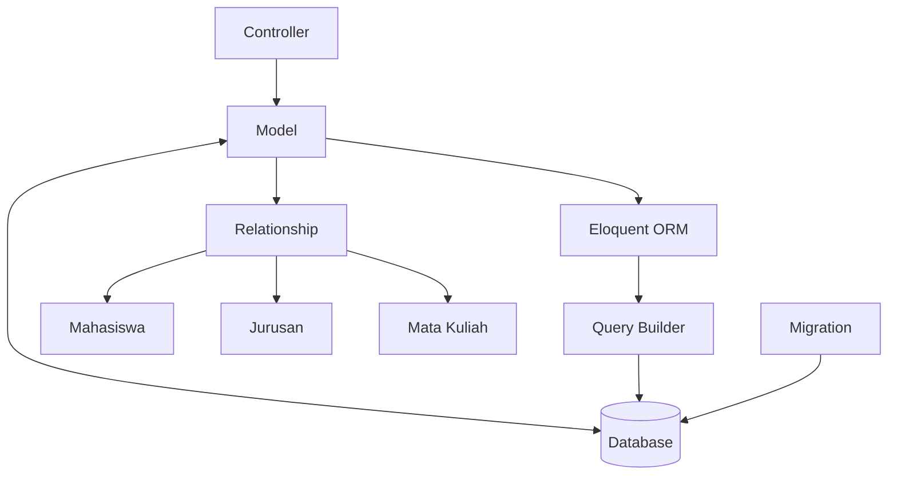

# Pengenalan Model pada Laravel

Model adalah salah satu komponen utama dalam arsitektur MVC (Model-View-Controller) Laravel. Model berfungsi sebagai lapisan abstraksi untuk berinteraksi dengan database. Dalam tutorial ini, kita akan membahas cara membuat dan menggunakan model Laravel untuk aplikasi manajemen data mahasiswa.

## Alur Kerja Model dalam Laravel



## 1. Apa itu Model dalam Laravel?

Model di Laravel merupakan kelas PHP yang mewakili tabel dalam database. Laravel menggunakan Eloquent ORM (Object-Relational Mapping) yang membuat interaksi dengan database menjadi lebih intuitif dan berorientasi objek. Dengan Eloquent, setiap model terhubung dengan tabel spesifik dalam database.

## 2. Membuat Model Pertama

### Langkah 1: Membuat Model menggunakan Artisan CLI

Artisan adalah command-line interface yang disediakan Laravel untuk membantu pengembangan. Untuk membuat model Mahasiswa, jalankan perintah berikut di terminal:

```bash
php artisan make:model Mahasiswa
```

Perintah di atas akan membuat file `app/Models/Mahasiswa.php` dengan kode dasar:

```php
<?php

namespace App\Models;

use Illuminate\Database\Eloquent\Factories\HasFactory;
use Illuminate\Database\Eloquent\Model;

class Mahasiswa extends Model
{
    use HasFactory;
}
```

### Langkah 2: Membuat Model dengan Migration dan Controller sekaligus

Jika Anda ingin membuat model beserta migration dan controller dalam satu perintah:

```bash
php artisan make:model Mahasiswa -mc
```

Flag `-m` akan membuat migration dan `-c` akan membuat controller.

## 3. Konfigurasi Model

### Langkah 1: Tentukan Nama Tabel

Secara default, Laravel akan menggunakan bentuk jamak (plural) dari nama model sebagai nama tabel. Misalnya, model `Mahasiswa` akan terhubung dengan tabel `mahasiswas`. Jika nama tabel berbeda, tentukan secara manual:

```php
class Mahasiswa extends Model
{
    use HasFactory;
    
    // Tentukan nama tabel yang digunakan
    protected $table = 'mahasiswa';
}
```

### Langkah 2: Tentukan Primary Key

Secara default, Eloquent mengasumsikan bahwa setiap tabel memiliki primary key bernama `id`. Jika berbeda:

```php
class Mahasiswa extends Model
{
    use HasFactory;
    
    protected $table = 'mahasiswa';
    protected $primaryKey = 'mahasiswa_id'; // Jika primary key bukan 'id'
}
```

### Langkah 3: Timestamps

Laravel secara otomatis mengelola kolom `created_at` dan `updated_at`. Jika tidak ingin menggunakan timestamps:

```php
class Mahasiswa extends Model
{
    use HasFactory;
    
    public $timestamps = false;
}
```

### Langkah 4: Mass Assignment Protection

Mass Assignment adalah teknik untuk menyimpan banyak data sekaligus ke database. Untuk keamanan, Laravel membatasi kolom apa saja yang boleh diisi secara massal:

```php
class Mahasiswa extends Model
{
    use HasFactory;
    
    // Kolom yang diizinkan untuk mass assignment
    protected $fillable = [
        'nim', 'nama', 'email', 'jenis_kelamin', 'jurusan_id', 'alamat', 'no_telp'
    ];
    
    // ATAU: Kolom yang dikecualikan dari mass assignment
    // protected $guarded = ['id'];
}
```

## 4. Menggunakan Model untuk CRUD

### Create: Menambah Data Mahasiswa

```php
// Cara 1: Instance baru
$mahasiswa = new Mahasiswa;
$mahasiswa->nim = '20210001';
$mahasiswa->nama = 'Budi Santoso';
$mahasiswa->email = 'budi@example.com';
$mahasiswa->jenis_kelamin = 'L';
$mahasiswa->jurusan_id = 1;
$mahasiswa->alamat = 'Jl. Mangga No. 10';
$mahasiswa->no_telp = '08123456789';
$mahasiswa->save();

// Cara 2: Mass Assignment
Mahasiswa::create([
    'nim' => '20210002',
    'nama' => 'Siti Rahma',
    'email' => 'siti@example.com',
    'jenis_kelamin' => 'P',
    'jurusan_id' => 2,
    'alamat' => 'Jl. Apel No. 15',
    'no_telp' => '08987654321'
]);
```

### Read: Mengambil Data Mahasiswa

```php
// Mengambil semua mahasiswa
$semua_mahasiswa = Mahasiswa::all();

// Mengambil satu mahasiswa berdasarkan ID
$mahasiswa = Mahasiswa::find(1);

// Mengambil mahasiswa pertama yang sesuai dengan kondisi
$mahasiswa = Mahasiswa::where('nim', '20210001')->first();

// Mengambil semua mahasiswa yang sesuai dengan kondisi
$mahasiswa_TI = Mahasiswa::where('jurusan_id', 1)->get();

// Menangani jika data tidak ditemukan
$mahasiswa = Mahasiswa::findOrFail(5); // Throws ModelNotFoundException jika tidak ada
```

### Update: Mengubah Data Mahasiswa

```php
// Cara 1: Find dan save
$mahasiswa = Mahasiswa::find(1);
$mahasiswa->nama = 'Budi Setiawan';
$mahasiswa->save();

// Cara 2: Mass update
Mahasiswa::where('jurusan_id', 1)->update(['alamat' => 'Kampus A']);
```

### Delete: Menghapus Data Mahasiswa

```php
// Cara 1: Find dan delete
$mahasiswa = Mahasiswa::find(1);
$mahasiswa->delete();

// Cara 2: Delete langsung
Mahasiswa::destroy(1); // Hapus berdasarkan ID
Mahasiswa::destroy([1, 2, 3]); // Hapus beberapa ID sekaligus

// Cara 3: Delete berdasarkan kondisi
Mahasiswa::where('jurusan_id', 3)->delete();
```

## 5. Relationships (Relasi)

Model Laravel memungkinkan Anda mendefinisikan relasi antar tabel. Berikut contoh relasi yang umum digunakan:

### One-to-Many: Jurusan memiliki banyak Mahasiswa

Di model `Jurusan`:

```php
public function mahasiswa()
{
    return $this->hasMany(Mahasiswa::class);
}
```

Di model `Mahasiswa`:

```php
public function jurusan()
{
    return $this->belongsTo(Jurusan::class);
}
```

### Many-to-Many: Mahasiswa mengambil banyak Mata Kuliah

Kita perlu tabel pivot `mahasiswa_matakuliah`:

Di model `Mahasiswa`:

```php
public function matakuliah()
{
    return $this->belongsToMany(MataKuliah::class, 'mahasiswa_matakuliah');
}
```

Di model `MataKuliah`:

```php
public function mahasiswa()
{
    return $this->belongsToMany(Mahasiswa::class, 'mahasiswa_matakuliah');
}
```

## 6. Menggunakan Relasi

```php
// Mendapatkan jurusan dari mahasiswa
$mahasiswa = Mahasiswa::find(1);
$jurusan = $mahasiswa->jurusan;
echo $jurusan->nama; // Output: nama jurusan

// Mendapatkan semua mahasiswa dari jurusan
$jurusan = Jurusan::find(1);
$mahasiswa_list = $jurusan->mahasiswa;
foreach ($mahasiswa_list as $mhs) {
    echo $mhs->nama . '<br>';
}

// Eager loading untuk optimalisasi query
$mahasiswa = Mahasiswa::with('jurusan')->get();
foreach ($mahasiswa as $mhs) {
    echo $mhs->nama . ' - ' . $mhs->jurusan->nama . '<br>';
}
```

## 7. Accessor dan Mutator

Accessor dan mutator memungkinkan Anda mengubah format data saat mengambil atau menyimpan ke database.

### Accessor: Format data saat diambil

```php
// Di model Mahasiswa
public function getNamaLengkapAttribute()
{
    return strtoupper($this->nama);
}

// Penggunaan
$mahasiswa = Mahasiswa::find(1);
echo $mahasiswa->nama_lengkap; // Output: BUDI SANTOSO
```

### Mutator: Format data sebelum disimpan

```php
// Di model Mahasiswa
public function setNamaAttribute($value)
{
    $this->attributes['nama'] = ucwords(strtolower($value));
}

// Penggunaan: nama akan disimpan dengan huruf kapital di awal kata
$mahasiswa = new Mahasiswa;
$mahasiswa->nama = 'budi santoso'; // Akan disimpan sebagai "Budi Santoso"
$mahasiswa->save();
```

## 8. Scopes untuk Query yang Sering Digunakan

Scopes memungkinkan Anda mendefinisikan batasan query yang dapat digunakan berulang kali:

```php
// Di model Mahasiswa
public function scopeAktif($query)
{
    return $query->where('status', 'aktif');
}

public function scopeJurusan($query, $jurusan_id)
{
    return $query->where('jurusan_id', $jurusan_id);
}

// Penggunaan
$mahasiswa_TI_aktif = Mahasiswa::aktif()->jurusan(1)->get();
```

## 9. Praktik: Membuat Model dan Relasi untuk Aplikasi Mahasiswa

1. Buat model Mahasiswa dan Jurusan dengan relasi yang sesuai
2. Implementasikan CRUD sederhana untuk model Mahasiswa
3. Tampilkan data mahasiswa beserta nama jurusannya
4. Buat filter untuk menampilkan mahasiswa berdasarkan jurusan

### Contoh Implementasi:

```php
// Controller MahasiswaController.php
public function index()
{
    $mahasiswa = Mahasiswa::with('jurusan')->get();
    return view('mahasiswa.index', compact('mahasiswa'));
}

public function filteredByJurusan($jurusan_id)
{
    $mahasiswa = Mahasiswa::with('jurusan')->where('jurusan_id', $jurusan_id)->get();
    $jurusan = Jurusan::find($jurusan_id);
    return view('mahasiswa.filtered', compact('mahasiswa', 'jurusan'));
}
```

## Kesimpulan

Model Laravel adalah komponen penting yang menghubungkan aplikasi Anda dengan database. Dengan Eloquent ORM, interaksi dengan database menjadi lebih intuitif dan berorientasi objek. Memahami konsep model dan relasinya sangat penting untuk membangun aplikasi web yang efisien dengan Laravel.

Dalam tutorial ini, kita telah mempelajari:
- Cara membuat dan mengonfigurasi model
- Operasi CRUD dasar menggunakan model
- Mendefinisikan dan menggunakan relasi antar model
- Menggunakan accessor dan mutator untuk memanipulasi data
- Menggunakan scopes untuk query yang sering digunakan

Dengan pemahaman yang baik tentang model Laravel, Anda dapat membangun aplikasi pengelolaan data mahasiswa yang efisien dan terstruktur dengan baik.