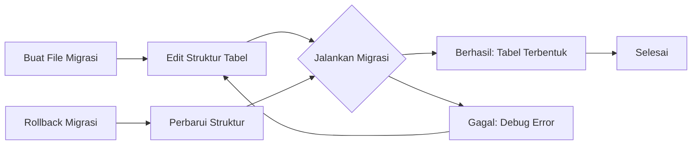

# Tutorial: Membuat Migrasi Database untuk Tabel Mahasiswa

Migrasi database adalah fitur Laravel yang memungkinkan Anda mengelola struktur database aplikasi dengan mudah dan terstruktur. Dalam tutorial ini, kita akan belajar cara membuat migrasi untuk tabel Mahasiswa dalam aplikasi mahasiswa-app.

## Diagram Alur Migrasi di Laravel



## 1. Pengenalan Migrasi Database Laravel

Migrasi database di Laravel adalah seperti version control untuk database Anda. Migrasi memungkinkan Anda dan tim Anda untuk:

1. Mendefinisikan dan berbagi struktur database aplikasi
2. Mengubah struktur database dengan mudah dan aman
3. Melacak perubahan pada skema database dari waktu ke waktu
4. Memudahkan deployment pada berbagai lingkungan (development, testing, production)

## 2. Membuat File Migrasi

### Langkah 1: Buat File Migrasi dengan Artisan CLI

Gunakan perintah berikut di terminal:

```bash
php artisan make:migration create_mahasiswa_table
```

Perintah ini akan membuat file migrasi baru di direktori `database/migrations` dengan format nama `[timestamp]_create_mahasiswa_table.php`.

### Langkah 2: Struktur Dasar File Migrasi

File migrasi yang dihasilkan akan terlihat seperti ini:

```php
<?php

use Illuminate\Database\Migrations\Migration;
use Illuminate\Database\Schema\Blueprint;
use Illuminate\Support\Facades\Schema;

class CreateMahasiswaTable extends Migration
{
    /**
     * Run the migrations.
     *
     * @return void
     */
    public function up()
    {
        Schema::create('mahasiswa', function (Blueprint $table) {
            $table->id();
            $table->timestamps();
        });
    }

    /**
     * Reverse the migrations.
     *
     * @return void
     */
    public function down()
    {
        Schema::dropIfExists('mahasiswa');
    }
}
```

Setiap file migrasi berisi dua metode utama:
- `up()`: Dijalankan saat migrasi diterapkan (menambah tabel, kolom, dll)
- `down()`: Dijalankan saat migrasi dibatalkan (menghapus tabel, kolom, dll)

## 3. Menentukan Struktur Tabel Mahasiswa

### Langkah 1: Edit File Migrasi

Buka file migrasi yang baru dibuat dan ubah metode `up()` untuk mendefinisikan struktur tabel Mahasiswa:

```php
public function up()
{
    Schema::create('mahasiswa', function (Blueprint $table) {
        $table->id();                              // Kolom ID otomatis
        $table->string('nim', 20)->unique();       // NIM mahasiswa (unique)
        $table->string('nama', 100);               // Nama lengkap mahasiswa
        $table->string('email')->unique();         // Email (unique)
        $table->enum('jenis_kelamin', ['L', 'P']); // Jenis kelamin (L/P)
        $table->unsignedBigInteger('jurusan_id');  // Foreign key ke jurusan
        $table->text('alamat')->nullable();        // Alamat (opsional)
        $table->string('no_telp', 15)->nullable(); // No telepon (opsional)
        $table->timestamps();                      // created_at & updated_at
        
        // Menambahkan foreign key constraint
        $table->foreign('jurusan_id')
              ->references('id')
              ->on('jurusan')
              ->onDelete('cascade'); // Hapus mahasiswa jika jurusan dihapus
    });
}
```

## 4. Jenis Kolom yang Sering Digunakan

Selain tipe kolom yang digunakan di atas, Laravel menyediakan berbagai tipe data untuk kolom:

```php
// Tipe Numerik
$table->bigInteger('nomor_induk');    // BIGINT
$table->integer('angkatan');          // INTEGER
$table->smallInteger('semester');     // SMALLINT
$table->tinyInteger('status');        // TINYINT
$table->decimal('ipk', 3, 2);         // DECIMAL dengan 3 digit dan 2 desimal (misal 3.85)
$table->float('nilai');               // FLOAT

// Tipe Teks
$table->char('kode', 5);              // CHAR panjang tetap
$table->string('nama', 100);          // VARCHAR dengan panjang 100
$table->text('biografi');             // TEXT
$table->mediumText('esai');           // MEDIUMTEXT
$table->longText('penelitian');       // LONGTEXT

// Tipe Tanggal dan Waktu
$table->date('tanggal_lahir');        // DATE
$table->time('jam_masuk');            // TIME
$table->dateTime('waktu_ujian');      // DATETIME
$table->timestamp('login_at');        // TIMESTAMP
$table->year('tahun_masuk');          // YEAR

// Tipe Boolean
$table->boolean('aktif');             // BOOLEAN (TINYINT(1))

// Tipe Khusus
$table->json('preferensi');           // JSON
$table->binary('file');               // BLOB
$table->uuid('identifier');           // UUID
```

## 5. Modifikasi Kolom

Anda dapat menambahkan modifikasi ke kolom untuk berbagai keperluan:

```php
$table->string('nim')->unique();        // Kolom harus memiliki nilai unik
$table->text('alamat')->nullable();     // Kolom boleh kosong (NULL)
$table->integer('sks')->default(20);    // Nilai default jika tidak diisi
$table->timestamp('logged_at')->useCurrent(); // Nilai default: waktu sekarang
$table->softDeletes();                  // Tambahkan kolom deleted_at untuk soft deletes
```

## 6. Menjalankan Migrasi

### Langkah 1: Memastikan Database Terhubung

Pastikan database sudah dikonfigurasi dengan benar di file `.env`:

```
DB_CONNECTION=mysql
DB_HOST=127.0.0.1
DB_PORT=3306
DB_DATABASE=mahasiswa_app
DB_USERNAME=root
DB_PASSWORD=
```

### Langkah 2: Menjalankan Migrasi

Jalankan perintah berikut untuk menerapkan migrasi:

```bash
php artisan migrate
```

Laravel akan menjalankan semua file migrasi yang belum diterapkan dan membuat tabel yang telah didefinisikan.

## 7. Memodifikasi Tabel yang Sudah Ada

### Cara 1: Membuat Migrasi Baru

Jika Anda perlu menambahkan kolom ke tabel yang sudah ada:

```bash
php artisan make:migration add_foto_to_mahasiswa_table
```

Edit file migrasi:

```php
public function up()
{
    Schema::table('mahasiswa', function (Blueprint $table) {
        $table->string('foto')->nullable()->after('nama');
    });
}

public function down()
{
    Schema::table('mahasiswa', function (Blueprint $table) {
        $table->dropColumn('foto');
    });
}
```

### Cara 2: Menggunakan Fresh Migration (Reset Database)

**Perhatian**: Perintah ini akan menghapus semua tabel dan data:

```bash
php artisan migrate:fresh
```

Untuk mempertahankan data sambil memperbarui struktur:

```bash
php artisan migrate:refresh
```

## 8. Migrasi untuk Tabel Terkait Mahasiswa

### Membuat Migrasi untuk Tabel Jurusan

Karena tabel Mahasiswa memiliki foreign key ke tabel Jurusan, kita harus membuat dan menjalankan migrasi untuk tabel Jurusan terlebih dahulu:

```bash
php artisan make:migration create_jurusan_table
```

Edit file migrasi Jurusan:

```php
public function up()
{
    Schema::create('jurusan', function (Blueprint $table) {
        $table->id();
        $table->string('nama', 100);
        $table->string('kode', 10)->unique();
        $table->text('deskripsi')->nullable();
        $table->timestamps();
    });
}
```

### Membuat Migrasi untuk Tabel Relasional (Many-to-Many)

Jika mahasiswa dapat mengambil banyak mata kuliah, kita perlu tabel pivot:

```bash
php artisan make:migration create_mahasiswa_matakuliah_table
```

Edit file migrasi:

```php
public function up()
{
    Schema::create('mahasiswa_matakuliah', function (Blueprint $table) {
        $table->id();
        $table->unsignedBigInteger('mahasiswa_id');
        $table->unsignedBigInteger('matakuliah_id');
        $table->integer('nilai')->nullable();
        $table->timestamps();
        
        $table->foreign('mahasiswa_id')->references('id')->on('mahasiswa');
        $table->foreign('matakuliah_id')->references('id')->on('matakuliah');
        
        // Memastikan tidak ada duplikasi mahasiswa-matakuliah
        $table->unique(['mahasiswa_id', 'matakuliah_id']);
    });
}
```

## 9. Mengurutkan Migrasi

Laravel menjalankan migrasi berdasarkan urutan timestamp. Jika Anda memiliki dependensi antar tabel (foreign key), pastikan untuk menjalankan migrasi tabel referensi terlebih dahulu:

1. Tabel `jurusan` (tidak memiliki foreign key)
2. Tabel `matakuliah` (tidak memiliki foreign key)
3. Tabel `mahasiswa` (memiliki foreign key ke `jurusan`)
4. Tabel `mahasiswa_matakuliah` (memiliki foreign key ke `mahasiswa` dan `matakuliah`)

## 10. Praktik: Membuat Migrasi Lengkap untuk Aplikasi Mahasiswa

Berikut adalah langkah-langkah untuk membuat semua migrasi yang diperlukan untuk aplikasi manajemen mahasiswa:

1. Buat dan jalankan migrasi untuk tabel `jurusan`:
   ```bash
   php artisan make:migration create_jurusan_table
   # Edit file migrasi
   php artisan migrate
   ```

2. Buat dan jalankan migrasi untuk tabel `matakuliah`:
   ```bash
   php artisan make:migration create_matakuliah_table
   # Edit file migrasi
   php artisan migrate
   ```

3. Buat dan jalankan migrasi untuk tabel `mahasiswa`:
   ```bash
   php artisan make:migration create_mahasiswa_table
   # Edit file migrasi
   php artisan migrate
   ```

4. Buat dan jalankan migrasi untuk tabel pivot `mahasiswa_matakuliah`:
   ```bash
   php artisan make:migration create_mahasiswa_matakuliah_table
   # Edit file migrasi
   php artisan migrate
   ```

## Kesimpulan

Migrasi database di Laravel memberikan cara yang elegan dan terstruktur untuk mengelola skema database aplikasi Anda. Dengan menggunakan migrasi, Anda dapat:

1. Mendokumentasikan perubahan database dengan jelas
2. Memudahkan kolaborasi antar developer
3. Memastikan konsistensi struktur database di semua lingkungan
4. Menerapkan dan membatalkan perubahan database dengan mudah

Untuk aplikasi mahasiswa-app, migrasi database memungkinkan kita untuk membuat struktur data yang sesuai untuk menyimpan informasi mahasiswa, jurusan, mata kuliah, dan relasi antar entitas tersebut.

Setelah migrasi selesai dibuat dan dijalankan, Anda siap untuk melanjutkan ke tahap berikutnya: membuat model Eloquent untuk berinteraksi dengan tabel-tabel tersebut.