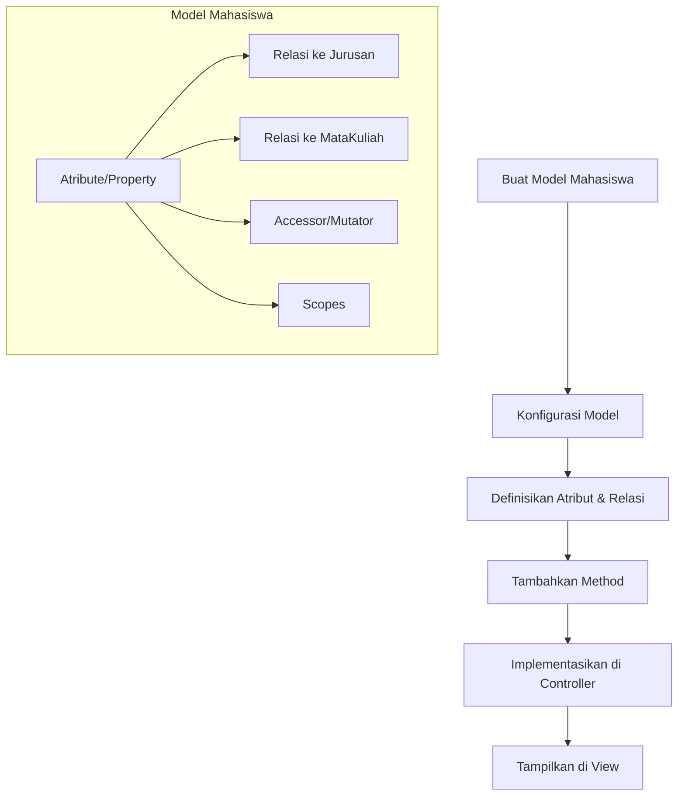

# Implementasi Model Mahasiswa di Laravel

Model merupakan komponen penting dalam arsitektur MVC Laravel yang berfungsi sebagai perantara antara aplikasi dan database. Pada tutorial ini, kita akan belajar cara mengimplementasikan model Mahasiswa untuk aplikasi manajemen data mahasiswa.

## Diagram Alur Implementasi Model



## 1. Membuat Model Mahasiswa

### Langkah 1: Membuat Model dengan Artisan CLI

Gunakan perintah Artisan berikut untuk membuat model Mahasiswa:

```bash
php artisan make:model Mahasiswa
```

Untuk membuat model beserta migrasi, controller, dan resource dalam satu perintah:

```bash
php artisan make:model Mahasiswa -mcr
```

Flag `-m` akan membuat migrasi, `-c` akan membuat controller, dan `-r` akan membuat controller dengan resource methods (index, create, store, dll).

### Langkah 2: Struktur Model yang Dihasilkan

Perintah di atas akan menghasilkan file `app/Models/Mahasiswa.php` dengan kode dasar seperti berikut:

```php
<?php

namespace App\Models;

use Illuminate\Database\Eloquent\Factories\HasFactory;
use Illuminate\Database\Eloquent\Model;

class Mahasiswa extends Model
{
    use HasFactory;
}
```

## 2. Mengonfigurasi Model Mahasiswa

### Langkah 1: Tentukan Nama Tabel

Secara default, Laravel akan menggunakan bentuk jamak (plural) dari nama model sebagai nama tabel. Untuk model Mahasiswa, Laravel akan mencari tabel bernama `mahasiswas`. Jika tabel Anda bernama `mahasiswa` (tanpa 's'), maka perlu menentukan nama tabel secara eksplisit:

```php
class Mahasiswa extends Model
{
    use HasFactory;
    
    // Tentukan nama tabel yang digunakan
    protected $table = 'mahasiswa';
}
```

### Langkah 2: Tetapkan Primary Key

Secara default, Laravel menggunakan kolom `id` sebagai primary key. Jika primary key Anda berbeda:

```php
class Mahasiswa extends Model
{
    use HasFactory;
    
    protected $table = 'mahasiswa';
    protected $primaryKey = 'mahasiswa_id'; // Jika primary key bukan 'id'
}
```

### Langkah 3: Konfigurasi Timestamps

Laravel secara otomatis akan mengisi kolom `created_at` dan `updated_at` saat data disimpan atau diperbarui. Jika tabel Anda tidak memiliki kolom ini atau Anda tidak ingin menggunakannya:

```php
class Mahasiswa extends Model
{
    use HasFactory;
    
    protected $table = 'mahasiswa';
    public $timestamps = false; // Nonaktifkan fitur timestamps
}
```

### Langkah 4: Tentukan Fillable atau Guarded Properties

Untuk keamanan, Laravel membatasi kolom mana yang dapat diisi secara massal menggunakan metode `create()` atau `update()`. Ada dua cara untuk mengonfigurasinya:

1. **$fillable**: menentukan kolom yang boleh diisi
```php
protected $fillable = [
    'nim', 'nama', 'email', 'jenis_kelamin', 'jurusan_id', 'alamat', 'no_telp'
];
```

2. **$guarded**: menentukan kolom yang tidak boleh diisi
```php
protected $guarded = ['id', 'created_at', 'updated_at'];
```

Biasanya lebih aman menggunakan `$fillable` karena hanya kolom yang Anda tentukan yang dapat diisi secara massal.

## 3. Mendefinisikan Relasi Antar Model

### Langkah 1: Relasi dengan Jurusan (Belongs To)

Setiap mahasiswa terkait dengan satu jurusan, jadi kita perlu mendefinisikan relasi `belongsTo`:

```php
public function jurusan()
{
    return $this->belongsTo(Jurusan::class);
}
```

Jika nama kolom foreign key bukan `jurusan_id`:

```php
public function jurusan()
{
    return $this->belongsTo(Jurusan::class, 'id_jurusan');
}
```

### Langkah 2: Relasi dengan Mata Kuliah (Many to Many)

Setiap mahasiswa dapat mengambil banyak mata kuliah, dan setiap mata kuliah dapat diambil oleh banyak mahasiswa. Ini adalah relasi many-to-many yang memerlukan tabel pivot:

```php
public function matakuliah()
{
    return $this->belongsToMany(MataKuliah::class, 'mahasiswa_matakuliah')
                ->withPivot('nilai')
                ->withTimestamps();
}
```

Konfigurasi di atas mengasumsikan bahwa:
- Tabel pivot bernama `mahasiswa_matakuliah`
- Tabel pivot memiliki kolom tambahan `nilai` yang ingin diakses
- Tabel pivot memiliki kolom timestamps (`created_at` dan `updated_at`)

## 4. Menambahkan Accessor dan Mutator

Accessor dan mutator memungkinkan Anda mengubah format data saat diambil dari atau disimpan ke database.

### Langkah 1: Accessor (Format Data saat Diambil)

```php
// Accessor untuk menampilkan nama dalam format huruf kapital
public function getNamaAttribute($value)
{
    return strtoupper($value);
}

// Accessor untuk membuat attribute virtual (tidak ada di database)
public function getNamaLengkapAttribute()
{
    return $this->nim . ' - ' . $this->nama;
}
```

Accessor pertama akan mengubah nilai kolom `nama` menjadi huruf kapital saat diakses. Accessor kedua membuat atribut virtual `nama_lengkap` yang dapat diakses seperti `$mahasiswa->nama_lengkap`.

### Langkah 2: Mutator (Format Data sebelum Disimpan)

```php
// Mutator untuk mengubah nama menjadi format title case sebelum disimpan
public function setNamaAttribute($value)
{
    $this->attributes['nama'] = ucwords(strtolower($value));
}

// Mutator untuk mengubah email menjadi lowercase sebelum disimpan
public function setEmailAttribute($value)
{
    $this->attributes['email'] = strtolower($value);
}
```

## 5. Menambahkan Query Scopes

Query scopes memungkinkan Anda mendefinisikan batasan query yang dapat digunakan kembali:

```php
// Scope untuk mahasiswa aktif
public function scopeAktif($query)
{
    return $query->where('status', 'aktif');
}

// Scope untuk filter berdasarkan jurusan
public function scopeJurusan($query, $jurusanId)
{
    return $query->where('jurusan_id', $jurusanId);
}

// Scope untuk pencarian berdasarkan nama atau nim
public function scopeCari($query, $keyword)
{
    return $query->where('nama', 'like', "%{$keyword}%")
                 ->orWhere('nim', 'like', "%{$keyword}%");
}
```

Scopes ini dapat digunakan pada query seperti:

```php
$mahasiswaAktif = Mahasiswa::aktif()->get();
$mahasiswaTI = Mahasiswa::jurusan(1)->get();
$hasilPencarian = Mahasiswa::cari('Budi')->get();
```

## 6. Implementasi Model Mahasiswa Lengkap

Berikut implementasi lengkap model Mahasiswa dengan semua konfigurasi di atas:

```php
<?php

namespace App\Models;

use Illuminate\Database\Eloquent\Factories\HasFactory;
use Illuminate\Database\Eloquent\Model;

class Mahasiswa extends Model
{
    use HasFactory;
    
    // Konfigurasi dasar
    protected $table = 'mahasiswa';
    protected $fillable = [
        'nim', 'nama', 'email', 'jenis_kelamin', 'jurusan_id', 
        'alamat', 'no_telp', 'status'
    ];
    
    // Relasi
    public function jurusan()
    {
        return $this->belongsTo(Jurusan::class);
    }
    
    public function matakuliah()
    {
        return $this->belongsToMany(MataKuliah::class, 'mahasiswa_matakuliah')
                    ->withPivot('nilai')
                    ->withTimestamps();
    }
    
    // Accessor
    public function getNamaLengkapAttribute()
    {
        return $this->nim . ' - ' . $this->nama;
    }
    
    // Mutator
    public function setNamaAttribute($value)
    {
        $this->attributes['nama'] = ucwords(strtolower($value));
    }
    
    public function setEmailAttribute($value)
    {
        $this->attributes['email'] = strtolower($value);
    }
    
    // Query Scopes
    public function scopeAktif($query)
    {
        return $query->where('status', 'aktif');
    }
    
    public function scopeJurusan($query, $jurusanId)
    {
        return $query->where('jurusan_id', $jurusanId);
    }
    
    public function scopeCari($query, $keyword)
    {
        return $query->where('nama', 'like', "%{$keyword}%")
                     ->orWhere('nim', 'like', "%{$keyword}%");
    }
}
```

## 7. Menggunakan Model Mahasiswa

### Langkah 1: Menyimpan Data Mahasiswa Baru

```php
// Di dalam controller
public function store(Request $request)
{
    $validatedData = $request->validate([
        'nim' => 'required|unique:mahasiswa,nim',
        'nama' => 'required|string|max:100',
        'email' => 'required|email|unique:mahasiswa,email',
        'jenis_kelamin' => 'required|in:L,P',
        'jurusan_id' => 'required|exists:jurusan,id',
        'alamat' => 'nullable|string',
        'no_telp' => 'nullable|string|max:15',
    ]);
    
    $mahasiswa = Mahasiswa::create($validatedData);
    
    return redirect()->route('mahasiswa.index')
                     ->with('success', 'Data mahasiswa berhasil ditambahkan.');
}
```

### Langkah 2: Mengambil Data Mahasiswa dengan Relasi

```php
// Di dalam controller
public function index()
{
    // Eager loading relasi jurusan untuk optimasi query
    $mahasiswa = Mahasiswa::with('jurusan')->get();
    
    return view('mahasiswa.index', compact('mahasiswa'));
}

public function show($id)
{
    // Ambil mahasiswa beserta jurusan dan mata kuliah yang diambil
    $mahasiswa = Mahasiswa::with(['jurusan', 'matakuliah'])
                           ->findOrFail($id);
    
    return view('mahasiswa.show', compact('mahasiswa'));
}
```

### Langkah 3: Mengambil Data dengan Query Scopes

```php
// Di dalam controller
public function search(Request $request)
{
    $keyword = $request->input('keyword');
    $jurusanId = $request->input('jurusan_id');
    
    $query = Mahasiswa::with('jurusan');
    
    if ($keyword) {
        $query->cari($keyword);
    }
    
    if ($jurusanId) {
        $query->jurusan($jurusanId);
    }
    
    $mahasiswa = $query->paginate(10);
    
    return view('mahasiswa.index', compact('mahasiswa'));
}
```

### Langkah 4: Mengakses Relasi di View

```php
<!-- Di dalam view blade -->
@foreach($mahasiswa as $mhs)
    <tr>
        <td>{{ $mhs->nim }}</td>
        <td>{{ $mhs->nama }}</td>
        <td>{{ $mhs->jurusan->nama }}</td>
        <td>{{ $mhs->email }}</td>
    </tr>
@endforeach
```

### Langkah 5: Mengakses Data pivot (Many to Many)

```php
<!-- Di dalam view detail mahasiswa -->
<h3>Mata Kuliah yang Diambil:</h3>
<ul>
    @foreach($mahasiswa->matakuliah as $mk)
        <li>
            {{ $mk->kode }} - {{ $mk->nama }}
            @if($mk->pivot->nilai)
                (Nilai: {{ $mk->pivot->nilai }})
            @endif
        </li>
    @endforeach
</ul>
```

## 8. Praktik: Implementasi Model Mahasiswa

Setelah mempelajari cara mengimplementasikan model Mahasiswa, cobalah latihan berikut:

1. Buat model Mahasiswa dengan relasi ke Jurusan dan MataKuliah
2. Tambahkan accessor untuk menampilkan jenis kelamin dalam format lengkap (L -> Laki-laki, P -> Perempuan)
3. Tambahkan scope untuk memfilter mahasiswa berdasarkan angkatan (dari NIM)
4. Implementasikan fungsi CRUD lengkap untuk data mahasiswa di controller

## Kesimpulan

Implementasi model Mahasiswa di Laravel memberikan abstraksi yang kuat untuk berinteraksi dengan data mahasiswa di database. Dengan mendefinisikan relasi, accessor/mutator, dan query scopes, kita dapat membuat kode yang lebih bersih, mudah dibaca, dan efisien.

Model ini menjadi fondasi untuk membangun fitur-fitur aplikasi manajemen mahasiswa seperti:
- Pendaftaran mahasiswa baru
- Pencarian dan filtering data mahasiswa
- Pengambilan mata kuliah oleh mahasiswa
- Pengelolaan nilai mahasiswa

Setelah mengimplementasikan model Mahasiswa dengan benar, langkah selanjutnya adalah membuat controller dan view untuk menampilkan dan mengelola data mahasiswa melalui antarmuka web.