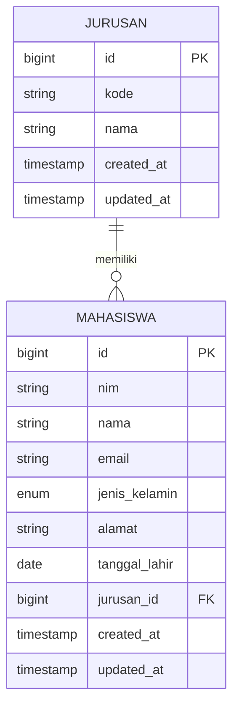

# Tutorial Eloquent ORM Dasar pada Laravel

Eloquent ORM (Object-Relational Mapping) adalah fitur Laravel yang memungkinkan kita berinteraksi dengan database secara lebih intuitif melalui model. Berikut langkah-langkah dasar untuk memahami dan menggunakan Eloquent ORM dalam konteks aplikasi mahasiswa.

## Apa itu Eloquent ORM?

Eloquent adalah implementasi Laravel dari pola Active Record, yang memungkinkan kita:
- Memetakan tabel database ke model/kelas PHP
- Melakukan operasi database tanpa menulis query SQL secara langsung
- Mendefinisikan relasi antar model dengan mudah

## Langkah 1: Membuat Model Mahasiswa

```bash
php artisan make:model Mahasiswa -m
```

Command di atas akan membuat:
- File model `Mahasiswa.php` di direktori `app/Models/`
- File migrasi untuk tabel mahasiswa di `database/migrations/`

## Langkah 2: Mendefinisikan Struktur Tabel melalui Migrasi

Buka file migrasi yang baru dibuat dan definisikan struktur tabel:

```php
public function up()
{
    Schema::create('mahasiswas', function (Blueprint $table) {
        $table->id();
        $table->string('nim', 20)->unique();
        $table->string('nama', 100);
        $table->string('email')->unique();
        $table->enum('jenis_kelamin', ['L', 'P']);
        $table->string('alamat')->nullable();
        $table->date('tanggal_lahir');
        $table->unsignedBigInteger('jurusan_id');
        $table->timestamps();
        
        $table->foreign('jurusan_id')->references('id')->on('jurusans');
    });
}
```

## Langkah 3: Mendefinisikan Model Mahasiswa

Buka file `app/Models/Mahasiswa.php` dan ubah kodenya:

```php
<?php

namespace App\Models;

use Illuminate\Database\Eloquent\Factories\HasFactory;
use Illuminate\Database\Eloquent\Model;

class Mahasiswa extends Model
{
    use HasFactory;
    
    // Definisikan kolom yang boleh diisi massal
    protected $fillable = [
        'nim', 
        'nama', 
        'email', 
        'jenis_kelamin', 
        'alamat', 
        'tanggal_lahir',
        'jurusan_id'
    ];
    
    // Definisikan relasi dengan Jurusan
    public function jurusan()
    {
        return $this->belongsTo(Jurusan::class);
    }
    
    // Definisikan relasi dengan MataKuliah (akan diimplementasikan nanti)
    public function mataKuliahs()
    {
        return $this->belongsToMany(MataKuliah::class);
    }
}
```

## Langkah 4: Membuat Model Jurusan

```bash
php artisan make:model Jurusan -m
```

Edit file migrasi untuk Jurusan:

```php
public function up()
{
    Schema::create('jurusans', function (Blueprint $table) {
        $table->id();
        $table->string('kode', 10)->unique();
        $table->string('nama', 100);
        $table->timestamps();
    });
}
```

Edit model Jurusan:

```php
<?php

namespace App\Models;

use Illuminate\Database\Eloquent\Factories\HasFactory;
use Illuminate\Database\Eloquent\Model;

class Jurusan extends Model
{
    use HasFactory;
    
    protected $fillable = ['kode', 'nama'];
    
    public function mahasiswas()
    {
        return $this->hasMany(Mahasiswa::class);
    }
}
```

## Langkah 5: Menjalankan Migrasi

Jalankan migrasi untuk membuat tabel di database:

```bash
php artisan migrate
```

## Langkah 6: Operasi CRUD dengan Eloquent

### Menyimpan Data (Create)

```php
// Di dalam controller
public function store(Request $request)
{
    $mahasiswa = Mahasiswa::create([
        'nim' => $request->nim,
        'nama' => $request->nama,
        'email' => $request->email,
        'jenis_kelamin' => $request->jenis_kelamin,
        'alamat' => $request->alamat,
        'tanggal_lahir' => $request->tanggal_lahir,
        'jurusan_id' => $request->jurusan_id
    ]);
    
    return redirect()->route('mahasiswa.index')->with('success', 'Data mahasiswa berhasil disimpan');
}
```

### Membaca Data (Read)

```php
// Mengambil semua data mahasiswa
$mahasiswas = Mahasiswa::all();

// Mengambil data mahasiswa dengan pagination
$mahasiswas = Mahasiswa::paginate(10);

// Mencari mahasiswa berdasarkan ID
$mahasiswa = Mahasiswa::find(1);

// Mencari mahasiswa berdasarkan NIM (akan menghasilkan error jika tidak ditemukan)
$mahasiswa = Mahasiswa::where('nim', '12345678')->firstOrFail();

// Mencari mahasiswa beserta data jurusan (eager loading)
$mahasiswa = Mahasiswa::with('jurusan')->find(1);
```

### Memperbarui Data (Update)

```php
// Cara 1: Menggunakan metode update
$mahasiswa = Mahasiswa::find(1);
$mahasiswa->update([
    'nama' => 'Nama Baru',
    'email' => 'email.baru@gmail.com'
]);

// Cara 2: Mengubah properti model
$mahasiswa = Mahasiswa::find(1);
$mahasiswa->nama = 'Nama Baru';
$mahasiswa->email = 'email.baru@gmail.com';
$mahasiswa->save();
```

### Menghapus Data (Delete)

```php
// Menghapus berdasarkan ID
$mahasiswa = Mahasiswa::find(1);
$mahasiswa->delete();

// Atau menghapus langsung
Mahasiswa::destroy(1);

// Menghapus beberapa data sekaligus
Mahasiswa::destroy([1, 2, 3]);
```

## Langkah 7: Query Builder Lanjutan

### Filter dan Pengurutan

```php
// Mencari mahasiswa berdasarkan jurusan
$mahasiswas = Mahasiswa::where('jurusan_id', 1)->get();

// Mencari mahasiswa laki-laki dan urut berdasarkan nama
$mahasiswas = Mahasiswa::where('jenis_kelamin', 'L')
                     ->orderBy('nama', 'asc')
                     ->get();

// Mencari mahasiswa dengan kata kunci di nama
$keyword = 'Budi';
$mahasiswas = Mahasiswa::where('nama', 'like', "%$keyword%")->get();
```

### Penggunaan Relasi

```php
// Mendapatkan data jurusan dari mahasiswa
$mahasiswa = Mahasiswa::find(1);
$jurusan = $mahasiswa->jurusan;
echo $jurusan->nama;

// Mendapatkan semua mahasiswa dari jurusan tertentu
$jurusan = Jurusan::find(1);
$mahasiswas = $jurusan->mahasiswas;
```

## Diagram Relasi Mahasiswa dan Jurusan



## Ringkasan Eloquent ORM

1. **Model**: Representasi tabel database dalam bentuk kelas PHP
2. **Migrasi**: Definisi struktur tabel yang versi kontrolnya dikelola Laravel
3. **Relasi**: Definisi hubungan antar model (hasMany, belongsTo, dll)
4. **Query Builder**: Metode untuk melakukan operasi CRUD tanpa menulis SQL
5. **Eager Loading**: Teknik untuk mengurangi N+1 query problem dengan `with()`

Dengan memahami dasar-dasar Eloquent ORM ini, Anda dapat mengelola data mahasiswa dengan efisien dalam aplikasi Laravel. Eloquent membuat operasi database menjadi lebih intuitif dan ekspresif, sehingga Anda dapat fokus pada logika bisnis aplikasi.