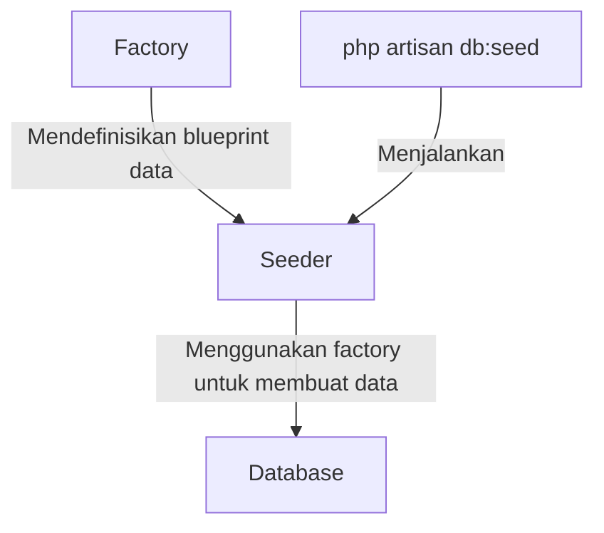

# Seeder dan Factory untuk Data Dummy pada Laravel

Seeder dan Factory adalah fitur Laravel yang memudahkan kita untuk mengisi database dengan data testing atau dummy. Fitur ini sangat berguna untuk pengembangan dan testing aplikasi. Mari kita pelajari cara menggunakannya dalam aplikasi mahasiswa kita.

## Mengapa Membutuhkan Data Dummy?

- Mempercepat proses pengembangan aplikasi
- Menguji fungsionalitas tanpa perlu input data manual
- Memastikan aplikasi berfungsi dengan beragam data
- Memudahkan demonstrasi fitur aplikasi

## Cara Kerja Seeder dan Factory



## Langkah 1: Membuat Model Factory

Factory adalah blueprint yang mendefinisikan bagaimana data dummy untuk model tertentu seharusnya dibuat.

```bash
php artisan make:factory JurusanFactory --model=Jurusan
php artisan make:factory MahasiswaFactory --model=Mahasiswa
```

## Langkah 2: Mendefinisikan Factory untuk Jurusan

Edit file `database/factories/JurusanFactory.php`:

```php
<?php

namespace Database\Factories;

use App\Models\Jurusan;
use Illuminate\Database\Eloquent\Factories\Factory;

class JurusanFactory extends Factory
{
    protected $model = Jurusan::class;

    public function definition()
    {
        // Data jurusan yang realistis
        $jurusanList = [
            ['kode' => 'TI', 'nama' => 'Teknik Informatika'],
            ['kode' => 'SI', 'nama' => 'Sistem Informasi'],
            ['kode' => 'TK', 'nama' => 'Teknik Komputer'],
            ['kode' => 'MI', 'nama' => 'Manajemen Informatika'],
            ['kode' => 'AK', 'nama' => 'Akuntansi'],
            ['kode' => 'MN', 'nama' => 'Manajemen'],
        ];
        
        // Ambil satu secara acak
        $jurusan = $this->faker->unique()->randomElement($jurusanList);
        
        return [
            'kode' => $jurusan['kode'],
            'nama' => $jurusan['nama'],
        ];
    }
}
```

## Langkah 3: Mendefinisikan Factory untuk Mahasiswa

Edit file `database/factories/MahasiswaFactory.php`:

```php
<?php

namespace Database\Factories;

use App\Models\Jurusan;
use App\Models\Mahasiswa;
use Illuminate\Database\Eloquent\Factories\Factory;

class MahasiswaFactory extends Factory
{
    protected $model = Mahasiswa::class;

    public function definition()
    {
        // Daftar jurusan yang tersedia (akan digunakan untuk mengambil ID)
        $jurusanIds = Jurusan::pluck('id')->toArray();
        
        // Jika belum ada jurusan, buat satu
        if (empty($jurusanIds)) {
            $jurusan = Jurusan::factory()->create();
            $jurusanIds = [$jurusan->id];
        }
        
        // Tentukan jenis kelamin secara acak
        $gender = $this->faker->randomElement(['L', 'P']);
        
        // Tentukan nama depan berdasarkan jenis kelamin
        $firstName = $gender === 'L' ? 
            $this->faker->firstNameMale() : 
            $this->faker->firstNameFemale();
        
        // Gabungkan dengan nama belakang
        $fullName = $firstName . ' ' . $this->faker->lastName();
        
        // Generate NIM dengan format tahun + kode jurusan + 5 digit angka random
        $nim = '20' . $this->faker->numberBetween(18, 23) . 
               $this->faker->randomElement(['01', '02', '03', '04', '05', '06']) . 
               $this->faker->unique()->randomNumber(5, true);
        
        return [
            'nim' => $nim,
            'nama' => $fullName,
            'email' => $this->faker->unique()->safeEmail(),
            'jenis_kelamin' => $gender,
            'alamat' => $this->faker->address(),
            'tanggal_lahir' => $this->faker->date('Y-m-d', '-18 years'),
            'jurusan_id' => $this->faker->randomElement($jurusanIds),
        ];
    }
}
```

## Langkah 4: Membuat Seeder untuk Jurusan

```bash
php artisan make:seeder JurusanSeeder
```

Edit file `database/seeders/JurusanSeeder.php`:

```php
<?php

namespace Database\Seeders;

use App\Models\Jurusan;
use Illuminate\Database\Seeder;

class JurusanSeeder extends Seeder
{
    public function run()
    {
        // Buat 6 jurusan dengan factory
        Jurusan::factory()->count(6)->create();
        
        // Atau, jika ingin data yang lebih terkontrol:
        /*
        $jurusans = [
            ['kode' => 'TI', 'nama' => 'Teknik Informatika'],
            ['kode' => 'SI', 'nama' => 'Sistem Informasi'],
            ['kode' => 'TK', 'nama' => 'Teknik Komputer'],
            ['kode' => 'MI', 'nama' => 'Manajemen Informatika'],
            ['kode' => 'AK', 'nama' => 'Akuntansi'],
            ['kode' => 'MN', 'nama' => 'Manajemen'],
        ];
        
        foreach ($jurusans as $jurusan) {
            Jurusan::create($jurusan);
        }
        */
    }
}
```

## Langkah 5: Membuat Seeder untuk Mahasiswa

```bash
php artisan make:seeder MahasiswaSeeder
```

Edit file `database/seeders/MahasiswaSeeder.php`:

```php
<?php

namespace Database\Seeders;

use App\Models\Mahasiswa;
use Illuminate\Database\Seeder;

class MahasiswaSeeder extends Seeder
{
    public function run()
    {
        // Buat 50 data mahasiswa
        Mahasiswa::factory()->count(50)->create();
    }
}
```

## Langkah 6: Mendaftarkan Seeder di DatabaseSeeder

Edit file `database/seeders/DatabaseSeeder.php`:

```php
<?php

namespace Database\Seeders;

use Illuminate\Database\Seeder;

class DatabaseSeeder extends Seeder
{
    public function run()
    {
        // Tentukan urutan pemanggilan seeder
        // Jurusan harus dibuat lebih dulu karena Mahasiswa membutuhkan jurusan_id
        $this->call([
            JurusanSeeder::class,
            MahasiswaSeeder::class,
        ]);
    }
}
```

## Langkah 7: Menjalankan Seeder

### Untuk Menjalankan Semua Seeder

```bash
php artisan db:seed
```

### Untuk Menjalankan Seeder Tertentu

```bash
php artisan db:seed --class=JurusanSeeder
php artisan db:seed --class=MahasiswaSeeder
```

### Untuk Menjalankan Migrasi dan Seeder Sekaligus (Fresh Install)

```bash
php artisan migrate:fresh --seed
```

## Langkah 8: Menggunakan Factory di Aplikasi (Opsional)

Factory tidak hanya berguna untuk seeding database, tapi juga bisa digunakan dalam testing atau pembuatan data dummy pada saat runtime.

### Contoh Penggunaan dalam Testing

```php
use App\Models\Mahasiswa;

// Membuat satu instance Mahasiswa tanpa menyimpan ke database
$mahasiswa = Mahasiswa::factory()->make();

// Membuat dan menyimpan satu Mahasiswa ke database
$mahasiswa = Mahasiswa::factory()->create();

// Membuat 5 Mahasiswa dengan jurusan_id yang sama
$mahasiswas = Mahasiswa::factory()
                    ->count(5)
                    ->create(['jurusan_id' => 1]);

// Membuat data dengan relasi (akan membuat Jurusan terlebih dahulu)
$mahasiswa = Mahasiswa::factory()
                    ->for(Jurusan::factory()->state([
                        'kode' => 'TI',
                        'nama' => 'Teknik Informatika'
                    ]))
                    ->create();
```

## Langkah 9: Membuat Seeder untuk Tabel Pivot (Bila Ada)

Jika kita memiliki relasi Many-to-Many antara Mahasiswa dan MataKuliah, kita perlu seeder untuk tabel pivot.

```php
<?php

namespace Database\Seeders;

use App\Models\Mahasiswa;
use App\Models\MataKuliah;
use Illuminate\Database\Seeder;

class MahasiswaMataKuliahSeeder extends Seeder
{
    public function run()
    {
        // Ambil semua mahasiswa dan mata kuliah
        $mahasiswas = Mahasiswa::all();
        $mataKuliahs = MataKuliah::all();
        
        // Untuk setiap mahasiswa, tetapkan beberapa mata kuliah secara acak
        foreach ($mahasiswas as $mahasiswa) {
            // Ambil 3-8 mata kuliah secara acak
            $mataKuliahCount = rand(3, 8);
            $selectedMataKuliahs = $mataKuliahs->random($mataKuliahCount);
            
            // Simpan ke tabel pivot dengan nilai tambahan jika diperlukan
            foreach ($selectedMataKuliahs as $mataKuliah) {
                $mahasiswa->mataKuliahs()->attach($mataKuliah->id, [
                    'nilai' => rand(50, 100),
                    'semester' => rand(1, 8)
                ]);
            }
        }
    }
}
```

## Tips dan Trik

1. **Refresh dan Seed**: Untuk menghapus data lama dan membuat data baru saat development:
   ```bash
   php artisan migrate:fresh --seed
   ```

2. **Membuat Data yang Konsisten**: Gunakan `state()` untuk membuat variasi factory:
   ```php
   // Di Factory
   public function ipkTinggi()
   {
       return $this->state(function (array $attributes) {
           return [
               'ipk' => $this->faker->randomFloat(2, 3.5, 4.0),
           ];
       });
   }
   
   // Penggunaan
   $mahasiswaBerprestasi = Mahasiswa::factory()->ipkTinggi()->create();
   ```

3. **Perbaiki Ketergantungan Data**: Selalu jalankan seeder dalam urutan yang benar (parent models dulu, baru child models)

4. **Gunakan Faker Efektif**: Faker memiliki banyak method yang berguna:
   ```php
   $this->faker->name();
   $this->faker->unique()->email();
   $this->faker->dateTimeBetween('-30 years', '-18 years');
   $this->faker->paragraphs(3, true);
   $this->faker->randomElement(['A', 'B', 'C']);
   ```

5. **Penanggulangan Error Unique**: Jika terjadi error karena constraint unique, coba gunakan `->unique()` pada faker atau tingkatkan iterasi:
   ```php
   $this->faker->unique(true)->safeEmail; // true akan me-reset ketika kehabisan nilai unik
   ```

## Kesimpulan

Seeder dan Factory sangat membantu dalam pengembangan aplikasi Laravel, terutama untuk mengisi database dengan data dummy yang realistis. Dengan data dummy yang baik, kita bisa:

- Melakukan testing lebih efektif
- Mempercepat proses development
- Memudahkan demonstrasi fitur aplikasi
- Meningkatkan kualitas pengujian aplikasi

Selamat mencoba mengimplementasikan Seeder dan Factory pada aplikasi mahasiswa Anda!