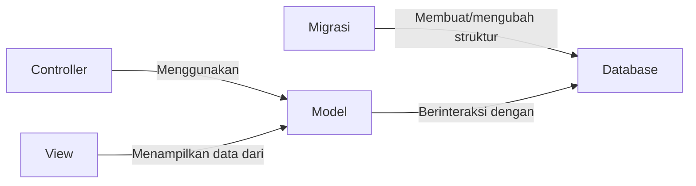
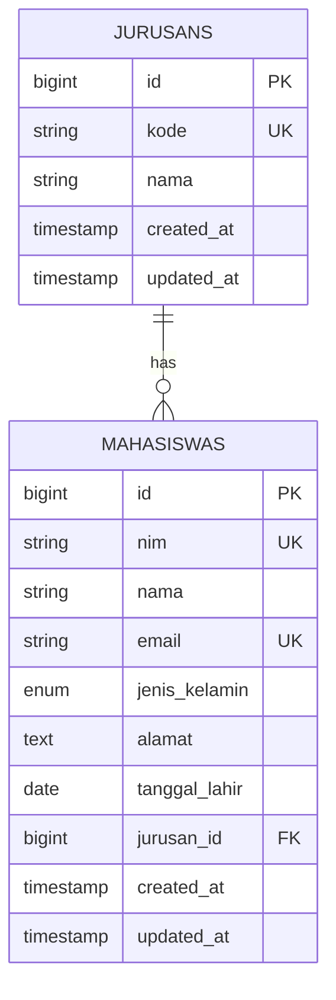

# Tutorial: Membuat Model dan Migrasi untuk Mahasiswa

Model dan migrasi adalah komponen fundamental dalam aplikasi Laravel. Pada tutorial ini, kita akan belajar cara membuat model dan migrasi untuk entitas Mahasiswa pada aplikasi manajemen mahasiswa.

## Apa itu Model dan Migrasi?



- **Model**: Representasi PHP dari tabel database, memungkinkan interaksi dengan data tanpa menulis SQL secara langsung
- **Migrasi**: "Version control" untuk struktur database, memudahkan perubahan skema database

## Langkah 1: Membuat Model dan Migrasi

Laravel menyediakan Artisan CLI untuk membuat model dan migrasi secara cepat. Kita akan membuat model Mahasiswa beserta file migrasinya dalam satu perintah:

```bash
php artisan make:model Mahasiswa -m
```

Parameter `-m` menginstruksikan Laravel untuk juga membuat file migrasi terkait model tersebut.

> **Catatan**: Perintah ini akan menghasilkan dua file:
> 1. Model: `app/Models/Mahasiswa.php`
> 2. Migrasi: `database/migrations/yyyy_mm_dd_hhmmss_create_mahasiswas_table.php`

## Langkah 2: Mendefinisikan Struktur Tabel dalam File Migrasi

Buka file migrasi yang baru saja dibuat. Secara default, file ini terletak di folder `database/migrations/` dengan format nama `yyyy_mm_dd_hhmmss_create_mahasiswas_table.php`.

Edit file migrasi tersebut untuk mendefinisikan struktur tabel sesuai kebutuhan:

```php
<?php

use Illuminate\Database\Migrations\Migration;
use Illuminate\Database\Schema\Blueprint;
use Illuminate\Support\Facades\Schema;

class CreateMahasiswasTable extends Migration
{
    /**
     * Run the migrations.
     *
     * @return void
     */
    public function up()
    {
        Schema::create('mahasiswas', function (Blueprint $table) {
            $table->id();
            $table->string('nim', 20)->unique();
            $table->string('nama', 100);
            $table->string('email')->unique();
            $table->enum('jenis_kelamin', ['L', 'P']);
            $table->text('alamat')->nullable();
            $table->date('tanggal_lahir');
            $table->unsignedBigInteger('jurusan_id');
            $table->timestamps();
            
            // Menambahkan foreign key ke tabel jurusans
            $table->foreign('jurusan_id')->references('id')->on('jurusans');
        });
    }

    /**
     * Reverse the migrations.
     *
     * @return void
     */
    public function down()
    {
        Schema::dropIfExists('mahasiswas');
    }
}
```

Pada kode di atas, kita mendefinisikan tabel `mahasiswas` dengan kolom-kolom yang dibutuhkan:
- `id`: Primary key yang otomatis bertambah
- `nim`: Nomor induk mahasiswa (unik)
- `nama`: Nama lengkap mahasiswa
- `email`: Alamat email mahasiswa (unik)
- `jenis_kelamin`: Jenis kelamin (L/P)
- `alamat`: Alamat mahasiswa (boleh kosong/nullable)
- `tanggal_lahir`: Tanggal lahir mahasiswa
- `jurusan_id`: Foreign key ke tabel jurusans
- `timestamps`: Kolom `created_at` dan `updated_at` otomatis

## Langkah 3: Membuat Model dan Migrasi untuk Jurusan

Sebelum kita dapat menggunakan relasi foreign key ke tabel jurusans, kita perlu membuat model dan migrasi untuk Jurusan:

```bash
php artisan make:model Jurusan -m
```

Sekarang edit file migrasi untuk tabel jurusans:

```php
<?php

use Illuminate\Database\Migrations\Migration;
use Illuminate\Database\Schema\Blueprint;
use Illuminate\Support\Facades\Schema;

class CreateJurusansTable extends Migration
{
    /**
     * Run the migrations.
     *
     * @return void
     */
    public function up()
    {
        Schema::create('jurusans', function (Blueprint $table) {
            $table->id();
            $table->string('kode', 10)->unique();
            $table->string('nama', 100);
            $table->timestamps();
        });
    }

    /**
     * Reverse the migrations.
     *
     * @return void
     */
    public function down()
    {
        Schema::dropIfExists('jurusans');
    }
}
```

## Langkah 4: Konfigurasi Model Mahasiswa

Buka file model `app/Models/Mahasiswa.php` dan edit sebagai berikut:

```php
<?php

namespace App\Models;

use Illuminate\Database\Eloquent\Factories\HasFactory;
use Illuminate\Database\Eloquent\Model;

class Mahasiswa extends Model
{
    use HasFactory;
    
    // Tentukan field yang dapat diisi secara massal (mass assignment)
    protected $fillable = [
        'nim',
        'nama',
        'email',
        'jenis_kelamin',
        'alamat',
        'tanggal_lahir',
        'jurusan_id'
    ];
    
    // Definisikan relasi ke model Jurusan
    public function jurusan()
    {
        return $this->belongsTo(Jurusan::class);
    }
    
    // Atribut yang perlu diubah tipe datanya
    protected $casts = [
        'tanggal_lahir' => 'date',
    ];
}
```

## Langkah 5: Konfigurasi Model Jurusan

Buka file model `app/Models/Jurusan.php` dan edit sebagai berikut:

```php
<?php

namespace App\Models;

use Illuminate\Database\Eloquent\Factories\HasFactory;
use Illuminate\Database\Eloquent\Model;

class Jurusan extends Model
{
    use HasFactory;
    
    protected $fillable = [
        'kode',
        'nama'
    ];
    
    // Definisikan relasi ke model Mahasiswa
    public function mahasiswas()
    {
        return $this->hasMany(Mahasiswa::class);
    }
}
```

## Langkah 6: Menjalankan Migrasi

Sekarang saatnya menjalankan migrasi untuk membuat tabel di database:

```bash
php artisan migrate
```

> **Penting**: Pastikan tabel jurusans dibuat terlebih dahulu karena tabel mahasiswas memiliki foreign key yang merujuk ke tabel jurusans. Jika Anda mengikuti tutorial ini secara berurutan, Laravel akan otomatis mengurutkan migrasi berdasarkan timestamp file.

Jika terjadi error, Anda dapat melakukan rollback:

```bash
php artisan migrate:rollback
```

Kemudian perbaiki masalah dan jalankan migrasi lagi.

## Langkah 7: Menambahkan Accessor dan Mutator (Opsional)

Accessor dan Mutator memungkinkan Anda untuk memodifikasi data sebelum disimpan ke database (mutator) atau sebelum ditampilkan (accessor).

Tambahkan kode berikut di model Mahasiswa:

```php
// Accessor - Format tanggal lahir untuk tampilan
public function getTanggalLahirFormattedAttribute()
{
    return $this->tanggal_lahir->format('d-m-Y');
}

// Accessor - Hitung usia mahasiswa
public function getUsiaAttribute()
{
    return $this->tanggal_lahir->age;
}

// Mutator - Pastikan nama selalu diformat dengan benar (huruf kapital di awal)
public function setNamaAttribute($value)
{
    $this->attributes['nama'] = ucwords(strtolower($value));
}
```

## Langkah 8: Menguji Model dan Migrasi

Untuk memastikan model dan migrasi bekerja dengan baik, Anda dapat mengujinya melalui Laravel Tinker:

```bash
php artisan tinker
```

Coba tambahkan data jurusan:

```php
$jurusan = new App\Models\Jurusan();
$jurusan->kode = 'TI';
$jurusan->nama = 'Teknik Informatika';
$jurusan->save();
```

Kemudian tambahkan data mahasiswa yang terhubung dengan jurusan tersebut:

```php
$mahasiswa = new App\Models\Mahasiswa();
$mahasiswa->nim = '12345678';
$mahasiswa->nama = 'Budi Santoso';
$mahasiswa->email = 'budi@example.com';
$mahasiswa->jenis_kelamin = 'L';
$mahasiswa->alamat = 'Jalan Contoh No. 123';
$mahasiswa->tanggal_lahir = '2000-01-01';
$mahasiswa->jurusan_id = 1; // Sesuaikan dengan id jurusan yang telah dibuat
$mahasiswa->save();
```

Cek relasi:

```php
$mahasiswa = App\Models\Mahasiswa::first();
$mahasiswa->jurusan->nama; // Seharusnya menampilkan 'Teknik Informatika'
```

## Struktur Tabel yang Dihasilkan



## Kesimpulan

Selamat! Anda telah berhasil membuat model dan migrasi untuk Mahasiswa dan Jurusan dalam aplikasi Laravel. Beberapa hal penting yang telah kita pelajari:

1. Cara membuat model dan migrasi secara bersamaan dengan Artisan CLI
2. Mendefinisikan struktur tabel dengan berbagai tipe kolom
3. Menambahkan foreign key untuk relasi antar tabel
4. Mendefinisikan relasi antar model (belongsTo dan hasMany)
5. Menjalankan migrasi untuk membuat tabel di database
6. Menguji model dengan Laravel Tinker

Dengan model dan migrasi yang sudah dibuat, Anda telah menyiapkan fondasi untuk membuat CRUD (Create, Read, Update, Delete) dalam aplikasi manajemen data mahasiswa.

Langkah selanjutnya Anda dapat membuat controller untuk menangani logika aplikasi dan view untuk menampilkan formulir dan data ke pengguna.