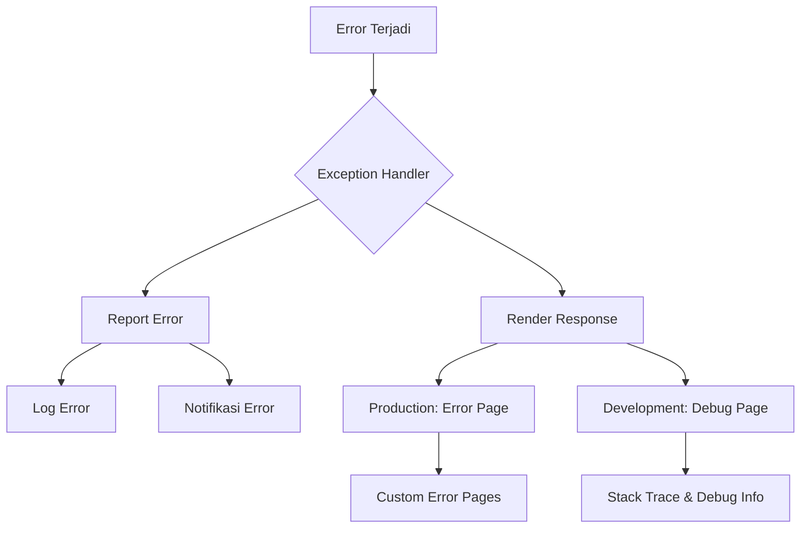

# Tutorial: Pengenalan Error Handling di Laravel

Error handling merupakan bagian penting dalam pengembangan aplikasi web untuk memastikan bahwa aplikasi tetap berjalan dengan baik bahkan ketika terjadi kesalahan. Laravel menyediakan berbagai cara untuk menangani error dengan elegan. Mari kita pelajari cara menangani error di Laravel dengan langkah-langkah berikut.

## Diagram Alur Error Handling di Laravel



## 1. Memahami Exception Handler di Laravel

Laravel menggunakan kelas `App\Exceptions\Handler` untuk menangani semua exception yang terjadi dalam aplikasi. Kelas ini memiliki dua metode utama:

- `report()`: Digunakan untuk mencatat (logging) atau mengirim notifikasi tentang exception
- `render()`: Digunakan untuk mengubah exception menjadi HTTP response yang akan dikirim ke browser

## 2. Konfigurasi Log Error

### Langkah 1: Periksa konfigurasi logging

Buka file `config/logging.php` untuk melihat konfigurasi logging di aplikasi Laravel Anda.

```php
return [
    'default' => env('LOG_CHANNEL', 'stack'),
    
    'channels' => [
        'stack' => [
            'driver' => 'stack',
            'channels' => ['single'],
            'ignore_exceptions' => false,
        ],
        
        'single' => [
            'driver' => 'single',
            'path' => storage_path('logs/laravel.log'),
            'level' => env('LOG_LEVEL', 'debug'),
        ],
        // Konfigurasi channel lainnya...
    ],
];
```

### Langkah 2: Atur level logging di .env

```
LOG_CHANNEL=stack
LOG_LEVEL=debug
```

Level logging yang tersedia (dari paling detail ke paling sedikit):
- debug
- info
- notice
- warning
- error
- critical
- alert
- emergency

## 3. Cara Mencatat Error Manual

### Menggunakan facade Log

```php
use Illuminate\Support\Facades\Log;

try {
    // Kode yang mungkin menimbulkan error
    $result = 10 / 0;
} catch (\Exception $e) {
    Log::error('Terjadi error pembagian: ' . $e->getMessage());
    // Atau dengan konteks tambahan:
    Log::error('Error pada aplikasi', [
        'exception' => $e->getMessage(),
        'file' => $e->getFile(),
        'line' => $e->getLine()
    ]);
}
```

## 4. Custom Exception dan Handler

### Langkah 1: Buat custom exception

```php
// app/Exceptions/MahasiswaNotFoundException.php
namespace App\Exceptions;

use Exception;

class MahasiswaNotFoundException extends Exception
{
    public function __construct($message = "Mahasiswa tidak ditemukan", $code = 404)
    {
        parent::__construct($message, $code);
    }
}
```

### Langkah 2: Modifikasi Handler untuk menangani custom exception

Edit file `app/Exceptions/Handler.php`:

```php
namespace App\Exceptions;

use Illuminate\Foundation\Exceptions\Handler as ExceptionHandler;
use App\Exceptions\MahasiswaNotFoundException;
use Throwable;

class Handler extends ExceptionHandler
{
    // ...existing code...
    
    public function register()
    {
        $this->reportable(function (Throwable $e) {
            //
        });
        
        // Tambahkan handler khusus untuk MahasiswaNotFoundException
        $this->renderable(function (MahasiswaNotFoundException $e, $request) {
            if ($request->expectsJson()) {
                return response()->json(['message' => $e->getMessage()], $e->getCode());
            }
            
            return response()->view('errors.mahasiswa-not-found', [], $e->getCode());
        });
    }
}
```

## 5. Membuat Custom Error Pages

### Langkah 1: Buat view untuk error

Buat folder `resources/views/errors` dan tambahkan file error custom:

```
// resources/views/errors/404.blade.php
@extends('layouts.app')

@section('content')
    <div class="error-page">
        <h2 class="headline text-warning">404</h2>
        <div class="error-content">
            <h3><i class="fas fa-exclamation-triangle text-warning"></i> Oops! Halaman tidak ditemukan.</h3>
            <p>
                Kami tidak dapat menemukan halaman yang Anda cari.
                Sementara itu, Anda dapat <a href="{{ route('home') }}">kembali ke dashboard</a>.
            </p>
        </div>
    </div>
@endsection
```

### Langkah 2: Buat error page untuk custom exception 

```
// resources/views/errors/mahasiswa-not-found.blade.php
@extends('layouts.app')

@section('content')
    <div class="error-page">
        <h2 class="headline text-warning">404</h2>
        <div class="error-content">
            <h3><i class="fas fa-exclamation-triangle text-warning"></i> Mahasiswa tidak ditemukan!</h3>
            <p>
                Data mahasiswa yang Anda cari tidak tersedia dalam database.
                Silakan <a href="{{ route('mahasiswa.index') }}">kembali ke daftar mahasiswa</a>.
            </p>
        </div>
    </div>
@endsection
```

## 6. Menerapkan Try-Catch untuk Menangani Error

### Contoh penggunaan dalam controller:

```php
public function show($id)
{
    try {
        $mahasiswa = Mahasiswa::findOrFail($id);
        return view('mahasiswa.show', compact('mahasiswa'));
    } catch (\Illuminate\Database\Eloquent\ModelNotFoundException $e) {
        // Tangani error ketika model tidak ditemukan
        throw new MahasiswaNotFoundException("Mahasiswa dengan ID $id tidak ditemukan");
    } catch (\Exception $e) {
        // Tangani semua jenis error lainnya
        Log::error('Error pada show mahasiswa: ' . $e->getMessage());
        return redirect()->route('mahasiswa.index')
            ->with('error', 'Terjadi kesalahan saat menampilkan data mahasiswa');
    }
}
```

## 7. Menggunakan Abort Helper

Laravel menyediakan helper `abort()` untuk langsung memunculkan HTTP exception:

```php
public function show($id)
{
    $mahasiswa = Mahasiswa::find($id);
    
    if (!$mahasiswa) {
        abort(404, 'Mahasiswa tidak ditemukan');
    }
    
    return view('mahasiswa.show', compact('mahasiswa'));
}
```

## 8. Debug Menggunakan dd() dan dump()

Untuk debugging cepat, Laravel menyediakan helper:

```php
// Dump and die - menampilkan data dan menghentikan eksekusi
dd($mahasiswa);

// Dump - menampilkan data tapi melanjutkan eksekusi
dump($mahasiswa);
```

## 9. Menangani Error Validasi Form

```php
public function store(Request $request)
{
    try {
        $validated = $request->validate([
            'nim' => 'required|unique:mahasiswa,nim',
            'nama' => 'required|string|max:100',
            'email' => 'required|email|unique:mahasiswa,email',
        ]);
        
        Mahasiswa::create($validated);
        
        return redirect()->route('mahasiswa.index')
            ->with('success', 'Data mahasiswa berhasil ditambahkan');
    } catch (\Illuminate\Validation\ValidationException $e) {
        // Laravel sudah otomatis menangani exception ini dengan redirect kembali
        // dengan error message, jadi kita tidak perlu menambahkan kode di sini
        throw $e;
    } catch (\Exception $e) {
        Log::error('Error saat menyimpan mahasiswa: ' . $e->getMessage());
        return redirect()->back()
            ->with('error', 'Terjadi kesalahan saat menyimpan data')
            ->withInput();
    }
}
```

## Praktik: Latihan Error Handling

1. Buatlah sebuah custom exception bernama `JurusanNotFoundException`
2. Modifikasi Handler.php untuk menangani exception tersebut 
3. Implementasikan try-catch pada controller Mahasiswa untuk menangani kasus ketika jurusan tidak ditemukan
4. Buat custom error page untuk exception tersebut

## Kesimpulan

Error handling yang baik merupakan aspek penting dalam pengembangan aplikasi Laravel. Dengan mengimplementasikan teknik-teknik di atas, aplikasi Anda akan lebih robust dan memberikan pengalaman pengguna yang lebih baik saat terjadi kesalahan.

Ingat untuk selalu:
- Log error untuk memudahkan debugging
- Tangani error dengan try-catch untuk kontrol yang lebih baik
- Buat custom error pages agar tampilan tetap profesional jika terjadi error
- Jangan menampilkan detail teknis error kepada pengguna di lingkungan production

Dengan penanganan error yang baik, aplikasi mahasiswa-app Anda akan lebih handal dan profesional.