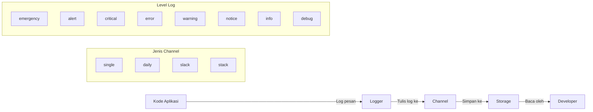

# Menggunakan Logging untuk Debugging di Laravel

Logging adalah salah satu teknik penting dalam debugging aplikasi Laravel. Dengan logging, kita dapat merekam informasi, peringatan, dan error yang terjadi dalam aplikasi untuk memudahkan proses debugging. Mari pelajari cara menggunakan fitur logging di Laravel untuk membantu proses debugging aplikasi mahasiswa kita.

## Konsep Dasar Logging di Laravel



## Langkah 1: Memahami Konfigurasi Logging

Laravel sudah menyediakan konfigurasi logging yang siap pakai. File konfigurasi ini terletak di `config/logging.php`. Di file ini, Anda dapat melihat berbagai channel logging yang tersedia:

- `stack`: Menggabungkan beberapa channel lain
- `single`: Log tunggal ke file
- `daily`: Log yang dirotasi setiap hari
- `slack`: Mengirim log ke Slack
- `stderr`: Log ke standard error
- `syslog`: Log ke syslog
- `errorlog`: Log menggunakan error_log() PHP
- `null`: Log dibuang (tidak disimpan)

## Langkah 2: Menggunakan Fungsi Logging Dasar

Laravel menyediakan fungsi `Log` yang mudah digunakan untuk menulis log:

```php
// Import Log facade di bagian atas file
use Illuminate\Support\Facades\Log;

// Di controller atau model
public function store(Request $request)
{
    // Tambahkan log untuk debugging
    Log::info('Memproses data mahasiswa baru');
    
    try {
        $mahasiswa = Mahasiswa::create([
            'nim' => $request->nim,
            'nama' => $request->nama,
            'email' => $request->email,
            // data lainnya
        ]);
        
        Log::info('Mahasiswa berhasil disimpan', ['id' => $mahasiswa->id]);
        
        return redirect()->route('mahasiswa.index')
            ->with('success', 'Data mahasiswa berhasil disimpan');
    } catch (\Exception $e) {
        Log::error('Gagal menyimpan data mahasiswa', [
            'error' => $e->getMessage(),
            'data' => $request->all()
        ]);
        
        return back()->withInput()->withErrors(['error' => 'Terjadi kesalahan saat menyimpan data']);
    }
}
```

## Langkah 3: Menggunakan Level Log yang Berbeda

Laravel menyediakan berbagai level log yang sesuai dengan standar RFC 5424:

```php
Log::emergency($message, $context);  // Level 0: Sistem tidak dapat digunakan
Log::alert($message, $context);      // Level 1: Perlu tindakan segera
Log::critical($message, $context);   // Level 2: Kondisi kritis
Log::error($message, $context);      // Level 3: Error runtime
Log::warning($message, $context);    // Level 4: Peringatan tapi tidak error
Log::notice($message, $context);     // Level 5: Peristiwa normal tapi penting
Log::info($message, $context);       // Level 6: Informasi umum
Log::debug($message, $context);      // Level 7: Informasi debugging detail
```

Contoh penggunaan level log untuk kasus berbeda:

```php
// Saat validasi gagal
Log::warning('Validasi gagal', ['data' => $request->all(), 'errors' => $validator->errors()]);

// Saat user login
Log::info('User login', ['user_id' => $user->id, 'email' => $user->email]);

// Saat ada exception
Log::error('Database error', ['exception' => $e->getMessage(), 'trace' => $e->getTraceAsString()]);
```

## Langkah 4: Meneruskan Konteks ke Log

Menambahkan konteks ke log sangat membantu debugging:

```php
// Log dengan konteks array
Log::info('Mencari mahasiswa dengan NIM', ['nim' => $nim]);

// Mencatat object eloquent
$mahasiswa = Mahasiswa::find(1);
Log::info('Mahasiswa ditemukan', $mahasiswa->toArray());

// Mencatat request data
Log::debug('Request data', ['form_data' => $request->all()]);
```

## Langkah 5: Menggunakan Channel Log Tertentu

Anda dapat menentukan channel mana yang ingin digunakan:

```php
// Menggunakan channel 'single'
Log::channel('single')->info('Log ini ke file tunggal');

// Menggunakan channel 'daily'
Log::channel('daily')->error('Log harian untuk error');

// Menggunakan channel stack yang dikonfigurasi
Log::stack(['single', 'slack'])->critical('Error kritis akan dikirim ke file dan Slack');
```

## Langkah 6: Membuat Custom Channel Log

Tambahkan konfigurasi channel baru di `config/logging.php`:

```php
'channels' => [
    // Channel yang sudah ada...
    
    'mahasiswa' => [
        'driver' => 'daily',
        'path' => storage_path('logs/mahasiswa.log'),
        'level' => 'debug',
        'days' => 14,
    ],
],
```

Kemudian gunakan channel tersebut:

```php
Log::channel('mahasiswa')->info('Operasi pada modul mahasiswa', ['action' => 'store']);
```

## Langkah 7: Debugging Dalam Skenario Praktis

### Skenario 1: Debugging Proses CRUD Mahasiswa

```php
public function update(Request $request, $id)
{
    Log::channel('mahasiswa')->info('Mulai proses update mahasiswa', ['id' => $id]);
    
    try {
        $mahasiswa = Mahasiswa::findOrFail($id);
        Log::debug('Data mahasiswa sebelum update', $mahasiswa->toArray());
        
        $mahasiswa->update($request->all());
        Log::debug('Data mahasiswa setelah update', $mahasiswa->fresh()->toArray());
        
        Log::info('Mahasiswa berhasil diupdate', ['id' => $id]);
        return redirect()->route('mahasiswa.index')->with('success', 'Data berhasil diperbarui');
    } catch (\Exception $e) {
        Log::error('Error saat update mahasiswa', [
            'id' => $id,
            'data' => $request->all(),
            'error' => $e->getMessage(),
            'trace' => $e->getTraceAsString()
        ]);
        
        return back()->withInput()->withErrors(['error' => 'Terjadi kesalahan']);
    }
}
```

### Skenario 2: Debugging Query Database

```php
public function search(Request $request)
{
    $keyword = $request->get('keyword');
    Log::info('Mencari mahasiswa', ['keyword' => $keyword]);
    
    // Aktifkan query logging untuk debugging
    DB::enableQueryLog();
    
    $mahasiswas = Mahasiswa::where('nama', 'like', "%$keyword%")
                    ->orWhere('nim', 'like', "%$keyword%")
                    ->paginate(10);
    
    // Log hasil query untuk debugging
    Log::debug('Query pencarian', [
        'queries' => DB::getQueryLog(),
        'result_count' => $mahasiswas->count()
    ]);
    
    return view('mahasiswa.index', compact('mahasiswas'));
}
```

## Langkah 8: Membaca File Log

File log Laravel disimpan di direktori `storage/logs/`. Cara mengaksesnya:

1. Melalui terminal:
   ```bash
   # Melihat isi log
   tail -f storage/logs/laravel.log
   
   # Mencari kata kunci tertentu di log
   grep "error" storage/logs/laravel.log
   ```

2. Melalui code editor:
   - Buka file `storage/logs/laravel.log` di editor seperti VSCode atau PhpStorm
   - Gunakan fitur pencarian untuk menemukan entry log tertentu

## Langkah 9: Implementasi Helper Function untuk Logging

Untuk standarisasi logging, buatlah helper function:

```php
// Di app/Helpers/LogHelper.php (buat file ini)
<?php

namespace App\Helpers;

use Illuminate\Support\Facades\Log;

class LogHelper
{
    public static function mahasiswaLog($level, $message, $data = [])
    {
        $context = array_merge($data, [
            'user_id' => auth()->id() ?? 'guest',
            'timestamp' => now()->toDateTimeString(),
        ]);
        
        Log::channel('mahasiswa')->{$level}($message, $context);
    }
}
```

Kemudian gunakan di controller:

```php
use App\Helpers\LogHelper;

// Di controller
LogHelper::mahasiswaLog('info', 'Menampilkan detail mahasiswa', ['id' => $id]);
```

## Tips Menggunakan Logging Secara Efektif

1. **Log dengan Konteks yang Cukup**: Selalu sertakan informasi yang relevan untuk membantu debugging
   ```php
   Log::error('Validasi gagal', ['errors' => $validator->errors()->toArray()]);
   ```

2. **Gunakan Level Log dengan Tepat**: Level debug untuk detail, info untuk informasi umum, error untuk kesalahan

3. **Jangan Log Data Sensitif**: Hindari mencatat password, token keamanan, dll
   ```php
   Log::info('User register', [
       'email' => $user->email,
       // Jangan log password!
   ]);
   ```

4. **Gunakan Try-Catch untuk Error Logging**: Tangkap error dan log detail untuk debugging
   ```php
   try {
       // kode yang mungkin error
   } catch (\Exception $e) {
       Log::error('Error saat proses data', [
           'message' => $e->getMessage(),
           'file' => $e->getFile(),
           'line' => $e->getLine()
       ]);
   }
   ```

5. **Aktifkan Query Log Hanya Saat Diperlukan**: Query logging dapat memengaruhi performa
   ```php
   DB::enableQueryLog(); // Aktifkan
   // Query database
   Log::debug('Queries', ['queries' => DB::getQueryLog()]);
   DB::disableQueryLog(); // Nonaktifkan setelah selesai
   ```

## Kesimpulan

Logging adalah alat debugging yang sangat penting dalam pengembangan aplikasi Laravel. Dengan menggunakan logging secara efektif, Anda dapat:

1. Melacak alur eksekusi program
2. Mengidentifikasi sumber error dengan cepat
3. Memahami perilaku aplikasi saat runtime
4. Mendokumentasikan kejadian penting dalam aplikasi

Gunakan logging secara bijak dan strategis untuk memudahkan proses debugging dan pemeliharaan aplikasi mahasiswa Anda.