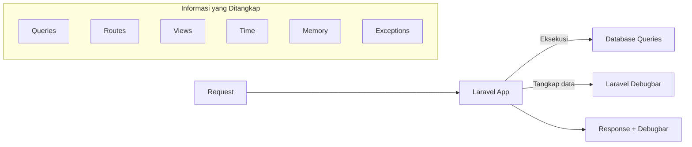

# Tutorial: Laravel Debugbar untuk Monitoring Queries

Laravel Debugbar adalah alat debugging yang sangat berguna untuk memantau dan menganalisis kinerja aplikasi Laravel, terutama query database. Dalam tutorial ini, kita akan belajar cara menginstal, mengonfigurasi, dan menggunakan Laravel Debugbar untuk memonitor query database di aplikasi mahasiswa kita.

## Apa itu Laravel Debugbar?

Laravel Debugbar adalah package yang menampilkan bar debug di bagian bawah halaman aplikasi Laravel Anda. Bar ini berisi berbagai informasi debugging seperti:

- Query database yang dijalankan
- Waktu eksekusi query
- Penggunaan memori
- Request dan response data
- Route yang diakses
- View yang dirender
- Dan banyak lagi



## Langkah 1: Instalasi Laravel Debugbar

Pertama, instal package Laravel Debugbar menggunakan Composer:

```bash
composer require barryvdh/laravel-debugbar --dev
```

> **Catatan**: Parameter `--dev` memastikan bahwa package ini hanya diinstal di lingkungan development, tidak di production.

Laravel akan otomatis mendeteksi package ini melalui fitur auto-discovery sehingga tidak perlu mendaftarkannya secara manual di `config/app.php`.

## Langkah 2: Konfigurasi Debugbar

Laravel Debugbar secara default akan aktif jika `APP_DEBUG=true` di file `.env` Anda. Untuk membuat file konfigurasi kustom:

```bash
php artisan vendor:publish --provider="Barryvdh\Debugbar\ServiceProvider"
```

Perintah ini akan membuat file `config/debugbar.php` yang berisi berbagai opsi konfigurasi. Beberapa opsi penting:

```php
'enabled' => env('DEBUGBAR_ENABLED', null),
'storage' => [
    'enabled'    => true,
    'path'       => storage_path('debugbar'),
],
'collectors' => [
    'phpinfo'         => true,
    'messages'        => true,
    'time'            => true,
    'memory'          => true,
    'exceptions'      => true,
    'log'             => true,
    'db'              => true,  // Aktifkan untuk monitor database queries
    'views'           => true,
    'route'           => true,
    'laravel'         => true,
    'events'          => false,
    'default_request' => false,
    'symfony_request' => true,
    'mail'            => true,
    'logs'            => false,
    'files'           => false,
    'config'          => true,
    'auth'            => false,
    'gate'            => false,
    'session'         => true,
    'models'          => true,
],
```

## Langkah 3: Menggunakan Debugbar untuk Monitoring Queries

Setelah Debugbar terinstal dan dikonfigurasi, buka aplikasi Laravel Anda di browser. Anda akan melihat bar debug di bagian bawah halaman. Mari fokus pada monitoring query:

### 3.1 Melihat Query Database

1. Klik pada tab "Queries" di Debugbar
2. Anda akan melihat daftar query yang dijalankan, waktu eksekusi, dan file yang memicu query

Misalnya, ketika membuka halaman daftar mahasiswa, Anda akan melihat query untuk mengambil data mahasiswa:

```sql
SELECT * FROM `mahasiswas` ORDER BY `id` DESC LIMIT 10 OFFSET 0
```

### 3.2 Menganalisis N+1 Query Problem

Debugbar sangat berguna untuk mengidentifikasi masalah N+1 Query. Misalnya:

```php
// Controller tanpa eager loading (akan menyebabkan N+1 problem)
public function index()
{
    $mahasiswas = Mahasiswa::paginate(10);
    return view('mahasiswa.index', compact('mahasiswas'));
}
```

Pada view, jika kita mengakses relasi:

```blade
@foreach($mahasiswas as $mahasiswa)
    <tr>
        <td>{{ $mahasiswa->nim }}</td>
        <td>{{ $mahasiswa->nama }}</td>
        <td>{{ $mahasiswa->jurusan->nama }}</td>  <!-- Akan memicu query tambahan -->
    </tr>
@endforeach
```

Debugbar akan menunjukkan:
- 1 query untuk mengambil semua mahasiswa
- N query tambahan untuk mengambil data jurusan (dimana N adalah jumlah mahasiswa)

Solusinya adalah dengan menggunakan eager loading:

```php
// Controller dengan eager loading (mengatasi N+1 problem)
public function index()
{
    $mahasiswas = Mahasiswa::with('jurusan')->paginate(10);
    return view('mahasiswa.index', compact('mahasiswas'));
}
```

## Langkah 4: Fitur Monitoring Query Lanjutan

### 4.1 Menampilkan Jumlah Query dan Waktu Eksekusi

Debugbar otomatis menampilkan jumlah query yang dijalankan dan total waktu eksekusi di tab "Queries". Informasi ini berguna untuk mengidentifikasi bottleneck performa.

### 4.2 Melihat Explain Plan Query

Untuk query yang lambat, Anda dapat mengklik pada query tersebut dan memilih "Explain" untuk melihat explain plan dari database:


### 4.3 Mengaktifkan Highlight untuk Query Duplikat

Debugbar dapat meng-highlight query yang dijalankan lebih dari sekali (duplikat). Edit file konfigurasi:

```php
'options' => [
    'queries' => [
        'timeline' => true,  // Tampilkan queries pada timeline
        'backtrace' => true, // Tampilkan backtrace setiap query
        'explain' => [       // Tampilkan explain untuk queries yang lambat
            'enabled' => true,
            'types' => ['SELECT'],
            'threshold' => 0.1, // Query lebih dari 0.1 detik akan di-explain
        ],
        'hints' => true,    // Tampilkan hint untuk optimasi
        'show_copy' => true, // Tampilkan tombol copy query
        'highlight' => [     // Highlight syntax query
            'enabled' => true,
            'show_class' => true,
        ],
    ],
],
```

## Langkah 5: Praktik Implementasi di Aplikasi Mahasiswa

### 5.1 Contoh Analisis Halaman Daftar Mahasiswa

Mari gunakan Debugbar untuk menganalisis dan mengoptimalkan halaman daftar mahasiswa:

```php
// MahasiswaController.php - Sebelum optimasi
public function index()
{
    $mahasiswas = Mahasiswa::paginate(10);
    return view('mahasiswa.index', compact('mahasiswas'));
}
```

Setelah mengamati Debugbar, kita menemukan N+1 query saat mengakses data jurusan. Mari kita optimalkan:

```php
// MahasiswaController.php - Setelah optimasi
public function index()
{
    $mahasiswas = Mahasiswa::with('jurusan')->paginate(10);
    return view('mahasiswa.index', compact('mahasiswas'));
}
```

### 5.2 Contoh Query Builder dengan Filter

```php
// MahasiswaController.php - Mencari mahasiswa dengan filter
public function search(Request $request)
{
    $query = Mahasiswa::query();
    
    if ($request->has('jurusan_id')) {
        $query->where('jurusan_id', $request->jurusan_id);
    }
    
    if ($request->has('keyword')) {
        $keyword = $request->keyword;
        $query->where(function($q) use ($keyword) {
            $q->where('nama', 'like', "%$keyword%")
              ->orWhere('nim', 'like', "%$keyword%");
        });
    }
    
    $mahasiswas = $query->with('jurusan')->paginate(10);
    
    return view('mahasiswa.index', compact('mahasiswas'));
}
```

Debugbar akan menunjukkan query yang dihasilkan dan performanya:

```sql
SELECT * FROM `mahasiswas` WHERE `jurusan_id` = 1 
AND (`nama` LIKE '%budi%' OR `nim` LIKE '%budi%') 
LIMIT 10 OFFSET 0
```

## Langkah 6: Menampilkan Query Debugbar di API Response

Jika Anda sedang mengembangkan API dan ingin melihat query di response JSON:

```php
// AppServiceProvider.php - Tambahkan di method boot()
if (config('app.debug')) {
    app('debugbar')->enable();
    \Debugbar::addCollector(new \DebugBar\DataCollector\PDO\PDOCollector($pdo = null));
    
    // Tambahkan middleware untuk inject debugbar data di API response
    $kernel = app('Illuminate\Contracts\Http\Kernel');
    $kernel->pushMiddleware(\Illuminate\Foundation\Http\Middleware\SerializeDebugbarForAPI::class);
}
```

Buat middleware `SerializeDebugbarForAPI.php`:

```php
<?php

namespace App\Http\Middleware;

use Closure;

class SerializeDebugbarForAPI
{
    public function handle($request, Closure $next)
    {
        $response = $next($request);
        
        if (app()->bound('debugbar') && app('debugbar')->isEnabled() && 
            $request->wantsJson() && $response->getStatusCode() === 200) {
            
            $data = $response->getData(true);
            $data['_debugbar'] = app('debugbar')->getData();
            $response->setData($data);
        }
        
        return $response;
    }
}
```

## Langkah 7: Praktik Terbaik Penggunaan Debugbar

### 7.1 Nonaktifkan di Production

Pastikan Debugbar dinonaktifkan di lingkungan production:

```php
// .env di production
APP_DEBUG=false
DEBUGBAR_ENABLED=false
```

### 7.2 Gunakan Mode Database Session untuk Query Antar Request

Edit file `config/debugbar.php`:

```php
'storage' => [
    'enabled'    => true,
    'driver'     => 'database', // Menggunakan database untuk menyimpan data
    'connection' => null,       // Menggunakan koneksi database default
    'provider'   => '', // Nama provider jika menggunakan penyimpanan kustom
],
```

Kemudian jalankan migrasi untuk membuat tabel:

```bash
php artisan vendor:publish --provider="Barryvdh\Debugbar\ServiceProvider" --tag=migrations
php artisan migrate
```

### 7.3 Gunakan Collector Secara Selektif

Aktifkan hanya collector yang Anda butuhkan untuk menghemat memori:

```php
'collectors' => [
    'phpinfo'         => false, // Nonaktifkan yang tidak perlu
    'messages'        => true,
    'time'            => true,
    'memory'          => true,
    'exceptions'      => true,
    'log'             => true,
    'db'              => true,  // Penting untuk monitoring query
    'views'           => false,
    'route'           => true,
    'laravel'         => false,
    // Lainnya...
],
```

## Kesimpulan

Laravel Debugbar adalah alat yang sangat berguna untuk monitoring query database dan mengoptimalkan performa aplikasi Laravel. Dengan menggunakan fitur-fitur yang tersedia, Anda dapat:

1. Mengidentifikasi masalah N+1 query
2. Memonitor waktu eksekusi query
3. Menemukan query duplikat atau tidak efisien
4. Melihat explain plan untuk query lambat

Semua ini membantu Anda membangun aplikasi mahasiswa yang lebih efisien dan responsif. Ingat untuk selalu menonaktifkan Debugbar di lingkungan production untuk menghindari kebocoran informasi sensitif dan overhead performa yang tidak perlu.