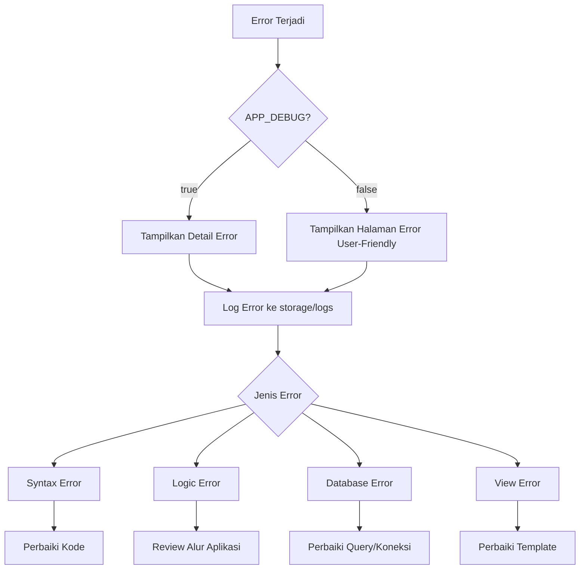

# Tutorial Error Reporting dan Pemecahan Masalah Umum di Laravel

Berikut panduan langkah demi langkah untuk menangani error reporting dan pemecahan masalah umum di Laravel:

## 1. Memahami Jenis Error di Laravel

Laravel mengelompokkan error menjadi beberapa kategori:
- **Syntax Error** - Kesalahan penulisan kode
- **Runtime Error** - Error saat aplikasi berjalan
- **Logic Error** - Aplikasi tidak berfungsi seperti yang diharapkan
- **Database Error** - Masalah koneksi atau query database

## 2. Mengaktifkan Error Reporting yang Tepat

#### Untuk Development:
```php
// file .env
APP_DEBUG=true
APP_ENV=local
```

#### Untuk Production:
```php
// file .env
APP_DEBUG=false
APP_ENV=production
```

## 3. Mengecek File Log Laravel

Laravel mencatat semua error di file log yang terletak di:
```
/storage/logs/laravel.log
```

Periksa file ini saat mengalami error untuk mendapatkan detail lengkap.

## 4. Pemecahan Masalah Database

Masalah database yang umum dan solusinya:

| Masalah | Solusi |
|---------|--------|
| Koneksi Gagal | Periksa kredensial database di `.env` |
| Table Not Found | Jalankan migrasi dengan `php artisan migrate` |
| Column Not Found | Pastikan struktur tabel sesuai dengan model |
| Foreign Key Constraint | Periksa relasi antar tabel |

## 5. Pemecahan Error CSRF Token Mismatch

Saat mengalami error CSRF Token:
1. Pastikan setiap form memiliki token CSRF:
```php
@csrf
```
2. Periksa session storage berfungsi dengan baik
3. Hindari validasi CSRF untuk route API dengan menambahkannya ke `VerifyCsrfToken.php`:
```php
protected $except = [
    'api/*'
];
```

## 6. Mengatasi Error "Class Not Found"

1. Jalankan `composer dump-autoload`
2. Periksa namespace dan lokasi file class
3. Pastikan import/use statement di bagian atas file

## 7. Menangani Error View Not Found

1. Pastikan nama file view sesuai dengan yang dipanggil
2. Periksa hierarki folder view
3. Run `php artisan view:clear` untuk membersihkan cache view

## 8. Visualisasi Alur Error Handling Laravel



## 9. Praktik Debugging yang Baik

1. **Gunakan `dd()` atau `dump()`** untuk memeriksa nilai variabel:
```php
dd($variable); // Menampilkan dan menghentikan eksekusi
dump($variable); // Menampilkan tanpa menghentikan eksekusi
```

2. **Manfaatkan try-catch** untuk menangani error yang diprediksi:
```php
try {
    // Kode yang mungkin menghasilkan error
    $result = $this->methodThatMightFail();
} catch (\Exception $e) {
    // Tangani error
    Log::error('Terjadi error: ' . $e->getMessage());
    return redirect()->back()->with('error', 'Operasi gagal');
}
```

## 10. Pemecahan Masalah Umum di Laravel

| Masalah | Solusi |
|---------|--------|
| Route tidak ditemukan | Periksa `php artisan route:list` |
| Cache bermasalah | Jalankan `php artisan config:clear` dan `php artisan cache:clear` |
| Permission error | Sesuaikan permission folder `storage` dan `bootstrap/cache` |
| Server 500 error | Periksa log untuk detail error sebenarnya |
| Pagination error | Pastikan view pagination sudah dipublish dengan `php artisan vendor:publish` |

## Latihan Praktik

1. Buat error dengan sengaja di aplikasi mahasiswa (misalnya typo pada nama model)
2. Identifikasi error dari tampilan debugger
3. Periksa file log dan catat detail error
4. Perbaiki error tersebut
5. Implementasikan try-catch pada controller mahasiswa untuk menangani error saat menyimpan data

Dengan memahami error reporting dan teknik pemecahan masalah di Laravel, Anda akan lebih efisien dalam mengembangkan aplikasi dan mengurangi waktu debugging!