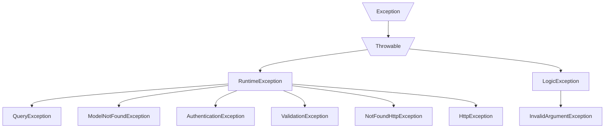
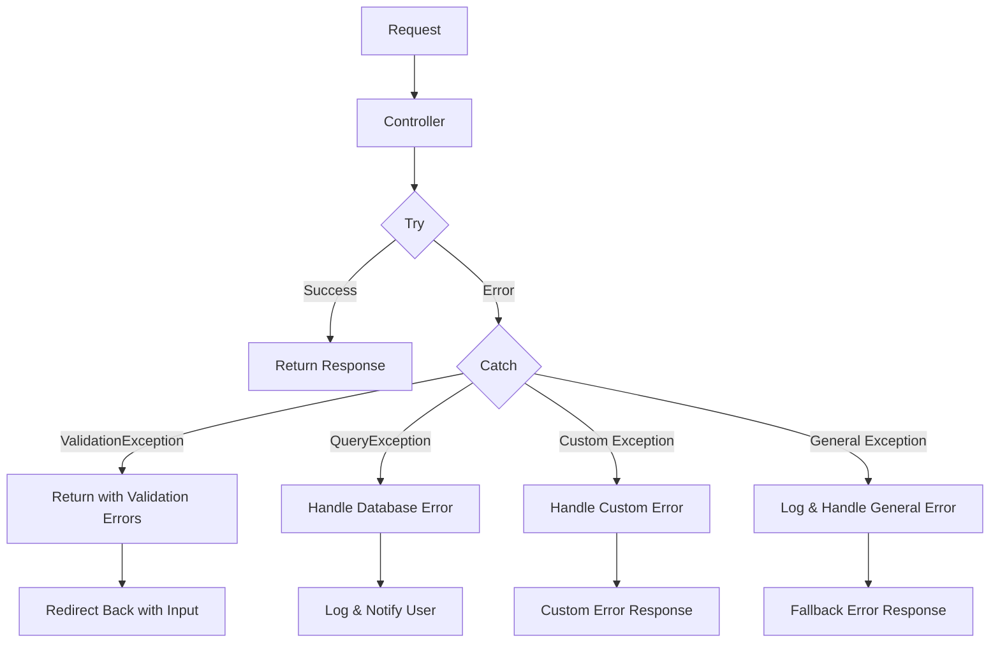

# Tutorial Try-Catch dan Exception Handling di Laravel

Exception handling adalah teknik penting dalam pengembangan aplikasi Laravel untuk mengelola error dengan elegan. Berikut panduan praktis untuk mengimplementasikan try-catch dan exception handling di aplikasi mahasiswa Anda:

## 1. Konsep Dasar Exception Handling

Exception handling memungkinkan Anda untuk:
- Menangkap error secara terstruktur
- Mencegah crash aplikasi
- Memberikan respons yang lebih baik kepada pengguna
- Mencatat error untuk analisis

## 2. Struktur Dasar Try-Catch

```php
try {
    // Kode yang berpotensi menghasilkan error
} catch (ExceptionType $e) {
    // Kode untuk menangani error
} finally {
    // Kode yang selalu dijalankan (opsional)
}
```

## 3. Mengimplementasikan Try-Catch dalam Controller Mahasiswa

Berikut contoh penerapan try-catch pada method store di MahasiswaController:

```php
public function store(Request $request)
{
    try {
        // Validasi input
        $validated = $request->validate([
            'nim' => 'required|unique:mahasiswa,nim',
            'nama' => 'required',
            'jurusan_id' => 'required|exists:jurusan,id',
            'email' => 'required|email|unique:mahasiswa,email',
        ]);
        
        // Simpan data mahasiswa
        Mahasiswa::create($validated);
        
        return redirect()->route('mahasiswa.index')
            ->with('success', 'Data mahasiswa berhasil disimpan');
            
    } catch (ValidationException $e) {
        // Khusus untuk error validasi
        return redirect()->back()
            ->withErrors($e->validator)
            ->withInput();
            
    } catch (\Illuminate\Database\QueryException $e) {
        // Untuk error database
        $errorCode = $e->errorInfo[1];
        
        if ($errorCode == 1062) { // Duplicate entry error
            return redirect()->back()
                ->with('error', 'NIM atau Email sudah terdaftar')
                ->withInput();
        }
        
        // Log error database lainnya
        \Log::error('Database error: ' . $e->getMessage());
        return redirect()->back()
            ->with('error', 'Terjadi kesalahan database')
            ->withInput();
            
    } catch (\Exception $e) {
        // Untuk semua jenis error lainnya
        \Log::error('Error saat menyimpan data: ' . $e->getMessage());
        return redirect()->back()
            ->with('error', 'Terjadi kesalahan saat menyimpan data')
            ->withInput();
    }
}
```

## 4. Jenis Exception yang Umum di Laravel



## 5. Custom Exception di Laravel

Membuat custom exception untuk penanganan error yang lebih khusus:

1. Buat class exception:

```php
// app/Exceptions/MahasiswaNotFoundException.php
namespace App\Exceptions;

use Exception;

class MahasiswaNotFoundException extends Exception
{
    public function report()
    {
        \Log::error('Mahasiswa tidak ditemukan');
    }

    public function render($request)
    {
        return response()->view('errors.mahasiswa-not-found', [], 404);
    }
}
```

2. Gunakan exception tersebut:

```php
public function show($id)
{
    try {
        $mahasiswa = Mahasiswa::findOrFail($id);
        return view('mahasiswa.show', compact('mahasiswa'));
    } catch (\Illuminate\Database\Eloquent\ModelNotFoundException $e) {
        throw new \App\Exceptions\MahasiswaNotFoundException('Mahasiswa dengan ID ' . $id . ' tidak ditemukan');
    }
}
```

## 6. Global Exception Handler di Laravel

Laravel memiliki Exception Handler global di `app/Exceptions/Handler.php` yang dapat dikustomisasi:

```php
// app/Exceptions/Handler.php
namespace App\Exceptions;

use Illuminate\Foundation\Exceptions\Handler as ExceptionHandler;
use Throwable;

class Handler extends ExceptionHandler
{
    /**
     * Register the exception handling callbacks for the application.
     */
    public function register(): void
    {
        $this->reportable(function (Throwable $e) {
            // Lakukan pencatatan khusus di sini
        });
        
        // Menangani exception mahasiswa tidak ditemukan
        $this->renderable(function (\App\Exceptions\MahasiswaNotFoundException $e, $request) {
            return response()->view('errors.mahasiswa-not-found', [], 404);
        });
    }
}
```

## 7. Praktik Exception Handling Terbaik



## 8. Menangani Error dalam Blade Template

Gunakan `@try` dan `@catch` di template Blade (Laravel 9+):

```blade
@try
    {{ $mahasiswa->jurusan->nama }}
@catch(\Exception $e)
    <span class="text-danger">Jurusan tidak tersedia</span>
@endtry
```

Untuk versi Laravel sebelumnya, gunakan operator null-safe:

```blade
{{ $mahasiswa->jurusan->nama ?? 'Jurusan tidak tersedia' }}
```

## 9. Pencatatan Error dengan Log Facade

Catat error untuk analisis:

```php
try {
    // kode yang mungkin error
} catch (\Exception $e) {
    \Log::error('Terjadi error: ' . $e->getMessage(), [
        'file' => $e->getFile(),
        'line' => $e->getLine(),
        'trace' => $e->getTraceAsString()
    ]);
    
    return redirect()->back()->with('error', 'Terjadi kesalahan.');
}
```

## 10. Latihan Praktik

1. **Implementasikan try-catch untuk method `update` di MahasiswaController:**

```php
public function update(Request $request, $id)
{
    try {
        $mahasiswa = Mahasiswa::findOrFail($id);
        
        // Validasi input
        $validated = $request->validate([
            'nim' => 'required|unique:mahasiswa,nim,'.$id,
            'nama' => 'required',
            'jurusan_id' => 'required|exists:jurusan,id',
            'email' => 'required|email|unique:mahasiswa,email,'.$id,
        ]);
        
        $mahasiswa->update($validated);
        
        return redirect()->route('mahasiswa.index')
            ->with('success', 'Data mahasiswa berhasil diperbarui');
            
    } catch (\Exception $e) {
        \Log::error('Error saat update: ' . $e->getMessage());
        return redirect()->back()
            ->with('error', 'Terjadi kesalahan saat memperbarui data')
            ->withInput();
    }
}
```

2. **Buatlah custom exception untuk validasi limit mahasiswa per jurusan**

Dengan memahami dan menerapkan try-catch dan exception handling dengan benar, Anda akan membuat aplikasi Laravel yang lebih tangguh dan memberikan pengalaman pengguna yang lebih baik saat terjadi error!