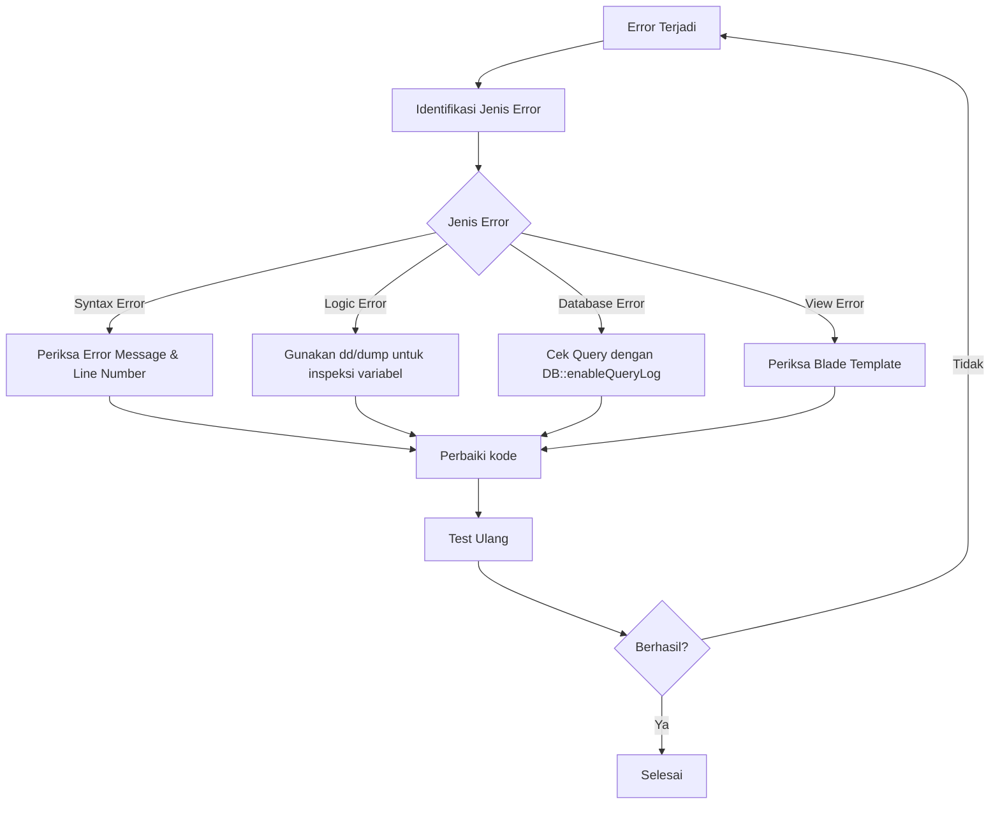

# Tutorial Praktik: Debugging Aplikasi dengan Skenario Error

Pada tutorial praktik ini, kita akan belajar menerapkan teknik debugging di aplikasi Laravel Mahasiswa dengan beberapa skenario umum. Mari kita mulai dengan langkah-langkah yang terstruktur.

## Persiapan Skenario Debugging

Berikut beberapa skenario error yang akan kita tangani dalam aplikasi Mahasiswa:

1. Error saat menambahkan data mahasiswa
2. Error saat menampilkan relasi mahasiswa-jurusan
3. Error pada validasi form
4. Error koneksi database

## Alur Debugging di Laravel



## Langkah-Langkah Praktis Debugging

### 1. Skenario: Error Saat Menambahkan Data Mahasiswa

#### Identifikasi Error
Misalkan kita mendapatkan error "SQLSTATE[23000]: Integrity constraint violation" saat menambah mahasiswa baru.

#### Langkah Debugging:

1. **Aktifkan query log untuk melihat SQL yang dijalankan:**

```php
// Di awal method controller
DB::enableQueryLog();

// Kode yang menghasilkan error
Mahasiswa::create($request->all());

// Di akhir method controller, atau sebelum error muncul
dd(DB::getQueryLog());
```

2. **Praktik: Implementasikan pada MahasiswaController.php**

```php
public function store(Request $request)
{
    // Enable SQL query logging
    DB::enableQueryLog();
    
    try {
        // Validasi input
        $validated = $request->validate([
            'nim' => 'required|unique:mahasiswa,nim',
            'nama' => 'required',
            'jurusan_id' => 'required|exists:jurusan,id',
            'email' => 'required|email|unique:mahasiswa,email',
        ]);
        
        // Debug: Periksa nilai yang akan disimpan
        logger('Data yang akan disimpan:', $validated);
        
        // Coba simpan data
        $mahasiswa = Mahasiswa::create($validated);
        
        // Debug: Cek ID yang dihasilkan
        logger('Mahasiswa berhasil disimpan dengan ID: ' . $mahasiswa->id);
        
        return redirect()->route('mahasiswa.index')
            ->with('success', 'Data mahasiswa berhasil disimpan');
            
    } catch (\Exception $e) {
        // Log error detail
        logger('Error saat menyimpan mahasiswa: ' . $e->getMessage());
        logger('SQL yang dijalankan:', DB::getQueryLog());
        
        return redirect()->back()
            ->with('error', 'Gagal menyimpan data mahasiswa: ' . $e->getMessage())
            ->withInput();
    }
}
```

### 2. Skenario: Error Pada Relasi Mahasiswa-Jurusan

#### Identifikasi Error
Misalkan kita mendapatkan error "Property [nama] does not exist on this collection instance" saat menampilkan nama jurusan.

#### Langkah Debugging:

1. **Gunakan dd() untuk memeriksa struktur objek relasi:**

```php
// Di controller atau view
$mahasiswa = Mahasiswa::find(1);
dd($mahasiswa->jurusan);
```

2. **Praktik: Debug relasi di view dengan pengecekan bertahap**

```php
// Buat method di controller untuk debugging
public function debugRelasi($id)
{
    $mahasiswa = Mahasiswa::find($id);
    
    // Periksa apakah mahasiswa ditemukan
    if (!$mahasiswa) {
        dd('Mahasiswa dengan ID ' . $id . ' tidak ditemukan');
    }
    
    // Periksa relasi jurusan
    if ($mahasiswa->jurusan) {
        dd([
            'mahasiswa' => $mahasiswa->toArray(),
            'jurusan' => $mahasiswa->jurusan->toArray()
        ]);
    } else {
        dd([
            'mahasiswa' => $mahasiswa->toArray(),
            'jurusan' => null,
            'jurusan_id' => $mahasiswa->jurusan_id
        ]);
    }
}
```

3. **Periksa definisi relasi di model:**

```php
// Pastikan relasi di model Mahasiswa sudah benar
public function jurusan()
{
    // Debug: Tampilkan foreign key yang digunakan
    logger('Foreign key yang digunakan: jurusan_id');
    
    return $this->belongsTo(Jurusan::class, 'jurusan_id');
}
```

### 3. Skenario: Error Pada Validasi Form

#### Identifikasi Error
Form validasi tidak menampilkan pesan error yang seharusnya muncul.

#### Langkah Debugging:

1. **Periksa error dengan metode debugging validasi:**

```php
public function store(Request $request)
{
    // Debug validasi rules
    logger('Validation rules:', [
        'nim' => 'required|unique:mahasiswa,nim',
        'nama' => 'required',
        'jurusan_id' => 'required|exists:jurusan,id',
        'email' => 'required|email|unique:mahasiswa,email',
    ]);
    
    // Debug input yang diterima
    logger('Input received:', $request->all());
    
    $validator = Validator::make($request->all(), [
        'nim' => 'required|unique:mahasiswa,nim',
        'nama' => 'required',
        'jurusan_id' => 'required|exists:jurusan,id',
        'email' => 'required|email|unique:mahasiswa,email',
    ]);
    
    // Debug: Periksa hasil validasi
    if ($validator->fails()) {
        logger('Validation errors:', $validator->errors()->toArray());
        
        return redirect()->back()
            ->withErrors($validator)
            ->withInput();
    }
    
    // Lanjutkan proses
    Mahasiswa::create($validator->validated());
    
    return redirect()->route('mahasiswa.index')
        ->with('success', 'Data mahasiswa berhasil disimpan');
}
```

2. **Periksa view untuk memastikan pesan error ditampilkan:**

```blade
<div class="form-group">
    <label for="nim">NIM</label>
    <input type="text" name="nim" id="nim" class="form-control @error('nim') is-invalid @enderror" value="{{ old('nim') }}">
    @error('nim')
        <!-- Debug: Tampilkan error message -->
        <div class="invalid-feedback">{{ $message }}</div>
    @enderror
</div>
```

### 4. Skenario: Error Koneksi Database

#### Identifikasi Error
Misalkan kita mendapatkan error "SQLSTATE[HY000] [2002] Connection refused".

#### Langkah Debugging:

1. **Buat helper function untuk debug koneksi database:**

```php
// Tambahkan di routes/web.php atau buat controller debug khusus
Route::get('/debug-db', function() {
    try {
        // Tes koneksi database
        DB::connection()->getPdo();
        $dbInfo = [
            'connected' => true,
            'database_name' => DB::connection()->getDatabaseName(),
            'host' => config('database.connections.mysql.host'),
            'port' => config('database.connections.mysql.port'),
        ];
        
        // Tampilkan info koneksi
        echo "<h1>Database Connection Info</h1>";
        echo "<pre>" . print_r($dbInfo, true) . "</pre>";
        
        // Tampilkan tabel yang ada
        echo "<h2>Tables:</h2>";
        $tables = DB::select('SHOW TABLES');
        echo "<pre>" . print_r($tables, true) . "</pre>";
        
    } catch (\Exception $e) {
        die("Database connection failed: " . $e->getMessage());
    }
});
```

2. **Periksa konfigurasi database:**

```php
// Buat route untuk debug konfigurasi database (jangan gunakan di production!)
Route::get('/debug-db-config', function() {
    return [
        'DB_CONNECTION' => env('DB_CONNECTION'),
        'DB_HOST' => env('DB_HOST'),
        'DB_PORT' => env('DB_PORT'),
        'DB_DATABASE' => env('DB_DATABASE'),
        'DB_USERNAME' => env('DB_USERNAME'),
        // Jangan tampilkan password di production!
        'DB_PASSWORD' => env('DB_PASSWORD') ? 'Exists but hidden' : 'Missing',
    ];
});
```

## Latihan Praktik Debugging

### Latihan 1: Debugging dengan Laravel Telescope

1. Install Laravel Telescope:
```bash
composer require laravel/telescope --dev
php artisan telescope:install
php artisan migrate
```

2. Akses dashboard Telescope di `/telescope` untuk melihat:
   - Requests yang dilakukan
   - Queries database
   - Log yang dihasilkan
   - Cache yang digunakan
   - Mail yang dikirim

### Latihan 2: Membuat Error Sengaja dan Memperbaikinya

1. Buat error dengan sengaja di model Mahasiswa (misalnya typo pada nama field):
```php
// Model/Mahasiswa.php
protected $fillable = ['nim', 'nama_lengkap', 'email', 'jurusan_id']; 
// seharusnya 'nama' bukan 'nama_lengkap'
```

2. Buat form untuk menambah mahasiswa baru dengan field `nama`

3. Jalankan aplikasi dan perhatikan error yang muncul

4. Gunakan teknik debugging yang sudah dipelajari untuk:
   - Identifikasi error
   - Catat pesan error di log
   - Perbaiki kode yang salah
   - Verifikasi solusi

### Latihan 3: Buat Halaman Rangkuman Debug Info

Buat halaman admin khusus yang menampilkan informasi debug penting:

```php
Route::get('/admin/debug-info', function() {
    // Info aplikasi
    $appInfo = [
        'Laravel Version' => app()->version(),
        'PHP Version' => phpversion(),
        'Environment' => app()->environment(),
        'Debug Mode' => config('app.debug') ? 'ON' : 'OFF',
    ];
    
    // Status database
    try {
        DB::connection()->getPdo();
        $dbStatus = 'Connected to: ' . DB::connection()->getDatabaseName();
    } catch (\Exception $e) {
        $dbStatus = 'Error: ' . $e->getMessage();
    }
    
    // Status cache
    try {
        $cacheStatus = Cache::store()->getDefaultDriver();
    } catch (\Exception $e) {
        $cacheStatus = 'Error: ' . $e->getMessage();
    }
    
    // Data statistik
    $stats = [
        'Total Mahasiswa' => \App\Models\Mahasiswa::count(),
        'Total Jurusan' => \App\Models\Jurusan::count(),
        'Free Disk Space' => round(disk_free_space('/') / 1024 / 1024 / 1024, 2) . ' GB',
        'Server Memory Usage' => round(memory_get_usage() / 1024 / 1024, 2) . ' MB',
    ];
    
    return view('admin.debug-info', compact('appInfo', 'dbStatus', 'cacheStatus', 'stats'));
});
```

## Tips Debugging Lanjutan

1. **Gunakan Log Levels yang Sesuai:**
```php
Log::emergency('Sistem tidak bisa diakses');
Log::alert('Database crash');
Log::critical('Komponen kritikal gagal');
Log::error('Error saat proses data');
Log::warning('Potensi masalah terdeteksi');
Log::notice('Sesuatu yang perlu diperhatikan');
Log::info('Info umum aplikasi');
Log::debug('Info detail untuk debugging');
```

2. **Gunakan session flash untuk tracking proses:**
```php
// Di setiap tahap proses
$request->session()->flash('debug_step_1', 'Data validasi OK');
$request->session()->flash('debug_step_2', 'Data tersimpan di database');
```

3. **Buat helper function debugging:**
```php
// Di helpers.php
if (!function_exists('debug_to_log')) {
    function debug_to_log($data, $title = 'Debug Info') {
        Log::debug($title . ': ' . print_r($data, true));
    }
}
```

Dengan melakukan praktik debugging seperti ini secara terstruktur, Anda akan lebih mudah menemukan dan memperbaiki error dalam aplikasi Laravel Mahasiswa Anda!