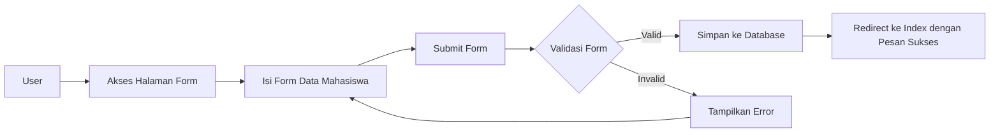

# Tutorial: Membuat Form Tambah Data Mahasiswa

Dalam tutorial ini, kita akan belajar cara membuat form untuk menambahkan data mahasiswa baru pada aplikasi Laravel Mahasiswa. Mari kita mulai dengan langkah-langkah yang terstruktur.

## Alur Kerja Form Tambah Data



## Langkah 1: Membuat Route

Pertama, buat route untuk menampilkan form dan memproses data form:

```php
// routes/web.php
Route::get('/mahasiswa/create', [MahasiswaController::class, 'create'])->name('mahasiswa.create');
Route::post('/mahasiswa', [MahasiswaController::class, 'store'])->name('mahasiswa.store');
```

## Langkah 2: Membuat Controller

Selanjutnya, buat atau edit controller untuk menangani form tambah data:

```php
// app/Http/Controllers/MahasiswaController.php
namespace App\Http\Controllers;

use App\Models\Mahasiswa;
use App\Models\Jurusan;
use Illuminate\Http\Request;

class MahasiswaController extends Controller
{
    // Menampilkan form tambah data
    public function create()
    {
        // Ambil data jurusan untuk dropdown
        $jurusan = Jurusan::all();
        return view('mahasiswa.create', compact('jurusan'));
    }
    
    // Memproses form tambah data
    public function store(Request $request)
    {
        // Validasi data input
        $validated = $request->validate([
            'nim' => 'required|string|max:20|unique:mahasiswa,nim',
            'nama' => 'required|string|max:100',
            'email' => 'required|email|unique:mahasiswa,email',
            'jurusan_id' => 'required|exists:jurusan,id',
            'alamat' => 'nullable|string',
            'tanggal_lahir' => 'nullable|date',
        ]);
        
        // Simpan data mahasiswa
        Mahasiswa::create($validated);
        
        // Redirect ke halaman index dengan pesan sukses
        return redirect()->route('mahasiswa.index')
            ->with('success', 'Data mahasiswa berhasil ditambahkan!');
    }
}
```

## Langkah 3: Membuat View Form

Buat file view untuk form tambah data:

```php
// resources/views/mahasiswa/create.blade.php
@extends('layouts.app')

@section('content')
<div class="container">
    <div class="row">
        <div class="col-md-8 offset-md-2">
            <div class="card">
                <div class="card-header">
                    <h4>Tambah Data Mahasiswa</h4>
                </div>
                <div class="card-body">
                    @if ($errors->any())
                        <div class="alert alert-danger">
                            <ul>
                                @foreach ($errors->all() as $error)
                                    <li>{{ $error }}</li>
                                @endforeach
                            </ul>
                        </div>
                    @endif
                    
                    <form action="{{ route('mahasiswa.store') }}" method="POST">
                        @csrf
                        
                        <div class="form-group mb-3">
                            <label for="nim">NIM <span class="text-danger">*</span></label>
                            <input type="text" class="form-control @error('nim') is-invalid @enderror" id="nim" name="nim" value="{{ old('nim') }}">
                            @error('nim')
                                <div class="invalid-feedback">{{ $message }}</div>
                            @enderror
                        </div>
                        
                        <div class="form-group mb-3">
                            <label for="nama">Nama Lengkap <span class="text-danger">*</span></label>
                            <input type="text" class="form-control @error('nama') is-invalid @enderror" id="nama" name="nama" value="{{ old('nama') }}">
                            @error('nama')
                                <div class="invalid-feedback">{{ $message }}</div>
                            @enderror
                        </div>
                        
                        <div class="form-group mb-3">
                            <label for="email">Email <span class="text-danger">*</span></label>
                            <input type="email" class="form-control @error('email') is-invalid @enderror" id="email" name="email" value="{{ old('email') }}">
                            @error('email')
                                <div class="invalid-feedback">{{ $message }}</div>
                            @enderror
                        </div>
                        
                        <div class="form-group mb-3">
                            <label for="jurusan_id">Jurusan <span class="text-danger">*</span></label>
                            <select class="form-control @error('jurusan_id') is-invalid @enderror" id="jurusan_id" name="jurusan_id">
                                <option value="">-- Pilih Jurusan --</option>
                                @foreach ($jurusan as $jrs)
                                    <option value="{{ $jrs->id }}" {{ old('jurusan_id') == $jrs->id ? 'selected' : '' }}>
                                        {{ $jrs->nama }}
                                    </option>
                                @endforeach
                            </select>
                            @error('jurusan_id')
                                <div class="invalid-feedback">{{ $message }}</div>
                            @enderror
                        </div>
                        
                        <div class="form-group mb-3">
                            <label for="tanggal_lahir">Tanggal Lahir</label>
                            <input type="date" class="form-control @error('tanggal_lahir') is-invalid @enderror" id="tanggal_lahir" name="tanggal_lahir" value="{{ old('tanggal_lahir') }}">
                            @error('tanggal_lahir')
                                <div class="invalid-feedback">{{ $message }}</div>
                            @enderror
                        </div>
                        
                        <div class="form-group mb-3">
                            <label for="alamat">Alamat</label>
                            <textarea class="form-control @error('alamat') is-invalid @enderror" id="alamat" name="alamat" rows="3">{{ old('alamat') }}</textarea>
                            @error('alamat')
                                <div class="invalid-feedback">{{ $message }}</div>
                            @enderror
                        </div>
                        
                        <div class="form-group d-flex justify-content-between">
                            <a href="{{ route('mahasiswa.index') }}" class="btn btn-secondary">Kembali</a>
                            <button type="submit" class="btn btn-primary">Simpan Data</button>
                        </div>
                    </form>
                </div>
            </div>
        </div>
    </div>
</div>
@endsection
```

## Langkah 4: Pastikan Model Memiliki Properti Fillable yang Sesuai

Edit model Mahasiswa untuk memastikan properti fillable sesuai:

```php
// app/Models/Mahasiswa.php
namespace App\Models;

use Illuminate\Database\Eloquent\Factories\HasFactory;
use Illuminate\Database\Eloquent\Model;

class Mahasiswa extends Model
{
    use HasFactory;
    
    protected $table = 'mahasiswa';
    
    protected $fillable = [
        'nim',
        'nama',
        'email',
        'jurusan_id',
        'tanggal_lahir',
        'alamat'
    ];
    
    // Relasi dengan jurusan
    public function jurusan()
    {
        return $this->belongsTo(Jurusan::class);
    }
}
```

## Langkah 5: Membuat Link ke Form Tambah Data

Tambahkan link di halaman index untuk menuju ke form tambah data:

```php
<!-- resources/views/mahasiswa/index.blade.php (bagian yang ditambahkan) -->
<div class="d-flex justify-content-between mb-3">
    <h4>Daftar Mahasiswa</h4>
    <a href="{{ route('mahasiswa.create') }}" class="btn btn-primary">
        <i class="bi bi-plus-circle"></i> Tambah Mahasiswa
    </a>
</div>
```

## Langkah 6: Menampilkan Pesan Flash

Edit layout untuk menampilkan pesan sukses/error:

```php
<!-- resources/views/layouts/app.blade.php (di dalam container sebelum @yield('content')) -->
@if (session('success'))
    <div class="alert alert-success alert-dismissible fade show" role="alert">
        {{ session('success') }}
        <button type="button" class="btn-close" data-bs-dismiss="alert" aria-label="Close"></button>
    </div>
@endif

@if (session('error'))
    <div class="alert alert-danger alert-dismissible fade show" role="alert">
        {{ session('error') }}
        <button type="button" class="btn-close" data-bs-dismiss="alert" aria-label="Close"></button>
    </div>
@endif
```

## Langkah 7: Testing Form

Sekarang saatnya menguji form dengan langkah-langkah berikut:

1. Buka halaman daftar mahasiswa
2. Klik tombol "Tambah Mahasiswa"
3. Isi form dengan data yang valid
4. Klik tombol "Simpan Data"
5. Verifikasi bahwa data berhasil disimpan dan muncul di daftar mahasiswa

## Langkah 8: Menambahkan JavaScript untuk Validasi Form (Opsional)

Untuk meningkatkan user experience, tambahkan validasi client-side:

```html
<!-- Tambahkan di bagian bawah view create.blade.php -->
@section('scripts')
<script>
    document.addEventListener('DOMContentLoaded', function() {
        const form = document.querySelector('form');
        
        form.addEventListener('submit', function(event) {
            let valid = true;
            
            // Validasi NIM
            const nim = document.getElementById('nim');
            if (!nim.value.trim()) {
                setInvalid(nim, 'NIM tidak boleh kosong');
                valid = false;
            } else if (nim.value.length > 20) {
                setInvalid(nim, 'NIM maksimal 20 karakter');
                valid = false;
            }
            
            // Validasi nama
            const nama = document.getElementById('nama');
            if (!nama.value.trim()) {
                setInvalid(nama, 'Nama tidak boleh kosong');
                valid = false;
            }
            
            // Validasi email
            const email = document.getElementById('email');
            if (!email.value.trim()) {
                setInvalid(email, 'Email tidak boleh kosong');
                valid = false;
            } else if (!isValidEmail(email.value)) {
                setInvalid(email, 'Format email tidak valid');
                valid = false;
            }
            
            // Validasi jurusan
            const jurusan = document.getElementById('jurusan_id');
            if (!jurusan.value) {
                setInvalid(jurusan, 'Jurusan harus dipilih');
                valid = false;
            }
            
            if (!valid) {
                event.preventDefault();
            }
        });
        
        function setInvalid(element, message) {
            element.classList.add('is-invalid');
            const feedback = element.nextElementSibling;
            if (feedback && feedback.classList.contains('invalid-feedback')) {
                feedback.textContent = message;
            }
        }
        
        function isValidEmail(email) {
            const regex = /^[^\s@]+@[^\s@]+\.[^\s@]+$/;
            return regex.test(email);
        }
        
        // Reset validasi saat input diubah
        const inputs = document.querySelectorAll('.form-control');
        inputs.forEach(input => {
            input.addEventListener('input', function() {
                this.classList.remove('is-invalid');
            });
        });
    });
</script>
@endsection
```

## Tips Tambahan

1. **Gunakan Komponen Form yang Dapat Digunakan Kembali**

Untuk efisiensi, bisa membuat partial form yang reusable:

```php
<!-- resources/views/components/form/input.blade.php -->
@props(['label', 'name', 'type' => 'text', 'required' => false])

<div class="form-group mb-3">
    <label for="{{ $name }}">{{ $label }} @if($required)<span class="text-danger">*</span>@endif</label>
    <input 
        type="{{ $type }}" 
        class="form-control @error($name) is-invalid @enderror" 
        id="{{ $name }}" 
        name="{{ $name }}" 
        value="{{ old($name) }}"
        {{ $attributes }}
    >
    @error($name)
        <div class="invalid-feedback">{{ $message }}</div>
    @enderror
</div>
```

Penggunaan:

```php
<x-form.input label="NIM" name="nim" required="true" />
```

2. **Menambahkan Button Batal**

Tambahkan tombol batal untuk UX yang lebih baik:

```html
<div class="form-group d-flex justify-content-between">
    <a href="{{ route('mahasiswa.index') }}" class="btn btn-secondary">
        <i class="bi bi-arrow-left"></i> Batal
    </a>
    <button type="submit" class="btn btn-primary">
        <i class="bi bi-save"></i> Simpan Data
    </button>
</div>
```

3. **Penambahan Field Foto Mahasiswa**

Jika ingin menambahkan upload foto:

```html
<div class="form-group mb-3">
    <label for="foto">Foto Mahasiswa</label>
    <input type="file" class="form-control @error('foto') is-invalid @enderror" id="foto" name="foto">
    @error('foto')
        <div class="invalid-feedback">{{ $message }}</div>
    @enderror
</div>
```

Dan ubah controller:

```php
public function store(Request $request)
{
    $validated = $request->validate([
        // validasi lainnya
        'foto' => 'nullable|image|mimes:jpeg,png,jpg|max:2048',
    ]);
    
    if ($request->hasFile('foto')) {
        $fotoPath = $request->file('foto')->store('mahasiswa', 'public');
        $validated['foto'] = $fotoPath;
    }
    
    Mahasiswa::create($validated);
    
    return redirect()->route('mahasiswa.index')->with('success', 'Data mahasiswa berhasil ditambahkan!');
}
```

Dengan mengikuti langkah-langkah ini, Anda akan berhasil membuat form tambah data mahasiswa yang lengkap dengan validasi dan proses penyimpanan data ke database. Selamat mencoba!