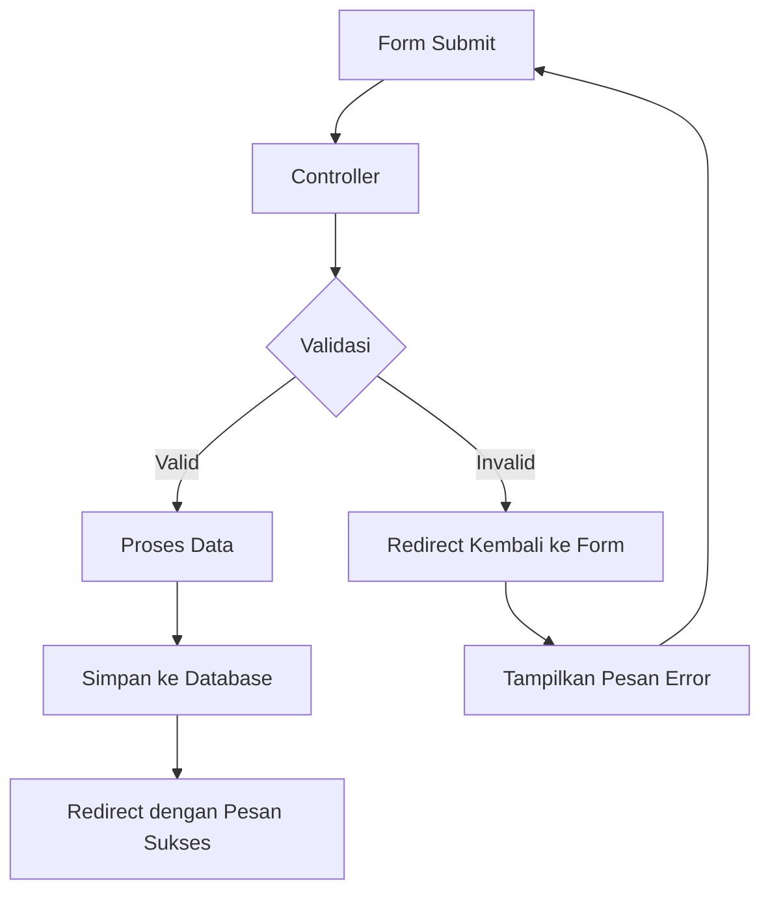
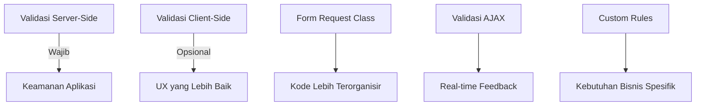

# Validasi Input Data pada Form Mahasiswa

Validasi input pengguna adalah komponen penting dalam pengembangan aplikasi web untuk memastikan bahwa data yang dimasukkan sesuai dengan format yang diharapkan. Laravel menyediakan beberapa cara mudah untuk mengimplementasikan validasi. Dalam tutorial ini, kita akan membahas cara validasi data input pada aplikasi Mahasiswa.

## Alur Kerja Validasi Input



## Langkah 1: Menambahkan Validasi pada Controller

Untuk menerapkan validasi pada controller, tambahkan kode validasi di method `store` dan `update`:

```php
// app/Http/Controllers/MahasiswaController.php
public function store(Request $request)
{
    // Validasi data input
    $validated = $request->validate([
        'nim' => 'required|string|max:20|unique:mahasiswa,nim',
        'nama' => 'required|string|max:100',
        'email' => 'required|email|unique:mahasiswa,email',
        'jurusan_id' => 'required|exists:jurusan,id',
        'alamat' => 'nullable|string',
        'tanggal_lahir' => 'nullable|date',
    ]);
    
    // Simpan data mahasiswa
    Mahasiswa::create($validated);
    
    return redirect()->route('mahasiswa.index')
        ->with('success', 'Data mahasiswa berhasil ditambahkan!');
}
```

## Langkah 2: Aturan Validasi yang Umum Digunakan

Berikut adalah beberapa aturan validasi yang sering digunakan di Laravel:

| Aturan | Deskripsi | Contoh |
|--------|-----------|--------|
| required | Field wajib diisi | `'nama' => 'required'` |
| string | Field harus berupa string | `'nama' => 'string'` |
| integer | Field harus berupa bilangan bulat | `'umur' => 'integer'` |
| email | Field harus format email valid | `'email' => 'email'` |
| numeric | Field harus berupa angka | `'nilai' => 'numeric'` |
| date | Field harus tanggal valid | `'tanggal_lahir' => 'date'` |
| min:n | Nilai minimal (string/angka) | `'password' => 'min:8'` |
| max:n | Nilai maksimal (string/angka) | `'nim' => 'max:20'` |
| size:n | Ukuran tepat (string/angka) | `'kode_pos' => 'size:5'` |
| unique:table,column | Nilai harus unik | `'email' => 'unique:mahasiswa,email'` |
| exists:table,column | Nilai harus ada di tabel | `'jurusan_id' => 'exists:jurusan,id'` |
| image | File harus berupa gambar | `'foto' => 'image'` |
| mimes:ext1,ext2 | File dengan ekstensi tertentu | `'foto' => 'mimes:jpeg,png,jpg'` |
| nullable | Field boleh kosong | `'alamat' => 'nullable'` |

## Langkah 3: Menampilkan Pesan Error di View

Buat bagian untuk menampilkan pesan error pada form:

```php
<!-- resources/views/mahasiswa/create.blade.php -->
<div class="form-group mb-3">
    <label for="nim">NIM <span class="text-danger">*</span></label>
    <input type="text" class="form-control @error('nim') is-invalid @enderror" id="nim" name="nim" value="{{ old('nim') }}">
    @error('nim')
        <div class="invalid-feedback">{{ $message }}</div>
    @enderror
</div>
```

## Langkah 4: Menyimpan Input Lama dengan old()

Untuk menjaga nilai input setelah validasi gagal, gunakan fungsi `old()`:

```php
<input type="text" class="form-control" name="nama" value="{{ old('nama') }}">
```

## Langkah 5: Menambahkan Validasi Kustom

Untuk kasus yang lebih kompleks, buat validasi kustom:

```php
// app/Http/Controllers/MahasiswaController.php
public function store(Request $request)
{
    $request->validate([
        'nim' => [
            'required',
            'string',
            'max:20',
            'unique:mahasiswa,nim',
            function ($attribute, $value, $fail) {
                // Format NIM: dua huruf diikuti 8 digit angka
                if (!preg_match('/^[A-Z]{2}\d{8}$/', $value)) {
                    $fail('Format NIM tidak valid. Format yang benar: XX12345678');
                }
            },
        ],
        // validasi lainnya
    ]);
    
    // lanjutkan proses penyimpanan data
}
```

## Langkah 6: Menggunakan Form Request untuk Validasi Terpisah

Untuk validasi yang lebih terorganisir, buat Form Request:

```bash
php artisan make:request StoreMahasiswaRequest
```

Kemudian edit file request yang dibuat:

```php
// app/Http/Requests/StoreMahasiswaRequest.php
namespace App\Http\Requests;

use Illuminate\Foundation\Http\FormRequest;

class StoreMahasiswaRequest extends FormRequest
{
    public function authorize()
    {
        return true; // Izinkan akses
    }

    public function rules()
    {
        return [
            'nim' => 'required|string|max:20|unique:mahasiswa,nim',
            'nama' => 'required|string|max:100',
            'email' => 'required|email|unique:mahasiswa,email',
            'jurusan_id' => 'required|exists:jurusan,id',
            'alamat' => 'nullable|string',
            'tanggal_lahir' => 'nullable|date',
        ];
    }
    
    public function messages()
    {
        return [
            'nim.required' => 'NIM wajib diisi',
            'nim.unique' => 'NIM sudah terdaftar',
            'nama.required' => 'Nama wajib diisi',
            'email.required' => 'Email wajib diisi',
            'email.email' => 'Format email tidak valid',
            'email.unique' => 'Email sudah terdaftar',
            'jurusan_id.required' => 'Jurusan wajib dipilih',
            'jurusan_id.exists' => 'Jurusan tidak valid',
            'tanggal_lahir.date' => 'Format tanggal tidak valid',
        ];
    }
}
```

Lalu gunakan di controller:

```php
// app/Http/Controllers/MahasiswaController.php
use App\Http\Requests\StoreMahasiswaRequest;

public function store(StoreMahasiswaRequest $request)
{
    // Data sudah tervalidasi
    Mahasiswa::create($request->validated());
    
    return redirect()->route('mahasiswa.index')
        ->with('success', 'Data mahasiswa berhasil ditambahkan!');
}
```

## Langkah 7: Validasi untuk Update Data

Untuk update, perlu pengecualian unique ID saat ini:

```php
// app/Http/Requests/UpdateMahasiswaRequest.php
public function rules()
{
    return [
        'nim' => 'required|string|max:20|unique:mahasiswa,nim,'.$this->mahasiswa,
        'email' => 'required|email|unique:mahasiswa,email,'.$this->mahasiswa,
        // aturan lainnya
    ];
}
```

## Langkah 8: Validasi dengan AJAX (Opsional)

Tambahkan validasi real-time dengan Ajax untuk pengalaman pengguna yang lebih baik:

```js
// resources/js/validation.js
$(document).ready(function() {
    $('#nim').on('blur', function() {
        let nim = $(this).val();
        
        if (nim) {
            $.ajax({
                url: '/validate/nim',
                type: 'POST',
                data: {
                    _token: $('meta[name="csrf-token"]').attr('content'),
                    nim: nim
                },
                success: function(response) {
                    if (response.valid) {
                        $('#nim').removeClass('is-invalid').addClass('is-valid');
                        $('#nim-feedback').hide();
                    } else {
                        $('#nim').removeClass('is-valid').addClass('is-invalid');
                        $('#nim-feedback').text(response.message).show();
                    }
                }
            });
        }
    });
});
```

Route untuk validasi AJAX:

```php
// routes/web.php
Route::post('/validate/nim', [ValidationController::class, 'validateNim']);
```

Controller validasi:

```php
// app/Http/Controllers/ValidationController.php
public function validateNim(Request $request)
{
    $nim = $request->input('nim');
    $mahasiswaId = $request->input('mahasiswa_id'); // Untuk update
    
    // Cek apakah NIM sudah ada
    $exists = Mahasiswa::where('nim', $nim)
        ->when($mahasiswaId, function($query, $mahasiswaId) {
            return $query->where('id', '!=', $mahasiswaId);
        })
        ->exists();
    
    if ($exists) {
        return response()->json([
            'valid' => false,
            'message' => 'NIM sudah digunakan'
        ]);
    }
    
    // Validasi format NIM
    if (!preg_match('/^[A-Z]{2}\d{8}$/', $nim)) {
        return response()->json([
            'valid' => false,
            'message' => 'Format NIM tidak valid. Format yang benar: XX12345678'
        ]);
    }
    
    return response()->json(['valid' => true]);
}
```

## Langkah 9: Praktik Terbaik Validasi



### Tips Validasi:

1. **Selalu gunakan validasi server-side**, tidak hanya client-side
2. **Buat pesan validasi yang jelas** untuk membantu pengguna
3. **Simpan nilai input lama** dengan `old()` untuk meningkatkan UX
4. **Gunakan Form Request** untuk validasi kompleks dan berulang
5. **Validasi data sensitif** dengan hati-hati (misalnya password)

## Langkah 10: Latihan Praktik

### Latihan 1: Validasi Data Mahasiswa

1. Buat validasi untuk memastikan format NIM sesuai standar (contoh: dua huruf diikuti 8 digit)
2. Tambahkan validasi email dengan domain spesifik (@student.universitasanda.ac.id)
3. Validasi tanggal lahir agar mahasiswa minimal berusia 17 tahun
4. Tambahkan validasi tambahan untuk nomor telepon dengan format yang benar

### Latihan 2: Membuat Form Request untuk Validasi

1. Buat Form Request untuk proses tambah mahasiswa
2. Buat Form Request untuk proses update mahasiswa
3. Tambahkan pesan validasi kustom di masing-masing Form Request

### Contoh Solusi Latihan 1

```php
// Validasi di controller
$request->validate([
    'nim' => [
        'required', 
        'string', 
        'max:20', 
        'unique:mahasiswa,nim',
        'regex:/^[A-Z]{2}\d{8}$/'
    ],
    'email' => [
        'required', 
        'email', 
        'unique:mahasiswa,email',
        'regex:/@student\.universitasanda\.ac\.id$/'
    ],
    'tanggal_lahir' => [
        'nullable', 
        'date', 
        function ($attribute, $value, $fail) {
            $minAge = Carbon::now()->subYears(17);
            $birthDate = Carbon::parse($value);
            
            if ($birthDate->isAfter($minAge)) {
                $fail('Mahasiswa minimal berusia 17 tahun.');
            }
        }
    ],
    'telepon' => [
        'nullable', 
        'regex:/^08[0-9]{8,11}$/'
    ],
]);
```

Dengan menguasai teknik validasi di Laravel, Anda dapat memastikan bahwa data yang masuk ke aplikasi Anda sesuai dengan kriteria yang diharapkan, meningkatkan integritas data, dan memberikan feedback yang jelas kepada pengguna.