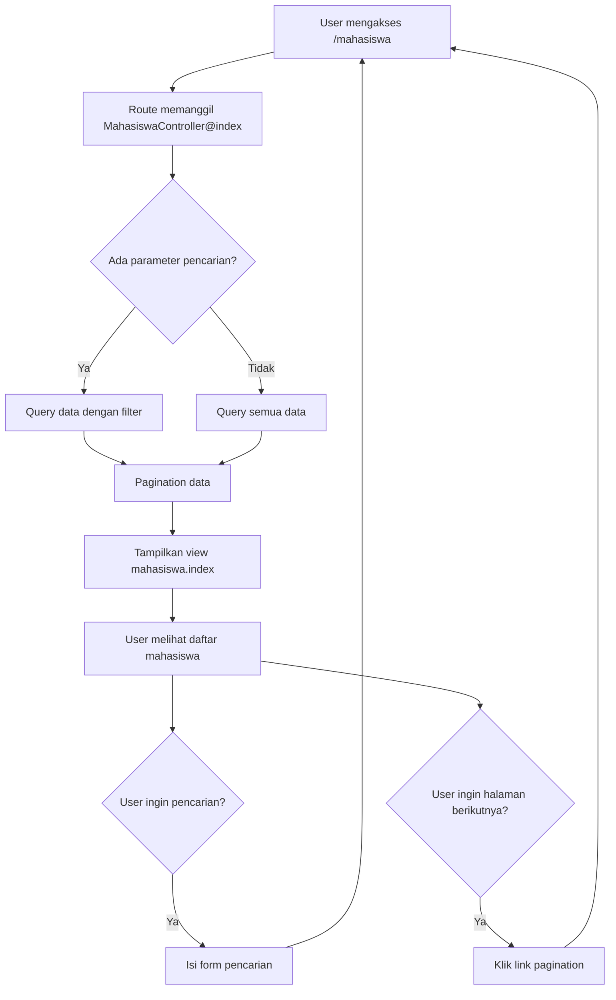

# Tutorial: Menampilkan Daftar Mahasiswa di Laravel

## Langkah 1: Persiapkan Model dan Migrasi

Pastikan model `Mahasiswa` dan migrasi tabel sudah dibuat sebelumnya.

```php
// app/Models/Mahasiswa.php
namespace App\Models;

use Illuminate\Database\Eloquent\Factories\HasFactory;
use Illuminate\Database\Eloquent\Model;

class Mahasiswa extends Model
{
    use HasFactory;
    
    protected $table = 'mahasiswa';
    protected $fillable = ['nim', 'nama', 'alamat', 'jurusan_id', 'tanggal_lahir', 'email'];
}
```

## Langkah 2: Buat Controller untuk Daftar Mahasiswa

```bash
php artisan make:controller MahasiswaController
```

## Langkah 3: Tambahkan Method Index

Buka file controller yang baru dibuat dan tambahkan method `index` untuk menampilkan daftar mahasiswa:

```php
// app/Http/Controllers/MahasiswaController.php
namespace App\Http\Controllers;

use App\Models\Mahasiswa;
use Illuminate\Http\Request;

class MahasiswaController extends Controller
{
    public function index()
    {
        // Ambil semua data mahasiswa
        $mahasiswa = Mahasiswa::orderBy('nama', 'asc')->paginate(10);
        
        // Tampilkan view dengan data mahasiswa
        return view('mahasiswa.index', ['mahasiswa' => $mahasiswa]);
    }
}
```

## Langkah 4: Buat Route untuk Daftar Mahasiswa

Tambahkan route di file `routes/web.php`:

```php
// routes/web.php
use App\Http\Controllers\MahasiswaController;

Route::get('/mahasiswa', [MahasiswaController::class, 'index'])->name('mahasiswa.index');
```

## Langkah 5: Buat View untuk Menampilkan Daftar

Buat folder `mahasiswa` di dalam folder `resources/views` dan buat file `index.blade.php`:

```bash
mkdir -p resources/views/mahasiswa
touch resources/views/mahasiswa/index.blade.php
```

## Langkah 6: Isi View dengan Tabel Daftar Mahasiswa

```html
<!-- resources/views/mahasiswa/index.blade.php -->
@extends('layouts.app')

@section('content')
    <div class="container">
        <h2>Daftar Mahasiswa</h2>
        
        <div class="mb-3">
            <a href="{{ route('mahasiswa.create') }}" class="btn btn-primary">Tambah Mahasiswa</a>
        </div>
        
        @if(session('success'))
            <div class="alert alert-success">
                {{ session('success') }}
            </div>
        @endif
        
        <div class="card">
            <div class="card-body">
                <table class="table table-striped">
                    <thead>
                        <tr>
                            <th>NIM</th>
                            <th>Nama</th>
                            <th>Jurusan</th>
                            <th>Email</th>
                            <th>Aksi</th>
                        </tr>
                    </thead>
                    <tbody>
                        @forelse($mahasiswa as $mhs)
                            <tr>
                                <td>{{ $mhs->nim }}</td>
                                <td>{{ $mhs->nama }}</td>
                                <td>{{ $mhs->jurusan->nama ?? 'Belum ada jurusan' }}</td>
                                <td>{{ $mhs->email }}</td>
                                <td>
                                    <a href="{{ route('mahasiswa.show', $mhs->id) }}" class="btn btn-sm btn-info">Detail</a>
                                    <a href="{{ route('mahasiswa.edit', $mhs->id) }}" class="btn btn-sm btn-warning">Edit</a>
                                    <form action="{{ route('mahasiswa.destroy', $mhs->id) }}" method="POST" class="d-inline">
                                        @csrf
                                        @method('DELETE')
                                        <button type="submit" class="btn btn-sm btn-danger" onclick="return confirm('Yakin ingin menghapus data ini?')">Hapus</button>
                                    </form>
                                </td>
                            </tr>
                        @empty
                            <tr>
                                <td colspan="5" class="text-center">Tidak ada data mahasiswa</td>
                            </tr>
                        @endforelse
                    </tbody>
                </table>
                
                <!-- Pagination Links -->
                <div class="mt-3">
                    {{ $mahasiswa->links() }}
                </div>
            </div>
        </div>
    </div>
@endsection
```

## Langkah 7: Implementasi Pencarian Data

Tambahkan fungsi pencarian di controller:

```php
// app/Http/Controllers/MahasiswaController.php
public function index(Request $request)
{
    $search = $request->input('search');
    
    $mahasiswa = Mahasiswa::query()
        ->when($search, function($query, $search) {
            return $query->where('nama', 'like', "%{$search}%")
                        ->orWhere('nim', 'like', "%{$search}%");
        })
        ->orderBy('nama', 'asc')
        ->paginate(10);
    
    return view('mahasiswa.index', [
        'mahasiswa' => $mahasiswa,
        'search' => $search
    ]);
}
```

## Langkah 8: Tambahkan Form Pencarian di View

```html
<!-- Tambahkan setelah div class="mb-3" -->
<div class="mb-3">
    <form action="{{ route('mahasiswa.index') }}" method="GET" class="row g-3">
        <div class="col-md-6">
            <div class="input-group">
                <input type="text" class="form-control" name="search" placeholder="Cari berdasarkan nama atau NIM..." value="{{ $search ?? '' }}">
                <button class="btn btn-outline-secondary" type="submit">Cari</button>
                @if($search ?? '')
                    <a href="{{ route('mahasiswa.index') }}" class="btn btn-outline-danger">Reset</a>
                @endif
            </div>
        </div>
    </form>
</div>
```

## Alur Kerja Menampilkan Daftar Mahasiswa



## Tips

1. **Pagination**: Laravel menyediakan pagination secara otomatis dengan metode `paginate()`. Untuk menampilkan link paginasi di view, gunakan `{{ $mahasiswa->links() }}`.

2. **Search dengan Query Scope**: Untuk aplikasi lebih besar, gunakan query scope di model untuk mencari data:

```php
// app/Models/Mahasiswa.php
public function scopeSearch($query, $search)
{
    return $query->where('nama', 'like', "%{$search}%")
                ->orWhere('nim', 'like', "%{$search}%");
}

// Lalu di controller
$mahasiswa = Mahasiswa::search($search)->paginate(10);
```

3. **Resource Collection**: Untuk aplikasi yang lebih kompleks, gunakan Resource untuk transformasi data:

```php
php artisan make:resource MahasiswaCollection
```

Dengan langkah-langkah di atas, Anda akan memiliki halaman daftar mahasiswa yang sudah dilengkapi dengan fitur pagination dan pencarian.
