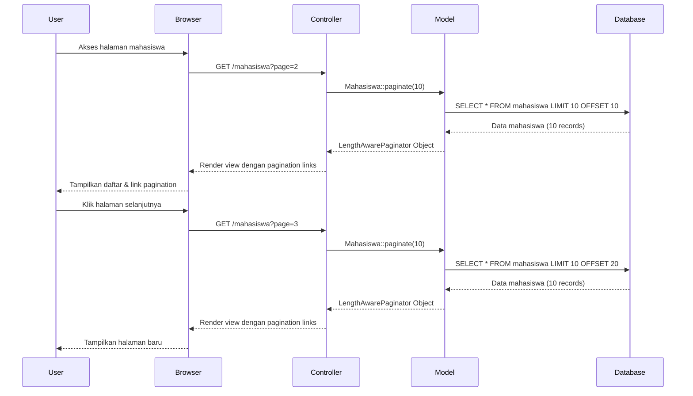

# Tutorial: Implementasi Pagination di Laravel

Pagination memungkinkan Anda menampilkan data dalam jumlah besar secara terpisah dalam beberapa halaman. Laravel menyediakan fitur pagination yang mudah digunakan dan sangat fleksibel.

## Langkah 1: Implementasi Pagination di Controller

Pagination dapat diterapkan dengan sangat mudah di Laravel dengan memodifikasi query pada controller:

```php
// app/Http/Controllers/MahasiswaController.php
namespace App\Http\Controllers;

use App\Models\Mahasiswa;
use Illuminate\Http\Request;

class MahasiswaController extends Controller
{
    public function index()
    {
        // Mengambil data dengan pagination (10 item per halaman)
        $mahasiswa = Mahasiswa::orderBy('nama', 'asc')->paginate(10);
        
        // Kirim data ke view
        return view('mahasiswa.index', compact('mahasiswa'));
    }
}
```

## Langkah 2: Menampilkan Links Pagination di View

Setelah mengatur pagination di controller, sekarang kita perlu menampilkan link navigasi halaman di view:

```html
<!-- resources/views/mahasiswa/index.blade.php -->
<div class="container">
    <h2>Daftar Mahasiswa</h2>
    
    <table class="table">
        <thead>
            <tr>
                <th>NIM</th>
                <th>Nama</th>
                <th>Email</th>
                <th>Aksi</th>
            </tr>
        </thead>
        <tbody>
            @foreach($mahasiswa as $mhs)
            <tr>
                <td>{{ $mhs->nim }}</td>
                <td>{{ $mhs->nama }}</td>
                <td>{{ $mhs->email }}</td>
                <td>
                    <a href="{{ route('mahasiswa.show', $mhs->id) }}" class="btn btn-sm btn-info">Detail</a>
                </td>
            </tr>
            @endforeach
        </tbody>
    </table>
    
    <!-- Pagination Links -->
    <div class="d-flex justify-content-center">
        {{ $mahasiswa->links() }}
    </div>
</div>
```

## Langkah 3: Konfigurasi Tampilan Pagination

### Menggunakan Bootstrap Style (Laravel 8+)

Laravel 8 dan yang lebih baru secara default menggunakan Tailwind CSS untuk tampilan pagination. Jika ingin menggunakan Bootstrap, tambahkan kode berikut di `AppServiceProvider.php`:

```php
// app/Providers/AppServiceProvider.php
namespace App\Providers;

use Illuminate\Support\ServiceProvider;
use Illuminate\Pagination\Paginator;

class AppServiceProvider extends ServiceProvider
{
    public function boot()
    {
        // Gunakan Bootstrap untuk pagination
        Paginator::useBootstrap();
    }
}
```

### Menggunakan Tailwind CSS (Default untuk Laravel 8+)

Jika ingin tetap menggunakan Tailwind CSS (default):

```php
// app/Providers/AppServiceProvider.php
// Tidak perlu konfigurasi tambahan untuk Tailwind CSS
```

## Langkah 4: Customize Jumlah Item per Halaman

Anda dapat memberikan kontrol kepada pengguna untuk menentukan berapa banyak item yang ingin ditampilkan per halaman:

```php
// app/Http/Controllers/MahasiswaController.php
public function index(Request $request)
{
    $perPage = $request->input('per_page', 10); // Default 10 item per halaman
    
    $mahasiswa = Mahasiswa::orderBy('nama', 'asc')
                          ->paginate($perPage);
    
    return view('mahasiswa.index', compact('mahasiswa', 'perPage'));
}
```

Lalu tambahkan dropdown di view:

```html
<!-- resources/views/mahasiswa/index.blade.php -->
<div class="mb-3">
    <form action="{{ route('mahasiswa.index') }}" method="GET" class="form-inline">
        <label class="mr-2">Tampilkan:</label>
        <select name="per_page" class="form-control form-control-sm" onchange="this.form.submit()">
            <option value="5" {{ $perPage == 5 ? 'selected' : '' }}>5</option>
            <option value="10" {{ $perPage == 10 ? 'selected' : '' }}>10</option>
            <option value="25" {{ $perPage == 25 ? 'selected' : '' }}>25</option>
            <option value="50" {{ $perPage == 50 ? 'selected' : '' }}>50</option>
        </select>
    </form>
</div>
```

## Langkah 5: Mempertahankan Query String pada Links Pagination

Ketika menggunakan pencarian atau filter lainnya bersama dengan pagination, penting untuk mempertahankan parameter query string:

```php
// app/Http/Controllers/MahasiswaController.php
public function index(Request $request)
{
    $search = $request->input('search');
    $perPage = $request->input('per_page', 10);
    
    $query = Mahasiswa::query();
    
    // Filter berdasarkan pencarian jika ada
    if ($search) {
        $query->where('nama', 'like', "%{$search}%")
              ->orWhere('nim', 'like', "%{$search}%");
    }
    
    $mahasiswa = $query->orderBy('nama', 'asc')
                       ->paginate($perPage)
                       ->appends($request->except('page')); // Ini akan mempertahankan semua parameter query
    
    return view('mahasiswa.index', compact('mahasiswa', 'search', 'perPage'));
}
```

## Langkah 6: Menampilkan Informasi Pagination

Tambahkan informasi pagination untuk memberikan konteks kepada pengguna:

```html
<!-- resources/views/mahasiswa/index.blade.php -->
<div class="pagination-info mb-3">
    Menampilkan {{ $mahasiswa->firstItem() ?? 0 }} hingga {{ $mahasiswa->lastItem() ?? 0 }} dari {{ $mahasiswa->total() }} data
</div>
```

## Langkah 7: Menggunakan Simple Pagination

Jika Anda hanya memerlukan tombol "Previous" dan "Next" tanpa nomor halaman, gunakan `simplePaginate()`:

```php
// app/Http/Controllers/MahasiswaController.php
public function index()
{
    $mahasiswa = Mahasiswa::orderBy('nama', 'asc')->simplePaginate(10);
    
    return view('mahasiswa.index', compact('mahasiswa'));
}
```

## Alur Kerja Pagination di Laravel



## Tips dan Trik

1. **Efisiensi Query**: Pagination secara otomatis mengoptimalkan query dengan menambahkan `LIMIT` dan `OFFSET`, namun jumlah total record tetap dihitung. Jika Anda hanya perlu tombol next/previous, gunakan `simplePaginate()` untuk menghindari query COUNT.

2. **Custom View Pagination**: Jika ingin membuat tampilan pagination kustom:
   ```bash
   php artisan vendor:publish --tag=laravel-pagination
   ```
   Ini akan membuat file view pagination di `resources/views/vendor/pagination/`.

3. **Lazy Loading**: Untuk performa lebih baik pada dataset besar:
   ```php
   $mahasiswa = Mahasiswa::orderBy('nama')->cursorPaginate(10);
   ```
   Ini menggunakan cursor-based pagination yang lebih efisien dibandingkan offset-based.

4. **Integrasi dengan JavaScript**:
   - Gunakan AJAX untuk loading data tanpa refresh halaman.
   - Kombinasikan dengan library seperti DataTables untuk fitur lebih lengkap.

Dengan mengikuti langkah-langkah di atas, Anda akan memiliki sistem pagination yang berfungsi dengan baik dan mudah disesuaikan untuk kebutuhan aplikasi Anda.
