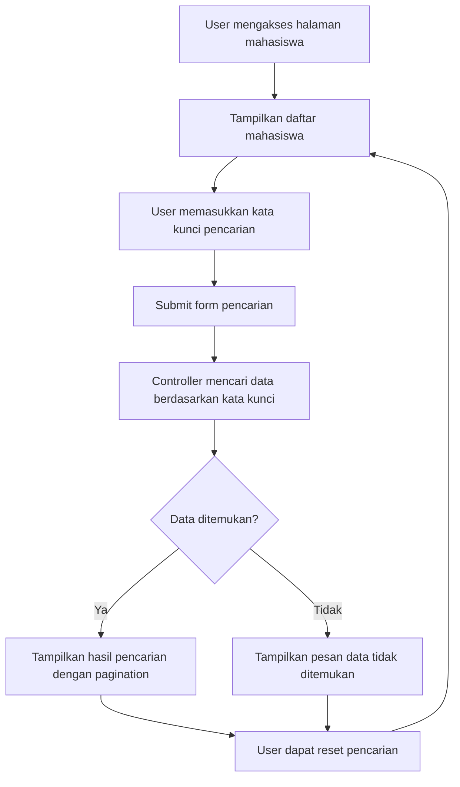
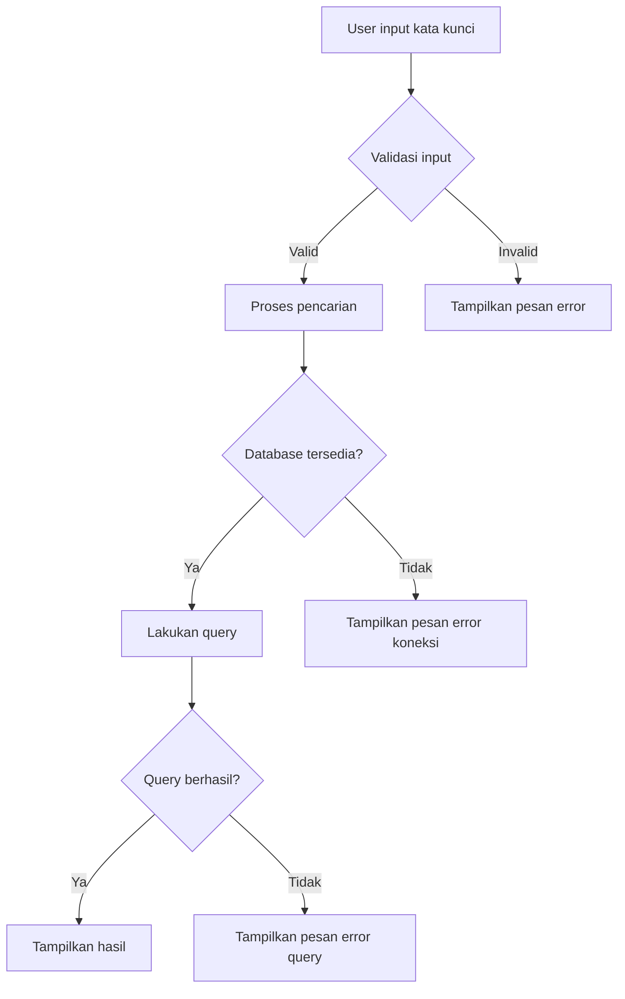

# Tutorial: Implementasi Pencarian Data Mahasiswa di Laravel

Berikut adalah tutorial langkah-demi-langkah untuk mengimplementasikan fitur pencarian data mahasiswa dalam aplikasi Laravel Anda.

## 1. Persiapkan Controller

Pertama, kita perlu memperbarui controller untuk menangani pencarian:

```php
// app/Http/Controllers/MahasiswaController.php

public function index(Request $request)
{
    $keyword = $request->search ?? "";
    
    $mahasiswas = Mahasiswa::where('nama', 'like', "%{$keyword}%")
                  ->orWhere('nim', 'like', "%{$keyword}%")
                  ->orWhere('email', 'like', "%{$keyword}%")
                  ->paginate(10);
    
    return view('mahasiswa.index', compact('mahasiswas', 'keyword'));
}
```

## 2. Buat Form Pencarian di View

Tambahkan form pencarian ke view daftar mahasiswa:

```html
<!-- resources/views/mahasiswa/index.blade.php -->

<div class="card mb-4">
    <div class="card-header">
        <h4>Cari Mahasiswa</h4>
    </div>
    <div class="card-body">
        <form action="{{ route('mahasiswa.index') }}" method="GET">
            <div class="input-group">
                <input type="text" name="search" class="form-control" placeholder="Cari berdasarkan nama, NIM atau email..." value="{{ $keyword }}">
                <button class="btn btn-primary" type="submit">Cari</button>
                @if($keyword)
                    <a href="{{ route('mahasiswa.index') }}" class="btn btn-secondary">Reset</a>
                @endif
            </div>
        </form>
    </div>
</div>
```

## 3. Modifikasi Tampilan Hasil Pencarian

Update tampilan untuk menampilkan hasil pencarian dengan informasi yang jelas:

```html
<!-- Setelah komponen pencarian -->
<div class="card">
    <div class="card-header d-flex justify-content-between align-items-center">
        <h4>Daftar Mahasiswa</h4>
        <a href="{{ route('mahasiswa.create') }}" class="btn btn-success">Tambah Mahasiswa</a>
    </div>
    <div class="card-body">
        @if($keyword)
            <div class="alert alert-info">
                Menampilkan hasil pencarian untuk: <strong>{{ $keyword }}</strong>
                <span class="badge bg-primary">{{ $mahasiswas->total() }} hasil</span>
            </div>
        @endif
        
        @if($mahasiswas->count() > 0)
            <div class="table-responsive">
                <table class="table table-striped">
                    <!-- Header tabel -->
                    <thead>
                        <tr>
                            <th>No</th>
                            <th>NIM</th>
                            <th>Nama</th>
                            <th>Email</th>
                            <th>Aksi</th>
                        </tr>
                    </thead>
                    <!-- Body tabel -->
                    <tbody>
                        @foreach($mahasiswas as $index => $mahasiswa)
                            <tr>
                                <td>{{ $mahasiswas->firstItem() + $index }}</td>
                                <td>{{ $mahasiswa->nim }}</td>
                                <td>{{ $mahasiswa->nama }}</td>
                                <td>{{ $mahasiswa->email }}</td>
                                <td>
                                    <a href="{{ route('mahasiswa.show', $mahasiswa->id) }}" class="btn btn-sm btn-info">Detail</a>
                                    <a href="{{ route('mahasiswa.edit', $mahasiswa->id) }}" class="btn btn-sm btn-warning">Edit</a>
                                    <!-- Tombol hapus -->
                                </td>
                            </tr>
                        @endforeach
                    </tbody>
                </table>
            </div>
            
            <!-- Pagination -->
            <div class="mt-4">
                {{ $mahasiswas->appends(['search' => $keyword])->links() }}
            </div>
        @else
            <div class="alert alert-warning">
                Tidak ada data mahasiswa yang ditemukan.
            </div>
        @endif
    </div>
</div>
```

## 4. Alur Kerja Fitur Pencarian



## 5. Tips Pengembangan Lebih Lanjut

1. **Pencarian Lanjutan**: Tambahkan filter tambahan seperti pencarian berdasarkan jurusan, tahun masuk, atau status mahasiswa.

2. **Penyimpanan State Pencarian**: Gunakan session untuk menyimpan state pencarian sehingga saat user berpindah halaman dan kembali, kata kunci pencarian masih ada.

3. **Highlight Kata Kunci**: Tambahkan highlight pada kata kunci yang ditemukan dalam hasil pencarian untuk UX yang lebih baik.

4. **Live Search**: Implementasikan pencarian secara real-time menggunakan AJAX tanpa perlu refresh halaman.

5. **Sort dan Filter**: Integrasikan fitur pengurutan dan filter tambahan untuk pengalaman pencarian yang lebih komprehensif.

## 6. Implementasi Live Search dengan AJAX

Berikut cara mengimplementasikan live search menggunakan AJAX untuk pengalaman pengguna yang lebih baik:

### 6.1 Perbarui Form Pencarian

```html
<!-- resources/views/mahasiswa/index.blade.php -->
<div class="card mb-4">
    <div class="card-header">
        <h4>Cari Mahasiswa (Live Search)</h4>
    </div>
    <div class="card-body">
        <div class="input-group">
            <input type="text" id="search" class="form-control" 
                   placeholder="Cari berdasarkan nama, NIM atau email..." 
                   value="{{ $keyword }}">
            <button class="btn btn-secondary" id="resetSearch">Reset</button>
        </div>
    </div>
</div>

<div id="search-results">
    <!-- Hasil pencarian akan dimuat di sini -->
</div>
```

### 6.2 Tambahkan Route API untuk Pencarian

```php
// routes/web.php
Route::get('/mahasiswa/search', [MahasiswaController::class, 'search'])->name('mahasiswa.search');
```

### 6.3 Tambahkan Method Search di Controller

```php
// app/Http/Controllers/MahasiswaController.php
public function search(Request $request)
{
    $keyword = $request->search ?? "";
    
    $mahasiswas = Mahasiswa::where('nama', 'like', "%{$keyword}%")
                  ->orWhere('nim', 'like', "%{$keyword}%")
                  ->orWhere('email', 'like', "%{$keyword}%")
                  ->paginate(10);
    
    return response()->json([
        'html' => view('mahasiswa.partials.table', compact('mahasiswas', 'keyword'))->render(),
        'count' => $mahasiswas->total()
    ]);
}
```

### 6.4 Buat Partial View untuk Tabel

```html
<!-- resources/views/mahasiswa/partials/table.blade.php -->
<div class="card">
    <div class="card-header d-flex justify-content-between align-items-center">
        <h4>Daftar Mahasiswa</h4>
        <a href="{{ route('mahasiswa.create') }}" class="btn btn-success">Tambah Mahasiswa</a>
    </div>
    <div class="card-body">
        @if($keyword)
            <div class="alert alert-info">
                Menampilkan hasil pencarian untuk: <strong>{{ $keyword }}</strong>
                <span class="badge bg-primary">{{ $mahasiswas->total() }} hasil</span>
            </div>
        @endif
        
        @if($mahasiswas->count() > 0)
            <!-- Kode tabel sama seperti sebelumnya -->
        @else
            <div class="alert alert-warning">
                Tidak ada data mahasiswa yang ditemukan.
            </div>
        @endif
    </div>
</div>
```

### 6.5 Tambahkan Script JavaScript

```html
<!-- Di bagian bawah file resources/views/mahasiswa/index.blade.php -->
<script>
    $(document).ready(function() {
        let typingTimer;
        const doneTypingInterval = 500; // Waktu tunggu dalam milidetik
        
        // Fungsi pencarian
        function performSearch() {
            let keyword = $('#search').val();
            
            $.ajax({
                url: "{{ route('mahasiswa.search') }}",
                method: 'GET',
                data: { search: keyword },
                beforeSend: function() {
                    $('#search-results').html('<div class="text-center"><div class="spinner-border" role="status"><span class="visually-hidden">Loading...</span></div></div>');
                },
                success: function(response) {
                    $('#search-results').html(response.html);
                    
                    // Update URL dengan parameter pencarian
                    let url = new URL(window.location);
                    if (keyword) {
                        url.searchParams.set('search', keyword);
                    } else {
                        url.searchParams.delete('search');
                    }
                    history.pushState({}, '', url);
                },
                error: function() {
                    $('#search-results').html('<div class="alert alert-danger">Terjadi kesalahan saat mencari data.</div>');
                }
            });
        }
        
        // Event listener untuk input pencarian
        $('#search').on('keyup', function() {
            clearTimeout(typingTimer);
            typingTimer = setTimeout(performSearch, doneTypingInterval);
        });
        
        $('#search').on('keydown', function() {
            clearTimeout(typingTimer);
        });
        
        // Event listener untuk tombol reset
        $('#resetSearch').on('click', function() {
            $('#search').val('');
            performSearch();
        });
        
        // Load initial content
        performSearch();
    });
</script>
```

## 7. Penanganan Error dan Validasi Input Pencarian

Untuk membuat fitur pencarian yang handal, penting untuk menangani berbagai kasus penggunaan dan kemungkinan error:

### 7.1 Validasi Input Pencarian

```php
// app/Http/Controllers/MahasiswaController.php
public function index(Request $request)
{
    // Validasi input
    $validated = $request->validate([
        'search' => 'nullable|string|max:100'
    ]);
    
    $keyword = $validated['search'] ?? "";
    
    // Lanjutkan dengan pencarian seperti sebelumnya
}
```

### 7.2 Diagram Alur Penanganan Error



## 8. Optimasi Performa Pencarian

Beberapa tips untuk mengoptimalkan performa pencarian pada data mahasiswa yang banyak:

### 8.1 Buat Index Database

```php
// Pada migrasi tabel mahasiswa
Schema::create('mahasiswas', function (Blueprint $table) {
    // Kolom lainnya
    
    // Tambahkan index pada kolom yang sering dicari
    $table->index(['nama', 'nim', 'email']);
});
```

### 8.2 Gunakan Full-Text Search untuk Data Besar

```php
// app/Http/Controllers/MahasiswaController.php
public function index(Request $request)
{
    $keyword = $request->search ?? "";
    
    // Gunakan full-text search untuk data besar
    if (!empty($keyword)) {
        $mahasiswas = Mahasiswa::whereRaw(
            "MATCH(nama, nim, email) AGAINST(? IN BOOLEAN MODE)", 
            [$keyword . "*"]
        )->paginate(10);
    } else {
        $mahasiswas = Mahasiswa::paginate(10);
    }
    
    return view('mahasiswa.index', compact('mahasiswas', 'keyword'));
}
```

### 8.3 Implementasi Caching untuk Hasil Pencarian

```php
// app/Http/Controllers/MahasiswaController.php
public function index(Request $request)
{
    $keyword = $request->search ?? "";
    $page = $request->page ?? 1;
    
    // Buat cache key berdasarkan kata kunci dan halaman
    $cacheKey = "mahasiswas_search_{$keyword}_page_{$page}";
    
    // Coba ambil dari cache dulu
    $mahasiswas = Cache::remember($cacheKey, now()->addMinutes(5), function () use ($keyword) {
        return Mahasiswa::where('nama', 'like', "%{$keyword}%")
                    ->orWhere('nim', 'like', "%{$keyword}%")
                    ->orWhere('email', 'like', "%{$keyword}%")
                    ->paginate(10);
    });
    
    return view('mahasiswa.index', compact('mahasiswas', 'keyword'));
}
```

Dengan mengikuti langkah-langkah di atas, Anda telah berhasil mengimplementasikan fitur pencarian data mahasiswa yang fungsional, user-friendly, dan teroptimasi di aplikasi Laravel Anda. Fitur pencarian ini akan memudahkan pengguna untuk menemukan data mahasiswa dengan cepat dan efisien.
