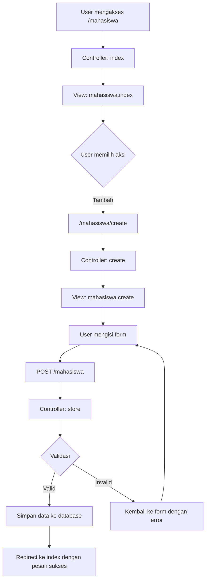

# Membuat Halaman Daftar dan Form Tambah Mahasiswa di Laravel

Pada praktik ini, kita akan membuat halaman untuk menampilkan daftar mahasiswa dan form untuk menambah data mahasiswa baru di aplikasi Laravel. Mari kita ikuti langkah-langkah berikut:

## 1. Persiapan Model dan Migrasi

Pastikan Anda sudah memiliki model dan migrasi Mahasiswa:

```php
// Buat model dan migrasi
php artisan make:model Mahasiswa -m
```

Edit file migrasi untuk tabel mahasiswa:

```php
// database/migrations/xxxx_xx_xx_create_mahasiswas_table.php
public function up()
{
    Schema::create('mahasiswas', function (Blueprint $table) {
        $table->id();
        $table->string('nim', 20)->unique();
        $table->string('nama', 100);
        $table->string('email', 100)->unique();
        $table->string('jurusan', 50);
        $table->text('alamat')->nullable();
        $table->date('tanggal_lahir')->nullable();
        $table->enum('jenis_kelamin', ['L', 'P']);
        $table->timestamps();
    });
}
```

Lakukan migrasi:

```
php artisan migrate
```

## 2. Membuat Controller

Buat controller untuk mengelola data Mahasiswa:

```php
php artisan make:controller MahasiswaController --resource
```

## 3. Implementasi Route

Tambahkan route di `routes/web.php`:

```php
// routes/web.php
use App\Http\Controllers\MahasiswaController;

Route::resource('mahasiswa', MahasiswaController::class);
```

## 4. Membuat Halaman Daftar Mahasiswa

### 4.1 Controller - Method Index

Edit method `index` pada controller:

```php
// app/Http/Controllers/MahasiswaController.php
public function index()
{
    $mahasiswas = Mahasiswa::latest()->paginate(10);
    return view('mahasiswa.index', compact('mahasiswas'));
}
```

### 4.2 View - Daftar Mahasiswa

Buat direktori dan file view:

```bash
mkdir -p resources/views/mahasiswa
touch resources/views/mahasiswa/index.blade.php
```

Isi file `index.blade.php`:

```html
@extends('layouts.app')

@section('content')
<div class="container">
    <div class="row justify-content-center">
        <div class="col-md-12">
            <div class="card">
                <div class="card-header d-flex justify-content-between align-items-center">
                    <h4>Daftar Mahasiswa</h4>
                    <a href="{{ route('mahasiswa.create') }}" class="btn btn-success">Tambah Mahasiswa</a>
                </div>
                <div class="card-body">
                    @if(session('success'))
                        <div class="alert alert-success alert-dismissible fade show" role="alert">
                            {{ session('success') }}
                            <button type="button" class="btn-close" data-bs-dismiss="alert" aria-label="Close"></button>
                        </div>
                    @endif

                    <div class="table-responsive">
                        <table class="table table-striped">
                            <thead>
                                <tr>
                                    <th>No</th>
                                    <th>NIM</th>
                                    <th>Nama</th>
                                    <th>Email</th>
                                    <th>Jurusan</th>
                                    <th>Aksi</th>
                                </tr>
                            </thead>
                            <tbody>
                                @forelse($mahasiswas as $index => $mahasiswa)
                                <tr>
                                    <td>{{ $mahasiswas->firstItem() + $index }}</td>
                                    <td>{{ $mahasiswa->nim }}</td>
                                    <td>{{ $mahasiswa->nama }}</td>
                                    <td>{{ $mahasiswa->email }}</td>
                                    <td>{{ $mahasiswa->jurusan }}</td>
                                    <td>
                                        <a href="{{ route('mahasiswa.show', $mahasiswa->id) }}" class="btn btn-sm btn-info">Detail</a>
                                        <a href="{{ route('mahasiswa.edit', $mahasiswa->id) }}" class="btn btn-sm btn-warning">Edit</a>
                                        <form action="{{ route('mahasiswa.destroy', $mahasiswa->id) }}" method="POST" class="d-inline">
                                            @csrf
                                            @method('DELETE')
                                            <button type="submit" class="btn btn-sm btn-danger" onclick="return confirm('Yakin ingin menghapus data ini?')">Hapus</button>
                                        </form>
                                    </td>
                                </tr>
                                @empty
                                <tr>
                                    <td colspan="6" class="text-center">Tidak ada data mahasiswa.</td>
                                </tr>
                                @endforelse
                            </tbody>
                        </table>
                    </div>

                    <!-- Pagination -->
                    <div class="d-flex justify-content-center mt-4">
                        {{ $mahasiswas->links() }}
                    </div>
                </div>
            </div>
        </div>
    </div>
</div>
@endsection
```

## 5. Membuat Form Tambah Mahasiswa

### 5.1 Controller - Method Create & Store

Edit method `create` dan `store` pada controller:

```php
// app/Http/Controllers/MahasiswaController.php
public function create()
{
    return view('mahasiswa.create');
}

public function store(Request $request)
{
    // Validasi data input
    $validated = $request->validate([
        'nim' => 'required|string|max:20|unique:mahasiswas',
        'nama' => 'required|string|max:100',
        'email' => 'required|email|max:100|unique:mahasiswas',
        'jurusan' => 'required|string|max:50',
        'alamat' => 'nullable|string',
        'tanggal_lahir' => 'nullable|date',
        'jenis_kelamin' => 'required|in:L,P',
    ]);
    
    // Simpan data mahasiswa
    Mahasiswa::create($validated);
    
    // Redirect dengan pesan sukses
    return redirect()->route('mahasiswa.index')
                    ->with('success', 'Data mahasiswa berhasil ditambahkan!');
}
```

### 5.2 Perbarui Model Mahasiswa

Tambahkan `$fillable` pada model Mahasiswa:

```php
// app/Models/Mahasiswa.php
protected $fillable = [
    'nim',
    'nama',
    'email',
    'jurusan',
    'alamat',
    'tanggal_lahir',
    'jenis_kelamin',
];
```

### 5.3 View - Form Tambah Mahasiswa

Buat file view untuk form tambah:

```bash
touch resources/views/mahasiswa/create.blade.php
```

Isi file `create.blade.php`:

```html
@extends('layouts.app')

@section('content')
<div class="container">
    <div class="row justify-content-center">
        <div class="col-md-8">
            <div class="card">
                <div class="card-header">
                    <div class="d-flex justify-content-between align-items-center">
                        <h4>Tambah Mahasiswa</h4>
                        <a href="{{ route('mahasiswa.index') }}" class="btn btn-secondary">Kembali</a>
                    </div>
                </div>
                <div class="card-body">
                    @if ($errors->any())
                        <div class="alert alert-danger">
                            <ul class="mb-0">
                                @foreach ($errors->all() as $error)
                                    <li>{{ $error }}</li>
                                @endforeach
                            </ul>
                        </div>
                    @endif

                    <form action="{{ route('mahasiswa.store') }}" method="POST">
                        @csrf
                        
                        <div class="mb-3">
                            <label for="nim" class="form-label">NIM <span class="text-danger">*</span></label>
                            <input type="text" class="form-control @error('nim') is-invalid @enderror" id="nim" name="nim" value="{{ old('nim') }}" required>
                            @error('nim')
                                <div class="invalid-feedback">{{ $message }}</div>
                            @enderror
                        </div>
                        
                        <div class="mb-3">
                            <label for="nama" class="form-label">Nama Lengkap <span class="text-danger">*</span></label>
                            <input type="text" class="form-control @error('nama') is-invalid @enderror" id="nama" name="nama" value="{{ old('nama') }}" required>
                            @error('nama')
                                <div class="invalid-feedback">{{ $message }}</div>
                            @enderror
                        </div>
                        
                        <div class="mb-3">
                            <label for="email" class="form-label">Email <span class="text-danger">*</span></label>
                            <input type="email" class="form-control @error('email') is-invalid @enderror" id="email" name="email" value="{{ old('email') }}" required>
                            @error('email')
                                <div class="invalid-feedback">{{ $message }}</div>
                            @enderror
                        </div>
                        
                        <div class="mb-3">
                            <label for="jurusan" class="form-label">Jurusan <span class="text-danger">*</span></label>
                            <input type="text" class="form-control @error('jurusan') is-invalid @enderror" id="jurusan" name="jurusan" value="{{ old('jurusan') }}" required>
                            @error('jurusan')
                                <div class="invalid-feedback">{{ $message }}</div>
                            @enderror
                        </div>
                        
                        <div class="mb-3">
                            <label for="jenis_kelamin" class="form-label">Jenis Kelamin <span class="text-danger">*</span></label>
                            <select class="form-select @error('jenis_kelamin') is-invalid @enderror" id="jenis_kelamin" name="jenis_kelamin" required>
                                <option value="">Pilih Jenis Kelamin</option>
                                <option value="L" {{ old('jenis_kelamin') == 'L' ? 'selected' : '' }}>Laki-laki</option>
                                <option value="P" {{ old('jenis_kelamin') == 'P' ? 'selected' : '' }}>Perempuan</option>
                            </select>
                            @error('jenis_kelamin')
                                <div class="invalid-feedback">{{ $message }}</div>
                            @enderror
                        </div>
                        
                        <div class="mb-3">
                            <label for="tanggal_lahir" class="form-label">Tanggal Lahir</label>
                            <input type="date" class="form-control @error('tanggal_lahir') is-invalid @enderror" id="tanggal_lahir" name="tanggal_lahir" value="{{ old('tanggal_lahir') }}">
                            @error('tanggal_lahir')
                                <div class="invalid-feedback">{{ $message }}</div>
                            @enderror
                        </div>
                        
                        <div class="mb-3">
                            <label for="alamat" class="form-label">Alamat</label>
                            <textarea class="form-control @error('alamat') is-invalid @enderror" id="alamat" name="alamat" rows="3">{{ old('alamat') }}</textarea>
                            @error('alamat')
                                <div class="invalid-feedback">{{ $message }}</div>
                            @enderror
                        </div>
                        
                        <div class="d-grid gap-2">
                            <button type="submit" class="btn btn-primary">Simpan Data</button>
                        </div>
                    </form>
                </div>
            </div>
        </div>
    </div>
</div>
@endsection
```

## 6. Membuat Layout Master

Untuk layout yang konsisten, buat file layout master:

```bash
mkdir -p resources/views/layouts
touch resources/views/layouts/app.blade.php
```

Isi file `app.blade.php`:

```html
<!DOCTYPE html>
<html lang="id">
<head>
    <meta charset="UTF-8">
    <meta name="viewport" content="width=device-width, initial-scale=1.0">
    <title>Aplikasi Mahasiswa</title>
    <!-- Bootstrap CSS -->
    <link href="https://cdn.jsdelivr.net/npm/bootstrap@5.2.3/dist/css/bootstrap.min.css" rel="stylesheet">
    <!-- Custom CSS -->
    <style>
        body {
            padding-top: 20px;
            padding-bottom: 20px;
        }
    </style>
</head>
<body>
    <nav class="navbar navbar-expand-lg navbar-dark bg-primary mb-4">
        <div class="container">
            <a class="navbar-brand" href="{{ url('/') }}">Mahasiswa App</a>
            <button class="navbar-toggler" type="button" data-bs-toggle="collapse" data-bs-target="#navbarNav">
                <span class="navbar-toggler-icon"></span>
            </button>
            <div class="collapse navbar-collapse" id="navbarNav">
                <ul class="navbar-nav">
                    <li class="nav-item">
                        <a class="nav-link {{ request()->is('/') ? 'active' : '' }}" href="{{ url('/') }}">Home</a>
                    </li>
                    <li class="nav-item">
                        <a class="nav-link {{ request()->is('mahasiswa*') ? 'active' : '' }}" href="{{ route('mahasiswa.index') }}">Mahasiswa</a>
                    </li>
                </ul>
            </div>
        </div>
    </nav>

    <main>
        @yield('content')
    </main>

    <footer class="container mt-5">
        <hr>
        <p class="text-center text-muted">&copy; {{ date('Y') }} Aplikasi Mahasiswa</p>
    </footer>

    <!-- Bootstrap Bundle with Popper -->
    <script src="https://cdn.jsdelivr.net/npm/bootstrap@5.2.3/dist/js/bootstrap.bundle.min.js"></script>
</body>
</html>
```

## 7. Alur Kerja Aplikasi CRUD



## 8. Testing Aplikasi

### 8.1 Seed Data untuk Testing

Buat seeder untuk data mahasiswa:

```php
php artisan make:seeder MahasiswaSeeder
```

Edit file seeder:

```php
// database/seeders/MahasiswaSeeder.php
public function run()
{
    $mahasiswas = [
        [
            'nim' => '20200001',
            'nama' => 'Budi Santoso',
            'email' => 'budi@example.com',
            'jurusan' => 'Teknik Informatika',
            'alamat' => 'Jl. Raya No. 123, Jakarta',
            'tanggal_lahir' => '2002-05-15',
            'jenis_kelamin' => 'L',
        ],
        [
            'nim' => '20200002',
            'nama' => 'Siti Aminah',
            'email' => 'siti@example.com',
            'jurusan' => 'Sistem Informasi',
            'alamat' => 'Jl. Mawar No. 45, Bandung',
            'tanggal_lahir' => '2001-08-21',
            'jenis_kelamin' => 'P',
        ],
        // Tambahkan data dummy lainnya
    ];
    
    foreach ($mahasiswas as $mahasiswa) {
        \App\Models\Mahasiswa::create($mahasiswa);
    }
}
```

Update database seeder:

```php
// database/seeders/DatabaseSeeder.php
public function run()
{
    $this->call(MahasiswaSeeder::class);
}
```

Jalankan seeder:

```bash
php artisan db:seed
```

### 8.2 Uji Aplikasi

1. Buka URL `http://mahasiswa-app.test/mahasiswa` di browser
2. Periksa tampilan daftar mahasiswa
3. Klik tombol "Tambah Mahasiswa" dan isi form
4. Submit form dan pastikan redirect kembali ke halaman daftar dengan pesan sukses
5. Verifikasi data baru muncul di daftar

## 9. Tips dan Pengembangan Lebih Lanjut

1. **Validasi Form**: Tambahkan JavaScript untuk validasi client-side sebelum form dikirim
2. **Pemilihan Jurusan**: Buat tabel terpisah untuk jurusan dan gunakan dropdown untuk seleksi
3. **Upload Foto**: Tambahkan fitur untuk upload foto mahasiswa
4. **Filter dan Sorting**: Implementasikan filter berdasarkan jurusan dan sorting
5. **Export Data**: Tambahkan fitur export data ke Excel atau PDF
6. **Import Data**: Implementasikan fitur import data dari file Excel

Dengan mengikuti langkah-langkah di atas, Anda telah berhasil membuat halaman daftar mahasiswa dan form tambah data yang fungsional dalam aplikasi Laravel. Praktek ini memberikan dasar yang kuat untuk pengembangan fitur CRUD lainnya.
