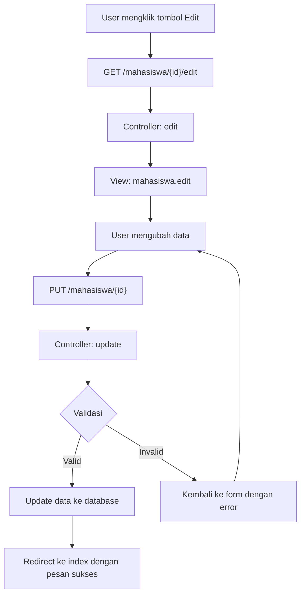

# Tutorial: Membuat Form Edit Data Mahasiswa di Laravel

Pada bagian ini, kita akan melanjutkan pengembangan aplikasi manajemen data mahasiswa dengan membuat fungsi edit data. Setelah sebelumnya kita membuat form untuk menambah data, kini kita akan membuat form untuk mengubah data mahasiswa yang sudah ada.

## 1. Persiapan Method di Controller

Kita akan menggunakan dua method di controller Mahasiswa yang sudah dibuat sebelumnya:
- Method `edit` untuk menampilkan form edit dengan data yang sudah ada
- Method `update` untuk memproses perubahan data

Buka file `app/Http/Controllers/MahasiswaController.php` dan tambahkan method berikut:

```php
// app/Http/Controllers/MahasiswaController.php

public function edit(Mahasiswa $mahasiswa)
{
    // Laravel secara otomatis melakukan model binding
    // Parameter $mahasiswa sudah berisi data mahasiswa dengan ID yang sesuai
    return view('mahasiswa.edit', compact('mahasiswa'));
}

public function update(Request $request, Mahasiswa $mahasiswa)
{
    // Validasi data input
    $validated = $request->validate([
        'nim' => 'required|string|max:20|unique:mahasiswas,nim,' . $mahasiswa->id,
        'nama' => 'required|string|max:100',
        'email' => 'required|email|max:100|unique:mahasiswas,email,' . $mahasiswa->id,
        'jurusan' => 'required|string|max:50',
        'alamat' => 'nullable|string',
        'tanggal_lahir' => 'nullable|date',
        'jenis_kelamin' => 'required|in:L,P',
    ]);
    
    // Update data mahasiswa
    $mahasiswa->update($validated);
    
    // Redirect dengan pesan sukses
    return redirect()->route('mahasiswa.index')
                    ->with('success', 'Data mahasiswa berhasil diperbarui!');
}
```

Perhatikan pada validasi untuk `nim` dan `email` kita perlu menambahkan pengecualian untuk data yang sedang diedit menggunakan sintaks `unique:table,column,id` agar tidak bentrok dengan data yang sudah ada.

## 2. Membuat View Form Edit

Selanjutnya, buat file view untuk form edit:

```bash
touch resources/views/mahasiswa/edit.blade.php
```

Isi file `edit.blade.php` dengan kode berikut:

```html
@extends('layouts.app')

@section('content')
<div class="container">
    <div class="row justify-content-center">
        <div class="col-md-8">
            <div class="card">
                <div class="card-header">
                    <div class="d-flex justify-content-between align-items-center">
                        <h4>Edit Data Mahasiswa</h4>
                        <a href="{{ route('mahasiswa.index') }}" class="btn btn-secondary">Kembali</a>
                    </div>
                </div>
                <div class="card-body">
                    @if ($errors->any())
                        <div class="alert alert-danger">
                            <ul class="mb-0">
                                @foreach ($errors->all() as $error)
                                    <li>{{ $error }}</li>
                                @endforeach
                            </ul>
                        </div>
                    @endif

                    <form action="{{ route('mahasiswa.update', $mahasiswa->id) }}" method="POST">
                        @csrf
                        @method('PUT')
                        
                        <div class="mb-3">
                            <label for="nim" class="form-label">NIM <span class="text-danger">*</span></label>
                            <input type="text" class="form-control @error('nim') is-invalid @enderror" id="nim" name="nim" value="{{ old('nim', $mahasiswa->nim) }}" required>
                            @error('nim')
                                <div class="invalid-feedback">{{ $message }}</div>
                            @enderror
                        </div>
                        
                        <div class="mb-3">
                            <label for="nama" class="form-label">Nama Lengkap <span class="text-danger">*</span></label>
                            <input type="text" class="form-control @error('nama') is-invalid @enderror" id="nama" name="nama" value="{{ old('nama', $mahasiswa->nama) }}" required>
                            @error('nama')
                                <div class="invalid-feedback">{{ $message }}</div>
                            @enderror
                        </div>
                        
                        <div class="mb-3">
                            <label for="email" class="form-label">Email <span class="text-danger">*</span></label>
                            <input type="email" class="form-control @error('email') is-invalid @enderror" id="email" name="email" value="{{ old('email', $mahasiswa->email) }}" required>
                            @error('email')
                                <div class="invalid-feedback">{{ $message }}</div>
                            @enderror
                        </div>
                        
                        <div class="mb-3">
                            <label for="jurusan" class="form-label">Jurusan <span class="text-danger">*</span></label>
                            <input type="text" class="form-control @error('jurusan') is-invalid @enderror" id="jurusan" name="jurusan" value="{{ old('jurusan', $mahasiswa->jurusan) }}" required>
                            @error('jurusan')
                                <div class="invalid-feedback">{{ $message }}</div>
                            @enderror
                        </div>
                        
                        <div class="mb-3">
                            <label for="jenis_kelamin" class="form-label">Jenis Kelamin <span class="text-danger">*</span></label>
                            <select class="form-select @error('jenis_kelamin') is-invalid @enderror" id="jenis_kelamin" name="jenis_kelamin" required>
                                <option value="">Pilih Jenis Kelamin</option>
                                <option value="L" {{ (old('jenis_kelamin', $mahasiswa->jenis_kelamin) == 'L') ? 'selected' : '' }}>Laki-laki</option>
                                <option value="P" {{ (old('jenis_kelamin', $mahasiswa->jenis_kelamin) == 'P') ? 'selected' : '' }}>Perempuan</option>
                            </select>
                            @error('jenis_kelamin')
                                <div class="invalid-feedback">{{ $message }}</div>
                            @enderror
                        </div>
                        
                        <div class="mb-3">
                            <label for="tanggal_lahir" class="form-label">Tanggal Lahir</label>
                            <input type="date" class="form-control @error('tanggal_lahir') is-invalid @enderror" id="tanggal_lahir" name="tanggal_lahir" value="{{ old('tanggal_lahir', $mahasiswa->tanggal_lahir) }}">
                            @error('tanggal_lahir')
                                <div class="invalid-feedback">{{ $message }}</div>
                            @enderror
                        </div>
                        
                        <div class="mb-3">
                            <label for="alamat" class="form-label">Alamat</label>
                            <textarea class="form-control @error('alamat') is-invalid @enderror" id="alamat" name="alamat" rows="3">{{ old('alamat', $mahasiswa->alamat) }}</textarea>
                            @error('alamat')
                                <div class="invalid-feedback">{{ $message }}</div>
                            @enderror
                        </div>
                        
                        <div class="d-grid gap-2">
                            <button type="submit" class="btn btn-primary">Perbarui Data</button>
                        </div>
                    </form>
                </div>
            </div>
        </div>
    </div>
</div>
@endsection
```

Perhatikan beberapa hal penting:
1. Menggunakan method `PUT` melalui `@method('PUT')` untuk update data
2. Menampilkan data yang sudah ada dengan `old('field', $mahasiswa->field)`
3. Form mengirim data ke route `mahasiswa.update` dengan parameter ID mahasiswa

## 3. Memastikan Link Edit Berfungsi

Pastikan link pada tombol Edit di halaman index mengarah ke route yang benar. Periksa kembali file `resources/views/mahasiswa/index.blade.php` dan pastikan kode untuk tombol Edit seperti berikut:

```html
<a href="{{ route('mahasiswa.edit', $mahasiswa->id) }}" class="btn btn-sm btn-warning">Edit</a>
```

## 4. Alur Kerja Form Edit

Berikut diagram yang menunjukkan alur kerja form edit data mahasiswa:



## 5. Tips dan Best Practices

### 5.1 Pemeriksaan Eksistensi Data

Untuk keamanan tambahan, tambahkan validasi untuk memastikan data yang akan diedit ada di database:

```php
public function edit($id)
{
    $mahasiswa = Mahasiswa::findOrFail($id);
    return view('mahasiswa.edit', compact('mahasiswa'));
}
```

### 5.2 Shared Form Component

Jika form create dan edit memiliki banyak kesamaan, pertimbangkan untuk membuat partial view untuk form:

```bash
touch resources/views/mahasiswa/form.blade.php
```

Isi dengan:

```html
<div class="mb-3">
    <label for="nim" class="form-label">NIM <span class="text-danger">*</span></label>
    <input type="text" class="form-control @error('nim') is-invalid @enderror" id="nim" name="nim" value="{{ old('nim', $mahasiswa->nim ?? '') }}" required>
    @error('nim')
        <div class="invalid-feedback">{{ $message }}</div>
    @enderror
</div>

<!-- Tambahkan field lainnya -->
```

Lalu di form create dan edit, ganti form fields dengan:

```html
@include('mahasiswa.form')
```

### 5.3 Request Form Validation

Untuk aplikasi yang lebih besar, pertimbangkan untuk memindahkan logika validasi ke Form Request terpisah:

```bash
php artisan make:request UpdateMahasiswaRequest
```

Lalu edit file request:

```php
// app/Http/Requests/UpdateMahasiswaRequest.php
public function rules()
{
    return [
        'nim' => 'required|string|max:20|unique:mahasiswas,nim,' . $this->mahasiswa->id,
        'nama' => 'required|string|max:100',
        // Rule lainnya
    ];
}
```

Dan di controller:

```php
public function update(UpdateMahasiswaRequest $request, Mahasiswa $mahasiswa)
{
    $mahasiswa->update($request->validated());
    return redirect()->route('mahasiswa.index')
                    ->with('success', 'Data mahasiswa berhasil diperbarui!');
}
```

### 5.4 Periksa Apakah Data Berubah

Opsi tambahan: periksa apakah data benar-benar berubah sebelum menyimpan ke database:

```php
public function update(Request $request, Mahasiswa $mahasiswa)
{
    $validated = $request->validate([
        // Aturan validasi
    ]);
    
    // Cek apakah data berubah
    if ($mahasiswa->isDirty($validated)) {
        $mahasiswa->update($validated);
        return redirect()->route('mahasiswa.index')
                        ->with('success', 'Data mahasiswa berhasil diperbarui!');
    }
    
    return redirect()->route('mahasiswa.index')
                    ->with('info', 'Tidak ada perubahan data.');
}
```

## 6. Pengujian Form Edit

Untuk memastikan form edit berfungsi dengan baik, lakukan pengujian berikut:

1. Akses halaman daftar mahasiswa dan klik tombol Edit pada salah satu data
2. Pastikan form terisi dengan data yang benar
3. Ubah beberapa data dan kirim form
4. Pastikan data berhasil diperbarui dan muncul di halaman daftar

Dengan mengikuti langkah-langkah di atas, Anda telah berhasil mengimplementasikan form edit data mahasiswa yang fungsional dalam aplikasi Laravel. Fitur ini melengkapi fungsionalitas CRUD dasar yang sudah kita buat sebelumnya.
