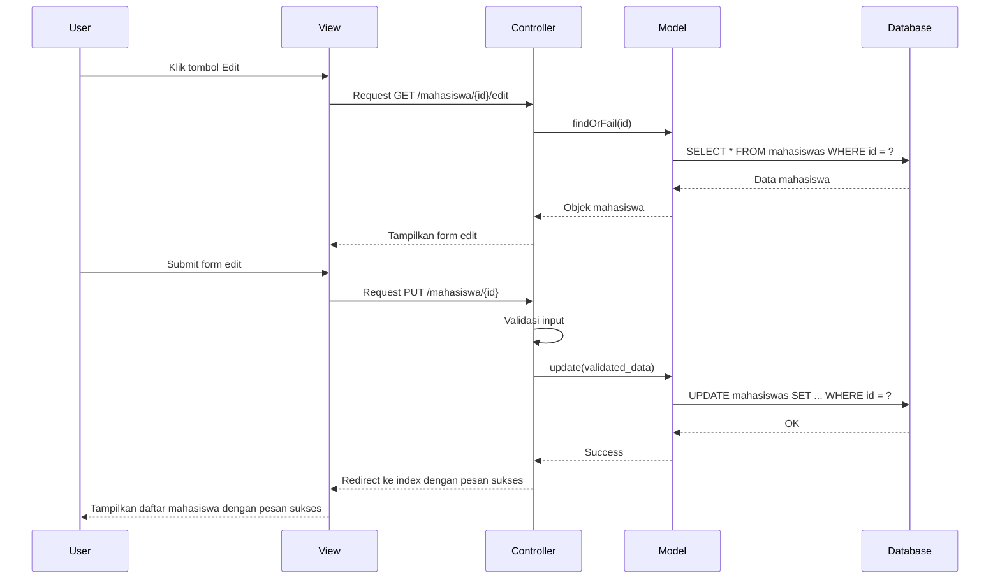

# Implementasi Update Data dalam Laravel

Berikut adalah langkah-langkah implementasi update data untuk aplikasi mahasiswa:

## 1. Membuat Route untuk Update

Tambahkan route berikut di file `routes/web.php`:

```php
Route::get('/mahasiswa/{id}/edit', 'MahasiswaController@edit')->name('mahasiswa.edit');
Route::put('/mahasiswa/{id}', 'MahasiswaController@update')->name('mahasiswa.update');
```

## 2. Membuat Method Edit pada Controller

Buka `MahasiswaController.php` dan tambahkan method edit:

```php
public function edit($id)
{
    $mahasiswa = Mahasiswa::findOrFail($id);
    $jurusan = Jurusan::all(); // Jika ada relasi dengan jurusan
    
    return view('mahasiswa.edit', compact('mahasiswa', 'jurusan'));
}
```

## 3. Membuat Form Edit

Buat file `resources/views/mahasiswa/edit.blade.php`:

```html
@extends('layouts.app')

@section('content')
<div class="container">
    <div class="row">
        <div class="col-md-8 offset-md-2">
            <div class="card">
                <div class="card-header">Edit Data Mahasiswa</div>
                
                <div class="card-body">
                    <form action="{{ route('mahasiswa.update', $mahasiswa->id) }}" method="POST">
                        @csrf
                        @method('PUT')
                        
                        <div class="form-group">
                            <label for="nim">NIM</label>
                            <input type="text" class="form-control @error('nim') is-invalid @enderror" 
                                   id="nim" name="nim" value="{{ old('nim', $mahasiswa->nim) }}">
                            @error('nim')
                                <span class="invalid-feedback">{{ $message }}</span>
                            @enderror
                        </div>
                        
                        <div class="form-group">
                            <label for="nama">Nama Lengkap</label>
                            <input type="text" class="form-control @error('nama') is-invalid @enderror" 
                                   id="nama" name="nama" value="{{ old('nama', $mahasiswa->nama) }}">
                            @error('nama')
                                <span class="invalid-feedback">{{ $message }}</span>
                            @enderror
                        </div>
                        
                        <div class="form-group">
                            <label for="jurusan_id">Jurusan</label>
                            <select class="form-control @error('jurusan_id') is-invalid @enderror" 
                                    id="jurusan_id" name="jurusan_id">
                                <option value="">Pilih Jurusan</option>
                                @foreach($jurusan as $jur)
                                    <option value="{{ $jur->id }}" 
                                        {{ old('jurusan_id', $mahasiswa->jurusan_id) == $jur->id ? 'selected' : '' }}>
                                        {{ $jur->nama_jurusan }}
                                    </option>
                                @endforeach
                            </select>
                            @error('jurusan_id')
                                <span class="invalid-feedback">{{ $message }}</span>
                            @enderror
                        </div>
                        
                        <div class="form-group">
                            <label for="alamat">Alamat</label>
                            <textarea class="form-control @error('alamat') is-invalid @enderror" 
                                     id="alamat" name="alamat" rows="3">{{ old('alamat', $mahasiswa->alamat) }}</textarea>
                            @error('alamat')
                                <span class="invalid-feedback">{{ $message }}</span>
                            @enderror
                        </div>
                        
                        <div class="form-group mt-4">
                            <button type="submit" class="btn btn-primary">Update Data</button>
                            <a href="{{ route('mahasiswa.index') }}" class="btn btn-secondary">Kembali</a>
                        </div>
                    </form>
                </div>
            </div>
        </div>
    </div>
</div>
@endsection
```

## 4. Implementasi Method Update pada Controller

Tambahkan method update di `MahasiswaController.php`:

```php
public function update(Request $request, $id)
{
    // Validasi input
    $validated = $request->validate([
        'nim' => 'required|string|max:20|unique:mahasiswas,nim,'.$id,
        'nama' => 'required|string|max:100',
        'jurusan_id' => 'required|exists:jurusans,id',
        'alamat' => 'nullable|string',
    ]);
    
    // Cari data yang akan diupdate
    $mahasiswa = Mahasiswa::findOrFail($id);
    
    // Update data
    $mahasiswa->update($validated);
    
    // Redirect dengan pesan sukses
    return redirect()->route('mahasiswa.index')
                     ->with('success', 'Data mahasiswa berhasil diperbarui!');
}
```

## 5. Menambahkan Tombol Edit di Halaman Index

Update file `resources/views/mahasiswa/index.blade.php` untuk menambahkan tombol edit:

```html
<!-- Di dalam loop data mahasiswa -->
<td>
    <a href="{{ route('mahasiswa.edit', $mhs->id) }}" class="btn btn-sm btn-primary">Edit</a>
    <!-- Tombol hapus akan ditambahkan nanti -->
</td>
```

## 6. Alur Proses Update Data



## 7. Tips untuk Implementasi Update Data

1. Gunakan metode HTTP `PUT` atau `PATCH` untuk update data (Laravel mengharuskan `@method('PUT')` di form)
2. Selalu validasi input dari user untuk mencegah data tidak valid
3. Gunakan `old('field', $model->field)` untuk menjaga nilai form tetap terisi saat terjadi error validasi
4. Tambahkan aturan validasi `unique` dengan pengecualian ID yang sedang diedit untuk field yang unik
5. Selalu gunakan `findOrFail()` untuk menghindari error jika data tidak ditemukan
6. Gunakan flash message (`with('success', ...)`) untuk memberikan feedback ke pengguna

Dengan mengikuti langkah-langkah di atas, implementasi fitur update data pada aplikasi manajemen mahasiswa Anda akan berjalan dengan baik dan mudah digunakan.