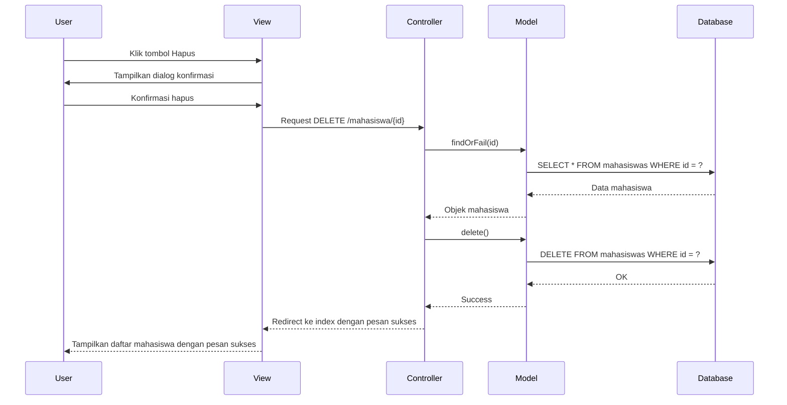

# Implementasi Hapus Data dalam Laravel

Berikut adalah langkah-langkah implementasi fitur hapus data untuk aplikasi mahasiswa:

## 1. Membuat Route untuk Delete

Tambahkan route berikut di file `routes/web.php`:

```php
Route::delete('/mahasiswa/{id}', 'MahasiswaController@destroy')->name('mahasiswa.destroy');
```

## 2. Membuat Method Destroy pada Controller

Buka `MahasiswaController.php` dan tambahkan method destroy:

```php
public function destroy($id)
{
    // Cari data yang akan dihapus
    $mahasiswa = Mahasiswa::findOrFail($id);
    
    // Hapus data
    $mahasiswa->delete();
    
    // Redirect dengan pesan sukses
    return redirect()->route('mahasiswa.index')
                     ->with('success', 'Data mahasiswa berhasil dihapus!');
}
```

## 3. Menambahkan Tombol Hapus di Halaman Index

Update file `resources/views/mahasiswa/index.blade.php` untuk menambahkan tombol hapus di samping tombol edit:

```html
<!-- Di dalam loop data mahasiswa -->
<td>
    <a href="{{ route('mahasiswa.edit', $mhs->id) }}" class="btn btn-sm btn-primary">Edit</a>
    
    <form action="{{ route('mahasiswa.destroy', $mhs->id) }}" method="POST" class="d-inline">
        @csrf
        @method('DELETE')
        <button type="submit" class="btn btn-sm btn-danger" 
                onclick="return confirm('Apakah Anda yakin ingin menghapus data ini?')">
            Hapus
        </button>
    </form>
</td>
```

## 4. Menambahkan Konfirmasi Hapus dengan JavaScript

Untuk meningkatkan pengalaman pengguna, tambahkan konfirmasi sebelum menghapus data. Ada dua cara:

### a. Menggunakan JavaScript Sederhana (seperti contoh di atas)

```html
<button type="submit" class="btn btn-sm btn-danger" 
        onclick="return confirm('Apakah Anda yakin ingin menghapus data ini?')">
    Hapus
</button>
```

### b. Menggunakan Modal Bootstrap (lebih profesional)

Tambahkan kode berikut di `index.blade.php`:

```html
<!-- Di dalam loop data mahasiswa -->
<td>
    <a href="{{ route('mahasiswa.edit', $mhs->id) }}" class="btn btn-sm btn-primary">Edit</a>
    <button type="button" class="btn btn-sm btn-danger" data-toggle="modal" 
            data-target="#deleteModal{{ $mhs->id }}">
        Hapus
    </button>
    
    <!-- Modal Konfirmasi Hapus -->
    <div class="modal fade" id="deleteModal{{ $mhs->id }}" tabindex="-1" role="dialog" 
         aria-labelledby="deleteModalLabel" aria-hidden="true">
        <div class="modal-dialog" role="document">
            <div class="modal-content">
                <div class="modal-header">
                    <h5 class="modal-title" id="deleteModalLabel">Konfirmasi Hapus</h5>
                    <button type="button" class="close" data-dismiss="modal" aria-label="Close">
                        <span aria-hidden="true">&times;</span>
                    </button>
                </div>
                <div class="modal-body">
                    Apakah Anda yakin ingin menghapus data mahasiswa <strong>{{ $mhs->nama }}</strong>?
                </div>
                <div class="modal-footer">
                    <button type="button" class="btn btn-secondary" data-dismiss="modal">Batal</button>
                    <form action="{{ route('mahasiswa.destroy', $mhs->id) }}" method="POST" class="d-inline">
                        @csrf
                        @method('DELETE')
                        <button type="submit" class="btn btn-danger">Hapus</button>
                    </form>
                </div>
            </div>
        </div>
    </div>
</td>
```

## 5. Menambahkan Flash Message

Pastikan Anda memiliki komponen flash message di layout utama (`layouts/app.blade.php`):

```html
<!-- Tambahkan ini setelah navbar atau di awal konten utama -->
<div class="container mt-4">
    @if(session('success'))
        <div class="alert alert-success alert-dismissible fade show" role="alert">
            {{ session('success') }}
            <button type="button" class="close" data-dismiss="alert" aria-label="Close">
                <span aria-hidden="true">&times;</span>
            </button>
        </div>
    @endif
    
    @if(session('error'))
        <div class="alert alert-danger alert-dismissible fade show" role="alert">
            {{ session('error') }}
            <button type="button" class="close" data-dismiss="alert" aria-label="Close">
                <span aria-hidden="true">&times;</span>
            </button>
        </div>
    @endif
</div>
```

## 6. Alur Proses Hapus Data



## 7. Implementasi Soft Delete (Opsional)

Laravel menyediakan fitur Soft Delete, di mana data tidak benar-benar dihapus dari database, tetapi hanya ditandai sebagai "dihapus".

### a. Aktifkan Soft Delete pada Model:

```php
// Model: app/Models/Mahasiswa.php
namespace App\Models;

use Illuminate\Database\Eloquent\Model;
use Illuminate\Database\Eloquent\SoftDeletes;

class Mahasiswa extends Model
{
    use SoftDeletes;
    
    // Kode lainnya tetap sama
}
```

### b. Tambahkan kolom `deleted_at` di tabel:

```php
// Buat migrasi baru
php artisan make:migration add_soft_delete_to_mahasiswas_table --table=mahasiswas

// Edit file migrasi yang baru dibuat
public function up()
{
    Schema::table('mahasiswas', function (Blueprint $table) {
        $table->softDeletes();
    });
}

public function down()
{
    Schema::table('mahasiswas', function (Blueprint $table) {
        $table->dropSoftDeletes();
    });
}

// Jalankan migrasi
php artisan migrate
```

## 8. Tips untuk Implementasi Hapus Data

1. Selalu gunakan metode HTTP `DELETE` untuk operasi penghapusan data
2. Selalu tambahkan konfirmasi sebelum menghapus data untuk mencegah penghapusan tidak sengaja
3. Pertimbangkan untuk menggunakan Soft Delete pada data yang sensitif atau memiliki relasi dengan data lain
4. Jika data memiliki banyak relasi, pertimbangkan untuk menambahkan logika pengecekan sebelum menghapus
5. Berikan feedback yang jelas kepada pengguna setelah operasi penghapusan selesai
6. Untuk data-data yang saling berelasi, gunakan fitur `cascade` pada migrasi atau atur `onDelete` pada model

Dengan mengikuti langkah-langkah di atas, implementasi fitur hapus data pada aplikasi manajemen mahasiswa Anda akan berfungsi dengan baik dan memiliki pengalaman pengguna yang aman.