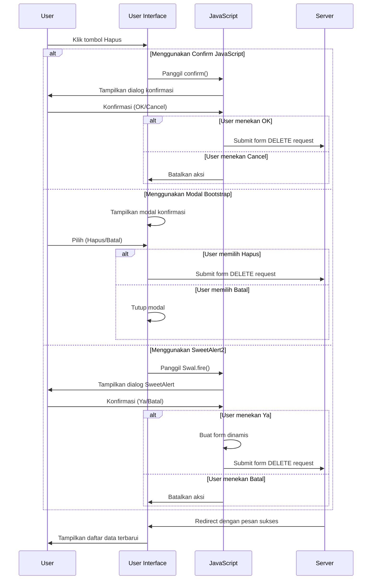

# Konfirmasi Hapus Data dalam Laravel

Menambahkan konfirmasi sebelum menghapus data adalah praktik yang sangat penting untuk mencegah penghapusan data yang tidak disengaja. Berikut adalah cara mengimplementasikan konfirmasi hapus data dengan beberapa metode berbeda:

## 1. Konfirmasi Menggunakan JavaScript Native

Ini adalah metode paling sederhana yang menggunakan fungsi `confirm()` bawaan JavaScript:

```html
<form action="{{ route('mahasiswa.destroy', $mahasiswa->id) }}" method="POST" class="d-inline">
    @csrf
    @method('DELETE')
    <button type="submit" class="btn btn-sm btn-danger" 
            onclick="return confirm('Apakah Anda yakin ingin menghapus data mahasiswa ini?')">
        Hapus
    </button>
</form>
```

### Kelebihan:
- Sangat mudah diimplementasikan
- Tidak memerlukan library tambahan
- Bekerja di semua browser modern

### Kekurangan:
- Tampilan dialog sangat sederhana dan tidak dapat dikustomisasi
- Tidak konsisten dengan desain UI aplikasi Anda

## 2. Konfirmasi Menggunakan Modal Bootstrap

Pendekatan yang lebih profesional adalah menggunakan modal Bootstrap:

```html
<!-- Tombol untuk membuka modal -->
<button type="button" class="btn btn-sm btn-danger" data-toggle="modal" data-target="#deleteModal{{ $mahasiswa->id }}">
    Hapus
</button>

<!-- Modal Dialog -->
<div class="modal fade" id="deleteModal{{ $mahasiswa->id }}" tabindex="-1" role="dialog" aria-labelledby="deleteModalLabel" aria-hidden="true">
    <div class="modal-dialog" role="document">
        <div class="modal-content">
            <div class="modal-header">
                <h5 class="modal-title" id="deleteModalLabel">Konfirmasi Hapus</h5>
                <button type="button" class="close" data-dismiss="modal" aria-label="Close">
                    <span aria-hidden="true">&times;</span>
                </button>
            </div>
            <div class="modal-body">
                <p>Anda yakin ingin menghapus data mahasiswa <strong>{{ $mahasiswa->nama }}</strong> (NIM: {{ $mahasiswa->nim }})?</p>
                <p class="text-danger"><small>Tindakan ini tidak dapat dibatalkan.</small></p>
            </div>
            <div class="modal-footer">
                <button type="button" class="btn btn-secondary" data-dismiss="modal">Batal</button>
                <form action="{{ route('mahasiswa.destroy', $mahasiswa->id) }}" method="POST" class="d-inline">
                    @csrf
                    @method('DELETE')
                    <button type="submit" class="btn btn-danger">Hapus Data</button>
                </form>
            </div>
        </div>
    </div>
</div>
```

### Kelebihan:
- Tampilan yang profesional dan sesuai dengan desain aplikasi
- Dapat menampilkan informasi detail tentang data yang akan dihapus
- Dapat dikustomisasi sesuai kebutuhan

### Kekurangan:
- Memerlukan kode yang lebih banyak untuk setiap baris data
- Membutuhkan jQuery dan Bootstrap JS

## 3. Konfirmasi Menggunakan SweetAlert2

SweetAlert2 adalah library JavaScript yang menyediakan dialog konfirmasi yang lebih menarik:

### Langkah 1: Tambahkan library SweetAlert2

Tambahkan di bagian `head` layout utama Anda:

```html
<!-- Di dalam layouts/app.blade.php -->
<link rel="stylesheet" href="https://cdn.jsdelivr.net/npm/sweetalert2@11/dist/sweetalert2.min.css">
<script src="https://cdn.jsdelivr.net/npm/sweetalert2@11"></script>
```

### Langkah 2: Buat tombol hapus dengan class khusus

```html
<button type="button" class="btn btn-sm btn-danger delete-btn" 
        data-id="{{ $mahasiswa->id }}" 
        data-name="{{ $mahasiswa->nama }}">
    Hapus
</button>
```

### Langkah 3: Tambahkan script JavaScript

```html
<!-- Di bagian bawah layouts/app.blade.php sebelum penutup tag body -->
<script>
    document.addEventListener('DOMContentLoaded', function() {
        // Cari semua tombol dengan class delete-btn
        const deleteButtons = document.querySelectorAll('.delete-btn');
        
        deleteButtons.forEach(button => {
            button.addEventListener('click', function() {
                const id = this.getAttribute('data-id');
                const name = this.getAttribute('data-name');
                
                Swal.fire({
                    title: 'Konfirmasi Hapus',
                    html: `Anda yakin ingin menghapus data mahasiswa <strong>${name}</strong>?<br><small class="text-danger">Tindakan ini tidak dapat dibatalkan.</small>`,
                    icon: 'warning',
                    showCancelButton: true,
                    confirmButtonColor: '#d33',
                    cancelButtonColor: '#3085d6',
                    confirmButtonText: 'Ya, Hapus!',
                    cancelButtonText: 'Batal'
                }).then((result) => {
                    if (result.isConfirmed) {
                        // Buat form untuk submit
                        const form = document.createElement('form');
                        form.method = 'POST';
                        form.action = '/mahasiswa/' + id;
                        
                        const csrfToken = document.createElement('input');
                        csrfToken.type = 'hidden';
                        csrfToken.name = '_token';
                        csrfToken.value = '{{ csrf_token() }}';
                        
                        const method = document.createElement('input');
                        method.type = 'hidden';
                        method.name = '_method';
                        method.value = 'DELETE';
                        
                        form.appendChild(csrfToken);
                        form.appendChild(method);
                        document.body.appendChild(form);
                        form.submit();
                    }
                });
            });
        });
    });
</script>
```

### Kelebihan:
- Tampilan yang sangat menarik dan modern
- Animasi yang halus
- Sangat dapat dikustomisasi
- Konsisten di semua browser

### Kekurangan:
- Memerlukan library tambahan
- Setup yang lebih kompleks

## 4. Alur Proses Konfirmasi Hapus Data



## 5. Praktik Terbaik untuk Konfirmasi Hapus Data

1. **Berikan informasi yang jelas**: Tampilkan nama/identitas data yang akan dihapus untuk menghindari kesalahan.
   
2. **Gunakan warna yang tepat**: Warna merah untuk tombol konfirmasi hapus dan warna netral untuk tombol batal.
   
3. **Berikan peringatan**: Informasikan bahwa tindakan tidak dapat dibatalkan.
   
4. **Minta konfirmasi eksplisit**: Pastikan user harus melakukan tindakan positif untuk mengkonfirmasi (bukan hanya menekan OK).
   
5. **Konsistensi**: Gunakan pola konfirmasi yang sama di seluruh aplikasi untuk menjaga UX yang konsisten.
   
6. **Sesuaikan tingkat konfirmasi dengan risiko**: Untuk data penting, pertimbangkan untuk meminta konfirmasi tambahan seperti mengetik nama data yang akan dihapus.

## 6. Contoh Konfirmasi Tingkat Lanjut (untuk Data Penting)

Untuk data yang sangat penting, Anda bisa menambahkan konfirmasi tambahan seperti meminta pengguna memasukkan nama data yang akan dihapus:

```html
<script>
    document.addEventListener('DOMContentLoaded', function() {
        const deleteButtons = document.querySelectorAll('.delete-btn');
        
        deleteButtons.forEach(button => {
            button.addEventListener('click', function() {
                const id = this.getAttribute('data-id');
                const name = this.getAttribute('data-name');
                
                Swal.fire({
                    title: 'Konfirmasi Hapus Data Penting',
                    html: `
                        <p>Anda akan menghapus data mahasiswa <strong>${name}</strong>.</p>
                        <p>Tindakan ini tidak dapat dibatalkan!</p>
                        <p>Ketik <strong>${name}</strong> untuk mengkonfirmasi:</p>
                        <input id="confirmation-input" class="swal2-input">
                    `,
                    icon: 'warning',
                    showCancelButton: true,
                    confirmButtonColor: '#d33',
                    cancelButtonColor: '#3085d6',
                    confirmButtonText: 'Ya, Hapus!',
                    cancelButtonText: 'Batal',
                    preConfirm: () => {
                        const input = document.getElementById('confirmation-input').value;
                        if (input !== name) {
                            Swal.showValidationMessage('Nama yang diketik tidak sesuai!');
                            return false;
                        }
                        return true;
                    }
                }).then((result) => {
                    if (result.isConfirmed) {
                        // Kode untuk submit form
                        const form = document.createElement('form');
                        form.method = 'POST';
                        form.action = '/mahasiswa/' + id;
                        
                        const csrfToken = document.createElement('input');
                        csrfToken.type = 'hidden';
                        csrfToken.name = '_token';
                        csrfToken.value = '{{ csrf_token() }}';
                        
                        const method = document.createElement('input');
                        method.type = 'hidden';
                        method.name = '_method';
                        method.value = 'DELETE';
                        
                        form.appendChild(csrfToken);
                        form.appendChild(method);
                        document.body.appendChild(form);
                        form.submit();
                    }
                });
            });
        });
    });
</script>
```

Dengan mengimplementasikan konfirmasi hapus data dengan baik, Anda dapat mencegah kesalahan pengguna dan memberikan pengalaman yang lebih aman dan menyenangkan dalam aplikasi manajemen mahasiswa Anda.