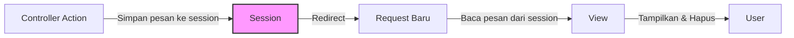
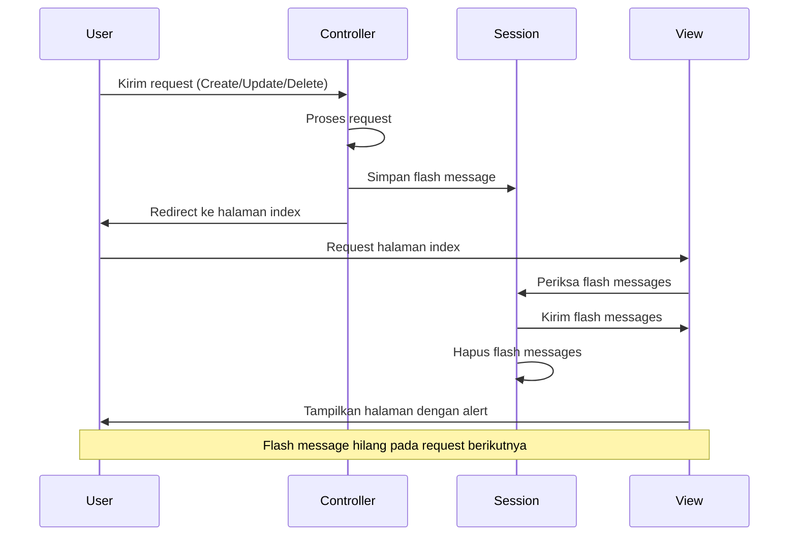

# Flash Messages untuk Notifikasi di Laravel

Flash messages adalah pesan sementara yang ditampilkan sekali kepada pengguna setelah suatu aksi, seperti berhasil menyimpan, mengupdate, atau menghapus data. Tutorial ini akan menjelaskan cara mengimplementasikan flash messages di aplikasi Laravel untuk manajemen data mahasiswa.

## 1. Konsep Flash Messages di Laravel

Flash messages disimpan dalam session dan hanya tersedia hingga request berikutnya. Ini sangat berguna untuk memberikan feedback kepada pengguna setelah melakukan operasi CRUD.



## 2. Mengatur Flash Messages di Controller

Flash messages harus ditambahkan di Controller saat melakukan redirect setelah operasi CRUD. Berikut cara menambahkannya di berbagai metode Controller:

```php
// Create (Store) - MahasiswaController.php
public function store(Request $request)
{
    // Validasi dan simpan data
    
    // Redirect dengan flash message
    return redirect()->route('mahasiswa.index')
                     ->with('success', 'Data mahasiswa berhasil ditambahkan!');
}

// Update
public function update(Request $request, $id)
{
    // Validasi dan update data
    
    // Redirect dengan flash message
    return redirect()->route('mahasiswa.index')
                     ->with('success', 'Data mahasiswa berhasil diperbarui!');
}

// Delete (Destroy)
public function destroy($id)
{
    // Hapus data
    
    // Redirect dengan flash message
    return redirect()->route('mahasiswa.index')
                     ->with('success', 'Data mahasiswa berhasil dihapus!');
}

// Contoh pesan error
public function update(Request $request, $id)
{
    try {
        // Proses update
        
        return redirect()->route('mahasiswa.index')
                         ->with('success', 'Data mahasiswa berhasil diperbarui!');
    } catch (\Exception $e) {
        return redirect()->back()
                         ->with('error', 'Gagal memperbarui data: ' . $e->getMessage())
                         ->withInput();
    }
}
```

## 3. Menampilkan Flash Messages di View

### a. Tambahkan Komponen Flash Message di Layout Utama

Buat file partial untuk flash messages di `resources/views/components/flash-message.blade.php`:

```html
@if(session('success'))
    <div class="alert alert-success alert-dismissible fade show" role="alert">
        <i class="bi bi-check-circle me-1"></i>
        {{ session('success') }}
        <button type="button" class="btn-close" data-bs-dismiss="alert" aria-label="Close"></button>
    </div>
@endif

@if(session('error'))
    <div class="alert alert-danger alert-dismissible fade show" role="alert">
        <i class="bi bi-exclamation-triangle me-1"></i>
        {{ session('error') }}
        <button type="button" class="btn-close" data-bs-dismiss="alert" aria-label="Close"></button>
    </div>
@endif

@if(session('warning'))
    <div class="alert alert-warning alert-dismissible fade show" role="alert">
        <i class="bi bi-exclamation-circle me-1"></i>
        {{ session('warning') }}
        <button type="button" class="btn-close" data-bs-dismiss="alert" aria-label="Close"></button>
    </div>
@endif

@if(session('info'))
    <div class="alert alert-info alert-dismissible fade show" role="alert">
        <i class="bi bi-info-circle me-1"></i>
        {{ session('info') }}
        <button type="button" class="btn-close" data-bs-dismiss="alert" aria-label="Close"></button>
    </div>
@endif
```

### b. Sertakan Komponen di Layout Utama

Tambahkan baris berikut di `resources/views/layouts/app.blade.php`:

```html
<div class="container mt-4">
    @include('components.flash-message')
    
    @yield('content')
</div>
```

## 4. Menambahkan Animasi untuk Flash Messages

Untuk meningkatkan UX, tambahkan JavaScript untuk animasi otomatis menutup flash message setelah beberapa detik:

```html
<!-- Tambahkan di bagian bawah layout sebelum penutup tag body -->
<script>
    // Auto-dismiss flash messages after 5 seconds
    document.addEventListener('DOMContentLoaded', function() {
        setTimeout(function() {
            const alerts = document.querySelectorAll('.alert');
            alerts.forEach(function(alert) {
                // Create Bootstrap alert instance and hide it
                const bsAlert = new bootstrap.Alert(alert);
                bsAlert.close();
            });
        }, 5000); // 5000ms = 5 seconds
    });
</script>
```

## 5. Jenis-Jenis Flash Messages

Anda dapat menggunakan berbagai jenis flash messages sesuai kebutuhan:

```php
// Success message
return redirect()->route('mahasiswa.index')->with('success', 'Operasi berhasil!');

// Error message
return redirect()->back()->with('error', 'Terjadi kesalahan!')->withInput();

// Warning message
return redirect()->route('mahasiswa.index')->with('warning', 'Perhatian!');

// Info message
return redirect()->route('mahasiswa.index')->with('info', 'Informasi penting.');
```

## 6. Menambahkan Ikon dan Styling Menarik

Jika menggunakan Bootstrap Icons, tambahkan link CSS di layout:

```html
<link rel="stylesheet" href="https://cdn.jsdelivr.net/npm/bootstrap-icons@1.10.0/font/bootstrap-icons.css">
```

Kemudian tambahkan kelas CSS kustom untuk animasi:

```html
<style>
    .alert {
        border-left: 4px solid;
        box-shadow: 0 0.125rem 0.25rem rgba(0, 0, 0, 0.075);
    }
    
    .alert-success {
        border-left-color: #198754;
    }
    
    .alert-danger {
        border-left-color: #dc3545;
    }
    
    .alert-warning {
        border-left-color: #ffc107;
    }
    
    .alert-info {
        border-left-color: #0dcaf0;
    }
    
    .alert.fade-in {
        animation: fadeIn 0.5s;
    }
    
    @keyframes fadeIn {
        from { opacity: 0; transform: translateY(-20px); }
        to { opacity: 1; transform: translateY(0); }
    }
</style>
```

## 7. Menggunakan SweetAlert2 untuk Flash Messages yang Lebih Menarik

Alternatif lain adalah menggunakan SweetAlert2 untuk flash messages:

### a. Tambahkan Library SweetAlert2

```html
<!-- Di layout utama -->
<link rel="stylesheet" href="https://cdn.jsdelivr.net/npm/sweetalert2@11/dist/sweetalert2.min.css">
<script src="https://cdn.jsdelivr.net/npm/sweetalert2@11"></script>
```

### b. Tampilkan Flash Messages dengan SweetAlert2

```html
<script>
    document.addEventListener('DOMContentLoaded', function() {
        // Check for flash messages
        @if(session('success'))
            Swal.fire({
                icon: 'success',
                title: 'Berhasil!',
                text: '{{ session('success') }}',
                timer: 3000,
                showConfirmButton: false
            });
        @endif
        
        @if(session('error'))
            Swal.fire({
                icon: 'error',
                title: 'Error!',
                text: '{{ session('error') }}',
                timer: 3000,
                showConfirmButton: true
            });
        @endif
        
        @if(session('warning'))
            Swal.fire({
                icon: 'warning',
                title: 'Perhatian!',
                text: '{{ session('warning') }}',
                timer: 3000,
                showConfirmButton: true
            });
        @endif
        
        @if(session('info'))
            Swal.fire({
                icon: 'info',
                title: 'Informasi',
                text: '{{ session('info') }}',
                timer: 3000,
                showConfirmButton: false
            });
        @endif
    });
</script>
```

## 8. Alur Kerja Flash Messages



## 9. Praktik Terbaik untuk Flash Messages

1. **Konsistensi**: Gunakan jenis pesan yang konsisten untuk tindakan yang sama di seluruh aplikasi.
   
2. **Informatif**: Buat pesan yang informatif dan spesifik, misalnya "Data mahasiswa Budi Santoso berhasil diperbarui" lebih baik daripada "Data berhasil diperbarui".
   
3. **Durasi**: Sesuaikan durasi tampilan pesan - pesan sukses bisa hilang cepat, pesan error mungkin perlu waktu lebih lama.
   
4. **Responsif**: Pastikan flash messages terlihat baik di semua ukuran layar.
   
5. **Posisi Tepat**: Tempatkan flash messages di tempat yang konsisten dan mudah dilihat pengguna.

6. **Hindari Berlebihan**: Jangan memberikan terlalu banyak flash messages sekaligus karena akan membingungkan pengguna.

7. **Tidak Mengganggu**: Pastikan pesan tidak mengganggu interaksi pengguna dengan elemen penting lainnya.

## 10. Contoh Implementasi Lengkap

Controller (MahasiswaController.php):
```php
public function update(Request $request, $id)
{
    try {
        $mahasiswa = Mahasiswa::findOrFail($id);
        
        $validated = $request->validate([
            'nim' => 'required|string|max:20|unique:mahasiswas,nim,'.$id,
            'nama' => 'required|string|max:100',
            'jurusan_id' => 'required|exists:jurusans,id',
            'alamat' => 'nullable|string',
        ]);
        
        $mahasiswa->update($validated);
        
        // Flash message sukses
        return redirect()->route('mahasiswa.index')
                         ->with('success', "Data mahasiswa {$mahasiswa->nama} berhasil diperbarui!");
    } catch (\Illuminate\Database\Eloquent\ModelNotFoundException $e) {
        // Flash message error jika data tidak ditemukan
        return redirect()->route('mahasiswa.index')
                         ->with('error', 'Data mahasiswa tidak ditemukan!');
    } catch (\Exception $e) {
        // Flash message error jika terjadi kesalahan lain
        return redirect()->back()
                         ->with('error', 'Gagal memperbarui data: ' . $e->getMessage())
                         ->withInput();
    }
}
```

Dengan mengikuti panduan ini, Anda dapat mengimplementasikan flash messages yang efektif dan profesional untuk meningkatkan pengalaman pengguna dalam aplikasi Laravel Anda.