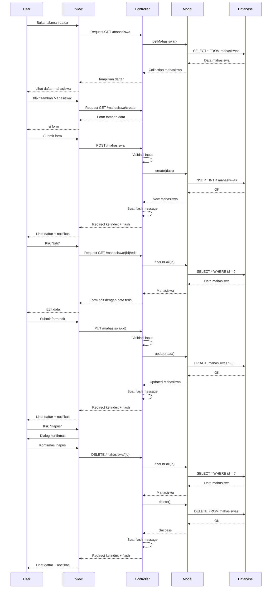
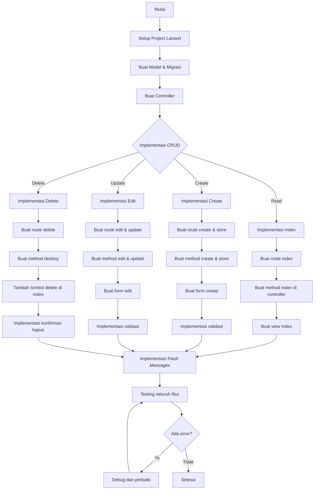

# Tutorial Praktik: Melengkapi CRUD dengan Fitur Edit dan Hapus

Pada tutorial ini, kita akan melengkapi aplikasi manajemen data mahasiswa dengan melakukan praktik langsung membuat fitur edit dan hapus. Kita akan menggunakan semua konsep yang telah dipelajari di sub-topik sebelumnya dan mengintegrasikannya menjadi sistem CRUD lengkap.

## Persiapan

Pastikan Anda sudah memiliki:
1. Project Laravel yang sudah disetup
2. Model Mahasiswa dan tabel database yang sudah dibuat
3. Controller MahasiswaController dasar
4. Fitur tampil data (index) dan tambah data (create/store)

## Langkah 1: Lengkapi Route

Buka file `routes/web.php` dan pastikan semua route untuk CRUD mahasiswa sudah lengkap:

```php
// Routes untuk Mahasiswa CRUD
Route::get('/mahasiswa', 'MahasiswaController@index')->name('mahasiswa.index');
Route::get('/mahasiswa/create', 'MahasiswaController@create')->name('mahasiswa.create');
Route::post('/mahasiswa', 'MahasiswaController@store')->name('mahasiswa.store');
Route::get('/mahasiswa/{id}/edit', 'MahasiswaController@edit')->name('mahasiswa.edit');
Route::put('/mahasiswa/{id}', 'MahasiswaController@update')->name('mahasiswa.update');
Route::delete('/mahasiswa/{id}', 'MahasiswaController@destroy')->name('mahasiswa.destroy');
```

## Langkah 2: Implementasi Form Edit

1. Buat view untuk edit data di `resources/views/mahasiswa/edit.blade.php`:

```html
@extends('layouts.app')

@section('content')
<div class="container">
    <div class="row">
        <div class="col-md-12">
            <div class="card">
                <div class="card-header">
                    <h4>Edit Data Mahasiswa</h4>
                </div>
                <div class="card-body">
                    <form action="{{ route('mahasiswa.update', $mahasiswa->id) }}" method="POST">
                        @csrf
                        @method('PUT')
                        
                        <div class="form-group mb-3">
                            <label for="nim">NIM</label>
                            <input type="text" name="nim" id="nim" 
                                class="form-control @error('nim') is-invalid @enderror" 
                                value="{{ old('nim', $mahasiswa->nim) }}">
                            @error('nim')
                                <div class="invalid-feedback">{{ $message }}</div>
                            @enderror
                        </div>
                        
                        <div class="form-group mb-3">
                            <label for="nama">Nama Mahasiswa</label>
                            <input type="text" name="nama" id="nama" 
                                class="form-control @error('nama') is-invalid @enderror" 
                                value="{{ old('nama', $mahasiswa->nama) }}">
                            @error('nama')
                                <div class="invalid-feedback">{{ $message }}</div>
                            @enderror
                        </div>
                        
                        <div class="form-group mb-3">
                            <label for="jurusan_id">Jurusan</label>
                            <select name="jurusan_id" id="jurusan_id" 
                                class="form-control @error('jurusan_id') is-invalid @enderror">
                                <option value="">-- Pilih Jurusan --</option>
                                @foreach($jurusan as $jur)
                                    <option value="{{ $jur->id }}" 
                                        {{ old('jurusan_id', $mahasiswa->jurusan_id) == $jur->id ? 'selected' : '' }}>
                                        {{ $jur->nama_jurusan }}
                                    </option>
                                @endforeach
                            </select>
                            @error('jurusan_id')
                                <div class="invalid-feedback">{{ $message }}</div>
                            @enderror
                        </div>
                        
                        <div class="form-group mb-3">
                            <label for="alamat">Alamat</label>
                            <textarea name="alamat" id="alamat" rows="3" 
                                class="form-control @error('alamat') is-invalid @enderror">{{ old('alamat', $mahasiswa->alamat) }}</textarea>
                            @error('alamat')
                                <div class="invalid-feedback">{{ $message }}</div>
                            @enderror
                        </div>
                        
                        <div class="form-group">
                            <button type="submit" class="btn btn-primary">Update Data</button>
                            <a href="{{ route('mahasiswa.index') }}" class="btn btn-secondary">Kembali</a>
                        </div>
                    </form>
                </div>
            </div>
        </div>
    </div>
</div>
@endsection
```

2. Lengkapi method `edit` dan `update` di MahasiswaController:

```php
public function edit($id)
{
    $mahasiswa = Mahasiswa::findOrFail($id);
    $jurusan = Jurusan::all();
    
    return view('mahasiswa.edit', compact('mahasiswa', 'jurusan'));
}

public function update(Request $request, $id)
{
    // Validasi input
    $validated = $request->validate([
        'nim' => 'required|string|max:20|unique:mahasiswas,nim,'.$id,
        'nama' => 'required|string|max:100',
        'jurusan_id' => 'required|exists:jurusans,id',
        'alamat' => 'nullable|string',
    ]);
    
    try {
        // Cari data yang akan diupdate
        $mahasiswa = Mahasiswa::findOrFail($id);
        
        // Update data
        $mahasiswa->update($validated);
        
        // Redirect dengan pesan sukses
        return redirect()->route('mahasiswa.index')
                         ->with('success', 'Data mahasiswa berhasil diperbarui!');
    } catch (\Exception $e) {
        return redirect()->back()
                         ->with('error', 'Gagal memperbarui data: ' . $e->getMessage())
                         ->withInput();
    }
}
```

## Langkah 3: Implementasi Hapus Data

1. Tambahkan button/form hapus di view `resources/views/mahasiswa/index.blade.php`:

```html
<!-- Dalam kolom aksi pada tabel daftar mahasiswa -->
<td>
    <div class="d-flex">
        <a href="{{ route('mahasiswa.edit', $mhs->id) }}" class="btn btn-sm btn-primary me-2">
            <i class="bi bi-pencil"></i> Edit
        </a>
        
        <form action="{{ route('mahasiswa.destroy', $mhs->id) }}" method="POST" class="delete-form">
            @csrf
            @method('DELETE')
            <button type="submit" class="btn btn-sm btn-danger delete-btn" 
                    data-id="{{ $mhs->id }}" data-name="{{ $mhs->nama }}">
                <i class="bi bi-trash"></i> Hapus
            </button>
        </form>
    </div>
</td>
```

2. Lengkapi method `destroy` di MahasiswaController:

```php
public function destroy($id)
{
    try {
        // Cari data yang akan dihapus
        $mahasiswa = Mahasiswa::findOrFail($id);
        $nama = $mahasiswa->nama; // Simpan nama untuk pesan
        
        // Hapus data
        $mahasiswa->delete();
        
        // Redirect dengan pesan sukses
        return redirect()->route('mahasiswa.index')
                         ->with('success', "Data mahasiswa $nama berhasil dihapus!");
    } catch (\Exception $e) {
        return redirect()->route('mahasiswa.index')
                         ->with('error', 'Gagal menghapus data: ' . $e->getMessage());
    }
}
```

## Langkah 4: Implementasi Konfirmasi Hapus dengan SweetAlert2

1. Tambahkan SweetAlert2 di layout utama:

```html
<!-- Di layouts/app.blade.php -->
<head>
    <!-- Tag lainnya -->
    <link rel="stylesheet" href="https://cdn.jsdelivr.net/npm/bootstrap-icons@1.10.0/font/bootstrap-icons.css">
    <link rel="stylesheet" href="https://cdn.jsdelivr.net/npm/sweetalert2@11/dist/sweetalert2.min.css">
    <script src="https://cdn.jsdelivr.net/npm/sweetalert2@11"></script>
</head>
```

2. Tambahkan script konfirmasi delete di bagian bawah file `index.blade.php` atau di file JS terpisah:

```html
@section('scripts')
<script>
    document.addEventListener('DOMContentLoaded', function() {
        const deleteForms = document.querySelectorAll('.delete-form');
        
        deleteForms.forEach(form => {
            form.addEventListener('submit', function(e) {
                e.preventDefault();
                
                const button = this.querySelector('.delete-btn');
                const id = button.getAttribute('data-id');
                const name = button.getAttribute('data-name');
                
                Swal.fire({
                    title: 'Konfirmasi Hapus',
                    html: `Apakah Anda yakin ingin menghapus data mahasiswa <strong>${name}</strong>?<br><small class="text-danger">Tindakan ini tidak dapat dibatalkan.</small>`,
                    icon: 'warning',
                    showCancelButton: true,
                    confirmButtonColor: '#d33',
                    cancelButtonColor: '#3085d6',
                    confirmButtonText: 'Ya, Hapus!',
                    cancelButtonText: 'Batal'
                }).then((result) => {
                    if (result.isConfirmed) {
                        this.submit();
                    }
                });
            });
        });
    });
</script>
@endsection
```

## Langkah 5: Implementasi Flash Messages

1. Buat partial untuk flash messages di `resources/views/components/flash-message.blade.php`:

```html
@if(session('success'))
    <div class="alert alert-success alert-dismissible fade show" role="alert">
        <i class="bi bi-check-circle me-1"></i>
        {{ session('success') }}
        <button type="button" class="btn-close" data-bs-dismiss="alert" aria-label="Close"></button>
    </div>
@endif

@if(session('error'))
    <div class="alert alert-danger alert-dismissible fade show" role="alert">
        <i class="bi bi-exclamation-triangle me-1"></i>
        {{ session('error') }}
        <button type="button" class="btn-close" data-bs-dismiss="alert" aria-label="Close"></button>
    </div>
@endif
```

2. Sertakan komponen flash message di layout:

```html
<!-- Di layout utama -->
<div class="container mt-3">
    @include('components.flash-message')
    @yield('content')
</div>
```

## Langkah 6: Merapikan Tampilan Daftar Mahasiswa

Update file `resources/views/mahasiswa/index.blade.php` untuk mempercantik tampilan dan menambahkan tombol aksi:

```html
@extends('layouts.app')

@section('content')
<div class="container">
    <div class="row mb-3">
        <div class="col-md-6">
            <h2>Daftar Mahasiswa</h2>
        </div>
        <div class="col-md-6 text-end">
            <a href="{{ route('mahasiswa.create') }}" class="btn btn-primary">
                <i class="bi bi-plus-circle"></i> Tambah Mahasiswa
            </a>
        </div>
    </div>
    
    <div class="card">
        <div class="card-body">
            <!-- Form Pencarian (opsional) -->
            <form action="{{ route('mahasiswa.index') }}" method="GET" class="mb-4">
                <div class="input-group">
                    <input type="text" name="search" class="form-control" placeholder="Cari mahasiswa..." 
                           value="{{ request('search') }}">
                    <button class="btn btn-outline-secondary" type="submit">
                        <i class="bi bi-search"></i> Cari
                    </button>
                </div>
            </form>
            
            <div class="table-responsive">
                <table class="table table-bordered table-hover">
                    <thead class="table-light">
                        <tr>
                            <th width="5%">No</th>
                            <th width="15%">NIM</th>
                            <th width="25%">Nama</th>
                            <th width="20%">Jurusan</th>
                            <th width="20%">Alamat</th>
                            <th width="15%">Aksi</th>
                        </tr>
                    </thead>
                    <tbody>
                        @forelse($mahasiswa as $index => $mhs)
                        <tr>
                            <td>{{ $mahasiswa->firstItem() + $index }}</td>
                            <td>{{ $mhs->nim }}</td>
                            <td>{{ $mhs->nama }}</td>
                            <td>{{ $mhs->jurusan->nama_jurusan ?? '-' }}</td>
                            <td>{{ $mhs->alamat ?? '-' }}</td>
                            <td>
                                <div class="d-flex">
                                    <a href="{{ route('mahasiswa.edit', $mhs->id) }}" 
                                       class="btn btn-sm btn-primary me-2">
                                        <i class="bi bi-pencil"></i> Edit
                                    </a>
                                    
                                    <form action="{{ route('mahasiswa.destroy', $mhs->id) }}" 
                                          method="POST" class="delete-form">
                                        @csrf
                                        @method('DELETE')
                                        <button type="submit" class="btn btn-sm btn-danger delete-btn" 
                                                data-id="{{ $mhs->id }}" data-name="{{ $mhs->nama }}">
                                            <i class="bi bi-trash"></i> Hapus
                                        </button>
                                    </form>
                                </div>
                            </td>
                        </tr>
                        @empty
                        <tr>
                            <td colspan="6" class="text-center">Tidak ada data mahasiswa</td>
                        </tr>
                        @endforelse
                    </tbody>
                </table>
            </div>
            
            <!-- Pagination -->
            <div class="d-flex justify-content-center mt-3">
                {{ $mahasiswa->links() }}
            </div>
        </div>
    </div>
</div>
@endsection

@section('scripts')
<script>
    // Script konfirmasi delete seperti yang sudah dijelaskan sebelumnya
</script>
@endsection
```

## Langkah 7: Testing dan Debug

1. Test seluruh fitur:
   - Tambah data mahasiswa baru
   - Edit data mahasiswa yang ada
   - Hapus data mahasiswa
   - Verifikasi flash messages muncul dengan benar

2. Debug:
   - Periksa log error di `storage/logs/laravel.log`
   - Gunakan `dd()` atau `dump()` pada controller untuk debug

## Diagram Alur CRUD Lengkap



## Flowchart CRUD Complete



## Kesimpulan

Dalam praktik ini, kita telah berhasil mengimplementasikan fitur edit dan hapus untuk melengkapi operasi CRUD pada aplikasi manajemen data mahasiswa. Beberapa hal penting yang telah kita implementasikan:

1. Form edit data dengan nilai default yang diambil dari database
2. Validasi data pada saat update
3. Konfirmasi hapus data dengan SweetAlert2
4. Flash messages untuk notifikasi hasil operasi
5. UI yang lebih baik dan responsif

Dengan menguasai implementasi CRUD, Anda telah mempelajari konsep dasar pengembangan aplikasi web dengan Laravel. Konsep ini dapat diterapkan pada berbagai jenis aplikasi dan model data lainnya.