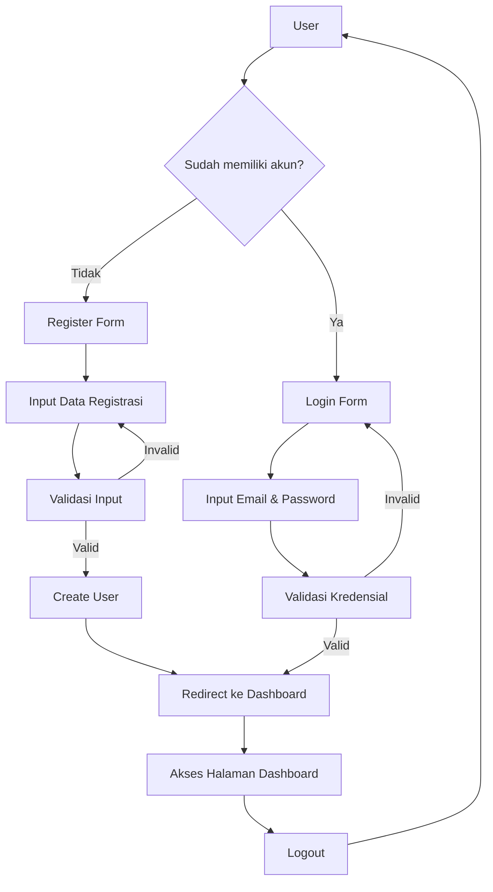
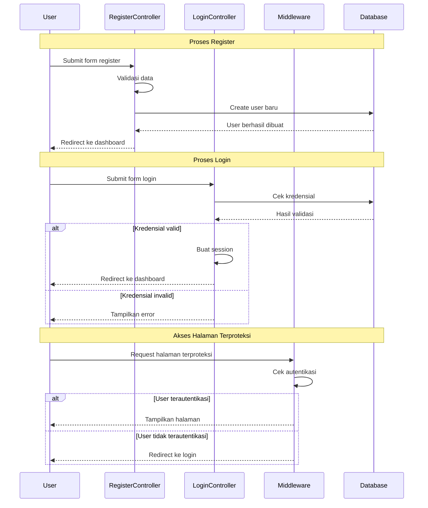

# Tutorial Implementasi Sistem Login dan Register di Laravel

## Langkah-langkah Implementasi Login dan Register

### 1. Persiapan Authentication Laravel

Laravel menyediakan sistem otentikasi bawaan yang bisa kita gunakan dengan mudah. Mari siapkan sistem autentikasi:

```bash
# Install Laravel UI package
composer require laravel/ui

# Generate authentication scaffolding dengan Bootstrap
php artisan ui bootstrap --auth

# Install dependencies dan compile assets
npm install
npm run dev
```

### 2. Konfigurasi Database

Pastikan konfigurasi database di file `.env` sudah benar:

```
DB_CONNECTION=mysql
DB_HOST=127.0.0.1
DB_PORT=3306
DB_DATABASE=mahasiswa_app
DB_USERNAME=root
DB_PASSWORD=
```

### 3. Jalankan Migrasi Tabel User

```bash
php artisan migrate
```

Migrasi ini akan membuat tabel-tabel yang diperlukan untuk autentikasi, termasuk `users`, `password_resets`, dll.

### 4. Memahami Struktur File yang Dibuat

Laravel UI menghasilkan beberapa file dan direktori penting:

- Controller autentikasi di `app/Http/Controllers/Auth/`
- View autentikasi di `resources/views/auth/`
- Routes autentikasi di `routes/web.php`
- Model User di `app/Models/User.php`

### 5. Menyesuaikan Form Register

Sesuaikan form register di `resources/views/auth/register.blade.php` jika Anda perlu menambahkan field tambahan:

```php
<div class="form-group row">
    <label for="nim" class="col-md-4 col-form-label text-md-right">NIM</label>
    <div class="col-md-6">
        <input id="nim" type="text" class="form-control @error('nim') is-invalid @enderror" 
               name="nim" value="{{ old('nim') }}" required autocomplete="nim">
        @error('nim')
            <span class="invalid-feedback" role="alert">
                <strong>{{ $message }}</strong>
            </span>
        @enderror
    </div>
</div>
```

### 6. Menyesuaikan RegisterController

Buka file `app/Http/Controllers/Auth/RegisterController.php` dan sesuaikan:

```php
// Tambahkan field baru ke validators
protected function validator(array $data)
{
    return Validator::make($data, [
        'name' => ['required', 'string', 'max:255'],
        'nim' => ['required', 'string', 'max:20', 'unique:users'],  // Field baru
        'email' => ['required', 'string', 'email', 'max:255', 'unique:users'],
        'password' => ['required', 'string', 'min:8', 'confirmed'],
    ]);
}

// Tambahkan field baru ke creator
protected function create(array $data)
{
    return User::create([
        'name' => $data['name'],
        'nim' => $data['nim'],  // Field baru
        'email' => $data['email'],
        'password' => Hash::make($data['password']),
    ]);
}
```

### 7. Menyesuaikan Model User

Buka `app/Models/User.php` dan tambahkan field baru ke `$fillable`:

```php
protected $fillable = [
    'name',
    'nim',  // Field baru
    'email',
    'password',
];
```

### 8. Update Migrasi User

Ubah migrasi untuk menambahkan kolom baru di `database/migrations/xxxx_xx_xx_create_users_table.php`:

```php
Schema::create('users', function (Blueprint $table) {
    $table->id();
    $table->string('name');
    $table->string('nim')->unique();  // Field baru
    $table->string('email')->unique();
    $table->timestamp('email_verified_at')->nullable();
    $table->string('password');
    $table->rememberToken();
    $table->timestamps();
});
```

Jalankan migrasi ulang:

```bash
php artisan migrate:fresh
```

### 9. Menguji Sistem Authentication

Sekarang buka aplikasi di browser dan akses:
- `/register` untuk halaman pendaftaran
- `/login` untuk halaman login
- `/home` untuk halaman setelah login

### 10. Menyesuaikan Redirect Setelah Login

Buka `app/Providers/RouteServiceProvider.php` dan ubah properti:

```php
public const HOME = '/dashboard';  // Ubah dari '/home'
```

Kemudian buat route dan controller untuk dashboard:

```php
Route::get('/dashboard', [App\Http\Controllers\DashboardController::class, 'index'])->middleware('auth');
```



## Penjelasan Proses Autentikasi Laravel



## Tips dan Best Practices

1. **Keamanan Password**
   - Laravel secara default menggunakan fungsi hash Bcrypt untuk menyimpan password secara aman
   - Sebaiknya gunakan validasi password yang kuat (minimal 8 karakter, kombinasi huruf besar-kecil, angka dan simbol)

2. **Email Verification**
   - Untuk menambahkan verifikasi email, tambahkan trait `MustVerifyEmail` ke model User
   - Tambahkan middleware `verified` pada route yang memerlukan verifikasi email

3. **Forgot Password**
   - Laravel UI sudah menyediakan fitur reset password
   - Pastikan konfigurasi email sudah benar di file `.env`

4. **Login Throttling**
   - Laravel memiliki perlindungan bawaan terhadap brute force attack
   - Bisa dikustomisasi di `app/Http/Controllers/Auth/LoginController.php`

5. **Remember Me**
   - Form login sudah menyediakan fitur "Remember Me"
   - Menggunakan cookie untuk menyimpan token autentikasi

Dengan mengikuti langkah-langkah di atas, Anda sudah berhasil mengimplementasikan sistem autentikasi dasar di aplikasi Laravel. Sistem ini dapat dikembangkan lebih lanjut sesuai kebutuhan aplikasi Anda.