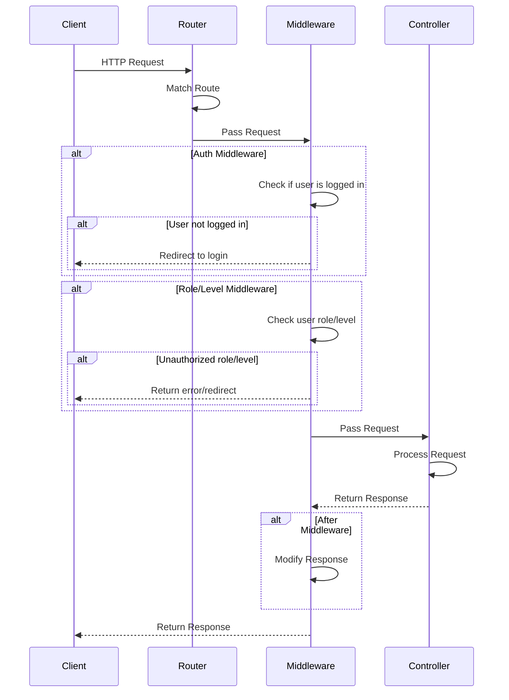

# Middleware di Laravel

## Pengertian Middleware

Middleware adalah filter atau "rantai" yang dilewati oleh request HTTP sebelum mencapai aplikasi Laravel Anda. Middleware dapat digunakan untuk:
- Verifikasi apakah pengguna sudah login
- Verifikasi hak akses (permissions) pengguna
- Proteksi aplikasi dari CSRF (Cross-Site Request Forgery)
- Memodifikasi request atau response

## Cara Kerja Middleware

```mermaid
flowchart LR
    A[Request HTTP] --> B[Middleware 1]
    B --> C[Middleware 2]
    C --> D[Middleware ...]
    D --> E[Controller/Action]
    E --> F[Response]
    F --> G[Middleware ...]
    G --> H[Middleware 2]
    H --> I[Middleware 1]
    I --> J[Browser]
    
    style A fill:#f9f,stroke:#333,stroke-width:2px
    style J fill:#bbf,stroke:#333,stroke-width:2px
    style E fill:#bfb,stroke:#333,stroke-width:2px

```



## Langkah-langkah Membuat dan Menggunakan Middleware

### 1. Middleware Bawaan Laravel

Laravel sudah menyediakan beberapa middleware bawaan yang sering digunakan:

- `auth` - Verifikasi apakah pengguna sudah login
- `guest` - Verifikasi apakah pengguna belum login
- `verified` - Verifikasi apakah email pengguna sudah diverifikasi
- `throttle` - Membatasi jumlah request dalam periode tertentu
- `can` - Verifikasi hak akses berdasarkan Gates/Policies

### 2. Membuat Middleware Kustom

Untuk membuat middleware baru, gunakan perintah Artisan:

```bash
php artisan make:middleware CheckUserRole
```

Perintah ini akan membuat file baru di `app/Http/Middleware/CheckUserRole.php`:

```php
<?php

namespace App\Http\Middleware;

use Closure;
use Illuminate\Http\Request;

class CheckUserRole
{
    /**
     * Handle an incoming request.
     *
     * @param  \Illuminate\Http\Request  $request
     * @param  \Closure  $next
     * @return mixed
     */
    public function handle(Request $request, Closure $next, $role)
    {
        if (!$request->user() || $request->user()->role !== $role) {
            return redirect('home')->with('error', 'Anda tidak memiliki akses ke halaman ini');
        }

        return $next($request);
    }
}
```

### 3. Mendaftarkan Middleware

Setelah membuat middleware, daftarkan di file `app/Http/Kernel.php`:

```php
protected $routeMiddleware = [
    // Middleware lain...
    'role' => \App\Http\Middleware\CheckUserRole::class,
];
```

### 4. Menggunakan Middleware pada Route

#### a. Middleware Tunggal

```php
Route::get('/admin', function () {
    // Hanya admin yang bisa akses
})->middleware('role:admin');
```

#### b. Multiple Middleware

```php
Route::get('/admin/reports', function () {
    // Hanya admin yang sudah login yang bisa akses
})->middleware(['auth', 'role:admin']);
```

#### c. Middleware pada Controller

```php
class AdminController extends Controller
{
    public function __construct()
    {
        $this->middleware('auth');
        $this->middleware('role:admin');
    }
    
    // Method controller
}
```

#### d. Middleware pada Group Route

```php
Route::middleware(['auth', 'role:admin'])->group(function () {
    Route::get('/admin', 'AdminController@index');
    Route::get('/admin/users', 'AdminController@users');
    Route::get('/admin/reports', 'AdminController@reports');
});
```

### 5. Middleware Before & After

Laravel mendukung middleware yang dijalankan sebelum atau sesudah request diproses:

```php
// Middleware Before - dijalankan sebelum request diproses
public function handle($request, Closure $next)
{
    // Lakukan sesuatu sebelum request diproses
    
    return $next($request);
}

// Middleware After - dijalankan setelah request diproses
public function handle($request, Closure $next)
{
    $response = $next($request);
    
    // Lakukan sesuatu setelah request diproses
    
    return $response;
}
```

## Contoh Implementasi: Middleware untuk Verifikasi Level User

Pertama, tambahkan kolom level pada tabel users melalui migrasi:

```php
Schema::table('users', function (Blueprint $table) {
    $table->enum('level', ['admin', 'dosen', 'mahasiswa'])->default('mahasiswa');
});
```

Buat middleware untuk memeriksa level user:

```bash
php artisan make:middleware CheckUserLevel
```

Edit file `app/Http/Middleware/CheckUserLevel.php`:

```php
<?php

namespace App\Http\Middleware;

use Closure;
use Illuminate\Http\Request;

class CheckUserLevel
{
    public function handle(Request $request, Closure $next, ...$levels)
    {
        if (!$request->user() || !in_array($request->user()->level, $levels)) {
            return redirect('dashboard')->with('error', 'Anda tidak memiliki hak akses');
        }

        return $next($request);
    }
}
```

Daftarkan middleware di Kernel.php:

```php
protected $routeMiddleware = [
    // Middleware lain...
    'level' => \App\Http\Middleware\CheckUserLevel::class,
];
```

Gunakan middleware pada route:

```php
// Hanya admin yang bisa akses
Route::get('/admin', 'AdminController@index')->middleware('level:admin');

// Admin dan dosen yang bisa akses
Route::get('/nilai', 'NilaiController@index')->middleware('level:admin,dosen');

// Semua user yang sudah login bisa akses
Route::get('/profil', 'ProfilController@index')->middleware('auth');
```



## Tips Penggunaan Middleware

1. **Gunakan nama yang deskriptif** - Beri nama middleware yang jelas sesuai fungsinya.

2. **Gunakan parameter pada middleware** - Seperti contoh `role:admin` di atas, parameter membuat middleware lebih fleksibel.

3. **Middleware Groups** - Untuk kombinasi middleware yang sering digunakan, definisikan dalam grup middleware di `app/Http/Kernel.php`:

```php
protected $middlewareGroups = [
    'admin' => [
        'auth',
        'level:admin',
    ],
];
```

Kemudian gunakan:

```php
Route::middleware('admin')->group(function () {
    // Route untuk admin
});
```

4. **Global Middleware** - Middleware yang harus selalu dijalankan untuk semua request, didaftarkan di:

```php
protected $middleware = [
    // Middleware lain...
    \App\Http\Middleware\CheckAppMaintenance::class,
];
```

5. **Exception Handling** - Gunakan try-catch dalam middleware untuk penanganan error yang lebih baik.

Dengan menguasai middleware, Anda dapat mengontrol alur request dan meningkatkan keamanan aplikasi Laravel Anda dengan lebih efektif.