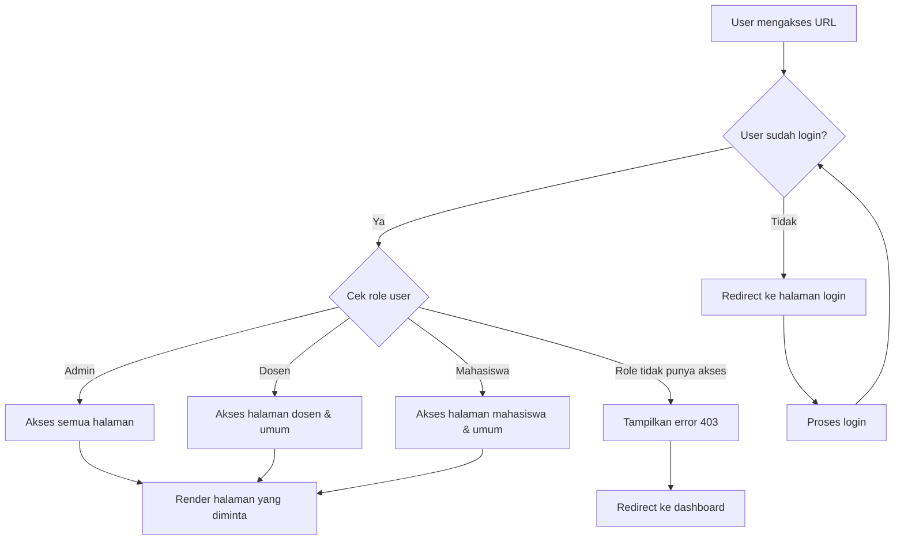
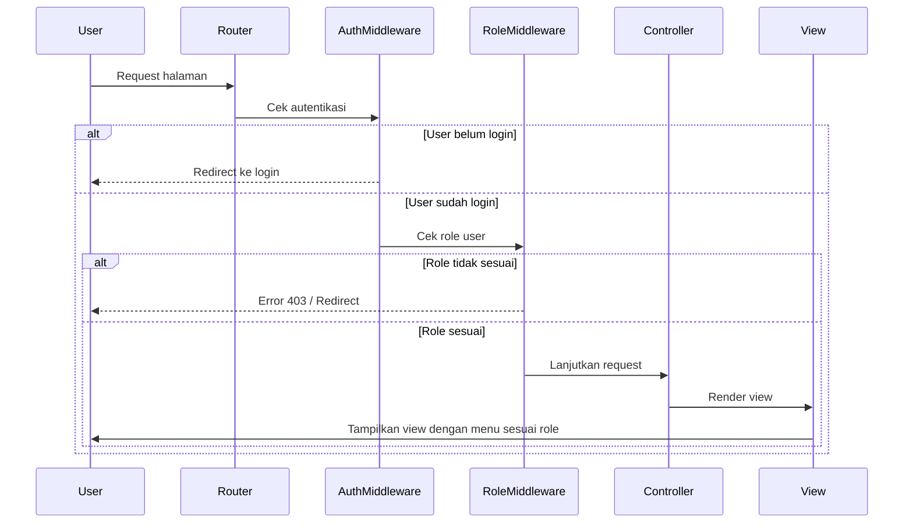

# Tutorial Pembatasan Akses Halaman di Laravel

Setelah mengimplementasikan sistem autentikasi dasar, kita perlu membuat pembatasan akses agar pengguna hanya dapat mengakses halaman sesuai dengan hak akses mereka. Tutorial ini akan menjelaskan cara membatasi akses halaman secara efektif dalam aplikasi Laravel mahasiswa.

## 1. Persiapan Struktur Pengguna dengan Peran (Role)

Pertama, kita perlu menambahkan kolom role ke tabel users:

```bash
php artisan make:migration add_role_to_users_table --table=users
```

Edit file migrasi yang baru dibuat:

```php
public function up()
{
    Schema::table('users', function (Blueprint $table) {
        $table->enum('role', ['admin', 'dosen', 'mahasiswa'])->default('mahasiswa');
    });
}

public function down()
{
    Schema::table('users', function (Blueprint $table) {
        $table->dropColumn('role');
    });
}
```

Jalankan migrasi:

```bash
php artisan migrate
```

Tambahkan kolom role ke model User:

```php
// app/Models/User.php
protected $fillable = [
    'name',
    'email',
    'password',
    'role', // Tambahkan role ke fillable
];
```

## 2. Membuat Middleware untuk Pembatasan Akses Berdasarkan Role

```bash
php artisan make:middleware CheckRole
```

Edit file middleware yang baru dibuat:

```php
// app/Http/Middleware/CheckRole.php
<?php

namespace App\Http\Middleware;

use Closure;
use Illuminate\Http\Request;

class CheckRole
{
    public function handle(Request $request, Closure $next, ...$roles)
    {
        // Pastikan user sudah login
        if (!$request->user()) {
            return redirect('login');
        }

        // Cek apakah user memiliki role yang diizinkan
        if (in_array($request->user()->role, $roles)) {
            return $next($request);
        }

        // Jika tidak memiliki akses, redirect dengan pesan
        return redirect('dashboard')->with('error', 'Anda tidak memiliki izin untuk mengakses halaman ini.');
    }
}
```

Daftarkan middleware di Kernel:

```php
// app/Http/Kernel.php
protected $routeMiddleware = [
    // Middleware lain...
    'role' => \App\Http\Middleware\CheckRole::class,
];
```

## 3. Menerapkan Pembatasan Akses pada Route

Sekarang kita bisa menerapkan middleware role pada route:

```php
// routes/web.php

// Halaman yang bisa diakses semua user yang sudah login
Route::middleware(['auth'])->group(function () {
    Route::get('/dashboard', [DashboardController::class, 'index'])->name('dashboard');
    Route::get('/profile', [ProfileController::class, 'index'])->name('profile');
});

// Halaman khusus Admin
Route::middleware(['auth', 'role:admin'])->group(function () {
    Route::get('/admin/users', [AdminController::class, 'users'])->name('admin.users');
    Route::get('/admin/settings', [AdminController::class, 'settings'])->name('admin.settings');
});

// Halaman untuk Admin dan Dosen
Route::middleware(['auth', 'role:admin,dosen'])->group(function () {
    Route::resource('nilai', NilaiController::class);
});

// Halaman untuk Mahasiswa
Route::middleware(['auth', 'role:mahasiswa'])->group(function () {
    Route::get('/krs', [KrsController::class, 'index'])->name('krs.index');
});
```

## 4. Menerapkan Pembatasan Akses pada Controller

Alternatif lain, kita bisa menerapkan middleware di constructor controller:

```php
// app/Http/Controllers/AdminController.php
public function __construct()
{
    $this->middleware('auth');
    $this->middleware('role:admin');
}
```

## 5. Menerapkan Pembatasan Akses pada Blade Views

Kita juga perlu menyembunyikan tombol atau link yang tidak seharusnya diakses oleh user:

```php
<!-- resources/views/layouts/app.blade.php -->
<nav>
    @auth
        <a href="{{ route('dashboard') }}">Dashboard</a>
        <a href="{{ route('profile') }}">Profile</a>
        
        @if(auth()->user()->role === 'admin')
            <a href="{{ route('admin.users') }}">Manage Users</a>
            <a href="{{ route('admin.settings') }}">Settings</a>
        @endif
        
        @if(in_array(auth()->user()->role, ['admin', 'dosen']))
            <a href="{{ route('nilai.index') }}">Nilai Mahasiswa</a>
        @endif
        
        @if(auth()->user()->role === 'mahasiswa')
            <a href="{{ route('krs.index') }}">KRS</a>
        @endif
    @endauth
</nav>
```

## 6. Membuat Blade Directive Kustom untuk Mempermudah Pembatasan Tampilan

Tambahkan directive kustom di AppServiceProvider:

```php
// app/Providers/AppServiceProvider.php
public function boot()
{
    Blade::if('role', function ($roles) {
        return auth()->check() && (is_array($roles) 
            ? in_array(auth()->user()->role, $roles) 
            : auth()->user()->role === $roles);
    });
}
```

Kemudian gunakan directive ini di view:

```php
@role('admin')
    <a href="{{ route('admin.users') }}">Manage Users</a>
@endrole

@role(['admin', 'dosen'])
    <a href="{{ route('nilai.index') }}">Nilai Mahasiswa</a>
@endrole
```

## 7. Menangani Pengecualian Izin Akses

Buat halaman error 403 kustom:

```bash
php artisan vendor:publish --tag=laravel-errors
```

Edit file `resources/views/errors/403.blade.php`:

```php
@extends('layouts.app')

@section('content')
<div class="container">
    <div class="alert alert-danger">
        <h4>Akses Ditolak</h4>
        <p>Anda tidak memiliki izin untuk mengakses halaman ini.</p>
        <a href="{{ route('dashboard') }}" class="btn btn-primary">Kembali ke Dashboard</a>
    </div>
</div>
@endsection
```

Ubah handler di `app/Exceptions/Handler.php` untuk menangani AuthorizationException:

```php
use Illuminate\Auth\Access\AuthorizationException;

public function register()
{
    $this->renderable(function (AuthorizationException $e, $request) {
        return response()->view('errors.403', [], 403);
    });
}
```



## Diagram Proses Pembatasan Akses



## Tips Pembatasan Akses Halaman

1. **Gunakan Gates dan Policies** untuk pembatasan akses yang lebih kompleks:

```php
// Di AuthServiceProvider
Gate::define('manage-users', function ($user) {
    return $user->role === 'admin';
});

// Di controller atau middleware
if (Gate::allows('manage-users')) {
    // Lakukan aksi
}

// Di blade
@can('manage-users')
    <a href="{{ route('admin.users') }}">Manage Users</a>
@endcan
```

2. **Kombinasikan dengan fitur lain** seperti email verification:

```php
Route::middleware(['auth', 'verified', 'role:admin'])->group(function () {
    // Route yang hanya bisa diakses admin yang sudah verifikasi email
});
```

3. **Gunakan cache** untuk menyimpan informasi role jika aplikasi memiliki banyak pengguna:

```php
// Contoh caching role
$userRole = Cache::remember('user_role_' . auth()->id(), 60*24, function () {
    return auth()->user()->role;
});
```

Dengan mengimplementasikan langkah-langkah di atas, aplikasi Laravel Anda akan memiliki sistem pembatasan akses yang efektif dan aman, sehingga setiap pengguna hanya dapat mengakses halaman sesuai dengan peran dan hak aksesnya.