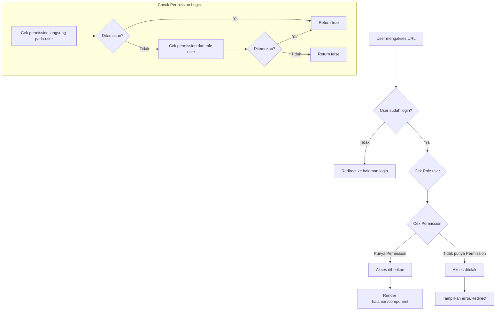
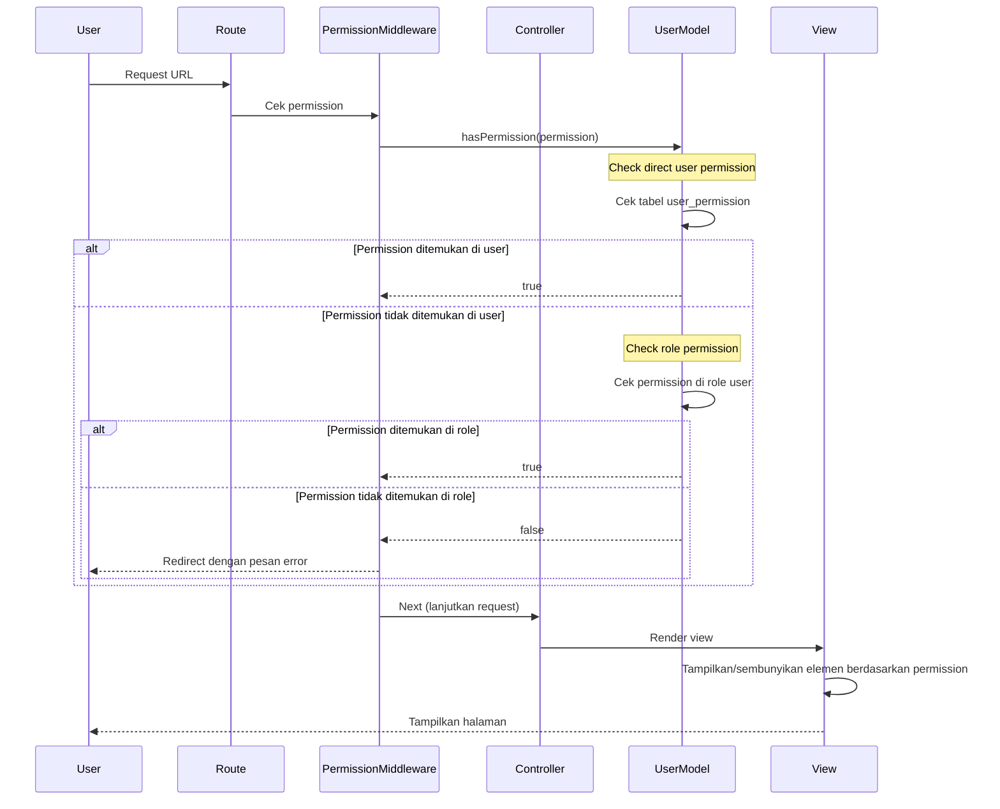

# Tutorial Role dan Permission Sederhana di Laravel

Sistem role dan permission memungkinkan kita untuk membuat manajemen hak akses yang lebih fleksibel dibanding hanya menggunakan role saja. Berikut langkah-langkah implementasi sistem role dan permission sederhana untuk aplikasi Mahasiswa Laravel.

## 1. Persiapan Struktur Database

Pertama, kita perlu membuat beberapa tabel untuk mengelola role dan permission:

```bash
# Membuat model dan migrasi untuk Role
php artisan make:model Role -m

# Membuat model dan migrasi untuk Permission
php artisan make:model Permission -m

# Membuat tabel pivot untuk relasi banyak-ke-banyak
php artisan make:migration create_role_permission_table
php artisan make:migration create_user_permission_table
```

## 2. Definisikan Struktur Tabel

### Migrasi Role:

```php
// database/migrations/xxxx_xx_xx_create_roles_table.php
public function up()
{
    Schema::create('roles', function (Blueprint $table) {
        $table->id();
        $table->string('name')->unique();
        $table->string('slug')->unique();
        $table->string('description')->nullable();
        $table->timestamps();
    });
}
```

### Migrasi Permission:

```php
// database/migrations/xxxx_xx_xx_create_permissions_table.php
public function up()
{
    Schema::create('permissions', function (Blueprint $table) {
        $table->id();
        $table->string('name')->unique();
        $table->string('slug')->unique();
        $table->string('description')->nullable();
        $table->timestamps();
    });
}
```

### Migrasi Tabel Pivot Role-Permission:

```php
// database/migrations/xxxx_xx_xx_create_role_permission_table.php
public function up()
{
    Schema::create('role_permission', function (Blueprint $table) {
        $table->foreignId('role_id')->constrained()->onDelete('cascade');
        $table->foreignId('permission_id')->constrained()->onDelete('cascade');
        $table->primary(['role_id', 'permission_id']);
    });
}
```

### Migrasi Tabel Pivot User-Permission (untuk permission khusus user):

```php
// database/migrations/xxxx_xx_xx_create_user_permission_table.php
public function up()
{
    Schema::create('user_permission', function (Blueprint $table) {
        $table->foreignId('user_id')->constrained()->onDelete('cascade');
        $table->foreignId('permission_id')->constrained()->onDelete('cascade');
        $table->primary(['user_id', 'permission_id']);
    });
}
```

### Modifikasi Tabel Users untuk Relasi Role:

```php
// database/migrations/xxxx_xx_xx_add_role_id_to_users_table.php
public function up()
{
    Schema::table('users', function (Blueprint $table) {
        $table->foreignId('role_id')->nullable()->constrained()->onDelete('set null');
    });
}
```

Jalankan semua migrasi:

```bash
php artisan migrate
```

## 3. Definisikan Model dan Relasi

### Model Role:

```php
// app/Models/Role.php
<?php

namespace App\Models;

use Illuminate\Database\Eloquent\Model;

class Role extends Model
{
    protected $fillable = ['name', 'slug', 'description'];
    
    public function permissions()
    {
        return $this->belongsToMany(Permission::class, 'role_permission');
    }
    
    public function users()
    {
        return $this->hasMany(User::class);
    }
}
```

### Model Permission:

```php
// app/Models/Permission.php
<?php

namespace App\Models;

use Illuminate\Database\Eloquent\Model;

class Permission extends Model
{
    protected $fillable = ['name', 'slug', 'description'];
    
    public function roles()
    {
        return $this->belongsToMany(Role::class, 'role_permission');
    }
    
    public function users()
    {
        return $this->belongsToMany(User::class, 'user_permission');
    }
}
```

### Model User (modifikasi):

```php
// app/Models/User.php
<?php

namespace App\Models;

use Illuminate\Foundation\Auth\User as Authenticatable;

class User extends Authenticatable
{
    // Existing code...
    
    public function role()
    {
        return $this->belongsTo(Role::class);
    }
    
    public function permissions()
    {
        return $this->belongsToMany(Permission::class, 'user_permission');
    }
    
    // Metode helper untuk mengecek role
    public function hasRole($role)
    {
        if (is_string($role)) {
            return $this->role && $this->role->slug === $role;
        }
        
        return false;
    }
    
    // Metode helper untuk mengecek permission
    public function hasPermission($permission)
    {
        // Cek permission langsung pada user
        if ($this->permissions->where('slug', $permission)->count()) {
            return true;
        }
        
        // Cek permission melalui role user
        if ($this->role) {
            return $this->role->permissions->where('slug', $permission)->count() > 0;
        }
        
        return false;
    }
}
```

## 4. Buat Seeder untuk Data Awal

```bash
php artisan make:seeder RolesAndPermissionsSeeder
```

```php
// database/seeders/RolesAndPermissionsSeeder.php
<?php

namespace Database\Seeders;

use Illuminate\Database\Seeder;
use App\Models\Role;
use App\Models\Permission;

class RolesAndPermissionsSeeder extends Seeder
{
    public function run()
    {
        // Roles
        $roles = [
            ['name' => 'Administrator', 'slug' => 'admin', 'description' => 'Full access to all features'],
            ['name' => 'Dosen', 'slug' => 'dosen', 'description' => 'Can manage courses and grades'],
            ['name' => 'Mahasiswa', 'slug' => 'mahasiswa', 'description' => 'Can view their own data']
        ];
        
        foreach ($roles as $role) {
            Role::create($role);
        }
        
        // Permissions
        $permissions = [
            // User Management
            ['name' => 'View Users', 'slug' => 'view-users', 'description' => 'Can view user list'],
            ['name' => 'Create Users', 'slug' => 'create-users', 'description' => 'Can create new users'],
            ['name' => 'Edit Users', 'slug' => 'edit-users', 'description' => 'Can edit existing users'],
            ['name' => 'Delete Users', 'slug' => 'delete-users', 'description' => 'Can delete users'],
            
            // Course Management
            ['name' => 'View Courses', 'slug' => 'view-courses', 'description' => 'Can view course list'],
            ['name' => 'Create Courses', 'slug' => 'create-courses', 'description' => 'Can create new courses'],
            ['name' => 'Edit Courses', 'slug' => 'edit-courses', 'description' => 'Can edit existing courses'],
            ['name' => 'Delete Courses', 'slug' => 'delete-courses', 'description' => 'Can delete courses'],
            
            // Grade Management
            ['name' => 'View Grades', 'slug' => 'view-grades', 'description' => 'Can view grades'],
            ['name' => 'Create Grades', 'slug' => 'create-grades', 'description' => 'Can create grades'],
            ['name' => 'Edit Grades', 'slug' => 'edit-grades', 'description' => 'Can edit grades'],
            ['name' => 'Delete Grades', 'slug' => 'delete-grades', 'description' => 'Can delete grades'],
        ];
        
        foreach ($permissions as $permission) {
            Permission::create($permission);
        }
        
        // Assign permissions to roles
        $adminRole = Role::where('slug', 'admin')->first();
        $dosenRole = Role::where('slug', 'dosen')->first();
        $mahasiswaRole = Role::where('slug', 'mahasiswa')->first();
        
        // Admin gets all permissions
        $adminRole->permissions()->attach(Permission::all());
        
        // Dosen permissions
        $dosenRole->permissions()->attach(
            Permission::whereIn('slug', [
                'view-courses', 'view-grades', 'create-grades', 'edit-grades',
            ])->get()
        );
        
        // Mahasiswa permissions
        $mahasiswaRole->permissions()->attach(
            Permission::whereIn('slug', [
                'view-courses', 'view-grades'
            ])->get()
        );
    }
}
```

Jalankan seeder:

```bash
php artisan db:seed --class=RolesAndPermissionsSeeder
```

## 5. Buat Middleware untuk Permission Check

```bash
php artisan make:middleware CheckPermission
```

```php
// app/Http/Middleware/CheckPermission.php
<?php

namespace App\Http\Middleware;

use Closure;
use Illuminate\Http\Request;

class CheckPermission
{
    public function handle(Request $request, Closure $next, $permission)
    {
        if (!$request->user() || !$request->user()->hasPermission($permission)) {
            return redirect()
                ->route('dashboard')
                ->with('error', 'Anda tidak memiliki izin untuk mengakses halaman ini.');
        }

        return $next($request);
    }
}
```

Daftarkan middleware:

```php
// app/Http/Kernel.php
protected $routeMiddleware = [
    // Existing middlewares...
    'permission' => \App\Http\Middleware\CheckPermission::class,
];
```

## 6. Implementasi pada Routes

```php
// routes/web.php

// User management (Admin only)
Route::middleware(['auth', 'permission:view-users'])->group(function () {
    Route::get('/users', [UserController::class, 'index'])->name('users.index');
    
    Route::middleware(['permission:create-users'])->group(function () {
        Route::get('/users/create', [UserController::class, 'create'])->name('users.create');
        Route::post('/users', [UserController::class, 'store'])->name('users.store');
    });
    
    Route::middleware(['permission:edit-users'])->group(function () {
        Route::get('/users/{user}/edit', [UserController::class, 'edit'])->name('users.edit');
        Route::put('/users/{user}', [UserController::class, 'update'])->name('users.update');
    });
    
    Route::delete('/users/{user}', [UserController::class, 'destroy'])
        ->middleware('permission:delete-users')
        ->name('users.destroy');
});

// Course management (Admin and Dosen)
Route::middleware(['auth', 'permission:view-courses'])->group(function () {
    Route::get('/courses', [CourseController::class, 'index'])->name('courses.index');
    
    // Other course routes with appropriate permissions...
});

// Grade management (Admin and Dosen for all, Mahasiswa for viewing)
Route::middleware(['auth', 'permission:view-grades'])->group(function () {
    Route::get('/grades', [GradeController::class, 'index'])->name('grades.index');
    
    // Other grade routes with appropriate permissions...
});
```

## 7. Implementasi pada Blade Views

```php
<!-- resources/views/layouts/app.blade.php -->
<nav>
    @auth
        <a href="{{ route('dashboard') }}">Dashboard</a>
        
        @if(auth()->user()->hasPermission('view-users'))
            <a href="{{ route('users.index') }}">Manage Users</a>
        @endif
        
        @if(auth()->user()->hasPermission('view-courses'))
            <a href="{{ route('courses.index') }}">Courses</a>
        @endif
        
        @if(auth()->user()->hasPermission('view-grades'))
            <a href="{{ route('grades.index') }}">Grades</a>
        @endif
    @endauth
</nav>

<!-- Dalam halaman manajemen users -->
@if(auth()->user()->hasPermission('create-users'))
    <a href="{{ route('users.create') }}" class="btn btn-primary">Add New User</a>
@endif

<!-- Dalam daftar users -->
@foreach($users as $user)
    <tr>
        <td>{{ $user->name }}</td>
        <td>
            @if(auth()->user()->hasPermission('edit-users'))
                <a href="{{ route('users.edit', $user) }}" class="btn btn-sm btn-info">Edit</a>
            @endif
            
            @if(auth()->user()->hasPermission('delete-users'))
                <form action="{{ route('users.destroy', $user) }}" method="POST" class="d-inline">
                    @csrf
                    @method('DELETE')
                    <button type="submit" class="btn btn-sm btn-danger" 
                            onclick="return confirm('Are you sure?')">Delete</button>
                </form>
            @endif
        </td>
    </tr>
@endforeach
```

## 8. Buat Blade Directive untuk Permission

```php
// app/Providers/AppServiceProvider.php
public function boot()
{
    Blade::if('permission', function ($permission) {
        return auth()->check() && auth()->user()->hasPermission($permission);
    });
}
```

Penggunaan:

```php
@permission('create-users')
    <a href="{{ route('users.create') }}" class="btn btn-primary">Add New User</a>
@endpermission
```

## 9. Integrasikan dengan Gates dan Policies

```php
// app/Providers/AuthServiceProvider.php
public function boot()
{
    // Gates
    Gate::define('view-users', function ($user) {
        return $user->hasPermission('view-users');
    });
    
    Gate::define('create-users', function ($user) {
        return $user->hasPermission('create-users');
    });
    
    // Bisa dilanjutkan untuk permission lainnya
}
```

Kemudian gunakan di controller:

```php
// app/Http/Controllers/UserController.php
public function index()
{
    $this->authorize('view-users');
    $users = User::all();
    return view('users.index', compact('users'));
}

public function create()
{
    $this->authorize('create-users');
    return view('users.create');
}
```



## Diagram Proses Pemeriksaan Role dan Permission



## Tips Implementasi Role dan Permission

1. **Gunakan cache untuk performa yang lebih baik** - Hindari query database berulang:

```php
public function hasPermission($permission)
{
    $cacheKey = "user_{$this->id}_has_permission_{$permission}";
    
    return Cache::remember($cacheKey, 60*24, function () use ($permission) {
        // Cek normal permission seperti di atas
    });
}
```

2. **Tambahkan Role dan Permission Management UI** - Buat UI administrator untuk mengelola role dan permission.

3. **Buat middleware untuk route resource secara keseluruhan**:

```php
Route::resource('users', UserController::class)->middleware('auth')->middleware([
    'index' => 'permission:view-users',
    'create' => 'permission:create-users',
    'store' => 'permission:create-users',
    'show' => 'permission:view-users',
    'edit' => 'permission:edit-users',
    'update' => 'permission:edit-users',
    'destroy' => 'permission:delete-users',
]);
```

4. **Buat permission dinamis untuk resource tertentu**:

```php
// Contoh: Dosen hanya boleh melihat/mengedit nilai mahasiswa di kelasnya
public function hasPermissionForClass($permission, $classId) 
{
    if ($this->hasRole('admin')) {
        return true;
    }
    
    if ($this->hasRole('dosen')) {
        return $this->classes->contains($classId);
    }
    
    return false;
}
```

Dengan mengikuti tutorial ini, Anda telah berhasil mengimplementasikan sistem role dan permission yang fleksibel untuk aplikasi Laravel. Sistem ini akan memungkinkan pengelolaan hak akses yang lebih detail dibandingkan hanya menggunakan role saja.