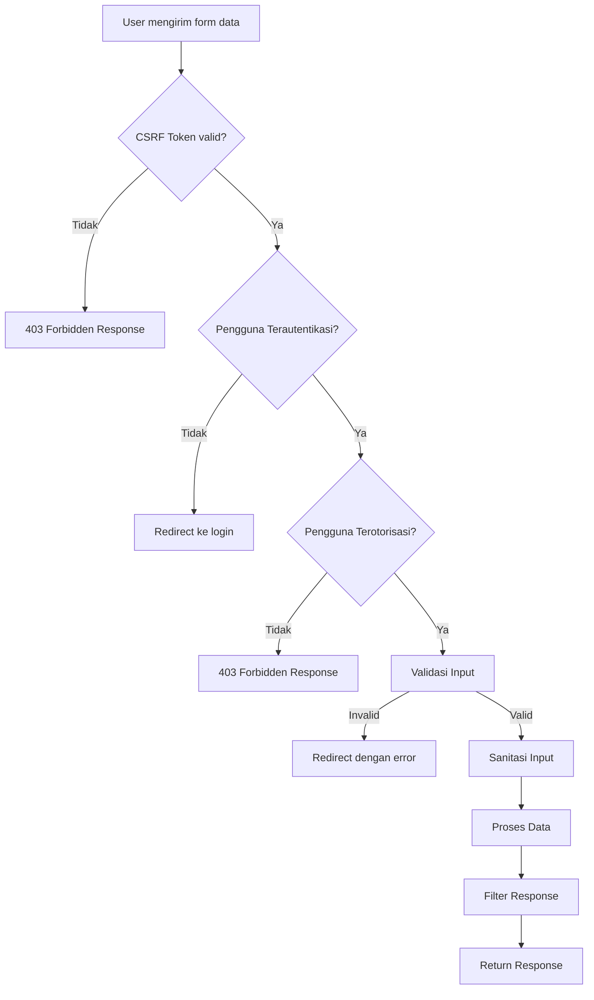
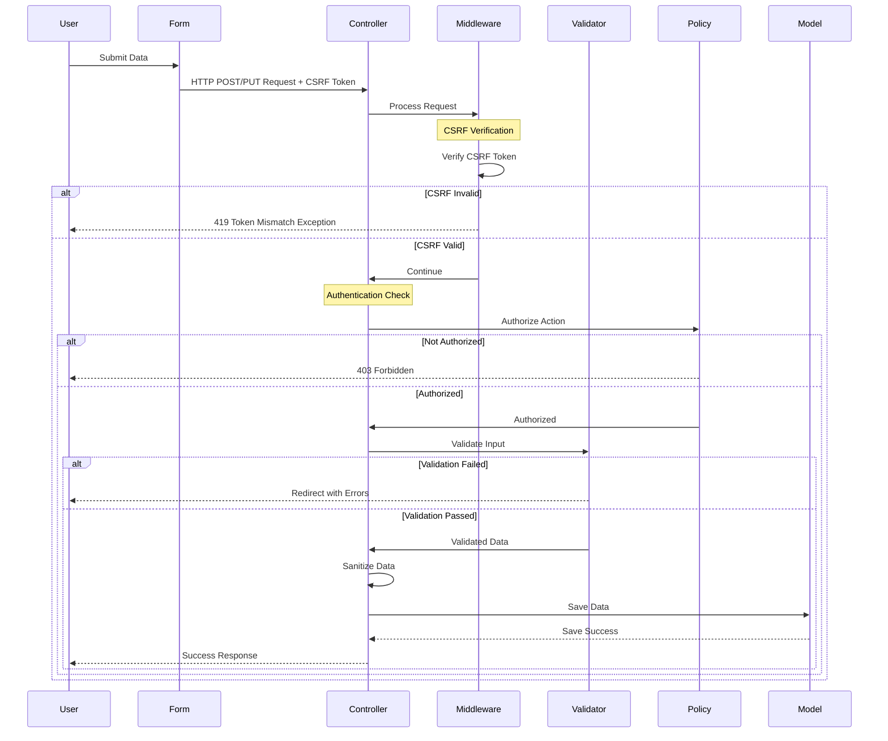

# Proteksi Form dan Data di Laravel

Keamanan data adalah komponen kritis dalam pengembangan aplikasi web. Pada tutorial ini, kita akan mempelajari cara melindungi form dan data dalam aplikasi Laravel untuk manajemen data mahasiswa. Proteksi ini penting untuk mencegah akses tidak sah, serangan CSRF, dan manipulasi data yang tidak diinginkan.

## 1. Proteksi CSRF (Cross-Site Request Forgery)

CSRF adalah serangan yang memaksa pengguna untuk menjalankan tindakan yang tidak diinginkan pada aplikasi web. Laravel menyediakan perlindungan bawaan terhadap CSRF.

### Implementasi Token CSRF:

```php
<form method="POST" action="/mahasiswa">
    @csrf
    <!-- Form fields -->
    <input type="text" name="nama" value="{{ old('nama') }}">
    <button type="submit">Simpan</button>
</form>
```

Laravel akan secara otomatis menolak permintaan POST tanpa token CSRF yang valid. Middleware `VerifyCsrfToken` sudah diaktifkan secara default di Laravel.

## 2. Validasi Form Input

Validasi input sangat penting untuk mencegah data yang tidak valid atau berbahaya.

### Implementasi Validasi:

```php
// MahasiswaController.php
public function store(Request $request)
{
    $validated = $request->validate([
        'nim' => 'required|string|max:20|unique:mahasiswas',
        'nama' => 'required|string|max:255',
        'email' => 'required|email|unique:mahasiswas',
        'jurusan_id' => 'required|exists:jurusans,id',
        'tanggal_lahir' => 'required|date|before:today',
    ]);
    
    Mahasiswa::create($validated);
    
    return redirect()->route('mahasiswa.index')
        ->with('success', 'Data mahasiswa berhasil disimpan.');
}
```

### Menampilkan Pesan Error:

```php
<div class="form-group">
    <label for="nim">NIM</label>
    <input type="text" name="nim" value="{{ old('nim') }}" class="form-control @error('nim') is-invalid @enderror">
    @error('nim')
        <div class="invalid-feedback">{{ $message }}</div>
    @enderror
</div>
```

## 3. Mass Assignment Protection

Proteksi mass assignment mencegah pengguna memodifikasi kolom yang tidak seharusnya bisa diubah.

### Mengamankan Model:

```php
// app/Models/Mahasiswa.php
class Mahasiswa extends Model
{
    // Hanya kolom-kolom ini yang bisa diisi massal
    protected $fillable = [
        'nim', 'nama', 'email', 'jurusan_id', 'tanggal_lahir', 'alamat'
    ];
    
    // Kolom-kolom ini tidak boleh diisi dengan mass assignment
    protected $guarded = [
        'id', 'created_at', 'updated_at', 'status_verifikasi'
    ];
}
```

## 4. Form Request Validation

Untuk validasi yang lebih kompleks, gunakan Form Request:

```bash
php artisan make:request StoreMahasiswaRequest
```

```php
// app/Http/Requests/StoreMahasiswaRequest.php
public function authorize()
{
    // Cek apakah user boleh melakukan aksi ini
    return auth()->user()->hasPermission('create-mahasiswa');
}

public function rules()
{
    return [
        'nim' => 'required|string|max:20|unique:mahasiswas',
        'nama' => 'required|string|max:255',
        'email' => 'required|email|unique:mahasiswas',
        'jurusan_id' => 'required|exists:jurusans,id',
        'tanggal_lahir' => 'required|date|before:today',
        'alamat' => 'nullable|string|max:500',
    ];
}
```

Penggunaan di Controller:

```php
public function store(StoreMahasiswaRequest $request)
{
    // Data sudah tervalidasi dan user sudah diauthorisasi
    $validated = $request->validated();
    
    Mahasiswa::create($validated);
    
    return redirect()->route('mahasiswa.index')
        ->with('success', 'Data mahasiswa berhasil disimpan.');
}
```

## 5. Sanitasi Input

Bersihkan input pengguna untuk mencegah XSS:

```php
// Di dalam Controller atau Form Request
public function store(Request $request)
{
    $validated = $request->validate([
        'nama' => 'required|string|max:255',
        'bio' => 'nullable|string|max:1000',
    ]);
    
    // Sanitasi html
    $validated['bio'] = strip_tags($validated['bio']);
    
    // Atau gunakan HTML Purifier untuk sanitasi yang lebih aman
    // $validated['bio'] = clean($validated['bio']);
    
    Mahasiswa::create($validated);
    
    return redirect()->route('mahasiswa.index')
        ->with('success', 'Data mahasiswa berhasil disimpan.');
}
```

Menggunakan HTML Purifier (memerlukan instalasi paket):

```bash
composer require mews/purifier
```

```php
$validated['bio'] = clean($validated['bio']);
```

## 6. Policy untuk Otorisasi

Buat policy untuk mengatur siapa yang bisa mengakses atau memodifikasi data:

```bash
php artisan make:policy MahasiswaPolicy --model=Mahasiswa
```

```php
// app/Policies/MahasiswaPolicy.php
public function view(User $user, Mahasiswa $mahasiswa)
{
    // Admin dan dosen bisa melihat semua data
    if ($user->hasRole('admin') || $user->hasRole('dosen')) {
        return true;
    }
    
    // Mahasiswa hanya bisa melihat data mereka sendiri
    return $user->hasRole('mahasiswa') && $user->id === $mahasiswa->user_id;
}

public function update(User $user, Mahasiswa $mahasiswa)
{
    // Admin bisa mengubah semua data
    if ($user->hasRole('admin')) {
        return true;
    }
    
    // Dosen bisa mengubah data mahasiswa dalam kelasnya
    if ($user->hasRole('dosen')) {
        return $user->kelas->contains($mahasiswa->kelas_id);
    }
    
    // Mahasiswa hanya bisa mengubah data mereka sendiri
    return $user->hasRole('mahasiswa') && $user->id === $mahasiswa->user_id;
}
```

Penggunaan di Controller:

```php
public function edit(Mahasiswa $mahasiswa)
{
    $this->authorize('update', $mahasiswa);
    
    return view('mahasiswa.edit', compact('mahasiswa'));
}

public function update(Request $request, Mahasiswa $mahasiswa)
{
    $this->authorize('update', $mahasiswa);
    
    // Proses update...
}
```

## 7. Response Filtering

Filter data yang dikembalikan ke pengguna:

```php
// Menggunakan Resource untuk memfilter kolom yang ditampilkan
php artisan make:resource MahasiswaResource
```

```php
// app/Http/Resources/MahasiswaResource.php
public function toArray($request)
{
    // Admin dan dosen bisa melihat semua data
    if (auth()->user()->hasRole(['admin', 'dosen'])) {
        return [
            'id' => $this->id,
            'nim' => $this->nim,
            'nama' => $this->nama,
            'email' => $this->email,
            'jurusan' => $this->jurusan->nama,
            'tanggal_lahir' => $this->tanggal_lahir,
            'alamat' => $this->alamat,
            'nilai' => $this->nilai,
        ];
    }
    
    // Mahasiswa hanya melihat data terbatas
    return [
        'id' => $this->id,
        'nim' => $this->nim,
        'nama' => $this->nama,
        'email' => $this->email,
        'jurusan' => $this->jurusan->nama,
    ];
}
```

Penggunaan di Controller:

```php
public function show(Mahasiswa $mahasiswa)
{
    $this->authorize('view', $mahasiswa);
    
    return view('mahasiswa.show', [
        'mahasiswa' => new MahasiswaResource($mahasiswa)
    ]);
}
```

## 8. Pencegahan SQL Injection

Laravel's Query Builder dan Eloquent ORM sudah aman dari SQL Injection, namun perlu berhati-hati dengan query manual:

```php
// TIDAK AMAN:
$results = DB::select("SELECT * FROM mahasiswas WHERE nama LIKE '%$searchTerm%'");

// AMAN - menggunakan parameter binding:
$results = DB::select("SELECT * FROM mahasiswas WHERE nama LIKE ?", ["%$searchTerm%"]);

// LEBIH AMAN - menggunakan Query Builder:
$results = DB::table('mahasiswas')->where('nama', 'like', "%$searchTerm%")->get();

// PALING DISARANKAN - menggunakan Eloquent:
$results = Mahasiswa::where('nama', 'like', "%$searchTerm%")->get();
```

## 9. Proteksi dari Method Spoofing

Terapkan proteksi untuk route-route tertentu:

```php
// routes/web.php
Route::match(['get', 'head'], 'mahasiswa', [MahasiswaController::class, 'index']);
Route::post('mahasiswa', [MahasiswaController::class, 'store']);
```

Laravel sudah menerapkan proteksi method spoofing, tapi kita bisa menambahkan middleware tambahan jika diperlukan.

## 10. Enkripsi Data Sensitif

Enkripsi data sensitif sebelum disimpan:

```php
// app/Models/Mahasiswa.php
use Illuminate\Database\Eloquent\Casts\Attribute;

protected function noKtp(): Attribute
{
    return Attribute::make(
        get: fn ($value) => decrypt($value),
        set: fn ($value) => encrypt($value),
    );
}
```



## Diagram Proses untuk Proteksi Form dan Data



## Tips Tambahan untuk Proteksi Form dan Data

1. **Gunakan rate limiting** untuk mencegah brute force dan DoS:

```php
// routes/web.php
Route::middleware(['throttle:5,1'])->group(function () {
    Route::post('/login', [AuthController::class, 'login']);
});
```

2. **Implementasi honeypot field** untuk menangkap bot:

```php
<input type="text" name="website" style="display:none">
```

```php
public function rules()
{
    return [
        'website' => 'honeypot',
        // field lain...
    ];
}
```

3. **Gunakan middleware terpisah untuk proses sensitif**:

```php
// app/Http/Middleware/VerifyAdmin.php
public function handle($request, Closure $next)
{
    if (!auth()->check() || !auth()->user()->isAdmin()) {
        Log::warning('Unauthorized admin access attempt by: ' . 
            (auth()->check() ? auth()->user()->email : 'guest'));
        abort(403);
    }
    
    return $next($request);
}
```

4. **Implementasi autentikasi dua faktor**:

```php
// Contoh alur 2FA sederhana
public function login(Request $request)
{
    if (Auth::attempt($request->only('email', 'password'))) {
        $user = Auth::user();
        if ($user->using_2fa) {
            // Kirim kode OTP
            $code = random_int(100000, 999999);
            $user->update(['otp_code' => Hash::make($code)]);
            // Kirim email/SMS dengan kode
            
            return redirect()->route('2fa.verify');
        }
        
        return redirect()->intended('dashboard');
    }
    
    return back()->withErrors([
        'email' => 'Kredensial tidak valid.',
    ]);
}
```

5. **Batasi akses API dengan token**:

```php
// routes/api.php
Route::middleware('auth:sanctum')->get('/mahasiswa', function (Request $request) {
    return $request->user()->mahasiswa;
});
```

Dengan mengikuti panduan ini, Anda dapat meningkatkan keamanan aplikasi Laravel Anda secara signifikan. Ingat bahwa keamanan adalah proses berkelanjutan, jadi selalu pantau dan perbarui praktik keamanan Anda seiring perkembangan aplikasi.