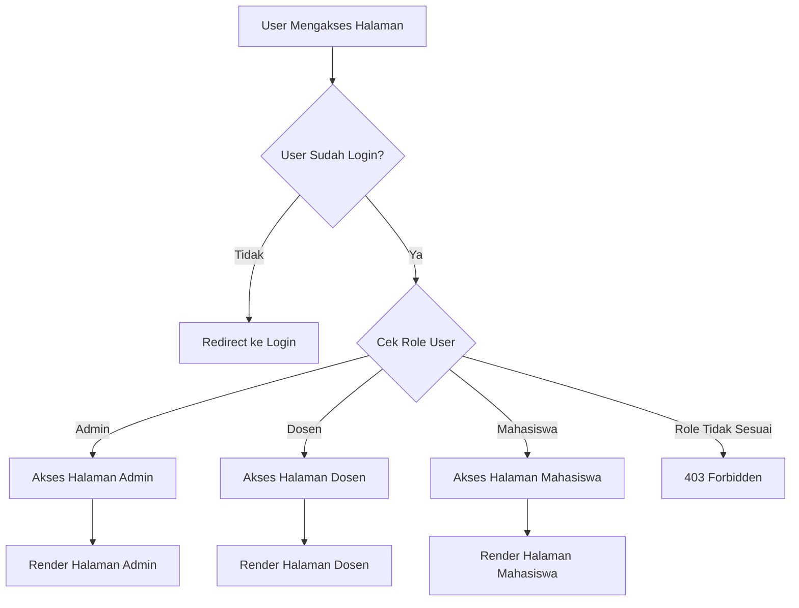
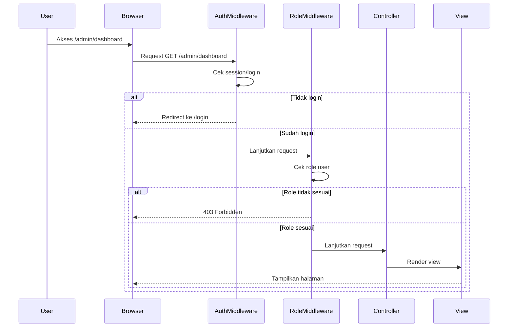

# Praktik: Mengimplementasikan Login dan Proteksi Halaman di Laravel

## Persiapan Awal
Sebelum memulai, pastikan Anda telah menyelesaikan:
1. Instalasi Laravel dan dependensi
2. Konfigurasi database
3. Pembuatan model User dan migrasinya

## Langkah 1: Membuat Sistem Login dan Register

### 1. Generate Scaffolding Authentication

```bash
composer require laravel/ui
php artisan ui bootstrap --auth
npm install && npm run dev
```

### 2. Jalankan Migrasi Database

```bash
php artisan migrate
```

### 3. Modifikasi Model User

```php
// app/Models/User.php
protected $fillable = [
    'name',
    'email',
    'password',
    'role', // tambahkan kolom role
];
```

### 4. Tambahkan Kolom Role ke Tabel Users

Buat migrasi baru:

```bash
php artisan make:migration add_role_to_users_table --table=users
```

Edit migrasi:

```php
public function up()
{
    Schema::table('users', function (Blueprint $table) {
        $table->enum('role', ['admin', 'dosen', 'mahasiswa'])->default('mahasiswa');
    });
}
```

Jalankan migrasi:

```bash
php artisan migrate
```

## Langkah 2: Membuat Middleware untuk Proteksi Halaman

### 1. Buat Middleware CheckRole

```bash
php artisan make:middleware CheckRole
```

Edit file middleware:

```php
// app/Http/Middleware/CheckRole.php
public function handle(Request $request, Closure $next, ...$roles)
{
    if (!$request->user()) {
        return redirect('/login');
    }

    if (!in_array($request->user()->role, $roles)) {
        abort(403, 'Unauthorized action.');
    }

    return $next($request);
}
```

### 2. Daftarkan Middleware di Kernel

```php
// app/Http/Kernel.php
protected $routeMiddleware = [
    // ...
    'role' => \App\Http\Middleware\CheckRole::class,
];
```

## Langkah 3: Implementasi pada Routes

```php
// routes/web.php

// Halaman umum
Route::get('/', function () {
    return view('welcome');
});

// Auth routes (login, register, etc.)
Auth::routes();

// Halaman dashboard berdasarkan role
Route::middleware(['auth'])->group(function () {
    Route::get('/home', [App\Http\Controllers\HomeController::class, 'index'])->name('home');
    
    // Halaman admin
    Route::middleware(['role:admin'])->group(function () {
        Route::get('/admin/dashboard', [AdminController::class, 'dashboard']);
    });
    
    // Halaman dosen
    Route::middleware(['role:dosen'])->group(function () {
        Route::get('/dosen/dashboard', [DosenController::class, 'dashboard']);
    });
    
    // Halaman mahasiswa
    Route::middleware(['role:mahasiswa'])->group(function () {
        Route::get('/mahasiswa/dashboard', [MahasiswaController::class, 'dashboard']);
    });
});
```

## Langkah 4: Modifikasi Tampilan Berdasarkan Role

### 1. Edit Navbar

```php
<!-- resources/views/layouts/app.blade.php -->
@auth
    <li class="nav-item">
        <a class="nav-link" href="{{ route('home') }}">Home</a>
    </li>
    
    @if(auth()->user()->role === 'admin')
        <li class="nav-item">
            <a class="nav-link" href="/admin/dashboard">Admin Dashboard</a>
        </li>
    @endif
    
    @if(auth()->user()->role === 'dosen')
        <li class="nav-item">
            <a class="nav-link" href="/dosen/dashboard">Dosen Dashboard</a>
        </li>
    @endif
    
    @if(auth()->user()->role === 'mahasiswa')
        <li class="nav-item">
            <a class="nav-link" href="/mahasiswa/dashboard">Mahasiswa Dashboard</a>
        </li>
    @endif
    
    <li class="nav-item">
        <form id="logout-form" action="{{ route('logout') }}" method="POST">
            @csrf
            <button type="submit" class="btn btn-link nav-link">Logout</button>
        </form>
    </li>
@else
    <li class="nav-item">
        <a class="nav-link" href="{{ route('login') }}">Login</a>
    </li>
    <li class="nav-item">
        <a class="nav-link" href="{{ route('register') }}">Register</a>
    </li>
@endauth
```

### 2. Buat View untuk Setiap Role

Contoh untuk admin:

```php
<!-- resources/views/admin/dashboard.blade.php -->
@extends('layouts.app')

@section('content')
<div class="container">
    <div class="row justify-content-center">
        <div class="col-md-8">
            <div class="card">
                <div class="card-header">Admin Dashboard</div>

                <div class="card-body">
                    @if (session('status'))
                        <div class="alert alert-success" role="alert">
                            {{ session('status') }}
                        </div>
                    @endif

                    <p>Welcome, Admin!</p>
                    <p>You have full access to the system.</p>
                </div>
            </div>
        </div>
    </div>
</div>
@endsection
```

## Langkah 5: Membuat Controller untuk Setiap Role

### 1. Controller Admin

```bash
php artisan make:controller AdminController
```

```php
// app/Http/Controllers/AdminController.php
public function dashboard()
{
    return view('admin.dashboard');
}
```

### 2. Controller Dosen

```bash
php artisan make:controller DosenController
```

```php
// app/Http/Controllers/DosenController.php
public function dashboard()
{
    return view('dosen.dashboard');
}
```

### 3. Controller Mahasiswa

```bash
php artisan make:controller MahasiswaController
```

```php
// app/Http/Controllers/MahasiswaController.php
public function dashboard()
{
    return view('mahasiswa.dashboard');
}
```

## Langkah 6: Testing Implementasi

1. Registrasi user dengan role berbeda
2. Coba akses halaman yang sesuai dengan role
3. Verifikasi bahwa:
   - User tidak bisa mengakses halaman role lain
   - User yang belum login diarahkan ke halaman login
   - User yang login melihat menu sesuai role

## Diagram Alur Proteksi Halaman



## Sequence Diagram Autentikasi dan Otorisasi



## Tips Tambahan

1. **Custom Redirect After Login**:
   ```php
   // app/Http/Controllers/Auth/LoginController.php
   protected function authenticated(Request $request, $user)
   {
       switch($user->role) {
           case 'admin':
               return redirect('/admin/dashboard');
           case 'dosen':
               return redirect('/dosen/dashboard');
           case 'mahasiswa':
               return redirect('/mahasiswa/dashboard');
           default:
               return redirect('/home');
       }
   }
   ```

2. **Menambahkan Role Saat Registrasi**:
   ```php
   // app/Http/Controllers/Auth/RegisterController.php
   protected function create(array $data)
   {
       return User::create([
           'name' => $data['name'],
           'email' => $data['email'],
           'password' => Hash::make($data['password']),
           'role' => 'mahasiswa', // default role
       ]);
   }
   ```

3. **Menambahkan Select Role untuk Admin**:
   ```php
   // resources/views/auth/register.blade.php
   <div class="form-group row">
       <label for="role" class="col-md-4 col-form-label text-md-right">Role</label>
       <div class="col-md-6">
           <select id="role" class="form-control" name="role" required>
               <option value="mahasiswa">Mahasiswa</option>
               <option value="dosen">Dosen</option>
               @if(auth()->check() && auth()->user()->role === 'admin')
                   <option value="admin">Admin</option>
               @endif
           </select>
       </div>
   </div>
   ```

Dengan mengikuti langkah-langkah di atas, Anda telah berhasil mengimplementasikan sistem login dan proteksi halaman berdasarkan role di Laravel. Sistem ini dapat dikembangkan lebih lanjut dengan menambahkan fitur-fitur seperti permission management, email verification, dan two-factor authentication.