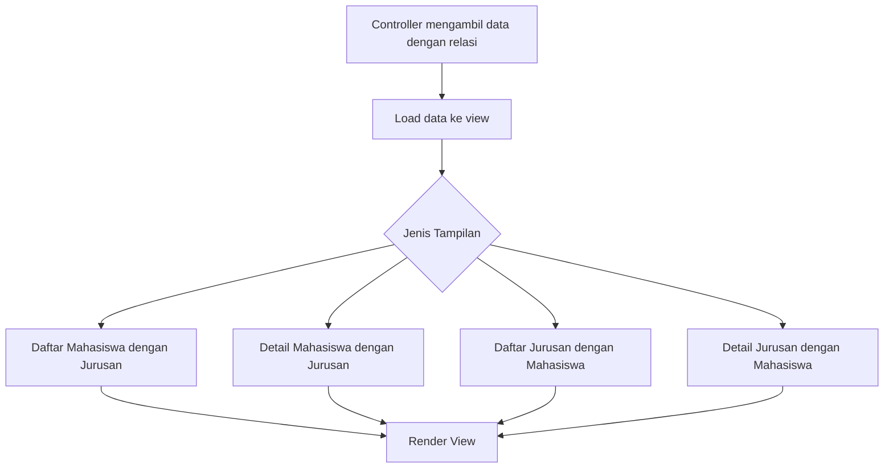
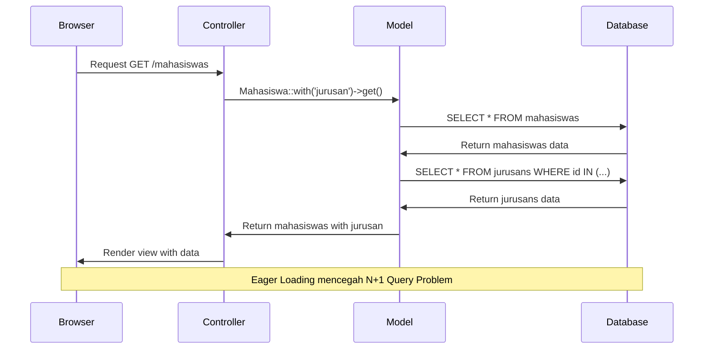

# Menampilkan Data Relasi di Laravel

Setelah kita memahami dan mengimplementasikan relasi antara Mahasiswa dan Jurusan, langkah selanjutnya adalah menampilkan data relasi tersebut dengan efektif. Pada artikel ini, kita akan belajar cara menampilkan data relasi One-to-Many antara Mahasiswa dan Jurusan di aplikasi Laravel kita.

## Alur Proses Menampilkan Data Relasi



## 1. Mengambil Data dengan Relasi di Controller

### Cara Eloquent

```php
// MahasiswaController.php

public function index()
{
    // Eager loading relasi jurusan dengan Eloquent
    $mahasiswas = Mahasiswa::with('jurusan')->latest()->paginate(10);
    return view('mahasiswas.index', compact('mahasiswas'));
}

public function show($id)
{
    // Load satu mahasiswa dengan relasinya
    $mahasiswa = Mahasiswa::with('jurusan')->findOrFail($id);
    return view('mahasiswas.show', compact('mahasiswa'));
}
```

### Cara Query Builder

```php
// MahasiswaController.php menggunakan Query Builder

public function index()
{
    // Join tabel dengan Query Builder
    $mahasiswas = DB::table('mahasiswas')
                ->join('jurusans', 'mahasiswas.jurusan_id', '=', 'jurusans.id')
                ->select('mahasiswas.*', 'jurusans.nama_jurusan', 'jurusans.kode_jurusan')
                ->latest('mahasiswas.created_at')
                ->paginate(10);
                
    return view('mahasiswas.index', compact('mahasiswas'));
}
```

### JurusanController untuk Menampilkan Mahasiswa per Jurusan

```php
// JurusanController.php

public function show($id)
{
    // Dapatkan jurusan dengan mahasiswanya (dengan pagination)
    $jurusan = Jurusan::findOrFail($id);
    $mahasiswas = $jurusan->mahasiswas()->paginate(10);
    
    return view('jurusans.show', compact('jurusan', 'mahasiswas'));
}
```

## 2. Tampilan untuk Daftar Mahasiswa dengan Data Jurusan

```blade
{{-- resources/views/mahasiswas/index.blade.php --}}

<div class="container">
    <h1>Daftar Mahasiswa</h1>
    
    <table class="table table-striped">
        <thead>
            <tr>
                <th>NIM</th>
                <th>Nama</th>
                <th>Jurusan</th>
                <th>Alamat</th>
                <th>Aksi</th>
            </tr>
        </thead>
        <tbody>
            @forelse($mahasiswas as $mahasiswa)
            <tr>
                <td>{{ $mahasiswa->nim }}</td>
                <td>{{ $mahasiswa->nama }}</td>
                <td>
                    @if(isset($mahasiswa->jurusan))
                        {{-- Jika menggunakan Eloquent --}}
                        {{ $mahasiswa->jurusan->kode_jurusan }} - {{ $mahasiswa->jurusan->nama_jurusan }}
                    @elseif(isset($mahasiswa->nama_jurusan))
                        {{-- Jika menggunakan Query Builder --}}
                        {{ $mahasiswa->kode_jurusan }} - {{ $mahasiswa->nama_jurusan }}
                    @else
                        <span class="text-muted">Tidak ada jurusan</span>
                    @endif
                </td>
                <td>{{ $mahasiswa->alamat }}</td>
                <td>
                    <a href="{{ route('mahasiswas.show', $mahasiswa->id) }}" class="btn btn-sm btn-info">Detail</a>
                    <a href="{{ route('mahasiswas.edit', $mahasiswa->id) }}" class="btn btn-sm btn-primary">Edit</a>
                    <form action="{{ route('mahasiswas.destroy', $mahasiswa->id) }}" method="POST" class="d-inline">
                        @csrf
                        @method('DELETE')
                        <button type="submit" class="btn btn-sm btn-danger" onclick="return confirm('Yakin ingin menghapus?')">Hapus</button>
                    </form>
                </td>
            </tr>
            @empty
            <tr>
                <td colspan="5" class="text-center">Tidak ada data mahasiswa</td>
            </tr>
            @endforelse
        </tbody>
    </table>
    
    {{ $mahasiswas->links() }}
</div>
```

## 3. Tampilan Detail Mahasiswa dengan Data Jurusan

```blade
{{-- resources/views/mahasiswas/show.blade.php --}}

<div class="container">
    <h1>Detail Mahasiswa</h1>
    
    <div class="card">
        <div class="card-header">
            {{ $mahasiswa->nama }} ({{ $mahasiswa->nim }})
        </div>
        <div class="card-body">
            <h5 class="card-title">Informasi Mahasiswa</h5>
            <table class="table">
                <tr>
                    <th>Nama Lengkap</th>
                    <td>{{ $mahasiswa->nama }}</td>
                </tr>
                <tr>
                    <th>NIM</th>
                    <td>{{ $mahasiswa->nim }}</td>
                </tr>
                <tr>
                    <th>Jurusan</th>
                    <td>
                        @if($mahasiswa->jurusan)
                            <a href="{{ route('jurusans.show', $mahasiswa->jurusan->id) }}">
                                {{ $mahasiswa->jurusan->kode_jurusan }} - {{ $mahasiswa->jurusan->nama_jurusan }}
                            </a>
                        @else
                            <span class="text-muted">Tidak ada jurusan</span>
                        @endif
                    </td>
                </tr>
                <tr>
                    <th>Alamat</th>
                    <td>{{ $mahasiswa->alamat ?? 'Tidak ada alamat' }}</td>
                </tr>
                <tr>
                    <th>Terdaftar pada</th>
                    <td>{{ $mahasiswa->created_at->format('d F Y') }}</td>
                </tr>
            </table>
        </div>
        <div class="card-footer">
            <a href="{{ route('mahasiswas.index') }}" class="btn btn-secondary">Kembali</a>
            <a href="{{ route('mahasiswas.edit', $mahasiswa->id) }}" class="btn btn-primary">Edit</a>
        </div>
    </div>
</div>
```

## 4. Menampilkan Daftar Jurusan dengan Jumlah Mahasiswa

```blade
{{-- resources/views/jurusans/index.blade.php --}}

<div class="container">
    <h1>Daftar Jurusan</h1>
    
    <table class="table table-striped">
        <thead>
            <tr>
                <th>Kode</th>
                <th>Nama Jurusan</th>
                <th>Jumlah Mahasiswa</th>
                <th>Aksi</th>
            </tr>
        </thead>
        <tbody>
            @foreach($jurusans as $jurusan)
            <tr>
                <td>{{ $jurusan->kode_jurusan }}</td>
                <td>{{ $jurusan->nama_jurusan }}</td>
                <td>{{ $jurusan->mahasiswas_count }}</td>
                <td>
                    <a href="{{ route('jurusans.show', $jurusan->id) }}" class="btn btn-sm btn-info">Lihat Mahasiswa</a>
                    <a href="{{ route('jurusans.edit', $jurusan->id) }}" class="btn btn-sm btn-primary">Edit</a>
                </td>
            </tr>
            @endforeach
        </tbody>
    </table>
</div>
```

Untuk mendapatkan jumlah mahasiswa, di controller:

```php
public function index()
{
    // Dengan eager loading dan menggunakan withCount
    $jurusans = Jurusan::withCount('mahasiswas')->get();
    return view('jurusans.index', compact('jurusans'));
}
```

## 5. Menampilkan Detail Jurusan dengan Daftar Mahasiswanya

```blade
{{-- resources/views/jurusans/show.blade.php --}}

<div class="container">
    <h1>{{ $jurusan->nama_jurusan }} ({{ $jurusan->kode_jurusan }})</h1>
    <p>{{ $jurusan->deskripsi }}</p>
    
    <h3>Daftar Mahasiswa</h3>
    @if($mahasiswas->count() > 0)
        <table class="table table-striped">
            <thead>
                <tr>
                    <th>NIM</th>
                    <th>Nama</th>
                    <th>Alamat</th>
                    <th>Aksi</th>
                </tr>
            </thead>
            <tbody>
                @foreach($mahasiswas as $mahasiswa)
                <tr>
                    <td>{{ $mahasiswa->nim }}</td>
                    <td>{{ $mahasiswa->nama }}</td>
                    <td>{{ $mahasiswa->alamat }}</td>
                    <td>
                        <a href="{{ route('mahasiswas.show', $mahasiswa->id) }}" class="btn btn-sm btn-info">Detail</a>
                    </td>
                </tr>
                @endforeach
            </tbody>
        </table>
        
        {{ $mahasiswas->links() }}
    @else
        <div class="alert alert-info">
            Belum ada mahasiswa di jurusan ini.
        </div>
    @endif
    
    <div class="mt-3">
        <a href="{{ route('jurusans.index') }}" class="btn btn-secondary">Kembali</a>
    </div>
</div>
```

## 6. Implementasi Filter dan Pencarian dengan Relasi

Mari tambahkan fitur filter dan pencarian pada daftar mahasiswa:

```blade
{{-- resources/views/mahasiswas/index.blade.php (dengan form filter) --}}

<div class="container">
    <h1>Daftar Mahasiswa</h1>
    
    <div class="card mb-4">
        <div class="card-header">Filter Mahasiswa</div>
        <div class="card-body">
            <form action="{{ route('mahasiswas.index') }}" method="GET" class="row g-3">
                <div class="col-md-4">
                    <label for="search" class="form-label">Cari</label>
                    <input type="text" class="form-control" id="search" name="search" value="{{ request('search') }}" placeholder="Nama atau NIM...">
                </div>
                <div class="col-md-4">
                    <label for="jurusan_id" class="form-label">Jurusan</label>
                    <select class="form-control" id="jurusan_id" name="jurusan_id">
                        <option value="">Semua Jurusan</option>
                        @foreach($jurusans as $jurusan)
                            <option value="{{ $jurusan->id }}" {{ request('jurusan_id') == $jurusan->id ? 'selected' : '' }}>
                                {{ $jurusan->kode_jurusan }} - {{ $jurusan->nama_jurusan }}
                            </option>
                        @endforeach
                    </select>
                </div>
                <div class="col-md-4 d-flex align-items-end">
                    <button type="submit" class="btn btn-primary me-2">Filter</button>
                    <a href="{{ route('mahasiswas.index') }}" class="btn btn-secondary">Reset</a>
                </div>
            </form>
        </div>
    </div>
    
    {{-- Tabel mahasiswa seperti sebelumnya --}}
</div>
```

Dan di controller:

```php
public function index(Request $request)
{
    $query = Mahasiswa::with('jurusan');
    
    // Filter berdasarkan pencarian
    if ($request->has('search') && $request->search != '') {
        $search = $request->search;
        $query->where(function($q) use ($search) {
            $q->where('nama', 'like', "%{$search}%")
              ->orWhere('nim', 'like', "%{$search}%");
        });
    }
    
    // Filter berdasarkan jurusan
    if ($request->has('jurusan_id') && $request->jurusan_id != '') {
        $query->where('jurusan_id', $request->jurusan_id);
    }
    
    $mahasiswas = $query->latest()->paginate(10);
    $jurusans = Jurusan::all();
    
    return view('mahasiswas.index', compact('mahasiswas', 'jurusans'));
}
```

## 7. Menampilkan Statistik dan Grafik

Kita juga bisa menampilkan statistik sederhana tentang distribusi mahasiswa per jurusan:

```blade
{{-- resources/views/statistik/index.blade.php --}}

<div class="container">
    <h1>Statistik Mahasiswa per Jurusan</h1>
    
    <div class="row">
        <div class="col-md-8">
            <div class="card">
                <div class="card-header">Jumlah Mahasiswa per Jurusan</div>
                <div class="card-body">
                    <table class="table table-striped">
                        <thead>
                            <tr>
                                <th>Jurusan</th>
                                <th>Jumlah Mahasiswa</th>
                                <th>Persentase</th>
                            </tr>
                        </thead>
                        <tbody>
                            @php $totalMahasiswa = $stats->sum('jumlah'); @endphp
                            
                            @foreach($stats as $stat)
                            <tr>
                                <td>{{ $stat->nama_jurusan }}</td>
                                <td>{{ $stat->jumlah }}</td>
                                <td>
                                    {{ number_format(($stat->jumlah / $totalMahasiswa) * 100, 1) }}%
                                    <div class="progress">
                                        <div class="progress-bar" role="progressbar" style="width: {{ ($stat->jumlah / $totalMahasiswa) * 100 }}%" aria-valuenow="{{ $stat->jumlah }}" aria-valuemin="0" aria-valuemax="{{ $totalMahasiswa }}"></div>
                                    </div>
                                </td>
                            </tr>
                            @endforeach
                        </tbody>
                        <tfoot>
                            <tr>
                                <th>Total</th>
                                <th>{{ $totalMahasiswa }}</th>
                                <th>100%</th>
                            </tr>
                        </tfoot>
                    </table>
                </div>
            </div>
        </div>
    </div>
</div>
```

Dan controller untuk statistik:

```php
public function statistik()
{
    $stats = DB::table('jurusans')
             ->leftJoin('mahasiswas', 'jurusans.id', '=', 'mahasiswas.jurusan_id')
             ->select('jurusans.nama_jurusan', DB::raw('COUNT(mahasiswas.id) as jumlah'))
             ->groupBy('jurusans.nama_jurusan')
             ->orderBy('jumlah', 'desc')
             ->get();
             
    return view('statistik.index', compact('stats'));
}
```



## Menggunakan Eager Loading vs Lazy Loading

Ketika menampilkan data relasi, ada dua pendekatan utama:

### 1. Eager Loading

Eager loading melakukan preload relasi dalam satu query tambahan. Ini sangat berguna untuk mencegah "N+1 Query Problem" - masalah di mana untuk setiap baris utama, kita harus menjalankan query tambahan untuk relasinya.

```php
// Eager Loading - Hanya 2 query terlepas dari jumlah data
$mahasiswas = Mahasiswa::with('jurusan')->get();
```

### 2. Lazy Loading

Lazy Loading mengambil data relasi saat pertama kali diakses. Ini bisa menyebabkan masalah N+1 query jika tidak dikelola dengan baik.

```php
// Lazy Loading - Akan menghasilkan N+1 queries
$mahasiswas = Mahasiswa::all();
foreach ($mahasiswas as $mahasiswa) {
    echo $mahasiswa->jurusan->nama_jurusan; // Ini memicu query baru setiap kali
}
```

## Tips dan Praktik Terbaik

1. **Selalu Gunakan Eager Loading**: Untuk daftar dengan relasi, selalu gunakan `with()` untuk eager loading.

2. **Batasi Data yang Diambil**: Gunakan select untuk memilih hanya kolom yang diperlukan.
   ```php
   $mahasiswas = Mahasiswa::with('jurusan:id,nama_jurusan,kode_jurusan')->select('id', 'nama', 'nim', 'jurusan_id')->get();
   ```

3. **Pagination**: Selalu gunakan pagination untuk daftar besar.

4. **Conditional Loading**: Gunakan `whenLoaded` untuk menghindari error jika relasi tidak di-load.
   ```blade
   {{ $mahasiswa->whenLoaded('jurusan', function($jurusan) {
       return $jurusan->nama_jurusan;
   }, 'Tidak ada jurusan') }}
   ```

5. **Nested Relationship**: Untuk relasi bertingkat, gunakan dot notation.
   ```php
   // Contoh: Jika Jurusan memiliki relasi dengan Fakultas
   $mahasiswas = Mahasiswa::with('jurusan.fakultas')->get();
   ```

6. **Gunakan Load Method**: Untuk mengambil relasi setelah model diambil.
   ```php
   $mahasiswa = Mahasiswa::find(1);
   $mahasiswa->load('jurusan');
   ```

## Kesimpulan

Menampilkan data relasi di Laravel adalah proses yang cukup sederhana berkat fitur Eloquent yang kuat. Dengan memahami bagaimana menggunakan eager loading dengan tepat, kita dapat membangun aplikasi yang tidak hanya fungsional tetapi juga efisien dalam hal performa database.

Dalam aplikasi Mahasiswa-Jurusan kita, kita telah berhasil menampilkan:
1. Daftar mahasiswa dengan informasi jurusan
2. Detail mahasiswa dengan data jurusan
3. Daftar jurusan dengan jumlah mahasiswa
4. Detail jurusan dengan daftar mahasiswanya
5. Statistik distribusi mahasiswa per jurusan

Pendekatan ini dapat dengan mudah diperluas untuk menampilkan relasi lebih kompleks seperti Many-to-Many, yang akan kita pelajari pada pertemuan berikutnya.