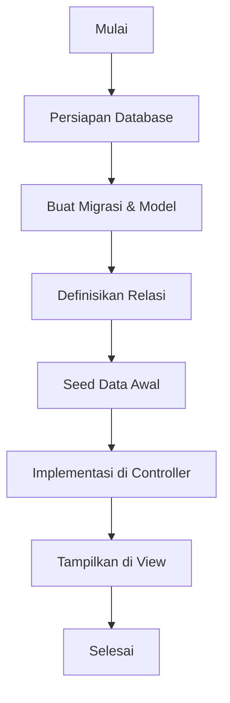
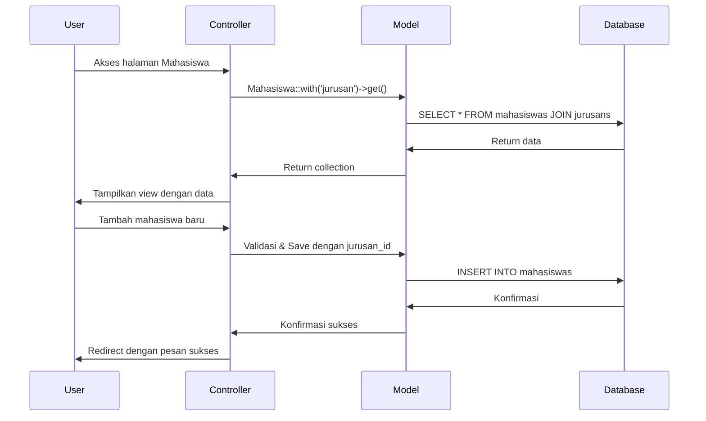

# Menghubungkan Mahasiswa dengan Tabel Jurusan di Laravel

Pada artikel ini, kita akan belajar langkah-langkah praktis untuk menghubungkan model Mahasiswa dengan tabel Jurusan dalam aplikasi Laravel. Kita akan membuat implementasi lengkap dari teori One-to-Many relationship yang telah kita pelajari sebelumnya.

## Alur Implementasi



## 1. Persiapan Database

Pastikan konfigurasi database Anda sudah benar di file `.env`:

```
DB_CONNECTION=mysql
DB_HOST=127.0.0.1
DB_PORT=3306
DB_DATABASE=mahasiswa_app
DB_USERNAME=root
DB_PASSWORD=
```

## 2. Membuat Migrasi dan Model

### Membuat Model dan Migrasi Jurusan

```bash
php artisan make:model Jurusan -m
```

Edit file migrasi untuk tabel jurusan di `database/migrations/xxxx_xx_xx_create_jurusans_table.php`:

```php
public function up()
{
    Schema::create('jurusans', function (Blueprint $table) {
        $table->id();
        $table->string('nama_jurusan');
        $table->string('kode_jurusan', 10)->unique();
        $table->text('deskripsi')->nullable();
        $table->timestamps();
    });
}
```

### Membuat/Modifikasi Migrasi Mahasiswa

Jika model Mahasiswa belum ada, buat dengan perintah:

```bash
php artisan make:model Mahasiswa -m
```

Atau jika sudah ada, buat migrasi untuk menambahkan kolom `jurusan_id`:

```bash
php artisan make:migration add_jurusan_id_to_mahasiswas_table --table=mahasiswas
```

Edit file migrasi mahasiswa:

```php
public function up()
{
    Schema::table('mahasiswas', function (Blueprint $table) {
        $table->foreignId('jurusan_id')->after('nim')->constrained('jurusans')->onDelete('cascade');
    });
}

public function down()
{
    Schema::table('mahasiswas', function (Blueprint $table) {
        $table->dropForeign(['jurusan_id']);
        $table->dropColumn('jurusan_id');
    });
}
```

## 3. Definisikan Relasi di Model

### Model Jurusan (`app/Models/Jurusan.php`)

```php
<?php

namespace App\Models;

use Illuminate\Database\Eloquent\Factories\HasFactory;
use Illuminate\Database\Eloquent\Model;

class Jurusan extends Model
{
    use HasFactory;
    
    protected $fillable = ['nama_jurusan', 'kode_jurusan', 'deskripsi'];
    
    // Relasi one-to-many: satu jurusan memiliki banyak mahasiswa
    public function mahasiswas()
    {
        return $this->hasMany(Mahasiswa::class);
    }
    
    // Method helper untuk menghitung jumlah mahasiswa
    public function jumlahMahasiswa()
    {
        return $this->mahasiswas()->count();
    }
}
```

### Model Mahasiswa (`app/Models/Mahasiswa.php`)

```php
<?php

namespace App\Models;

use Illuminate\Database\Eloquent\Factories\HasFactory;
use Illuminate\Database\Eloquent\Model;

class Mahasiswa extends Model
{
    use HasFactory;
    
    protected $fillable = ['nama', 'nim', 'jurusan_id', 'alamat', 'email', 'tanggal_lahir'];
    
    // Relasi belongs-to: satu mahasiswa hanya memiliki satu jurusan
    public function jurusan()
    {
        return $this->belongsTo(Jurusan::class);
    }
}
```

## 4. Jalankan Migrasi

```bash
php artisan migrate
```

## 5. Buat Seeder untuk Data Awal

### Jurusan Seeder

```bash
php artisan make:seeder JurusanSeeder
```

Edit file `database/seeders/JurusanSeeder.php`:

```php
<?php

namespace Database\Seeders;

use App\Models\Jurusan;
use Illuminate\Database\Seeder;

class JurusanSeeder extends Seeder
{
    public function run()
    {
        $jurusans = [
            [
                'nama_jurusan' => 'Teknik Informatika',
                'kode_jurusan' => 'TI',
                'deskripsi' => 'Program studi yang mempelajari tentang ilmu komputer dan teknologi informasi'
            ],
            [
                'nama_jurusan' => 'Sistem Informasi',
                'kode_jurusan' => 'SI',
                'deskripsi' => 'Program studi yang mempelajari tentang sistem informasi dalam konteks bisnis'
            ],
            [
                'nama_jurusan' => 'Teknik Elektro',
                'kode_jurusan' => 'TE',
                'deskripsi' => 'Program studi yang mempelajari tentang elektronika dan kelistrikan'
            ],
        ];

        foreach ($jurusans as $jurusan) {
            Jurusan::create($jurusan);
        }
    }
}
```

Tambahkan ke `DatabaseSeeder.php`:

```php
public function run()
{
    $this->call([
        JurusanSeeder::class,
    ]);
}
```

Jalankan seeder:

```bash
php artisan db:seed
```

## 6. Implementasi di Controller

### Controller Mahasiswa

Buat controller untuk Mahasiswa jika belum ada:

```bash
php artisan make:controller MahasiswaController --resource
```

Edit controller untuk mengelola Mahasiswa dengan relasi Jurusan:

```php
<?php

namespace App\Http\Controllers;

use App\Models\Mahasiswa;
use App\Models\Jurusan;
use Illuminate\Http\Request;

class MahasiswaController extends Controller
{
    public function index()
    {
        $mahasiswas = Mahasiswa::with('jurusan')->latest()->paginate(10);
        return view('mahasiswas.index', compact('mahasiswas'));
    }

    public function create()
    {
        $jurusans = Jurusan::all();
        return view('mahasiswas.create', compact('jurusans'));
    }

    public function store(Request $request)
    {
        $request->validate([
            'nama' => 'required|string|max:255',
            'nim' => 'required|string|unique:mahasiswas',
            'jurusan_id' => 'required|exists:jurusans,id',
            'alamat' => 'nullable|string',
            'email' => 'required|email|unique:mahasiswas',
            'tanggal_lahir' => 'nullable|date',
        ]);

        Mahasiswa::create($request->all());

        return redirect()->route('mahasiswas.index')
            ->with('success', 'Mahasiswa berhasil ditambahkan!');
    }

    public function show(Mahasiswa $mahasiswa)
    {
        $mahasiswa->load('jurusan');
        return view('mahasiswas.show', compact('mahasiswa'));
    }

    public function edit(Mahasiswa $mahasiswa)
    {
        $jurusans = Jurusan::all();
        return view('mahasiswas.edit', compact('mahasiswa', 'jurusans'));
    }

    public function update(Request $request, Mahasiswa $mahasiswa)
    {
        $request->validate([
            'nama' => 'required|string|max:255',
            'nim' => 'required|string|unique:mahasiswas,nim,' . $mahasiswa->id,
            'jurusan_id' => 'required|exists:jurusans,id',
            'alamat' => 'nullable|string',
            'email' => 'required|email|unique:mahasiswas,email,' . $mahasiswa->id,
            'tanggal_lahir' => 'nullable|date',
        ]);

        $mahasiswa->update($request->all());

        return redirect()->route('mahasiswas.index')
            ->with('success', 'Data mahasiswa berhasil diperbarui!');
    }

    public function destroy(Mahasiswa $mahasiswa)
    {
        $mahasiswa->delete();

        return redirect()->route('mahasiswas.index')
            ->with('success', 'Mahasiswa berhasil dihapus!');
    }

    // Menampilkan mahasiswa berdasarkan jurusan
    public function byJurusan($jurusan_id)
    {
        $jurusan = Jurusan::findOrFail($jurusan_id);
        $mahasiswas = $jurusan->mahasiswas()->paginate(10);
        
        return view('mahasiswas.by_jurusan', compact('mahasiswas', 'jurusan'));
    }
}
```

### Controller Jurusan

```bash
php artisan make:controller JurusanController --resource
```

```php
<?php

namespace App\Http\Controllers;

use App\Models\Jurusan;
use Illuminate\Http\Request;

class JurusanController extends Controller
{
    public function index()
    {
        $jurusans = Jurusan::withCount('mahasiswas')->get();
        return view('jurusans.index', compact('jurusans'));
    }

    public function create()
    {
        return view('jurusans.create');
    }

    public function store(Request $request)
    {
        $request->validate([
            'nama_jurusan' => 'required|string|max:255',
            'kode_jurusan' => 'required|string|max:10|unique:jurusans',
            'deskripsi' => 'nullable|string',
        ]);

        Jurusan::create($request->all());

        return redirect()->route('jurusans.index')
            ->with('success', 'Jurusan berhasil ditambahkan!');
    }

    public function show(Jurusan $jurusan)
    {
        $jurusan->load('mahasiswas');
        return view('jurusans.show', compact('jurusan'));
    }

    // tambahkan method lainnya (edit, update, destroy)
}
```

## 7. Buat View untuk Tampilan Relasi

### Form Create Mahasiswa dengan Dropdown Jurusan

```blade
<div class="form-group">
    <label for="jurusan_id">Jurusan</label>
    <select class="form-control @error('jurusan_id') is-invalid @enderror" id="jurusan_id" name="jurusan_id" required>
        <option value="">Pilih Jurusan</option>
        @foreach($jurusans as $jurusan)
            <option value="{{ $jurusan->id }}" {{ old('jurusan_id') == $jurusan->id ? 'selected' : '' }}>
                {{ $jurusan->nama_jurusan }} ({{ $jurusan->kode_jurusan }})
            </option>
        @endforeach
    </select>
    @error('jurusan_id')
        <div class="invalid-feedback">{{ $message }}</div>
    @enderror
</div>
```

### Menampilkan Data Mahasiswa dengan Detail Jurusan

```blade
<table class="table table-striped">
    <thead>
        <tr>
            <th>Nama</th>
            <th>NIM</th>
            <th>Jurusan</th>
            <th>Email</th>
            <th>Aksi</th>
        </tr>
    </thead>
    <tbody>
        @foreach($mahasiswas as $mahasiswa)
        <tr>
            <td>{{ $mahasiswa->nama }}</td>
            <td>{{ $mahasiswa->nim }}</td>
            <td>{{ $mahasiswa->jurusan->nama_jurusan }} ({{ $mahasiswa->jurusan->kode_jurusan }})</td>
            <td>{{ $mahasiswa->email }}</td>
            <td>
                <a href="{{ route('mahasiswas.show', $mahasiswa->id) }}" class="btn btn-sm btn-info">Detail</a>
                <a href="{{ route('mahasiswas.edit', $mahasiswa->id) }}" class="btn btn-sm btn-primary">Edit</a>
                <form action="{{ route('mahasiswas.destroy', $mahasiswa->id) }}" method="POST" class="d-inline">
                    @csrf
                    @method('DELETE')
                    <button type="submit" class="btn btn-sm btn-danger" onclick="return confirm('Yakin ingin menghapus?')">Hapus</button>
                </form>
            </td>
        </tr>
        @endforeach
    </tbody>
</table>
```

### Menampilkan Daftar Jurusan dengan Jumlah Mahasiswa

```blade
<table class="table table-striped">
    <thead>
        <tr>
            <th>Nama Jurusan</th>
            <th>Kode</th>
            <th>Jumlah Mahasiswa</th>
            <th>Aksi</th>
        </tr>
    </thead>
    <tbody>
        @foreach($jurusans as $jurusan)
        <tr>
            <td>{{ $jurusan->nama_jurusan }}</td>
            <td>{{ $jurusan->kode_jurusan }}</td>
            <td>{{ $jurusan->mahasiswas_count }}</td>
            <td>
                <a href="{{ route('jurusans.show', $jurusan->id) }}" class="btn btn-sm btn-info">Detail</a>
                <a href="{{ route('mahasiswas.by.jurusan', $jurusan->id) }}" class="btn btn-sm btn-success">Lihat Mahasiswa</a>
            </td>
        </tr>
        @endforeach
    </tbody>
</table>
```

## 8. Tambahkan Routes

Tambahkan routes di `routes/web.php`:

```php
Route::resource('mahasiswas', MahasiswaController::class);
Route::resource('jurusans', JurusanController::class);
Route::get('mahasiswas/jurusan/{jurusan}', [MahasiswaController::class, 'byJurusan'])->name('mahasiswas.by.jurusan');
```

## 9. Diagram Alur Data



## Tips Implementasi

1. **Validasi Foreign Key**: Selalu gunakan validasi `exists:jurusans,id` untuk memastikan jurusan yang dipilih valid.

2. **Eager Loading**: Gunakan `with('jurusan')` untuk menghindari N+1 query problem, terutama saat menampilkan banyak data mahasiswa.

3. **Cascade On Delete**: Pengaturan `onDelete('cascade')` pada foreign key akan menghapus data mahasiswa secara otomatis jika jurusan terkait dihapus. Tergantung kebutuhan aplikasi, Anda bisa menggunakan `onDelete('set null')` jika ingin mempertahankan data mahasiswa.

4. **Filtering Berdasarkan Jurusan**: Anda bisa menambahkan fitur pencarian atau filtering berdasarkan jurusan:

```php
// Di controller
public function index(Request $request)
{
    $query = Mahasiswa::with('jurusan');
    
    if ($request->has('jurusan_id') && $request->jurusan_id) {
        $query->where('jurusan_id', $request->jurusan_id);
    }
    
    $mahasiswas = $query->latest()->paginate(10);
    $jurusans = Jurusan::all();
    
    return view('mahasiswas.index', compact('mahasiswas', 'jurusans'));
}
```

## Kesimpulan

Dengan mengimplementasikan relationship antara Mahasiswa dan Jurusan, aplikasi kita menjadi lebih terstruktur dan data menjadi lebih terorganisir. Kita dapat dengan mudah melakukan operasi seperti:

1. Menampilkan data jurusan untuk setiap mahasiswa
2. Mendapatkan daftar mahasiswa per jurusan
3. Menghitung jumlah mahasiswa dalam setiap jurusan
4. Memfilter mahasiswa berdasarkan jurusan

Pendekatan relasional ini membantu kita membangun aplikasi yang lebih kuat dan lebih mudah dikembangkan di masa depan.