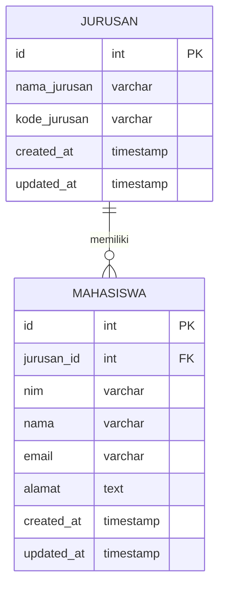
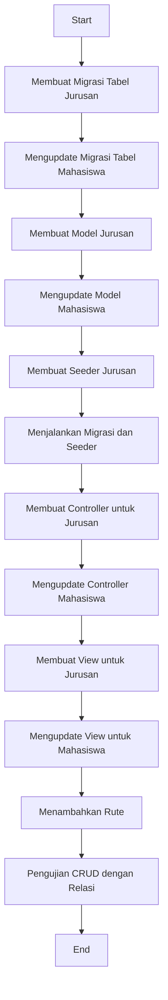

# Praktik: Membuat Relasi Mahasiswa-Jurusan

Dalam tutorial ini, kita akan mempelajari cara membuat relasi One-to-Many antara tabel Mahasiswa dan Jurusan di aplikasi Laravel kita. Relasi ini menggambarkan bahwa satu Jurusan dapat memiliki banyak Mahasiswa, sementara satu Mahasiswa hanya dapat terdaftar di satu Jurusan.

## Diagram Relasi Mahasiswa-Jurusan



## Langkah 1: Membuat Migrasi untuk Tabel Jurusan

Pertama, kita perlu membuat tabel Jurusan:

```bash
php artisan make:migration create_jurusans_table
```

Kemudian, edit file migrasi yang baru dibuat di direktori `database/migrations`:

```php
public function up()
{
    Schema::create('jurusans', function (Blueprint $table) {
        $table->id();
        $table->string('nama_jurusan');
        $table->string('kode_jurusan')->unique();
        $table->timestamps();
    });
}
```

## Langkah 2: Mengupdate Migrasi Tabel Mahasiswa

Kita perlu mengupdate tabel Mahasiswa untuk menambahkan kolom relasi `jurusan_id`. Buat migrasi baru:

```bash
php artisan make:migration add_jurusan_id_to_mahasiswas_table
```

Edit file migrasi tersebut:

```php
public function up()
{
    Schema::table('mahasiswas', function (Blueprint $table) {
        $table->foreignId('jurusan_id')->after('id')->constrained('jurusans')->onDelete('cascade');
    });
}

public function down()
{
    Schema::table('mahasiswas', function (Blueprint $table) {
        $table->dropForeign(['jurusan_id']);
        $table->dropColumn('jurusan_id');
    });
}
```

## Langkah 3: Membuat Model Jurusan

Buat model Jurusan:

```bash
php artisan make:model Jurusan
```

Edit file model `app/Models/Jurusan.php`:

```php
<?php

namespace App\Models;

use Illuminate\Database\Eloquent\Factories\HasFactory;
use Illuminate\Database\Eloquent\Model;

class Jurusan extends Model
{
    use HasFactory;
    
    protected $fillable = ['nama_jurusan', 'kode_jurusan'];
    
    // Relasi ke mahasiswa (One-to-Many)
    public function mahasiswas()
    {
        return $this->hasMany(Mahasiswa::class);
    }
}
```

## Langkah 4: Mengupdate Model Mahasiswa

Edit file model `app/Models/Mahasiswa.php` untuk menambahkan relasi ke Jurusan:

```php
<?php

namespace App\Models;

use Illuminate\Database\Eloquent\Factories\HasFactory;
use Illuminate\Database\Eloquent\Model;

class Mahasiswa extends Model
{
    use HasFactory;
    
    protected $fillable = ['jurusan_id', 'nim', 'nama', 'email', 'alamat'];
    
    // Relasi ke jurusan (Many-to-One)
    public function jurusan()
    {
        return $this->belongsTo(Jurusan::class);
    }
}
```

## Langkah 5: Membuat Seeder untuk Data Jurusan

Buat seeder untuk mengisi data Jurusan:

```bash
php artisan make:seeder JurusanSeeder
```

Edit file `database/seeders/JurusanSeeder.php`:

```php
<?php

namespace Database\Seeders;

use App\Models\Jurusan;
use Illuminate\Database\Seeder;

class JurusanSeeder extends Seeder
{
    public function run()
    {
        $jurusans = [
            ['nama_jurusan' => 'Teknik Informatika', 'kode_jurusan' => 'TI'],
            ['nama_jurusan' => 'Sistem Informasi', 'kode_jurusan' => 'SI'],
            ['nama_jurusan' => 'Teknik Elektro', 'kode_jurusan' => 'TE'],
            ['nama_jurusan' => 'Manajemen Bisnis', 'kode_jurusan' => 'MB'],
        ];

        foreach ($jurusans as $jurusan) {
            Jurusan::create($jurusan);
        }
    }
}
```

Update file `database/seeders/DatabaseSeeder.php`:

```php
public function run()
{
    $this->call([
        JurusanSeeder::class,
        // Seeder lainnya jika ada
    ]);
}
```

## Langkah 6: Menjalankan Migrasi dan Seeder

```bash
php artisan migrate
php artisan db:seed
```

## Langkah 7: Membuat Controller untuk Jurusan

```bash
php artisan make:controller JurusanController --resource
```

Edit file `app/Http/Controllers/JurusanController.php`:

```php
<?php

namespace App\Http\Controllers;

use App\Models\Jurusan;
use Illuminate\Http\Request;

class JurusanController extends Controller
{
    public function index()
    {
        $jurusans = Jurusan::all();
        return view('jurusans.index', compact('jurusans'));
    }

    public function create()
    {
        return view('jurusans.create');
    }

    public function store(Request $request)
    {
        $request->validate([
            'nama_jurusan' => 'required',
            'kode_jurusan' => 'required|unique:jurusans'
        ]);

        Jurusan::create($request->all());
        return redirect()->route('jurusans.index')
            ->with('success', 'Jurusan berhasil ditambahkan');
    }

    // Metode lainnya (show, edit, update, destroy)
}
```

## Langkah 8: Mengupdate Controller Mahasiswa

Edit file `app/Http/Controllers/MahasiswaController.php` untuk menambahkan relasi Jurusan:

```php
<?php

namespace App\Http\Controllers;

use App\Models\Mahasiswa;
use App\Models\Jurusan;
use Illuminate\Http\Request;

class MahasiswaController extends Controller
{
    public function index()
    {
        $mahasiswas = Mahasiswa::with('jurusan')->get();
        return view('mahasiswas.index', compact('mahasiswas'));
    }

    public function create()
    {
        $jurusans = Jurusan::all();
        return view('mahasiswas.create', compact('jurusans'));
    }

    public function store(Request $request)
    {
        $request->validate([
            'jurusan_id' => 'required|exists:jurusans,id',
            'nim' => 'required|unique:mahasiswas',
            'nama' => 'required',
            'email' => 'required|email|unique:mahasiswas',
            'alamat' => 'nullable'
        ]);

        Mahasiswa::create($request->all());
        return redirect()->route('mahasiswas.index')
            ->with('success', 'Data mahasiswa berhasil disimpan');
    }

    public function edit($id)
    {
        $mahasiswa = Mahasiswa::findOrFail($id);
        $jurusans = Jurusan::all();
        return view('mahasiswas.edit', compact('mahasiswa', 'jurusans'));
    }

    // Metode lainnya (show, update, destroy)
}
```

## Langkah 9: Membuat View untuk Jurusan

Buat direktori dan file view untuk Jurusan:

```bash
mkdir -p resources/views/jurusans
```

Buat file `resources/views/jurusans/index.blade.php`:

```html
@extends('layouts.app')

@section('content')
<div class="container">
    <h2>Daftar Jurusan</h2>
    <a href="{{ route('jurusans.create') }}" class="btn btn-primary mb-3">Tambah Jurusan</a>
    
    @if (session('success'))
        <div class="alert alert-success">
            {{ session('success') }}
        </div>
    @endif
    
    <table class="table">
        <thead>
            <tr>
                <th>No</th>
                <th>Kode</th>
                <th>Nama Jurusan</th>
                <th>Jumlah Mahasiswa</th>
                <th>Aksi</th>
            </tr>
        </thead>
        <tbody>
            @foreach ($jurusans as $key => $jurusan)
            <tr>
                <td>{{ $key + 1 }}</td>
                <td>{{ $jurusan->kode_jurusan }}</td>
                <td>{{ $jurusan->nama_jurusan }}</td>
                <td>{{ $jurusan->mahasiswas->count() }}</td>
                <td>
                    <a href="{{ route('jurusans.edit', $jurusan->id) }}" class="btn btn-sm btn-warning">Edit</a>
                    <form action="{{ route('jurusans.destroy', $jurusan->id) }}" method="POST" class="d-inline">
                        @csrf
                        @method('DELETE')
                        <button type="submit" class="btn btn-sm btn-danger" onclick="return confirm('Yakin ingin menghapus?')">Hapus</button>
                    </form>
                </td>
            </tr>
            @endforeach
        </tbody>
    </table>
</div>
@endsection
```

## Langkah 10: Mengupdate View untuk Mahasiswa

Edit file `resources/views/mahasiswas/create.blade.php` dan `resources/views/mahasiswas/edit.blade.php` untuk menambahkan dropdown Jurusan:

```html
<!-- Di form create.blade.php atau edit.blade.php -->
<div class="form-group">
    <label for="jurusan_id">Jurusan</label>
    <select class="form-control @error('jurusan_id') is-invalid @enderror" id="jurusan_id" name="jurusan_id">
        <option value="">-- Pilih Jurusan --</option>
        @foreach ($jurusans as $jurusan)
            <option value="{{ $jurusan->id }}" {{ old('jurusan_id', $mahasiswa->jurusan_id ?? '') == $jurusan->id ? 'selected' : '' }}>
                {{ $jurusan->kode_jurusan }} - {{ $jurusan->nama_jurusan }}
            </option>
        @endforeach
    </select>
    @error('jurusan_id')
        <div class="invalid-feedback">{{ $message }}</div>
    @enderror
</div>
```

Edit file `resources/views/mahasiswas/index.blade.php` untuk menampilkan informasi Jurusan:

```html
<!-- Di dalam tabel pada index.blade.php -->
<table class="table">
    <thead>
        <tr>
            <th>No</th>
            <th>NIM</th>
            <th>Nama</th>
            <th>Jurusan</th>
            <th>Email</th>
            <th>Aksi</th>
        </tr>
    </thead>
    <tbody>
        @foreach ($mahasiswas as $key => $mahasiswa)
        <tr>
            <td>{{ $key + 1 }}</td>
            <td>{{ $mahasiswa->nim }}</td>
            <td>{{ $mahasiswa->nama }}</td>
            <td>{{ $mahasiswa->jurusan->kode_jurusan }} - {{ $mahasiswa->jurusan->nama_jurusan }}</td>
            <td>{{ $mahasiswa->email }}</td>
            <td>
                <a href="{{ route('mahasiswas.edit', $mahasiswa->id) }}" class="btn btn-sm btn-warning">Edit</a>
                <form action="{{ route('mahasiswas.destroy', $mahasiswa->id) }}" method="POST" class="d-inline">
                    @csrf
                    @method('DELETE')
                    <button type="submit" class="btn btn-sm btn-danger" onclick="return confirm('Yakin ingin menghapus?')">Hapus</button>
                </form>
            </td>
        </tr>
        @endforeach
    </tbody>
</table>
```

## Langkah 11: Menambahkan Rute untuk Jurusan

Edit file `routes/web.php` untuk menambahkan rute Jurusan:

```php
Route::resource('jurusans', JurusanController::class);
Route::resource('mahasiswas', MahasiswaController::class);
```

## Flowchart Proses Relasi Mahasiswa-Jurusan



## Kesimpulan

Dalam tutorial ini, kita telah mempelajari bagaimana:

1. Membuat relasi One-to-Many antara tabel Jurusan dan Mahasiswa
2. Mengimplementasikan relasi tersebut dalam model Laravel
3. Menggunakan Eloquent ORM untuk mengakses data relasi
4. Mengupdate tampilan untuk menampilkan data relasi
5. Menerapkan CRUD dengan memperhitungkan relasi antar tabel

Dengan relasi ini, aplikasi manajemen data Mahasiswa kita sekarang dapat mengelola informasi Jurusan dengan lebih terstruktur dan mengikuti praktik perancangan database yang baik. Mahasiswa akan terhubung dengan Jurusan yang sesuai, dan setiap Jurusan dapat melihat daftar Mahasiswa yang terdaftar padanya.