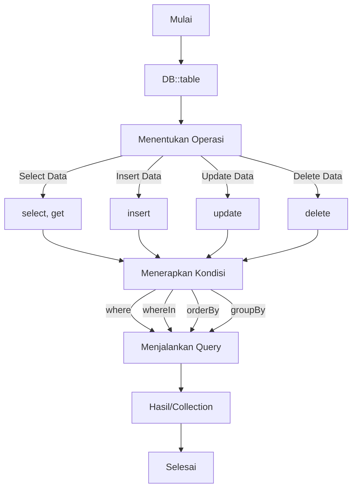
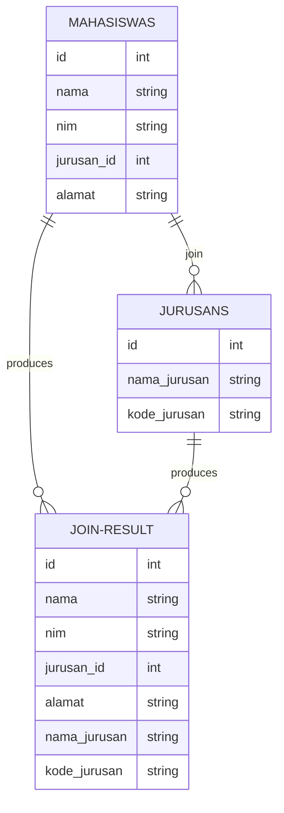
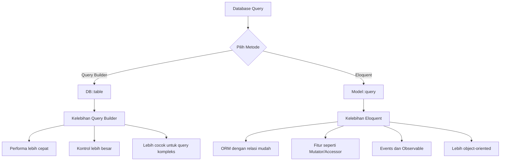

# Query Builder Dasar di Laravel

Query Builder adalah salah satu fitur Laravel yang memungkinkan kita untuk menulis dan menjalankan query database dengan cara yang lebih efisien dan ekspresif. Pada artikel ini, kita akan mempelajari penggunaan Query Builder dasar di Laravel untuk mengelola data dalam aplikasi Mahasiswa-Jurusan.

## Apa itu Query Builder?

Query Builder adalah interface berorientasi objek untuk membuat dan menjalankan query database. Dibandingkan dengan raw SQL, Query Builder menawarkan:

- Sintaks yang lebih mudah dibaca
- Keamanan dari SQL Injection
- Kompatibilitas lintas database
- Cara yang lebih ekspresif untuk membuat query kompleks



## Dasar-Dasar Query Builder

### Memulai Query Builder

Untuk menggunakan Query Builder, kita mulai dengan facade `DB` dan metode `table()`:

```php
use Illuminate\Support\Facades\DB;

// Query dasar
$mahasiswas = DB::table('mahasiswas')->get();
```

### Operasi Select Dasar

```php
// Mengambil semua data
$mahasiswas = DB::table('mahasiswas')->get();

// Mengambil kolom tertentu
$names = DB::table('mahasiswas')->select('nama', 'nim')->get();

// Mengambil satu baris
$mahasiswa = DB::table('mahasiswas')->where('id', 1)->first();

// Mengambil satu kolom dari satu baris
$nama = DB::table('mahasiswas')->where('id', 1)->value('nama');

// Mengambil kolom sebagai kunci array
$nimPairs = DB::table('mahasiswas')->pluck('nama', 'nim');
```

### Menggunakan Where Conditions

```php
// Where dasar
$tiMahasiswas = DB::table('mahasiswas')
                ->where('jurusan_id', 1)
                ->get();

// Multiple where (AND)
$filterMahasiswas = DB::table('mahasiswas')
                    ->where('jurusan_id', 1)
                    ->where('alamat', 'like', '%Jakarta%')
                    ->get();

// Where dengan operator
$seniorMahasiswas = DB::table('mahasiswas')
                    ->where('created_at', '<', now()->subYears(2))
                    ->get();

// orWhere
$tiOrSiMahasiswas = DB::table('mahasiswas')
                    ->where('jurusan_id', 1)
                    ->orWhere('jurusan_id', 2)
                    ->get();

// whereIn
$selectedMahasiswas = DB::table('mahasiswas')
                      ->whereIn('id', [1, 2, 3])
                      ->get();

// whereBetween
$midIdsMahasiswas = DB::table('mahasiswas')
                    ->whereBetween('id', [10, 20])
                    ->get();

// whereNull / whereNotNull
$noAddressMahasiswas = DB::table('mahasiswas')
                       ->whereNull('alamat')
                       ->get();
```

### Ordering, Grouping, dan Limit

```php
// orderBy
$orderedMahasiswas = DB::table('mahasiswas')
                     ->orderBy('nama', 'asc')
                     ->get();

// Multi-column ordering
$multiOrderMahasiswas = DB::table('mahasiswas')
                       ->orderBy('jurusan_id', 'asc')
                       ->orderBy('nama', 'asc')
                       ->get();

// latest dan oldest (shorthand untuk orderBy created_at)
$newestMahasiswas = DB::table('mahasiswas')->latest()->get();
$oldestMahasiswas = DB::table('mahasiswas')->oldest()->get();

// groupBy dengan having
$countByJurusan = DB::table('mahasiswas')
                  ->select('jurusan_id', DB::raw('count(*) as total'))
                  ->groupBy('jurusan_id')
                  ->having('total', '>', 10)
                  ->get();

// limit dan offset
$paginatedMahasiswas = DB::table('mahasiswas')
                      ->offset(10)
                      ->limit(5)
                      ->get();
```

## Query Builder untuk Join Tables

Mari kita gunakan Query Builder untuk menghubungkan tabel Mahasiswa dan Jurusan:

```php
// Inner Join
$mahasiswaJurusan = DB::table('mahasiswas')
                    ->join('jurusans', 'mahasiswas.jurusan_id', '=', 'jurusans.id')
                    ->select('mahasiswas.*', 'jurusans.nama_jurusan', 'jurusans.kode_jurusan')
                    ->get();

// Left Join
$allMahasiswaWithJurusan = DB::table('mahasiswas')
                          ->leftJoin('jurusans', 'mahasiswas.jurusan_id', '=', 'jurusans.id')
                          ->select('mahasiswas.*', 'jurusans.nama_jurusan')
                          ->get();

// Join dengan where
$tiMahasiswasWithJurusan = DB::table('mahasiswas')
                          ->join('jurusans', 'mahasiswas.jurusan_id', '=', 'jurusans.id')
                          ->select('mahasiswas.*', 'jurusans.nama_jurusan')
                          ->where('jurusans.kode_jurusan', 'TI')
                          ->get();
```



## Operasi Insert, Update, dan Delete

### Insert

```php
// Insert satu baris
DB::table('mahasiswas')->insert([
    'nama' => 'Budi Santoso',
    'nim' => '12345678',
    'jurusan_id' => 1,
    'alamat' => 'Jl. Contoh No. 123',
    'created_at' => now(),
    'updated_at' => now(),
]);

// Insert multiple baris
DB::table('mahasiswas')->insert([
    [
        'nama' => 'Ani Wijaya',
        'nim' => '87654321',
        'jurusan_id' => 2,
        'alamat' => 'Jl. Contoh No. 456',
        'created_at' => now(),
        'updated_at' => now(),
    ],
    [
        'nama' => 'Cici Permata',
        'nim' => '23456789',
        'jurusan_id' => 1,
        'alamat' => 'Jl. Contoh No. 789',
        'created_at' => now(),
        'updated_at' => now(),
    ],
]);

// Insert dan dapatkan ID
$id = DB::table('jurusans')->insertGetId([
    'nama_jurusan' => 'Teknik Sipil',
    'kode_jurusan' => 'TS',
    'created_at' => now(),
    'updated_at' => now(),
]);
```

### Update

```php
// Update satu kolom
DB::table('mahasiswas')
    ->where('id', 1)
    ->update(['alamat' => 'Alamat baru']);

// Update multiple kolom
DB::table('mahasiswas')
    ->where('jurusan_id', 1)
    ->update([
        'alamat' => 'Alamat kampus',
        'updated_at' => now()
    ]);

// Increment / Decrement
DB::table('jurusans')
    ->where('id', 1)
    ->increment('jumlah_mahasiswa'); // Asumsi ada kolom jumlah_mahasiswa

DB::table('jurusans')
    ->where('id', 2)
    ->decrement('jumlah_mahasiswa', 2); // Mengurangi 2
```

### Delete

```php
// Delete berdasarkan kondisi
DB::table('mahasiswas')
    ->where('id', 1)
    ->delete();

// Delete multiple baris
DB::table('mahasiswas')
    ->whereIn('id', [1, 2, 3])
    ->delete();

// Truncate (hapus semua data)
DB::table('mahasiswas')->truncate(); // Hati-hati dengan ini!
```

## Aggregates dan Raw Expressions

```php
// Count
$jumlahMahasiswa = DB::table('mahasiswas')->count();

// Sum, Avg, Min, Max
$avgId = DB::table('mahasiswas')->avg('id');
$minId = DB::table('mahasiswas')->min('id');
$maxId = DB::table('mahasiswas')->max('id');

// Exists / Doesn't Exist
$hasMahasiswa = DB::table('mahasiswas')
                ->where('jurusan_id', 1)
                ->exists();

$noTiMahasiswa = DB::table('mahasiswas')
                ->where('jurusan_id', 1)
                ->doesntExist();

// Raw expressions
$mahasiswasWithJurusan = DB::table('mahasiswas')
                        ->select(DB::raw('mahasiswas.*, CONCAT(jurusans.kode_jurusan, " - ", jurusans.nama_jurusan) as info_jurusan'))
                        ->join('jurusans', 'mahasiswas.jurusan_id', '=', 'jurusans.id')
                        ->get();
```

## Menerapkan Query Builder di Controller

Berikut contoh penggunaan Query Builder di Controller:

```php
<?php

namespace App\Http\Controllers;

use Illuminate\Http\Request;
use Illuminate\Support\Facades\DB;

class MahasiswaController extends Controller
{
    public function index()
    {
        $mahasiswas = DB::table('mahasiswas')
                     ->join('jurusans', 'mahasiswas.jurusan_id', '=', 'jurusans.id')
                     ->select('mahasiswas.*', 'jurusans.nama_jurusan')
                     ->paginate(10);
                     
        return view('mahasiswas.index', compact('mahasiswas'));
    }
    
    public function search(Request $request)
    {
        $keyword = $request->keyword;
        $jurusan_id = $request->jurusan_id;
        
        $query = DB::table('mahasiswas')
               ->join('jurusans', 'mahasiswas.jurusan_id', '=', 'jurusans.id')
               ->select('mahasiswas.*', 'jurusans.nama_jurusan');
        
        if (!empty($keyword)) {
            $query->where(function($q) use ($keyword) {
                $q->where('mahasiswas.nama', 'like', "%$keyword%")
                  ->orWhere('mahasiswas.nim', 'like', "%$keyword%");
            });
        }
        
        if (!empty($jurusan_id)) {
            $query->where('mahasiswas.jurusan_id', $jurusan_id);
        }
        
        $mahasiswas = $query->orderBy('mahasiswas.nama', 'asc')->paginate(10);
        $jurusans = DB::table('jurusans')->get();
        
        return view('mahasiswas.index', compact('mahasiswas', 'jurusans', 'keyword', 'jurusan_id'));
    }
    
    public function jurusanStats()
    {
        $stats = DB::table('mahasiswas')
               ->select('jurusans.nama_jurusan', DB::raw('count(*) as total'))
               ->join('jurusans', 'mahasiswas.jurusan_id', '=', 'jurusans.id')
               ->groupBy('jurusans.nama_jurusan')
               ->orderBy('total', 'desc')
               ->get();
               
        return view('mahasiswas.stats', compact('stats'));
    }
}
```

## Perbandingan dengan Eloquent



Meskipun Eloquent (ORM Laravel) lebih direkomendasikan untuk kebanyakan kasus karena fitur-fiturnya yang powerful, Query Builder tetap penting untuk dipelajari karena:

1. Performance yang lebih baik untuk query kompleks
2. Kontrol yang lebih detail saat membuat query
3. Kemampuan untuk menulis raw SQL jika diperlukan
4. Beberapa kasus di mana Eloquent terlalu "berat" untuk digunakan

## Tips Query Builder

1. **Gunakan Binding Parameter**: Selalu gunakan parameter binding untuk menghindari SQL Injection:

```php
// Jangan lakukan ini
$results = DB::table('mahasiswas')
          ->whereRaw("jurusan_id = $jurusanId")
          ->get();

// Lakukan ini
$results = DB::table('mahasiswas')
          ->whereRaw("jurusan_id = ?", [$jurusanId])
          ->get();
```

2. **Pagination**: Selalu gunakan pagination untuk dataset besar:

```php
$mahasiswas = DB::table('mahasiswas')->paginate(15);
```

3. **Transactions**: Gunakan transactions untuk operasi yang membutuhkan atomic operations:

```php
DB::transaction(function () {
    DB::table('mahasiswas')->where('id', 1)->update(['status' => 'inactive']);
    DB::table('jurusans')->where('id', 1)->decrement('jumlah_mahasiswa');
});
```

4. **Chunk untuk Dataset Besar**: Untuk mengolah dataset besar, gunakan chunk:

```php
DB::table('mahasiswas')->orderBy('id')->chunk(100, function ($mahasiswas) {
    foreach ($mahasiswas as $mahasiswa) {
        // Proses setiap mahasiswa
    }
});
```

5. **Debugging Queries**: Debug query yang dijalankan:

```php
DB::enableQueryLog();
// ... jalankan beberapa query
$queries = DB::getQueryLog();
dd($queries); // Dump queries untuk debugging
```

## Kesimpulan

Query Builder Laravel adalah tool yang powerful untuk berinteraksi dengan database dengan sintaks yang ekspresif dan mudah dibaca. Dengan memahami dasar-dasar Query Builder, kita dapat:

1. Membuat query select, insert, update, dan delete dengan mudah
2. Menggabungkan tabel dengan joins
3. Mengelompokkan dan memfilter data
4. Menggunakan agregasi dan fungsi lain

Meskipun Eloquent menawarkan abstraksi yang lebih tinggi, Query Builder tetap menjadi pilihan yang solid untuk query yang membutuhkan performa dan fleksibilitas lebih tinggi.

Pada pertemuan berikutnya, kita akan melanjutkan dengan mempelajari "Menampilkan data relasi" untuk melihat bagaimana menampilkan data hasil relasi Mahasiswa-Jurusan di aplikasi kita.